# 🏗️ Ploy Platform Architecture

> **A developer's guide to understanding Ploy's multi-chain loyalty platform architecture**

## 🎯 Overview

Ploy is built as a **multi-chain, multi-tenant loyalty platform** that abstracts blockchain complexity while providing powerful features for businesses and seamless experiences for customers.


---

## ⛓️ Multi-Chain Architecture

### **Primary Chains**

#### 🔷 SUI Network (Tier 1)
- **Role**: Primary customer-facing transactions
- **Benefits**: Gas sponsorship, object-centric model, sub-second finality
- **Use Cases**: Real-time rewards, customer transactions, NFT operations

```typescript
// Example: SUI gas-sponsored transaction
module loyalty::loyalty_system {
    struct LoyaltyPoint has key, store {
        id: UID,
        value: u64,
        owner: address,
        source: String,
        timestamp: u64,
    }
    
    public fun award_points(
        user: address,
        amount: u64,
        source: String,
        ctx: &mut TxContext
    ) {
        let points = LoyaltyPoint {
            id: object::new(ctx),
            value: amount,
            owner: user,
            source,
            timestamp: tx_context::epoch(ctx),
        };
        
        transfer::transfer(points, user);
    }
}
```

#### 🟣 Solana Network (Tier 1)
- **Role**: High-throughput operations and bulk processing
- **Benefits**: Fee payer service, compressed NFTs, high TPS
- **Use Cases**: Bulk operations, gaming integration, DeFi protocols

```typescript
// Example: Solana compressed NFT for achievements
import { createTree, mintCompressedNft } from '@solana/spl-account-compression';

const awardAchievementNFT = async (user: PublicKey, achievement: string) => {
  const merkleTree = await createTree(connection, payer, {
    maxDepth: 14,
    maxBufferSize: 64,
  });
  
  return await mintCompressedNft(connection, payer, {
    tree: merkleTree,
    owner: user,
    metadata: {
      name: `${achievement} Achievement`,
      symbol: 'PLOY',
      uri: `https://api.ploy.io/metadata/${achievement}`,
    },
  });
};
```

#### 🔶 EVM Chains (Tier 2)
- **Role**: Enterprise integration and compatibility
- **Benefits**: Widespread adoption, tooling ecosystem
- **Use Cases**: Business integrations, cross-chain bridges

---

## 💎 NFT-Powered Rewards System

### **Achievement NFT Categories**

```typescript
interface NFTRewardsSystem {
  milestoneNFTs: {
    firstPurchase: "Welcome to the community NFT",
    loyaltyAnniversary: "Year-based loyalty certificates",
    spendingMilestones: "Tiered spending achievement badges"
  },
  
  membershipNFTs: {
    tierStatus: "Bronze, Silver, Gold, Platinum NFTs",
    exclusiveAccess: "VIP membership tokens",
    founderEdition: "Early adopter recognition"
  },
  
  gamingNFTs: {
    tournamentVictories: "Competition achievement certificates",
    skillBadges: "Expertise recognition tokens",
    rareCollectibles: "Limited edition series"
  },
  
  utilityNFTs: {
    discountCoupons: "Redeemable value tokens",
    serviceAccess: "Premium feature unlock NFTs",
    experienceTickets: "Event and experience access"
  }
}
```

### **Built-in NFT Marketplace**

The platform includes a complete NFT marketplace with:

- **🔄 Cross-Chain Trading**: Trade NFTs across SUI, Solana, and EVM chains
- **💰 Point-to-NFT Purchases**: Buy NFTs directly with loyalty points
- **⏰ Dynamic Auctions**: Time-based bidding with automatic extensions
- **🏠 NFT Rentals**: Temporary access with smart contract protection
- **🍰 Fractionalization**: Shared ownership of high-value NFTs

---

## ⚡ Zero Gas Fee Implementation

### **Gas Sponsorship Architecture**

```typescript
interface GaslessArchitecture {
  sui: {
    implementation: "Native sponsored transactions",
    mechanism: "Gas budget sponsorship by platform",
    benefits: ["Zero user fees", "Instant confirmations", "Seamless UX"]
  },
  
  solana: {
    implementation: "Fee payer service pattern",
    mechanism: "Platform-managed fee payer accounts",
    benefits: ["Bulk processing", "Cost optimization", "High throughput"]
  },
  
  evm: {
    implementation: "EIP-2771 meta-transactions",
    mechanism: "Relayer network with signature verification",
    benefits: ["Ethereum compatibility", "Existing wallet support"]
  }
}
```

### **Cost Optimization Strategy**

```yaml
gas_optimization:
  batch_processing:
    concept: "Group multiple operations in single transaction"
    savings: "Up to 80% cost reduction for bulk operations"
    
  intelligent_routing:
    concept: "Route transactions to most cost-effective chain"
    decision_factors: ["Network congestion", "Gas prices", "User preferences"]
    
  sponsored_limits:
    concept: "Tier-based gas allowances"
    structure:
      basic_users: "100 transactions/month"
      premium_users: "500 transactions/month"
      enterprise: "Unlimited sponsored transactions"
```

---

## 🔄 Cross-Chain Bridge System

### **Bridge Architecture**

```mermaid
sequenceDiagram
    participant User as 👤 User
    participant SourceChain as ⛓️ Source Chain
    participant Bridge as 🌉 Bridge Network
    participant Validators as 🔐 Validators
    participant TargetChain as ⛓️ Target Chain
    
    User->>SourceChain: Initiate cross-chain transfer
    SourceChain->>Bridge: Lock tokens + emit event
    Bridge->>Validators: Validate transfer request
    Validators->>Validators: Reach consensus (2/3 majority)
    Validators->>TargetChain: Submit mint transaction
    TargetChain->>User: Tokens minted on target chain
    
    Note over User, TargetChain: Average transfer time: < 5 minutes
```



### **Supported Operations**

- **🪙 Token Transfers**: Loyalty points between chains
- **🖼️ NFT Bridging**: Achievement NFTs cross-chain
- **📊 State Sync**: Customer data consistency
- **⚙️ Metadata Updates**: Program configuration sync

---

## 🎯 Dynamic Policy Engine

### **Real-Time Rule Evaluation**

```typescript
interface PolicyEngine {
  ruleTypes: {
    earningPolicies: "Point accumulation rules and multipliers",
    redemptionPolicies: "Spending rules and restrictions", 
    tierPolicies: "Membership level progression",
    expirationPolicies: "Point lifecycle management",
    fraudPolicies: "Anomaly detection and prevention"
  },
  
  contextFactors: {
    userContext: ["tier_status", "purchase_history", "engagement_level"],
    businessContext: ["inventory_levels", "seasonal_factors", "performance_metrics"],
    temporalContext: ["time_of_day", "day_of_week", "campaign_windows"],
    environmentalContext: ["location", "weather", "market_conditions"]
  },
  
  evaluation: {
    speed: "Sub-second policy evaluation",
    scalability: "Handles 10,000+ rules simultaneously",
    flexibility: "Dynamic updates without downtime"
  }
}
```

### **Industry-Specific Templates**

The platform includes pre-built policy templates for:

- **🖥️ SaaS Platforms**: API usage, feature adoption, developer engagement
- **🛒 E-commerce**: Purchase behavior, social engagement, brand loyalty  
- **🎮 Gaming**: Achievement progression, tournament participation
- **💰 FinTech**: Financial wellness, compliance, risk management
- **✈️ Travel**: Experience diversity, destination achievements
- **🏥 Healthcare**: Wellness goals, preventive care engagement
- **🍔 Food & Beverage**: Culinary exploration, social dining
- **☁️ Cloud Services**: Resource optimization, innovation adoption
- **🌐 Web3/DeFi**: Protocol participation, governance engagement

---

## 🔑 Universal Single Sign-On

### **Identity Management**

```typescript
interface UniversalSSO {
  authenticationMethods: {
    web2: ["Email/Password", "Social OAuth", "Phone SMS"],
    web3: ["Wallet Connect", "MetaMask", "Hardware Wallets"],
    biometric: ["Face ID", "Touch ID", "Hardware Keys"],
    enterprise: ["SAML", "Active Directory", "LDAP"]
  },
  
  privacyControls: {
    dataSharing: "Granular permissions per business platform",
    anonymization: "Zero-knowledge proofs for sensitive operations",
    consentManagement: "Easy opt-in/opt-out controls",
    rightToErasure: "GDPR-compliant data deletion"
  },
  
  profileSync: {
    unifiedWallet: "Single wallet address across platforms",
    preferenceSync: "Settings consistency across businesses",
    achievementDisplay: "Cross-platform accomplishment showcase",
    reputationPortability: "Trust scores transfer between businesses"
  }
}
```

---

## 📊 Performance & Scalability

### **System Performance Targets**

```yaml
performance_benchmarks:
  api_response_times:
    authentication: "< 100ms (95th percentile)"
    balance_queries: "< 150ms (95th percentile)"
    transaction_processing: "< 300ms (95th percentile)"
    complex_analytics: "< 2s (95th percentile)"
    
  blockchain_performance:
    sui_transactions: "< 2s confirmation time"
    solana_operations: "< 10s confirmation time"
    cross_chain_transfers: "< 5 minutes end-to-end"
    gas_sponsorship: "100% success rate"
    
  scalability_targets:
    concurrent_users: "100,000+ simultaneous active users"
    transactions_per_second: "10,000+ TPS during peak"
    data_storage: "Petabyte-scale with sub-second queries"
    global_latency: "< 100ms response from any region"
```

### **Caching Strategy**

```typescript
interface CachingArchitecture {
  redis_layers: {
    hotCache: "Frequently accessed user balances and profiles",
    warmCache: "Recent transaction history and preferences", 
    coldCache: "Historical data and analytics aggregations"
  },
  
  invalidation: {
    realTime: "Immediate updates for critical operations",
    batchUpdates: "Periodic refresh for non-critical data",
    eventDriven: "Smart invalidation based on business events"
  },
  
  optimization: {
    connectionPooling: "Efficient database resource utilization",
    queryOptimization: "Indexed queries with sub-second response",
    distributedCaching: "Multi-region cache consistency"
  }
}
```

---

## 🔒 Security Framework

### **Multi-Layer Security**

```yaml
security_layers:
  smart_contract_security:
    formal_verification: "Mathematical proof of contract correctness"
    multi_signature_controls: "Admin operations require multiple approvals"
    time_locks: "Critical changes have mandatory waiting periods"
    emergency_pause: "Circuit breakers for incident response"
    
  operational_security:
    infrastructure: "SOC2 Type II compliant hosting"
    access_control: "Zero-trust architecture with minimal privileges"
    monitoring: "24/7 security monitoring with automated alerting"
    incident_response: "Dedicated security team with escalation procedures"
    
  data_protection:
    encryption: "AES-256 encryption for data at rest and in transit"
    key_management: "Hardware security modules for key storage"
    privacy_preservation: "Zero-knowledge proofs for sensitive operations"
    compliance: "GDPR, CCPA, HIPAA, SOX compliance frameworks"
```

### **Fraud Detection**

The platform includes ML-powered fraud detection with:

- **📈 Behavioral Analysis**: Unusual transaction patterns
- **🌍 Geographic Anomalies**: Unexpected location-based activity
- **⚡ Velocity Checks**: High-frequency transaction monitoring
- **🤖 AI-Powered Scoring**: Real-time fraud risk assessment

---

## 🚀 Getting Started

Ready to build with Ploy? Check out these resources:

- **[SDK Documentation](../integrations/sdk-integration-guide.md)**: Complete SDK reference
- **[API Reference](../api/api-reference.md)**: REST API documentation  
- **[Code Examples](../examples/code-examples-guide.md)**: Implementation patterns
- **[Development Setup](../contributing/development-setup.md)**: Local environment setup

---

*This architecture overview provides the foundation for understanding how Ploy's multi-chain loyalty platform works. For implementation details, see our internal documentation.*