# Platform Features Documentation

## Overview

This directory contains **specialized component documentation** for specific features of the Ploy platform. For comprehensive guides, see the main documentation structure.

> 📋 **Most comprehensive documentation has been moved to:**
> - **[External Documentation](../external/)** - For contributors and developers
> - **[Internal Documentation](../internal/)** - For implementation teams

## 🎯 Core Platform Documentation

### **📚 Comprehensive Guides (Recommended)**

| **Guide** | **Location** | **Audience** |
|-----------|-------------|--------------|
| **🏗️ Complete Platform Architecture** | [External Architecture](../external/architecture/platform-architecture-overview.md) | Developers, Contributors |
| **📋 Implementation Specifications** | [Internal Technical Specs](../internal/technical-specs/) | Engineering Teams |
| **📊 Business Strategies** | [Internal Business Strategy](../internal/business-strategy/) | Business Teams |
| **🔄 Complete Workflows** | [Internal Workflows](../internal/workflows/) | Implementation Teams |

### **⚠️ Important Documentation Moved**

The following major documents have been **moved and consolidated**:
- ✅ **Platform Architecture** → [External Architecture](../external/architecture/platform-architecture-overview.md)
- ✅ **Business Strategies** → [Internal Business Strategy](../internal/business-strategy/business-adoption-strategies.md)
- ✅ **NFT Ecosystem** → [Internal Technical Specs](../internal/technical-specs/complete-platform-architecture.md)
- ✅ **Workflows & Examples** → [Internal Workflows](../internal/workflows/industry-workflow-patterns.md)
- ✅ **Risk Analysis** → [Internal Business Strategy](../internal/business-strategy/risk-opportunity-analysis.md)

## 🤝 Contributing Guidelines for External Contributors

> **Welcome to the Ploy project!** These guidelines will help you understand our documentation structure and contribute effectively to the platform.

### **📖 Documentation Structure for Contributors**

#### **How to Navigate Our Documentation:**

1. **🌟 Start Here**: [External Documentation](../external/) - Public documentation for developers and contributors
2. **🔧 Component Details**: This directory - Specialized technical documentation for specific features
3. **🏢 Internal Docs**: [Internal Documentation](../internal/) - Implementation details for core team

#### **📚 Consolidated Documentation (After Recent Merging)**

We've recently consolidated our documentation for better maintainability:

**Core Merged Documents:**
- **[comprehensive-policy-engine.md](comprehensive-policy-engine.md)** - All policy engine functionality
- **[cross-platform-integration.md](cross-platform-integration.md)** - Universal login & token exchange  
- **[platform-operations.md](platform-operations.md)** - Edge cases & redemption systems
- **[technical-implementation.md](technical-implementation.md)** - Gas-less transactions & flexibility

**AI Integration Documents:**
- **[ai-integration-plan.md](ai-integration-plan.md)** - Strategic AI integration plan
- **[ai-technical-implementation.md](ai-technical-implementation.md)** - Technical AI specifications
- **[ai-workflow-examples.md](ai-workflow-examples.md)** - Practical AI workflow examples

**Architecture Documents:**
- **[multi-chain-architecture.md](multi-chain-architecture.md)** - Extensible multi-chain support system

### **🛠️ How to Contribute to Documentation**

#### **Before You Start:**
1. **Read the Architecture**: Start with [External Architecture](../external/architecture/platform-architecture-overview.md)
2. **Understand the Codebase**: Review [Internal Technical Specs](../internal/technical-specs/)
3. **Check Existing Issues**: Look for documentation-related issues in our repository

#### **Documentation Contribution Process:**

```mermaid
graph TD
    A[📚 Read Existing Docs] --> B[🔍 Identify Gap or Error]
    B --> C[📝 Create Issue/Discussion]
    C --> D[🔄 Get Team Feedback]
    D --> E[✏️ Make Documentation Changes]
    E --> F[🧪 Test Examples & Code]
    F --> G[📋 Submit Pull Request]
    G --> H[👀 Code Review Process]
    H --> I[✅ Merge & Deploy]
```



#### **Documentation Standards:**

1. **Clarity First**: Write for developers who are new to the project
2. **Code Examples**: Include working code samples for all technical concepts
3. **Consistency**: Follow existing formatting and structure patterns
4. **Completeness**: Ensure examples are self-contained and executable
5. **Cross-References**: Link to related documentation sections

#### **File Structure Guidelines:**

```
docs/features/
├── README.md                           # This navigation guide
├── CONTRIBUTING.md                     # Contributing guidelines
├── comprehensive-policy-engine.md        # Merged policy documentation
├── cross-platform-integration.md         # Merged integration documentation  
├── platform-operations.md               # Merged operations documentation
├── technical-implementation.md          # Merged technical documentation
├── ai-integration-plan.md                # AI strategic planning
├── ai-technical-implementation.md        # AI technical specifications
├── ai-workflow-examples.md               # AI practical examples
├── multi-chain-architecture.md           # Extensible blockchain support
└── [legacy files - being cleaned up]
```

#### **What Contributors Should Focus On:**

**High-Priority Areas:**
- **Code Examples**: Add or improve code samples in the merged documents
- **Integration Guides**: Help document how to integrate with specific platforms
- **Error Handling**: Document common errors and their solutions
- **Performance Tips**: Add optimization guidance for implementations
- **Testing Examples**: Provide testing patterns and examples

**Documentation Types We Need:**
- **Tutorial-Style Guides**: Step-by-step implementation tutorials
- **Troubleshooting Guides**: Common issues and solutions
- **Best Practices**: Recommended patterns and approaches
- **API Documentation**: Complete API reference with examples
- **Configuration Examples**: Real-world configuration samples

#### **Review Process for Contributors:**

1. **Technical Accuracy**: Code examples must work and follow best practices
2. **Documentation Quality**: Clear, well-structured, and properly formatted
3. **Completeness**: All necessary context and prerequisites included
4. **Cross-Platform Compatibility**: Examples work across supported blockchain networks
5. **Security Review**: No security vulnerabilities in examples or recommendations

#### **Getting Help:**

- **Questions**: Open a discussion in our repository
- **Documentation Issues**: Create an issue with the `documentation` label  
- **Code Questions**: Tag documentation maintainers in your PR
- **Unclear Guidelines**: Ask in our contributor Discord/Slack

## 🔧 Specialized Component Documentation

> **These docs provide detailed specifications for individual platform components.** Contributors should focus on improving these merged documents with examples, tutorials, and troubleshooting guides.

### **📋 Merged Documentation Structure**

#### 1. [Comprehensive Policy Engine](comprehensive-policy-engine.md)
**Consolidated from 3 documents** - Complete policy system documentation:
- **Conditional Policy Engine**: Dynamic rules and context-based policies
- **Industry-Specific Policies**: Configurations for 9 tech industry sectors  
- **Policy Engine Workflows**: Cross-platform coordination and optimization

**Contribution Opportunities:**
- Add more industry-specific examples
- Improve policy configuration tutorials
- Document policy testing patterns

#### 2. [Cross-Platform Integration](cross-platform-integration.md)  
**Consolidated from 2 documents** - Universal login and token exchange:
- **Universal Login SSO**: Single sign-on across all platforms
- **Unified Token Exchange**: Cross-platform token trading and value transfer

**Contribution Opportunities:**
- Add authentication integration examples
- Improve token exchange tutorials
- Document SSO troubleshooting

#### 3. [Platform Operations](platform-operations.md)
**Consolidated from 2 documents** - Operations and reliability:
- **Edge Cases Handling**: Complex transaction scenarios and system failures
- **Redemption & Void Mechanisms**: Efficient redemption across industries

**Contribution Opportunities:**
- Add more edge case examples
- Document error recovery patterns
- Improve redemption flow tutorials

#### 4. [Technical Implementation](technical-implementation.md)
**Consolidated from 2 documents** - Core technical systems with optional blockchain:
- **Flexible Storage Architecture**: Traditional database or blockchain storage options
- **Seamless Migration**: Zero-downtime upgrade from traditional to blockchain storage
- **Gas-less Transactions**: Zero-fee blockchain experiences (when blockchain enabled)
- **Flexibility Framework**: Configuration-driven architecture and plugins

**Contribution Opportunities:**
- Add storage mode migration tutorials
- Improve blockchain upgrade examples
- Document cost optimization patterns
- Create hybrid deployment guides

#### 5. [AI Integration Plan](ai-integration-plan.md)
**Strategic analysis** - AI agent capabilities and LLM integration:
- **Market Assessment**: Strategic opportunity evaluation
- **Architecture Design**: Headless API and agent orchestration
- **Business Benefits**: ROI analysis and competitive advantages
- **Implementation Roadmap**: 16-week development plan

**Contribution Opportunities:**
- Add AI use case examples
- Improve integration patterns
- Document best practices

#### 6. [AI Technical Implementation](ai-technical-implementation.md)
**Complete technical specification** - Headless architecture and AI agents:
- **Headless API Design**: GraphQL schema and REST endpoints
- **LLM Integration**: Multi-provider gateway implementation
- **Agent Framework**: Specialized AI agents for loyalty management
- **Security & Performance**: Production-ready considerations

**Contribution Opportunities:**
- Add code examples for different LLMs
- Improve agent implementation patterns
- Document security best practices

#### 7. [AI Workflow Examples](ai-workflow-examples.md)
**Practical implementation examples** - Real-world AI agent workflows:
- **Business Owner Workflows**: Dashboard reviews and policy optimization
- **Developer Workflows**: API integration and testing
- **Marketing Workflows**: Campaign creation and management
- **Support Workflows**: Intelligent issue resolution

**Contribution Opportunities:**
- Add more persona-specific examples
- Improve workflow documentation
- Create interactive tutorials

#### 8. [Multi-Chain Architecture](multi-chain-architecture.md)
**Optional blockchain support system** - Modular architecture for flexible storage choices:
- **Optional Blockchain Layer**: Start with traditional storage, upgrade when ready
- **Chain Abstraction Layer**: Unified interface for storage operations (traditional or blockchain)
- **Plugin-Based Architecture**: Blockchain plugins loaded only when needed
- **Configuration-Driven**: Choose storage mode and chains through config
- **Migration Service**: Seamless upgrade from traditional to blockchain storage

**Contribution Opportunities:**
- Add new storage migration patterns
- Improve cost optimization algorithms
- Document flexible deployment procedures
- Create testing frameworks for dual storage modes

### **🎯 Focus Areas for New Contributors**

#### **Beginner-Friendly Contributions:**
- **Code Comments**: Improve inline documentation in examples
- **README Updates**: Enhance setup and quickstart guides
- **Error Messages**: Document common error scenarios and solutions
- **Examples Library**: Create simple, focused example applications

#### **Advanced Contributions:**
- **Performance Guides**: Document optimization patterns
- **Security Best Practices**: Add security implementation guidelines
- **Architecture Deep-Dives**: Expand on system design decisions
- **Integration Patterns**: Document complex integration scenarios

## 📋 Documentation Navigation Guide

### **🎯 Choose the Right Documentation Level**

#### **🚀 Getting Started?**
**→ Start with [External Documentation](../external/)**
- Architecture overviews
- Code examples
- Integration guides
- Contributing guidelines

#### **🏢 Implementation Team?**
**→ Use [Internal Documentation](../internal/)**
- Complete technical specifications
- Business strategies
- Implementation roadmaps
- Detailed workflows

#### **🔧 Need Specific Component Details?**
**→ Use this directory's specialized docs above**
- Individual feature specifications
- Component-level implementation details
- Specific technology configurations

### **📚 Documentation Hierarchy**

```
📚 Ploy Documentation
├── 🌐 External (Public)          - For contributors & developers
├── 🔒 Internal (Team)            - For implementation & business strategy  
└── 🔧 Features (Specialized)     - For component-specific details
```

### **🔍 Quick Reference**

| **Need** | **Go To** |
|----------|-----------|
| **Understand the platform** | [External Architecture](../external/architecture/platform-architecture-overview.md) |
| **Start contributing** | [External Contributing](../external/contributing/CONTRIBUTING.md) |
| **Implement the platform** | [Internal Technical Specs](../internal/technical-specs/) |
| **Configure specific features** | This directory's component docs |
| **Business planning** | [Internal Business Strategy](../internal/business-strategy/) |

---

*💡 **Tip**: Most users should start with [External Documentation](../external/) or [Internal Documentation](../internal/) for comprehensive guides. This directory contains detailed specifications for individual components.*