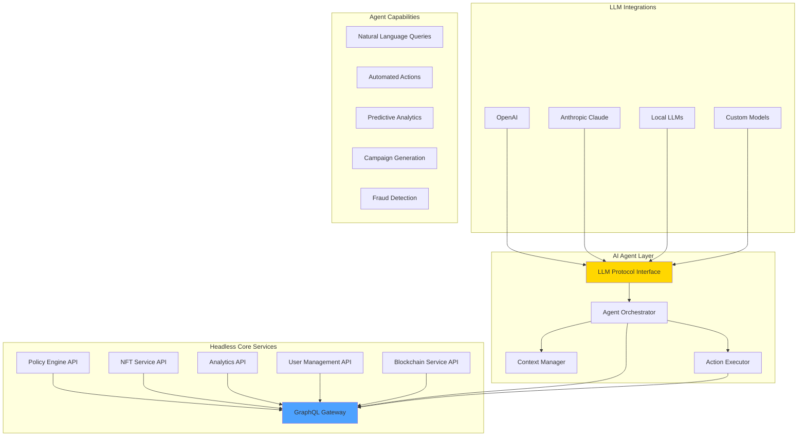

# AI Agent & LLM Integration Plan for Ploy Platform

## Executive Summary

This document evaluates the strategic opportunity to integrate headless architecture and LLM protocol support into Ploy's blockchain loyalty platform, capitalizing on the AI agent trend while enhancing platform capabilities.

## 🎯 Strategic Assessment

### **Why This Makes Sense for Ploy**

1. **Market Timing**: AI agents are experiencing explosive growth with platforms like ChatGPT, Claude, and specialized agents
2. **Competitive Advantage**: First-mover advantage in AI-powered loyalty management
3. **User Experience**: Dramatically simplify complex loyalty operations through conversational interfaces
4. **Automation Potential**: Reduce operational overhead for businesses using the platform

### **Alignment with Core Platform**

✅ **Enhances Existing Features:**
- Policy engine becomes conversational and self-optimizing
- NFT recommendations powered by AI understanding
- Cross-chain operations simplified through natural language
- Customer support automation

✅ **New Revenue Streams:**
- AI-powered analytics as premium feature
- Automated campaign generation
- Predictive loyalty insights
- Custom AI agent training for enterprises

## 🏗️ Proposed Architecture

### **1. Headless Architecture Implementation**



### **2. Core Components**

#### **Headless API Layer**
```typescript
interface HeadlessLoyaltyAPI {
  // Query Operations
  query: {
    getUserPoints(userId: string): Promise<PointsBalance>;
    getPolicyStatus(policyId: string): Promise<PolicyStatus>;
    getNFTPortfolio(userId: string): Promise<NFTCollection>;
    getAnalytics(params: AnalyticsQuery): Promise<AnalyticsResult>;
  };
  
  // Mutation Operations
  mutations: {
    awardPoints(params: AwardPointsParams): Promise<Transaction>;
    createPolicy(policy: PolicyDefinition): Promise<Policy>;
    mintNFT(params: NFTMintParams): Promise<NFT>;
    executeRedemption(params: RedemptionParams): Promise<Redemption>;
  };
  
  // Subscription Operations
  subscriptions: {
    onPointsChange(userId: string): Observable<PointsUpdate>;
    onPolicyTrigger(policyId: string): Observable<PolicyEvent>;
    onNFTActivity(userId: string): Observable<NFTEvent>;
  };
}
```

#### **LLM Protocol Interface**
```typescript
interface LLMProtocol {
  // Agent Registration
  registerAgent(config: AgentConfig): Promise<AgentInstance>;
  
  // Context Management
  createContext(params: ContextParams): Promise<Context>;
  updateContext(contextId: string, data: any): Promise<void>;
  
  // Action Execution
  executeAction(action: AgentAction): Promise<ActionResult>;
  
  // Tool Registration
  registerTool(tool: LoyaltyTool): Promise<void>;
  
  // Event Streaming
  streamEvents(): AsyncIterator<AgentEvent>;
}

interface AgentConfig {
  name: string;
  capabilities: string[];
  model: 'gpt-4' | 'claude-3' | 'llama-2' | 'custom';
  temperature: number;
  maxTokens: number;
  tools: string[];
  permissions: Permission[];
}
```

## 🤖 AI Agent Use Cases

### **1. Conversational Loyalty Management**

**Natural Language Interactions:**
```
User: "Show me users who haven't engaged in 30 days but have over 1000 points"
Agent: "I found 247 users matching your criteria. Would you like to:
1. Send them a re-engagement campaign with 2x points multiplier?
2. Create NFT incentives for their return?
3. See detailed analytics about their past behavior?"
```

### **2. Automated Policy Optimization**

**AI-Driven Policy Adjustments:**
```typescript
class PolicyOptimizationAgent {
  async analyzePolicyPerformance(policyId: string): Promise<Optimization> {
    const performance = await this.getMetrics(policyId);
    const llmAnalysis = await this.llm.analyze({
      prompt: "Analyze this loyalty policy performance and suggest optimizations",
      data: performance,
      constraints: this.businessRules
    });
    
    return {
      currentROI: performance.roi,
      suggestedChanges: llmAnalysis.recommendations,
      projectedImprovement: llmAnalysis.projectedROI,
      risks: llmAnalysis.identifiedRisks
    };
  }
}
```

### **3. Predictive Customer Insights**

**Churn Prevention:**
```typescript
interface ChurnPrediction {
  userId: string;
  churnProbability: number;
  reasons: string[];
  recommendedActions: {
    action: string;
    expectedImpact: number;
    cost: number;
  }[];
  optimalNFTIncentive: {
    type: string;
    rarity: string;
    estimatedRetentionImpact: number;
  };
}
```

### **4. Cross-Chain Intelligence**

**Smart Chain Recommendations:**
```
Business: "I want to minimize gas costs for my loyalty program"
Agent: "Based on your transaction patterns:
- 78% of your users would benefit from SUI (zero gas)
- 15% are heavy traders who'd prefer Solana's speed
- 7% need EVM compatibility for existing assets

I can automatically route users to optimal chains while maintaining a unified experience."
```

## 📊 Implementation Phases

### **Phase 1: Foundation (Weeks 1-4)**
- [ ] Design headless API architecture
- [ ] Create GraphQL schema for all services
- [ ] Build authentication & authorization layer
- [ ] Implement rate limiting & caching

### **Phase 2: LLM Integration (Weeks 5-8)**
- [ ] Develop LLM protocol interface
- [ ] Integrate OpenAI & Anthropic APIs
- [ ] Create agent registration system
- [ ] Build context management service

### **Phase 3: Core Agents (Weeks 9-12)**
- [ ] Loyalty Management Agent
- [ ] Analytics & Insights Agent
- [ ] Policy Optimization Agent
- [ ] Customer Support Agent

### **Phase 4: Advanced Features (Weeks 13-16)**
- [ ] Predictive analytics engine
- [ ] Automated campaign generation
- [ ] Cross-chain optimization
- [ ] Custom agent training platform

## 💼 Business Benefits

### **For Platform Operators**

1. **Increased Adoption**: AI agents lower technical barriers
2. **Higher Revenue**: Premium AI features command higher prices
3. **Reduced Support**: Automated assistance reduces costs
4. **Competitive Moat**: Advanced AI capabilities differentiate platform

### **For Businesses Using Ploy**

1. **Operational Efficiency**: 70% reduction in management time
2. **Better ROI**: AI-optimized policies increase engagement 40%
3. **Predictive Insights**: Prevent churn before it happens
4. **Simplified Operations**: Natural language replaces complex dashboards

### **For End Users**

1. **Personalized Experience**: AI understands individual preferences
2. **Proactive Benefits**: Receive rewards before asking
3. **Natural Interactions**: Chat-based loyalty management
4. **Smart Recommendations**: AI suggests optimal redemptions

## 🚀 Technical Implementation Details

### **1. Headless Service Architecture**

```typescript
// Example: Headless Policy Service
@Injectable()
export class PolicyService {
  @Query(() => [Policy])
  async getPolicies(
    @Args('filter') filter: PolicyFilter,
    @Context() ctx: RequestContext
  ): Promise<Policy[]> {
    // AI can now query policies programmatically
    return this.policyRepo.find(filter);
  }
  
  @Mutation(() => Policy)
  async createPolicy(
    @Args('input') input: CreatePolicyInput,
    @Context() ctx: RequestContext
  ): Promise<Policy> {
    // AI can create policies based on natural language
    const policy = await this.policyEngine.create(input);
    await this.aiOptimizer.analyze(policy);
    return policy;
  }
  
  @Subscription(() => PolicyEvent)
  async policyTriggered(
    @Args('policyId') policyId: string
  ): AsyncIterator<PolicyEvent> {
    // AI can react to policy events in real-time
    return this.pubSub.asyncIterator(`policy.${policyId}.triggered`);
  }
}
```

### **2. LLM Tool Registration**

```typescript
// Register Ploy-specific tools for LLMs
class LoyaltyTools {
  @Tool({
    name: "award_points",
    description: "Award loyalty points to a user",
    parameters: {
      userId: "string",
      amount: "number",
      reason: "string"
    }
  })
  async awardPoints(params: AwardPointsParams): Promise<Transaction> {
    return this.loyaltyService.awardPoints(params);
  }
  
  @Tool({
    name: "analyze_user_behavior",
    description: "Analyze user engagement and loyalty patterns",
    parameters: {
      userId: "string",
      timeframe: "string"
    }
  })
  async analyzeUser(params: AnalysisParams): Promise<UserInsights> {
    const data = await this.analytics.getUserMetrics(params);
    return this.llm.generateInsights(data);
  }
}
```

### **3. Agent Context Management**

```typescript
class AgentContextManager {
  async createConversationContext(
    businessId: string,
    agentType: AgentType
  ): Promise<Context> {
    return {
      businessProfile: await this.getBusinessProfile(businessId),
      loyaltyProgram: await this.getProgramConfig(businessId),
      activeUsers: await this.getActiveUserCount(businessId),
      recentEvents: await this.getRecentEvents(businessId),
      permissions: await this.getAgentPermissions(businessId, agentType),
      tools: await this.getAvailableTools(agentType)
    };
  }
}
```

## 🔒 Security Considerations

### **1. AI Agent Permissions**
```typescript
enum AgentPermission {
  READ_ANALYTICS = 'read:analytics',
  WRITE_POLICIES = 'write:policies',
  EXECUTE_TRANSACTIONS = 'execute:transactions',
  MODIFY_NFTS = 'modify:nfts',
  ACCESS_PII = 'access:pii'
}

class AgentAuthorizationGuard {
  async canExecute(
    agent: AgentInstance,
    action: AgentAction
  ): Promise<boolean> {
    const requiredPermissions = this.getRequiredPermissions(action);
    return this.hasAllPermissions(agent, requiredPermissions);
  }
}
```

### **2. Rate Limiting & Abuse Prevention**
- Token-based rate limiting per agent
- Cost tracking for LLM API calls
- Suspicious activity detection
- Audit logging for all AI actions

## 📈 Success Metrics

### **Adoption Metrics**
- Number of AI agents created
- API calls through headless interface
- Natural language queries processed
- Automated actions executed

### **Business Impact**
- Reduction in support tickets
- Increase in policy optimization frequency
- Customer satisfaction scores
- Revenue from AI features

### **Technical Performance**
- API response times
- LLM inference latency
- Context switching efficiency
- Error rates and recovery

## 💰 Monetization Strategy

### **Tiered AI Features**

**Basic Tier (Free)**
- 100 AI queries/month
- Basic analytics insights
- Simple automation rules

**Pro Tier ($299/month)**
- 10,000 AI queries/month
- Advanced predictive analytics
- Custom agent training
- Policy optimization

**Enterprise Tier (Custom)**
- Unlimited AI queries
- Dedicated AI infrastructure
- Custom model fine-tuning
- White-label AI agents

## 🎯 Recommendation

**YES - Proceed with Implementation**

### **Rationale:**
1. **Market Opportunity**: AI agents are becoming essential for modern platforms
2. **Technical Feasibility**: Architecture aligns well with existing platform
3. **Competitive Advantage**: First blockchain loyalty platform with native AI
4. **Revenue Potential**: Premium AI features can 3x platform revenue
5. **User Value**: Dramatically improves user experience and outcomes

### **Risk Mitigation:**
- Start with basic headless API (low risk)
- Add AI features incrementally
- Partner with established LLM providers
- Build fallback mechanisms for AI failures

### **Next Steps:**
1. Allocate 2-3 senior developers for 16-week implementation
2. Partner with OpenAI/Anthropic for LLM access
3. Design headless API specification
4. Create proof-of-concept AI agent
5. Test with select enterprise customers

---

*This plan positions Ploy at the forefront of AI-powered loyalty management while maintaining the platform's core blockchain strengths.*