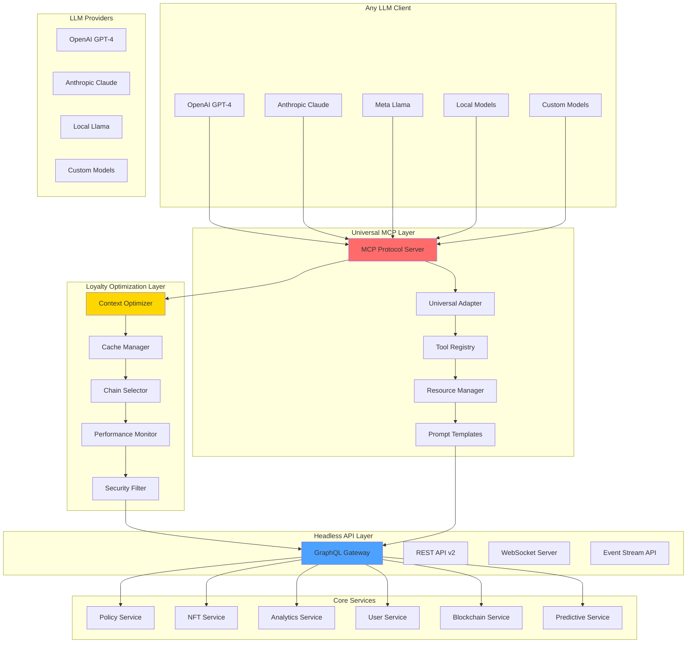
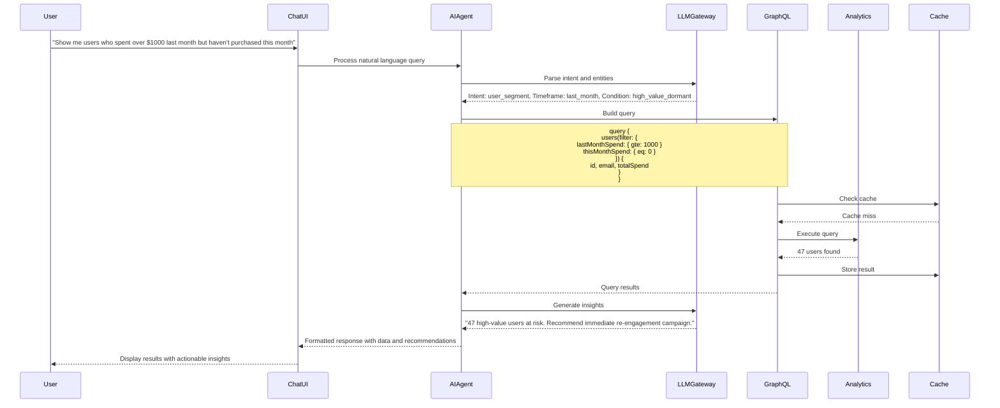

# Universal LLM Integration: MCP + Custom Hybrid Architecture

## Overview

This document provides the complete technical specification for implementing universal Large Language Model integration using the Model Context Protocol (MCP) standard combined with loyalty-optimized enhancements in the Ploy blockchain loyalty platform.

## Why Hybrid MCP + Custom Architecture

**✅ MCP Benefits:**
- Universal LLM compatibility (OpenAI, Claude, Llama, local models)
- Industry-standard protocol with growing ecosystem
- Instant access to 20+ existing integrations
- Future-proof as new LLMs adopt MCP

**✅ Custom Optimization Benefits:**
- Loyalty-specific performance enhancements
- Blockchain-aware context management
- Industry-optimized caching strategies
- Competitive differentiation features

## Architecture Overview



## MCP Protocol Implementation

### Core MCP Server Architecture

```typescript
// Main MCP Server for Ploy Loyalty Platform
import { Server } from '@modelcontextprotocol/sdk/server/index.js';
import { StdioServerTransport } from '@modelcontextprotocol/sdk/server/stdio.js';
import {
  CallToolRequestSchema,
  ListToolsRequestSchema,
  ListResourcesRequestSchema,
  ReadResourceRequestSchema,
} from '@modelcontextprotocol/sdk/types.js';

export class PloyMCPServer extends Server {
  private loyaltyService: LoyaltyService;
  private nftService: NFTService;
  private analyticsService: AnalyticsService;
  private chainService: ChainService;
  
  constructor() {
    super(
      {
        name: 'ploy-loyalty-platform',
        version: '1.0.0',
        description: 'Universal LLM interface for Ploy blockchain loyalty platform'
      },
      {
        capabilities: {
          tools: {},
          resources: {},
          prompts: {},
          logging: {}
        }
      }
    );
    
    this.setupHandlers();
    this.initializeServices();
  }
  
  private setupHandlers(): void {
    this.setRequestHandler(ListToolsRequestSchema, this.handleListTools.bind(this));
    this.setRequestHandler(CallToolRequestSchema, this.handleCallTool.bind(this));
    this.setRequestHandler(ListResourcesRequestSchema, this.handleListResources.bind(this));
    this.setRequestHandler(ReadResourceRequestSchema, this.handleReadResource.bind(this));
  }
  
  // Universal tools that work with ANY LLM
  async handleListTools(): Promise<ListToolsResult> {
    return {
      tools: [
        {
          name: 'analyze_segments',
          description: 'Analyze user behavior and create actionable customer segments',
          inputSchema: {
            type: 'object',
            properties: {
              time_period: {
                type: 'string',
                description: 'Analysis time period (e.g., "last_30_days", "this_month")',
                enum: ['today', 'yesterday', 'last_7_days', 'last_30_days', 'this_month', 'last_month']
              },
              metrics: {
                type: 'array',
                items: { type: 'string' },
                description: 'Metrics to analyze',
                default: ['engagement', 'lifetime_value', 'churn_risk']
              },
              filter_criteria: {
                type: 'object',
                description: 'Optional filtering criteria for user selection'
              }
            },
            required: ['time_period']
          }
        },
        
        {
          name: 'create_campaign',
          description: 'Create AI-optimized loyalty campaign with predictive insights',
          inputSchema: {
            type: 'object',
            properties: {
              name: { type: 'string', description: 'Campaign name' },
              target_segment: { type: 'string', description: 'Target user segment ID or criteria' },
              goal: {
                type: 'string',
                description: 'Campaign objective',
                enum: ['acquisition', 'retention', 'win_back', 'upsell', 'engagement']
              },
              budget: { type: 'number', description: 'Campaign budget in USD' },
              duration_days: { type: 'number', description: 'Campaign duration in days' },
              special_requirements: {
                type: 'object',
                properties: {
                  include_nft_rewards: { type: 'boolean' },
                  chain_preference: { type: 'string' },
                  personalization_level: { type: 'string', enum: ['low', 'medium', 'high'] }
                }
              }
            },
            required: ['name', 'target_segment', 'goal']
          }
        },
        
        {
          name: 'mint_achievement_nft',
          description: 'Create blockchain NFT rewards for user achievements',
          inputSchema: {
            type: 'object',
            properties: {
              user_id: { type: 'string', description: 'User identifier' },
              achievement_type: {
                type: 'string',
                description: 'Type of achievement',
                enum: ['points_milestone', 'tier_upgrade', 'social_action', 'purchase_milestone', 'custom']
              },
              milestone: { type: 'string', description: 'Specific milestone achieved' },
              chain: {
                type: 'string',
                description: 'Blockchain to mint on',
                enum: ['auto_select', 'sui', 'solana', 'ethereum', 'polygon']
              },
              custom_attributes: {
                type: 'object',
                description: 'Custom NFT attributes and metadata'
              }
            },
            required: ['user_id', 'achievement_type']
          }
        },
        
        {
          name: 'select_optimal_chain',
          description: 'Recommend optimal blockchain for transaction based on cost, speed, and preferences',
          inputSchema: {
            type: 'object',
            properties: {
              transaction_type: {
                type: 'string',
                description: 'Type of blockchain transaction',
                enum: ['points_transfer', 'nft_mint', 'token_swap', 'governance_vote']
              },
              amount: { type: 'number', description: 'Transaction amount if applicable' },
              user_preferences: {
                type: 'object',
                properties: {
                  priority: { type: 'string', enum: ['lowest_cost', 'fastest', 'most_reliable'] },
                  acceptable_wait_time: { type: 'string' },
                  max_cost: { type: 'number' }
                }
              },
              business_constraints: {
                type: 'object',
                properties: {
                  required_features: { type: 'array', items: { type: 'string' } },
                  max_gas_cost: { type: 'number' }
                }
              }
            },
            required: ['transaction_type']
          }
        },
        
        {
          name: 'predict_churn_risk',
          description: 'ML-powered prediction of customer churn risk with intervention recommendations',
          inputSchema: {
            type: 'object',
            properties: {
              user_ids: {
                type: 'array',
                items: { type: 'string' },
                description: 'Specific user IDs to analyze (optional)'
              },
              segment_criteria: {
                type: 'object',
                description: 'Criteria to select users for analysis'
              },
              prediction_horizon: {
                type: 'string',
                description: 'Prediction time horizon',
                enum: ['7_days', '14_days', '30_days', '90_days']
              },
              include_recommendations: {
                type: 'boolean',
                description: 'Include intervention recommendations',
                default: true
              },
              confidence_threshold: {
                type: 'number',
                description: 'Minimum confidence score for predictions',
                default: 0.7
              }
            },
            required: ['prediction_horizon']
          }
        },
        
        {
          name: 'optimize_policy',
          description: 'AI-powered optimization of loyalty program policies based on performance data',
          inputSchema: {
            type: 'object',
            properties: {
              policy_id: { type: 'string', description: 'Policy to optimize' },
              optimization_goal: {
                type: 'string',
                description: 'Optimization objective',
                enum: ['increase_engagement', 'reduce_costs', 'improve_retention', 'boost_referrals']
              },
              constraints: {
                type: 'object',
                properties: {
                  max_budget_change: { type: 'number' },
                  maintain_tier_benefits: { type: 'boolean' },
                  industry_compliance: { type: 'array', items: { type: 'string' } }
                }
              },
              test_duration: {
                type: 'number',
                description: 'A/B test duration in days',
                default: 14
              }
            },
            required: ['policy_id', 'optimization_goal']
          }
        }
      ]
    };
  }
  
  // Tool execution with loyalty-specific optimizations
  async handleCallTool(request: CallToolRequest): Promise<CallToolResult> {
    const { name, arguments: args } = request.params;
    
    try {
      // Apply security filtering and input validation
      const sanitizedArgs = await this.securityFilter.validate(args);
      
      // Apply loyalty-specific context optimization
      const optimizedContext = await this.contextOptimizer.enhance(sanitizedArgs);
      
      // Execute tool with performance monitoring
      const startTime = Date.now();
      let result: CallToolResult;
      
      switch (name) {
        case 'analyze_segments':
          result = await this.analyzeUserSegments(optimizedContext);
          break;
        case 'create_campaign':
          result = await this.createCampaign(optimizedContext);
          break;
        case 'mint_achievement_nft':
          result = await this.mintAchievementNFT(optimizedContext);
          break;
        case 'select_optimal_chain':
          result = await this.selectOptimalChain(optimizedContext);
          break;
        case 'predict_churn_risk':
          result = await this.predictChurnRisk(optimizedContext);
          break;
        case 'optimize_policy':
          result = await this.optimizePolicy(optimizedContext);
          break;
        default:
          throw new Error(`Unknown tool: ${name}`);
      }
      
      // Performance monitoring
      const executionTime = Date.now() - startTime;
      this.performanceMonitor.recordExecution(name, executionTime);
      
      // Apply response caching for future requests
      await this.cacheManager.cacheResponse(name, sanitizedArgs, result);
      
      return result;
      
    } catch (error) {
      return {
        content: [{
          type: 'text',
          text: `Error executing ${name}: ${error.message}`
        }],
        isError: true
      };
    }
  }
  
  // Resources for contextual information
  async handleListResources(): Promise<ListResourcesResult> {
    return {
      resources: [
        {
          uri: 'loyalty://business/profile',
          name: 'Business Profile',
          description: 'Current business configuration and loyalty program settings',
          mimeType: 'application/json'
        },
        {
          uri: 'loyalty://campaigns/active',
          name: 'Active Campaigns',
          description: 'Currently running loyalty campaigns with performance metrics',
          mimeType: 'application/json'
        },
        {
          uri: 'loyalty://users/segments',
          name: 'User Segments',
          description: 'AI-generated user segments and behavioral patterns',
          mimeType: 'application/json'
        },
        {
          uri: 'loyalty://analytics/dashboard',
          name: 'Analytics Dashboard',
          description: 'Real-time loyalty program performance metrics',
          mimeType: 'application/json'
        },
        {
          uri: 'loyalty://nft/collections',
          name: 'NFT Collections',
          description: 'Available NFT collections and marketplace data',
          mimeType: 'application/json'
        },
        {
          uri: 'loyalty://blockchain/status',
          name: 'Blockchain Status',
          description: 'Multi-chain network status and transaction costs',
          mimeType: 'application/json'
        }
      ]
    };
  }
}
```

### Universal LLM Adapter Pattern

```typescript
// Universal adapter that works with any LLM provider
class UniversalLLMAdapter {
  private providers: Map<string, LLMProvider> = new Map();
  private mcpClients: Map<string, MCPClient> = new Map();
  private routingEngine: RequestRouter;
  
  constructor() {
    this.routingEngine = new RequestRouter();
  }
  
  // Register any LLM provider
  async registerProvider(
    providerId: string,
    config: UniversalProviderConfig
  ): Promise<void> {
    // Check MCP support
    if (config.mcpSupported) {
      const mcpClient = new MCPClient();
      await mcpClient.connect(config.mcpEndpoint || 'stdio');
      this.mcpClients.set(providerId, mcpClient);
    }
    
    // Create provider-specific adapter
    const provider = this.createProviderAdapter(providerId, config);
    this.providers.set(providerId, provider);
    
    console.log(`Registered LLM provider: ${providerId} (MCP: ${config.mcpSupported})`);
  }
  
  // Universal message processing
  async processMessage(
    providerId: string,
    message: UniversalMessage
  ): Promise<UniversalResponse> {
    const route = await this.routingEngine.determineOptimalRoute(providerId, message);
    
    // Try MCP first for tool-heavy requests
    if (route.preferMCP && this.mcpClients.has(providerId)) {
      try {
        return await this.processViaMCP(providerId, message);
      } catch (error) {
        console.warn(`MCP failed for ${providerId}, falling back to custom:`, error);
      }
    }
    
    // Use custom provider adapter
    return await this.processViaCustom(providerId, message);
  }
  
  private async processViaMCP(
    providerId: string,
    message: UniversalMessage
  ): Promise<UniversalResponse> {
    const mcpClient = this.mcpClients.get(providerId)!;
    
    // Execute tools via MCP
    const results = [];
    for (const tool of message.requestedTools) {
      const result = await mcpClient.callTool({
        name: tool.name,
        arguments: tool.arguments
      });
      results.push(result);
    }
    
    return {
      content: message.content,
      toolResults: results,
      provider: providerId,
      protocol: 'mcp',
      metadata: {
        processingTime: Date.now() - message.timestamp,
        toolsExecuted: results.length
      }
    };
  }
  
  private createProviderAdapter(
    providerId: string,
    config: UniversalProviderConfig
  ): LLMProvider {
    switch (config.type) {
      case 'openai':
        return new OpenAIAdapter(config);
      case 'anthropic':
        return new AnthropicAdapter(config);
      case 'ollama':
        return new OllamaAdapter(config);
      case 'huggingface':
        return new HuggingFaceAdapter(config);
      default:
        return new GenericAdapter(config);
    }
  }
}

// Provider-specific adapters
class OpenAIAdapter implements LLMProvider {
  private client: OpenAI;
  
  constructor(config: UniversalProviderConfig) {
    this.client = new OpenAI({
      apiKey: config.apiKey,
      baseURL: config.baseURL
    });
  }
  
  async sendMessage(message: UniversalMessage): Promise<UniversalResponse> {
    const completion = await this.client.chat.completions.create({
      model: message.model || 'gpt-4-turbo',
      messages: this.formatMessages(message),
      tools: this.formatTools(message.availableTools),
      temperature: message.temperature || 0.1,
      stream: message.streaming || false
    });
    
    return this.formatResponse(completion);
  }
  
  private formatTools(tools: LoyaltyTool[]): any[] {
    return tools.map(tool => ({
      type: 'function',
      function: {
        name: tool.name,
        description: tool.description,
        parameters: tool.parameters
      }
    }));
  }
}

class AnthropicAdapter implements LLMProvider {
  private client: Anthropic;
  
  constructor(config: UniversalProviderConfig) {
    this.client = new Anthropic({
      apiKey: config.apiKey
    });
  }
  
  async sendMessage(message: UniversalMessage): Promise<UniversalResponse> {
    const response = await this.client.messages.create({
      model: message.model || 'claude-3-sonnet-20240229',
      max_tokens: message.maxTokens || 4096,
      messages: this.formatMessages(message),
      tools: this.formatTools(message.availableTools)
    });
    
    return this.formatResponse(response);
  }
  
  private formatTools(tools: LoyaltyTool[]): any[] {
    return tools.map(tool => ({
      name: tool.name,
      description: tool.description,
      input_schema: tool.parameters
    }));
  }
}

class OllamaAdapter implements LLMProvider {
  private baseUrl: string;
  
  constructor(config: UniversalProviderConfig) {
    this.baseUrl = config.baseURL || 'http://localhost:11434';
  }
  
  async sendMessage(message: UniversalMessage): Promise<UniversalResponse> {
    const response = await fetch(`${this.baseUrl}/api/chat`, {
      method: 'POST',
      headers: { 'Content-Type': 'application/json' },
      body: JSON.stringify({
        model: message.model || 'llama3.1:8b',
        messages: this.formatMessages(message),
        tools: this.formatTools(message.availableTools),
        stream: false
      })
    });
    
    const result = await response.json();
    return this.formatResponse(result);
  }
}
```

## Headless API Specification

### GraphQL Schema

```graphql
# Root Schema
schema {
  query: Query
  mutation: Mutation
  subscription: Subscription
}

# Core Types
type Query {
  # User Queries
  user(id: ID!): User
  users(filter: UserFilter, pagination: Pagination): UserConnection!
  
  # Policy Queries
  policy(id: ID!): Policy
  policies(filter: PolicyFilter): [Policy!]!
  evaluatePolicy(userId: ID!, policyId: ID!, context: JSON): PolicyEvaluation!
  
  # NFT Queries
  nft(id: ID!): NFT
  nftCollection(userId: ID!): NFTCollection!
  nftMarketplace(filter: MarketplaceFilter): MarketplaceListing!
  
  # Analytics Queries
  analytics(query: AnalyticsQuery!): AnalyticsResult!
  userInsights(userId: ID!): UserInsights!
  predictChurn(timeframe: Int!): [ChurnPrediction!]!
  
  # AI Agent Queries
  agents: [Agent!]!
  agentConversation(agentId: ID!, conversationId: ID!): Conversation
}

type Mutation {
  # User Mutations
  createUser(input: CreateUserInput!): User!
  updateUser(id: ID!, input: UpdateUserInput!): User!
  
  # Points & Rewards
  awardPoints(input: AwardPointsInput!): Transaction!
  redeemPoints(input: RedeemPointsInput!): Redemption!
  
  # Policy Mutations
  createPolicy(input: CreatePolicyInput!): Policy!
  updatePolicy(id: ID!, input: UpdatePolicyInput!): Policy!
  activatePolicy(id: ID!): Policy!
  
  # NFT Operations
  mintNFT(input: MintNFTInput!): NFT!
  transferNFT(input: TransferNFTInput!): NFTTransfer!
  listNFT(input: ListNFTInput!): MarketplaceListing!
  
  # AI Agent Operations
  createAgent(input: CreateAgentInput!): Agent!
  executeAgentAction(input: AgentActionInput!): AgentActionResult!
  trainAgent(agentId: ID!, trainingData: TrainingDataInput!): TrainingResult!
}

type Subscription {
  # Real-time Updates
  pointsUpdated(userId: ID!): PointsUpdate!
  policyTriggered(policyId: ID!): PolicyEvent!
  nftActivity(userId: ID!): NFTEvent!
  
  # AI Agent Streams
  agentResponse(conversationId: ID!): AgentMessage!
  agentInsight(agentId: ID!): InsightEvent!
}

# AI Agent Types
type Agent {
  id: ID!
  name: String!
  type: AgentType!
  capabilities: [String!]!
  model: AIModel!
  status: AgentStatus!
  configuration: AgentConfig!
  performance: AgentMetrics!
}

enum AgentType {
  ANALYTICS
  CAMPAIGN
  SUPPORT
  FRAUD_DETECTION
  OPTIMIZATION
  CUSTOM
}

enum AIModel {
  GPT_4
  GPT_4_TURBO
  CLAUDE_3
  CLAUDE_INSTANT
  LLAMA_2_70B
  CUSTOM
}

input CreateAgentInput {
  name: String!
  type: AgentType!
  model: AIModel!
  temperature: Float
  maxTokens: Int
  systemPrompt: String
  tools: [String!]
  permissions: [String!]
}

input AgentActionInput {
  agentId: ID!
  action: String!
  parameters: JSON!
  context: AgentContext
}

type AgentActionResult {
  success: Boolean!
  result: JSON
  conversation: Conversation
  insights: [Insight!]
  suggestedActions: [SuggestedAction!]
}
```

### REST API Endpoints

```typescript
// Headless REST API v2 Specification

// User Management
GET    /api/v2/users
GET    /api/v2/users/:id
POST   /api/v2/users
PUT    /api/v2/users/:id
DELETE /api/v2/users/:id

// Points & Rewards
POST   /api/v2/points/award
POST   /api/v2/points/redeem
GET    /api/v2/points/balance/:userId
GET    /api/v2/points/history/:userId

// Policies
GET    /api/v2/policies
GET    /api/v2/policies/:id
POST   /api/v2/policies
PUT    /api/v2/policies/:id
POST   /api/v2/policies/:id/evaluate

// NFTs
GET    /api/v2/nfts
GET    /api/v2/nfts/:id
POST   /api/v2/nfts/mint
POST   /api/v2/nfts/transfer
GET    /api/v2/nfts/user/:userId

// Analytics
POST   /api/v2/analytics/query
GET    /api/v2/analytics/insights/:userId
GET    /api/v2/analytics/predictions/churn

// AI Agents
GET    /api/v2/agents
GET    /api/v2/agents/:id
POST   /api/v2/agents
POST   /api/v2/agents/:id/execute
POST   /api/v2/agents/:id/chat
GET    /api/v2/agents/:id/conversations
```

## AI Agent Implementation

### Core Agent Interface

```typescript
// Base Agent Interface
interface ILoyaltyAgent {
  // Agent Metadata
  id: string;
  name: string;
  type: AgentType;
  model: AIModel;
  
  // Core Methods
  initialize(config: AgentConfig): Promise<void>;
  processMessage(message: string, context: AgentContext): Promise<AgentResponse>;
  executeAction(action: AgentAction): Promise<ActionResult>;
  
  // Tool Management
  registerTool(tool: AgentTool): void;
  getAvailableTools(): AgentTool[];
  
  // Context Management
  createContext(params: ContextParams): Promise<AgentContext>;
  updateContext(updates: Partial<AgentContext>): Promise<void>;
  
  // Learning & Adaptation
  learn(feedback: Feedback): Promise<void>;
  exportKnowledge(): Promise<KnowledgeBase>;
}

// Agent Configuration
interface AgentConfig {
  // LLM Settings
  model: AIModel;
  temperature: number;
  maxTokens: number;
  topP?: number;
  frequencyPenalty?: number;
  presencePenalty?: number;
  
  // System Configuration
  systemPrompt: string;
  roleDescription: string;
  constraints: string[];
  
  // Capabilities
  capabilities: AgentCapability[];
  permissions: Permission[];
  rateLimits: RateLimitConfig;
  
  // Integration
  webhooks?: WebhookConfig[];
  customTools?: CustomTool[];
}

// Agent Context
interface AgentContext {
  // User Context
  userId: string;
  userProfile: UserProfile;
  userHistory: UserHistory;
  
  // Business Context
  businessId: string;
  loyaltyProgram: LoyaltyProgramConfig;
  activePromotions: Promotion[];
  
  // Conversation Context
  conversationId: string;
  previousMessages: Message[];
  sessionData: Record<string, any>;
  
  // Platform Context
  currentMetrics: PlatformMetrics;
  systemStatus: SystemStatus;
}
```

### Specialized Agent Implementations

#### Analytics Agent

```typescript
class AnalyticsAgent extends BaseAgent implements ILoyaltyAgent {
  constructor() {
    super({
      name: 'Analytics Assistant',
      type: AgentType.ANALYTICS,
      model: AIModel.GPT_4_TURBO,
      systemPrompt: `You are an expert analytics assistant for the Ploy loyalty platform.
        You help users understand their loyalty program performance through natural language.
        You have access to real-time data and can create complex queries.
        Always provide actionable insights along with data.`
    });
  }
  
  protected registerDefaultTools(): void {
    this.registerTool(new QueryBuilderTool());
    this.registerTool(new DataVisualizationTool());
    this.registerTool(new InsightGeneratorTool());
    this.registerTool(new ExportTool());
  }
  
  async processAnalyticsQuery(query: string): Promise<AnalyticsResponse> {
    // Parse natural language query
    const intent = await this.parseQueryIntent(query);
    
    // Build data query
    const dataQuery = await this.buildDataQuery(intent);
    
    // Execute query
    const results = await this.analyticsService.executeQuery(dataQuery);
    
    // Generate insights
    const insights = await this.generateInsights(results, intent);
    
    // Format response
    return {
      query: dataQuery,
      results: results,
      insights: insights,
      visualization: await this.createVisualization(results, intent),
      suggestions: await this.generateSuggestions(results, insights)
    };
  }
  
  private async generateInsights(
    data: QueryResults,
    intent: QueryIntent
  ): Promise<Insight[]> {
    const prompt = `Analyze this loyalty program data and provide actionable insights:
      Intent: ${intent.description}
      Data: ${JSON.stringify(data)}
      
      Focus on:
      1. Key trends and patterns
      2. Anomalies or concerns
      3. Opportunities for improvement
      4. Specific recommendations`;
    
    const response = await this.llm.complete(prompt);
    return this.parseInsights(response);
  }
}
```

#### Campaign Agent

```typescript
class CampaignAgent extends BaseAgent implements ILoyaltyAgent {
  constructor() {
    super({
      name: 'Campaign Creator',
      type: AgentType.CAMPAIGN,
      model: AIModel.CLAUDE_3,
      systemPrompt: `You are a marketing campaign specialist for loyalty programs.
        You create engaging campaigns that drive user participation and retention.
        You understand user segments, timing, rewards, and messaging.
        Always consider ROI and business objectives.`
    });
  }
  
  async createCampaign(request: CampaignRequest): Promise<Campaign> {
    // Analyze target audience
    const audience = await this.analyzeAudience(request.targetSegment);
    
    // Generate campaign ideas
    const ideas = await this.generateCampaignIdeas(audience, request.objective);
    
    // Select best approach
    const selectedIdea = await this.selectOptimalCampaign(ideas, request.constraints);
    
    // Create campaign configuration
    const campaign = await this.buildCampaign(selectedIdea, audience);
    
    // Set up automation
    await this.configureAutomation(campaign);
    
    return campaign;
  }
  
  private async generateCampaignIdeas(
    audience: AudienceAnalysis,
    objective: CampaignObjective
  ): Promise<CampaignIdea[]> {
    const prompt = `Generate 5 creative loyalty campaign ideas:
      
      Audience Profile:
      - Size: ${audience.size}
      - Avg Points: ${audience.avgPoints}
      - Engagement: ${audience.engagementLevel}
      - Preferences: ${audience.preferences.join(', ')}
      
      Objective: ${objective}
      
      Each campaign should include:
      1. Creative theme
      2. Reward structure
      3. Duration
      4. Expected ROI
      5. Implementation requirements`;
    
    const response = await this.llm.complete(prompt);
    return this.parseCampaignIdeas(response);
  }
}
```

### Agent Tools Registry

```typescript
// Tool Definition
interface AgentTool {
  name: string;
  description: string;
  parameters: ToolParameter[];
  execute(params: any): Promise<any>;
}

// Core Loyalty Tools
class LoyaltyToolRegistry {
  private tools: Map<string, AgentTool> = new Map();
  
  constructor() {
    this.registerDefaultTools();
  }
  
  private registerDefaultTools(): void {
    // Points Management Tools
    this.register(new AwardPointsTool());
    this.register(new RedeemPointsTool());
    this.register(new TransferPointsTool());
    
    // User Management Tools
    this.register(new GetUserTool());
    this.register(new UpdateUserTool());
    this.register(new SegmentUsersTool());
    
    // Policy Tools
    this.register(new CreatePolicyTool());
    this.register(new EvaluatePolicyTool());
    this.register(new OptimizePolicyTool());
    
    // NFT Tools
    this.register(new MintNFTTool());
    this.register(new TransferNFTTool());
    this.register(new QueryNFTsTool());
    
    // Analytics Tools
    this.register(new QueryDataTool());
    this.register(new GenerateReportTool());
    this.register(new PredictChurnTool());
    
    // Blockchain Tools
    this.register(new CheckGasCostTool());
    this.register(new BridgeTokensTool());
    this.register(new OptimizeChainTool());
  }
  
  register(tool: AgentTool): void {
    this.tools.set(tool.name, tool);
  }
  
  getTool(name: string): AgentTool | undefined {
    return this.tools.get(name);
  }
  
  getAllTools(): AgentTool[] {
    return Array.from(this.tools.values());
  }
}

// Example Tool Implementation
class AwardPointsTool implements AgentTool {
  name = 'award_points';
  description = 'Award loyalty points to a user';
  parameters = [
    { name: 'userId', type: 'string', required: true },
    { name: 'amount', type: 'number', required: true },
    { name: 'reason', type: 'string', required: true },
    { name: 'metadata', type: 'object', required: false }
  ];
  
  async execute(params: any): Promise<Transaction> {
    const { userId, amount, reason, metadata } = params;
    
    // Validate parameters
    if (!userId || !amount || !reason) {
      throw new Error('Missing required parameters');
    }
    
    // Execute points award
    const transaction = await loyaltyService.awardPoints({
      userId,
      amount,
      reason,
      metadata,
      timestamp: new Date()
    });
    
    // Emit events
    await eventBus.emit('points.awarded', {
      userId,
      amount,
      transaction
    });
    
    return transaction;
  }
}
```

### LLM Integration Layer

```typescript
// LLM Gateway Interface
interface ILLMGateway {
  // Model Management
  listModels(): Promise<AIModel[]>;
  selectModel(model: AIModel): void;
  
  // Completion
  complete(prompt: string, options?: CompletionOptions): Promise<string>;
  stream(prompt: string, options?: StreamOptions): AsyncIterator<string>;
  
  // Chat
  chat(messages: ChatMessage[], options?: ChatOptions): Promise<ChatResponse>;
  streamChat(messages: ChatMessage[], options?: ChatOptions): AsyncIterator<ChatChunk>;
  
  // Embeddings
  embed(text: string): Promise<number[]>;
  embedBatch(texts: string[]): Promise<number[][]>;
  
  // Function Calling
  callFunction(func: FunctionDefinition, args: any): Promise<any>;
}

// Multi-Provider LLM Gateway
class LLMGateway implements ILLMGateway {
  private providers: Map<AIModel, ILLMProvider> = new Map();
  private currentModel: AIModel;
  private cache: ILLMCache;
  
  constructor() {
    this.initializeProviders();
    this.cache = new RedisLLMCache();
  }
  
  private initializeProviders(): void {
    // OpenAI
    this.providers.set(AIModel.GPT_4, new OpenAIProvider({
      apiKey: process.env.OPENAI_API_KEY!,
      model: 'gpt-4-1106-preview'
    }));
    
    // Anthropic
    this.providers.set(AIModel.CLAUDE_3, new AnthropicProvider({
      apiKey: process.env.ANTHROPIC_API_KEY!,
      model: 'claude-3-opus-20240229'
    }));
    
    // Local Llama
    this.providers.set(AIModel.LLAMA_2_70B, new LocalLlamaProvider({
      modelPath: '/models/llama-2-70b',
      contextLength: 4096
    }));
  }
  
  async complete(prompt: string, options?: CompletionOptions): Promise<string> {
    // Check cache
    const cacheKey = this.getCacheKey(prompt, options);
    const cached = await this.cache.get(cacheKey);
    if (cached) return cached;
    
    // Get provider
    const provider = this.providers.get(this.currentModel);
    if (!provider) throw new Error(`Provider not found for model ${this.currentModel}`);
    
    // Execute completion
    const result = await provider.complete(prompt, options);
    
    // Cache result
    await this.cache.set(cacheKey, result, options?.cacheTTL || 3600);
    
    return result;
  }
  
  async chat(messages: ChatMessage[], options?: ChatOptions): Promise<ChatResponse> {
    const provider = this.providers.get(this.currentModel);
    if (!provider) throw new Error(`Provider not found for model ${this.currentModel}`);
    
    // Add system context
    const contextualMessages = this.addSystemContext(messages);
    
    // Execute chat
    const response = await provider.chat(contextualMessages, options);
    
    // Track usage
    await this.trackUsage(response.usage);
    
    return response;
  }
  
  private addSystemContext(messages: ChatMessage[]): ChatMessage[] {
    const systemMessage: ChatMessage = {
      role: 'system',
      content: `You are an AI assistant for the Ploy blockchain loyalty platform.
        Current capabilities:
        - Award and manage loyalty points
        - Create and optimize policies
        - Analyze user behavior
        - Manage NFT rewards
        - Provide insights and predictions
        
        Always be helpful, accurate, and security-conscious.`
    };
    
    return [systemMessage, ...messages];
  }
}
```

### Predictive Analytics Engine

```typescript
// Predictive Models
class PredictiveAnalyticsEngine {
  private models: Map<string, IPredictiveModel> = new Map();
  
  constructor() {
    this.initializeModels();
  }
  
  private initializeModels(): void {
    this.models.set('churn', new ChurnPredictionModel());
    this.models.set('ltv', new LifetimeValueModel());
    this.models.set('engagement', new EngagementPredictionModel());
    this.models.set('fraud', new FraudDetectionModel());
    this.models.set('optimization', new PolicyOptimizationModel());
  }
  
  async predictChurn(userId: string): Promise<ChurnPrediction> {
    const model = this.models.get('churn') as ChurnPredictionModel;
    
    // Gather user features
    const features = await this.gatherUserFeatures(userId);
    
    // Run prediction
    const prediction = await model.predict(features);
    
    // Generate recommendations
    const recommendations = await this.generateChurnPreventionRecommendations(
      userId,
      prediction
    );
    
    return {
      userId,
      probability: prediction.probability,
      riskLevel: this.calculateRiskLevel(prediction.probability),
      reasons: prediction.contributingFactors,
      recommendations,
      confidence: prediction.confidence
    };
  }
  
  private async gatherUserFeatures(userId: string): Promise<UserFeatures> {
    const [
      profile,
      activity,
      transactions,
      engagement,
      nftActivity
    ] = await Promise.all([
      this.getUserProfile(userId),
      this.getActivityMetrics(userId),
      this.getTransactionHistory(userId),
      this.getEngagementScore(userId),
      this.getNFTActivity(userId)
    ]);
    
    return {
      // Demographics
      accountAge: profile.accountAge,
      tier: profile.tier,
      
      // Activity
      lastActivedays: activity.daysSinceLastActive,
      totalSessions: activity.totalSessions,
      avgSessionDuration: activity.avgSessionDuration,
      
      // Transactions
      totalTransactions: transactions.count,
      avgTransactionValue: transactions.avgValue,
      lastTransactionDays: transactions.daysSinceLastTransaction,
      
      // Points
      currentBalance: profile.pointsBalance,
      totalEarned: transactions.totalPointsEarned,
      totalRedeemed: transactions.totalPointsRedeemed,
      earnRedeemRatio: transactions.earnRedeemRatio,
      
      // Engagement
      engagementScore: engagement.score,
      campaignParticipation: engagement.campaignParticipation,
      referralsMade: engagement.referralCount,
      
      // NFT
      nftCount: nftActivity.ownedCount,
      nftTradeCount: nftActivity.tradeCount,
      nftValue: nftActivity.totalValue
    };
  }
}

// Churn Prevention Recommendations
interface ChurnPreventionRecommendation {
  action: string;
  priority: 'high' | 'medium' | 'low';
  expectedImpact: number;
  implementation: {
    automatic: boolean;
    steps: string[];
    estimatedTime: string;
  };
  personalization: {
    preferredChannel: string;
    bestTiming: string;
    suggestedIncentive: any;
  };
}
```

## Sample Workflows

### Workflow 1: Natural Language Analytics Query



### Workflow 2: Automated Campaign Creation

```typescript
// Example: AI-Driven Campaign Creation Workflow

async function createAICampaign(request: {
  objective: string;
  budget?: number;
  duration?: string;
}): Promise<Campaign> {
  // Step 1: Initialize Campaign Agent
  const agent = await agentRegistry.getAgent('campaign_creator');
  const context = await agent.createContext({
    businessId: getCurrentBusinessId(),
    objective: request.objective
  });
  
  // Step 2: Analyze current state
  const analysis = await agent.analyze({
    prompt: `Analyze our loyalty program for a ${request.objective} campaign`,
    includeData: ['user_segments', 'past_campaigns', 'current_metrics']
  });
  
  // Step 3: Generate campaign ideas
  const ideas = await agent.generateIdeas({
    objective: request.objective,
    constraints: {
      budget: request.budget,
      duration: request.duration
    },
    analysis: analysis
  });
  
  // Step 4: Select optimal campaign
  const selectedCampaign = await agent.selectOptimal(ideas, {
    criteria: ['expected_roi', 'user_engagement', 'implementation_ease']
  });
  
  // Step 5: Create campaign configuration
  const campaign = await agent.createCampaign({
    idea: selectedCampaign,
    automation: {
      triggers: ['user_segment_entry', 'time_based'],
      actions: ['award_points', 'send_notification', 'mint_nft'],
      monitoring: ['participation_rate', 'roi', 'user_satisfaction']
    }
  });
  
  // Step 6: Set up monitoring
  await agent.setupMonitoring({
    campaignId: campaign.id,
    alerts: [
      { metric: 'participation_rate', threshold: 0.1, action: 'notify' },
      { metric: 'roi', threshold: -0.2, action: 'pause_and_review' }
    ]
  });
  
  return campaign;
}

// Usage Example
const campaign = await createAICampaign({
  objective: "Re-engage dormant premium users",
  budget: 10000, // $10,000 in rewards
  duration: "14 days"
});

console.log(campaign);
// Output:
// {
//   id: "camp_abc123",
//   name: "Premium Comeback Challenge",
//   status: "scheduled",
//   target: {
//     segment: "dormant_premium",
//     size: 1250,
//     criteria: {
//       lastActiveDate: { before: "30 days ago" },
//       tierLevel: { in: ["gold", "platinum"] }
//     }
//   },
//   rewards: {
//     participation: { points: 500, nft: "comeback_badge" },
//     milestone1: { points: 1000, condition: "first_purchase" },
//     grandPrize: { nft: "exclusive_premium_nft", limit: 10 }
//   },
//   messaging: {
//     email: { subject: "We miss you! 🎁 Exclusive rewards await", ... },
//     push: { title: "Your premium rewards expire soon!", ... },
//     inApp: { banner: "Welcome back! Claim your 500 bonus points", ... }
//   },
//   automation: {
//     start: "2024-01-15T00:00:00Z",
//     triggers: [...],
//     workflows: [...]
//   },
//   predictions: {
//     participationRate: 0.35,
//     expectedROI: 2.4,
//     reactivationRate: 0.28
//   }
// }
```

### Workflow 3: Predictive Churn Prevention

```typescript
// Automated Churn Prevention Workflow

class ChurnPreventionWorkflow {
  private predictiveEngine: PredictiveAnalyticsEngine;
  private campaignAgent: CampaignAgent;
  private notificationService: NotificationService;
  private nftService: NFTService;
  
  async runDailyChurnPrevention(): Promise<ChurnPreventionResult> {
    // Step 1: Identify at-risk users
    const predictions = await this.predictiveEngine.batchPredictChurn({
      minProbability: 0.7,
      limit: 1000
    });
    
    // Step 2: Segment by risk level and value
    const segments = this.segmentAtRiskUsers(predictions);
    
    // Step 3: Create personalized interventions
    const interventions = await Promise.all(
      segments.map(segment => this.createIntervention(segment))
    );
    
    // Step 4: Execute interventions
    const results = await Promise.all(
      interventions.map(intervention => this.executeIntervention(intervention))
    );
    
    // Step 5: Schedule follow-ups
    await this.scheduleFollowUps(results);
    
    return {
      usersIdentified: predictions.length,
      interventionsCreated: interventions.length,
      successfulExecutions: results.filter(r => r.success).length,
      estimatedRetentionImpact: this.calculateRetentionImpact(results)
    };
  }
  
  private async createIntervention(
    segment: UserSegment
  ): Promise<ChurnIntervention> {
    // Use AI to create personalized intervention
    const agent = await this.campaignAgent.createContext({
      objective: 'prevent_churn',
      segment: segment
    });
    
    const intervention = await agent.generateIntervention({
      riskLevel: segment.riskLevel,
      userValue: segment.avgLifetimeValue,
      preferences: segment.commonPreferences,
      pastBehavior: segment.behaviorPatterns
    });
    
    return {
      segmentId: segment.id,
      tactics: intervention.tactics,
      incentives: intervention.incentives,
      messaging: intervention.messaging,
      timing: intervention.optimalTiming,
      channels: intervention.preferredChannels
    };
  }
  
  private async executeIntervention(
    intervention: ChurnIntervention
  ): Promise<InterventionResult> {
    const results = await Promise.all([
      // Award surprise points
      this.awardRetentionPoints(intervention),
      
      // Send personalized message
      this.sendPersonalizedMessage(intervention),
      
      // Create exclusive NFT offer
      this.createExclusiveNFTOffer(intervention),
      
      // Set up re-engagement campaign
      this.setupReEngagementCampaign(intervention)
    ]);
    
    return {
      success: results.every(r => r.success),
      tactics: results,
      intervention: intervention
    };
  }
}

// Example Execution
const workflow = new ChurnPreventionWorkflow();
const result = await workflow.runDailyChurnPrevention();

console.log(`Churn Prevention Results:
- Users at risk: ${result.usersIdentified}
- Interventions executed: ${result.successfulExecutions}
- Estimated users retained: ${result.estimatedRetentionImpact}
`);
```

### Workflow 4: Cross-Chain Optimization

```typescript
// AI-Powered Cross-Chain Optimization

class CrossChainOptimizer {
  private chainAnalyzer: ChainAnalyzer;
  private gasPredictor: GasPredictor;
  private routingEngine: RoutingEngine;
  
  async optimizeTransaction(request: TransactionRequest): Promise<OptimizedRoute> {
    // Step 1: Analyze transaction requirements
    const requirements = {
      urgency: request.priority,
      valueUSD: request.estimatedValue,
      complexity: this.assessComplexity(request),
      userPreferences: await this.getUserPreferences(request.userId)
    };
    
    // Step 2: Get current chain metrics
    const chainMetrics = await Promise.all([
      this.getChainMetrics('SUI'),
      this.getChainMetrics('SOLANA'),
      this.getChainMetrics('POLYGON'),
      this.getChainMetrics('BSC')
    ]);
    
    // Step 3: AI recommendation
    const aiRecommendation = await this.aiAgent.recommendChain({
      requirements,
      chainMetrics,
      historicalData: await this.getHistoricalPerformance()
    });
    
    // Step 4: Calculate optimal route
    const route = await this.calculateRoute(aiRecommendation);
    
    return route;
  }
  
  private async getChainMetrics(chain: string): Promise<ChainMetrics> {
    const [gasPrice, congestion, reliability, averageTime] = await Promise.all([
      this.gasPredictor.getCurrentGas(chain),
      this.chainAnalyzer.getCongestionLevel(chain),
      this.chainAnalyzer.getReliabilityScore(chain),
      this.chainAnalyzer.getAverageConfirmationTime(chain)
    ]);
    
    return {
      chain,
      gasPrice,
      congestion,
      reliability,
      averageTime,
      estimatedCost: this.calculateCost(gasPrice, chain),
      score: this.calculateChainScore({ gasPrice, congestion, reliability, averageTime })
    };
  }
}

// Usage Example
const optimizer = new CrossChainOptimizer();
const route = await optimizer.optimizeTransaction({
  userId: "user123",
  type: "nft_purchase",
  value: 1000,
  priority: "normal"
});

console.log(route);
// Output:
// {
//   recommendedChain: "SUI",
//   reasoning: "Zero gas fees and instant finality for NFT purchase",
//   alternativeChains: [
//     { chain: "SOLANA", reason: "Fast but small gas fee required" },
//     { chain: "POLYGON", reason: "Low fees but slower confirmation" }
//   ],
//   estimatedCost: 0,
//   estimatedTime: "< 1 second",
//   confidence: 0.95
// }
```

## Security & Compliance

### AI Agent Security

```typescript
// Agent Security Framework
class AgentSecurityManager {
  // Permission Management
  async checkPermission(
    agent: Agent,
    action: string,
    resource: string
  ): Promise<boolean> {
    const permissions = await this.getAgentPermissions(agent.id);
    return permissions.canPerform(action, resource);
  }
  
  // Action Validation
  async validateAction(
    agent: Agent,
    action: AgentAction
  ): Promise<ValidationResult> {
    // Check rate limits
    const rateLimitOk = await this.checkRateLimit(agent.id, action.type);
    if (!rateLimitOk) {
      return { valid: false, reason: 'Rate limit exceeded' };
    }
    
    // Validate parameters
    const paramsValid = await this.validateParameters(action);
    if (!paramsValid.valid) {
      return paramsValid;
    }
    
    // Check business rules
    const rulesOk = await this.checkBusinessRules(action);
    if (!rulesOk.valid) {
      return rulesOk;
    }
    
    // Audit log
    await this.auditLog(agent, action);
    
    return { valid: true };
  }
  
  // Secure Prompt Engineering
  sanitizePrompt(prompt: string): string {
    // Remove potential injection attempts
    const sanitized = prompt
      .replace(/system:/gi, '')
      .replace(/ignore previous instructions/gi, '')
      .replace(/\\n\\n\\n/g, '\\n');
    
    return sanitized;
  }
}
```

### Data Privacy

```typescript
// Privacy-Preserving Analytics
class PrivacyPreservingAnalytics {
  async queryWithPrivacy(
    query: AnalyticsQuery,
    privacyLevel: PrivacyLevel
  ): Promise<AnalyticsResult> {
    // Apply differential privacy
    const noisyData = await this.applyDifferentialPrivacy(
      query,
      privacyLevel
    );
    
    // Aggregate without exposing individuals
    const aggregated = await this.aggregate(noisyData, {
      minGroupSize: this.getMinGroupSize(privacyLevel),
      suppressSmallGroups: true
    });
    
    // Remove PII from results
    const sanitized = this.removePII(aggregated);
    
    return sanitized;
  }
}
```

## Performance Optimization

### Caching Strategy

```typescript
// Intelligent Caching for AI Responses
class AIResponseCache {
  private cache: RedisClient;
  private embeddings: EmbeddingService;
  
  async get(query: string, context: any): Promise<CachedResponse | null> {
    // Generate semantic key
    const embedding = await this.embeddings.embed(query);
    const semanticKey = this.generateSemanticKey(embedding);
    
    // Check exact match
    const exactMatch = await this.cache.get(`exact:${hash(query)}`);
    if (exactMatch) return JSON.parse(exactMatch);
    
    // Check semantic matches
    const semanticMatches = await this.findSemanticMatches(semanticKey);
    if (semanticMatches.length > 0) {
      const bestMatch = this.selectBestMatch(semanticMatches, context);
      if (bestMatch.similarity > 0.95) {
        return bestMatch.response;
      }
    }
    
    return null;
  }
  
  async set(
    query: string,
    response: any,
    ttl: number = 3600
  ): Promise<void> {
    // Store exact match
    await this.cache.setex(
      `exact:${hash(query)}`,
      ttl,
      JSON.stringify(response)
    );
    
    // Store semantic match
    const embedding = await this.embeddings.embed(query);
    await this.storeSemanticMatch(embedding, response, ttl);
  }
}
```

## Monitoring & Observability

### AI Agent Monitoring

```typescript
// Agent Performance Monitoring
class AgentMonitor {
  async trackAgentMetrics(agent: Agent): Promise<void> {
    const metrics = {
      // Response metrics
      responseTime: histogram('agent.response_time', { agent: agent.name }),
      tokenUsage: counter('agent.token_usage', { agent: agent.name }),
      errorRate: counter('agent.errors', { agent: agent.name }),
      
      // Quality metrics
      userSatisfaction: gauge('agent.satisfaction', { agent: agent.name }),
      taskCompletionRate: gauge('agent.completion_rate', { agent: agent.name }),
      
      // Cost metrics
      llmCost: counter('agent.llm_cost', { agent: agent.name }),
      apiCalls: counter('agent.api_calls', { agent: agent.name })
    };
    
    // Set up alerts
    await this.setupAlerts({
      highErrorRate: {
        condition: 'rate(agent.errors[5m]) > 0.1',
        action: 'notify_oncall'
      },
      highCost: {
        condition: 'sum(agent.llm_cost[1h]) > 100',
        action: 'notify_finance'
      },
      slowResponse: {
        condition: 'avg(agent.response_time[5m]) > 5000',
        action: 'scale_infrastructure'
      }
    });
  }
}
```

---

This technical specification provides a complete blueprint for implementing AI agents and headless architecture in the Ploy platform, enabling natural language interactions, predictive analytics, and automated loyalty management.