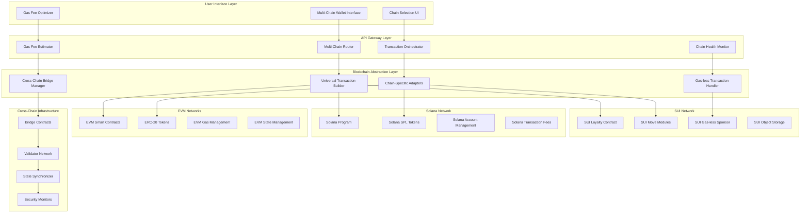
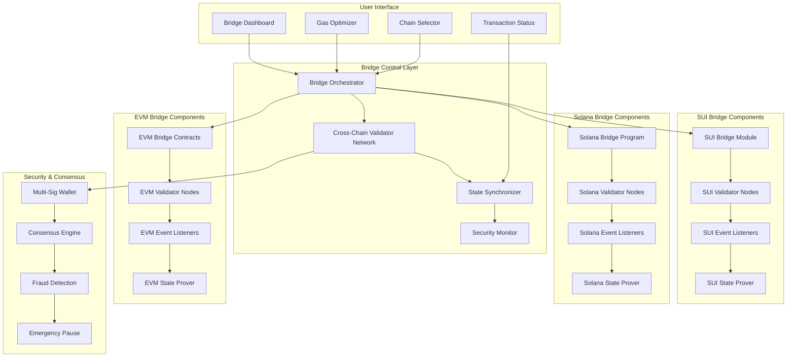

# Complete Blockchain Architecture & Multi-Chain Infrastructure

## Overview

This comprehensive document covers the complete blockchain architecture for the Ploy loyalty platform, including multi-chain support (SUI, Solana, EVM), cross-chain bridge infrastructure, token lifecycle management, and multi-chain policy engines.

## Table of Contents

1. [Multi-Chain Architecture](#multi-chain-architecture)
2. [Cross-Chain Bridge Infrastructure](#cross-chain-bridge-infrastructure)
3. [Blockchain Token Lifecycle](#blockchain-token-lifecycle)
4. [Multi-Chain Policy Engines](#multi-chain-policy-engines)
5. [Technical Implementation](#technical-implementation)

---

## Multi-Chain Architecture

### Chain Prioritization Strategy

#### Tier 1: Preferred Chains (Low Cost + Gas-less)
- **SUI Network**: Native gas-less transactions, low fees, high throughput
- **Solana**: Low fees, high speed, established ecosystem

#### Tier 2: EVM Compatible Chains
- **Polygon**: Lower fees than Ethereum mainnet
- **BSC (Binance Smart Chain)**: Fast and cheap transactions
- **Arbitrum/Optimism**: Layer 2 scaling solutions

#### Tier 3: High-Cost Chains
- **Ethereum Mainnet**: High fees, reserved for high-value operations

### Multi-Chain Architecture Overview



### Chain-Specific Implementations

#### SUI Implementation

```move
module loyalty::loyalty_system {
    use sui::coin::{Self, Coin};
    use sui::balance::{Self, Balance};
    use sui::object::{Self, UID, ID};
    use sui::transfer;
    use sui::tx_context::{Self, TxContext};
    use std::string::String;
    
    // Loyalty point structure
    struct LoyaltyPoint has key, store {
        id: UID,
        value: u64,
        source: String,
        timestamp: u64,
    }
    
    // Tenant configuration
    struct TenantConfig has key {
        id: UID,
        tenant_id: String,
        point_multiplier: u64,
        gas_sponsor: address,
        admin: address,
    }
    
    // Gas-less transaction sponsorship
    struct GasSponsor has key {
        id: UID,
        sponsor_balance: Balance<sui::sui::SUI>,
        daily_limit: u64,
        used_today: u64,
    }
    
    // Award points with gas sponsorship
    public fun award_points_gasless(
        config: &TenantConfig,
        sponsor: &mut GasSponsor,
        recipient: address,
        amount: u64,
        source: String,
        ctx: &mut TxContext
    ) {
        // Verify sponsor has sufficient balance
        assert!(balance::value(&sponsor.sponsor_balance) > 0, 0);
        assert!(sponsor.used_today + amount <= sponsor.daily_limit, 1);
        
        // Create loyalty points
        let loyalty_point = LoyaltyPoint {
            id: object::new(ctx),
            value: amount * config.point_multiplier,
            source,
            timestamp: tx_context::epoch(ctx),
        };
        
        // Update sponsor usage
        sponsor.used_today = sponsor.used_today + amount;
        
        // Transfer to recipient
        transfer::transfer(loyalty_point, recipient);
    }
    
    // Cross-chain bridge mint
    public fun bridge_mint(
        config: &TenantConfig,
        recipient: address,
        amount: u64,
        source_chain: String,
        bridge_tx_hash: String,
        ctx: &mut TxContext
    ) {
        let loyalty_point = LoyaltyPoint {
            id: object::new(ctx),
            value: amount,
            source: source_chain,
            timestamp: tx_context::epoch(ctx),
        };
        
        transfer::transfer(loyalty_point, recipient);
    }
}
```

#### Solana Implementation

```rust
use anchor_lang::prelude::*;
use anchor_spl::token::{self, Token, TokenAccount, Mint, Transfer};

declare_id!("LoyaltyProgramSolana11111111111111111111");

#[program]
pub mod loyalty_program {
    use super::*;
    
    // Initialize loyalty program
    pub fn initialize_program(
        ctx: Context<InitializeProgram>,
        tenant_id: String,
        point_multiplier: u64,
    ) -> Result<()> {
        let program_state = &mut ctx.accounts.program_state;
        program_state.tenant_id = tenant_id;
        program_state.point_multiplier = point_multiplier;
        program_state.admin = ctx.accounts.admin.key();
        program_state.total_supply = 0;
        Ok(())
    }
    
    // Award points (low-cost transaction)
    pub fn award_points(
        ctx: Context<AwardPoints>,
        amount: u64,
        reason: String,
    ) -> Result<()> {
        let program_state = &mut ctx.accounts.program_state;
        let final_amount = amount * program_state.point_multiplier;
        
        // Mint tokens to user
        let cpi_accounts = token::MintTo {
            mint: ctx.accounts.mint.to_account_info(),
            to: ctx.accounts.user_token_account.to_account_info(),
            authority: ctx.accounts.mint_authority.to_account_info(),
        };
        let cpi_program = ctx.accounts.token_program.to_account_info();
        let cpi_ctx = CpiContext::new(cpi_program, cpi_accounts);
        
        token::mint_to(cpi_ctx, final_amount)?;
        
        program_state.total_supply += final_amount;
        
        emit!(PointsAwarded {
            user: ctx.accounts.user.key(),
            amount: final_amount,
            reason,
            timestamp: Clock::get()?.unix_timestamp,
        });
        
        Ok(())
    }
    
    // Bridge transfer from other chains
    pub fn bridge_receive(
        ctx: Context<BridgeReceive>,
        amount: u64,
        source_chain: String,
        source_tx_hash: String,
    ) -> Result<()> {
        // Verify bridge signature
        require!(
            ctx.accounts.bridge_authority.key() == ctx.accounts.program_state.bridge_authority,
            ErrorCode::InvalidBridgeAuthority
        );
        
        // Mint bridged tokens
        let cpi_accounts = token::MintTo {
            mint: ctx.accounts.mint.to_account_info(),
            to: ctx.accounts.user_token_account.to_account_info(),
            authority: ctx.accounts.mint_authority.to_account_info(),
        };
        let cpi_program = ctx.accounts.token_program.to_account_info();
        let cpi_ctx = CpiContext::new(cpi_program, cpi_accounts);
        
        token::mint_to(cpi_ctx, amount)?;
        
        emit!(BridgeReceived {
            user: ctx.accounts.user.key(),
            amount,
            source_chain,
            source_tx_hash,
            timestamp: Clock::get()?.unix_timestamp,
        });
        
        Ok(())
    }
}

#[derive(Accounts)]
pub struct InitializeProgram<'info> {
    #[account(init, payer = admin, space = 8 + 200)]
    pub program_state: Account<'info, ProgramState>,
    #[account(mut)]
    pub admin: Signer<'info>,
    pub system_program: Program<'info, System>,
}

#[derive(Accounts)]
pub struct AwardPoints<'info> {
    #[account(mut)]
    pub program_state: Account<'info, ProgramState>,
    #[account(mut)]
    pub mint: Account<'info, Mint>,
    #[account(mut)]
    pub user_token_account: Account<'info, TokenAccount>,
    /// CHECK: Mint authority PDA
    #[account(seeds = [b"mint_authority"], bump)]
    pub mint_authority: UncheckedAccount<'info>,
    pub user: SystemAccount<'info>,
    pub token_program: Program<'info, Token>,
}

#[account]
pub struct ProgramState {
    pub tenant_id: String,
    pub point_multiplier: u64,
    pub admin: Pubkey,
    pub bridge_authority: Pubkey,
    pub total_supply: u64,
}

#[event]
pub struct PointsAwarded {
    pub user: Pubkey,
    pub amount: u64,
    pub reason: String,
    pub timestamp: i64,
}

#[event]
pub struct BridgeReceived {
    pub user: Pubkey,
    pub amount: u64,
    pub source_chain: String,
    pub source_tx_hash: String,
    pub timestamp: i64,
}

#[error_code]
pub enum ErrorCode {
    #[msg("Invalid bridge authority")]
    InvalidBridgeAuthority,
}
```

#### EVM Implementation

```solidity
// SPDX-License-Identifier: MIT
pragma solidity ^0.8.19;

import "@openzeppelin/contracts/token/ERC20/ERC20.sol";
import "@openzeppelin/contracts/token/ERC20/extensions/ERC20Burnable.sol";
import "@openzeppelin/contracts/access/AccessControl.sol";
import "@openzeppelin/contracts/security/ReentrancyGuard.sol";

contract MultiChainLoyaltyToken is ERC20, ERC20Burnable, AccessControl, ReentrancyGuard {
    bytes32 public constant MINTER_ROLE = keccak256("MINTER_ROLE");
    bytes32 public constant BURNER_ROLE = keccak256("BURNER_ROLE");
    bytes32 public constant BRIDGE_ROLE = keccak256("BRIDGE_ROLE");
    
    struct TenantConfig {
        string tenantId;
        uint256 pointMultiplier;
        bool active;
        address admin;
    }
    
    struct BridgeTransaction {
        uint256 amount;
        address recipient;
        string sourceChain;
        string sourceTxHash;
        bool processed;
    }
    
    mapping(address => TenantConfig) public tenantConfigs;
    mapping(bytes32 => BridgeTransaction) public bridgeTransactions;
    mapping(address => uint256) public totalEarned;
    mapping(address => uint256) public totalRedeemed;
    
    event PointsAwarded(
        address indexed user,
        uint256 amount,
        string reason,
        string tenantId,
        uint256 timestamp
    );
    
    event PointsRedeemed(
        address indexed user,
        uint256 amount,
        string reason,
        string tenantId,
        uint256 timestamp
    );
    
    event BridgeTransferReceived(
        address indexed recipient,
        uint256 amount,
        string sourceChain,
        string sourceTxHash,
        uint256 timestamp
    );
    
    event BridgeTransferSent(
        address indexed sender,
        uint256 amount,
        string targetChain,
        string targetAddress,
        uint256 timestamp
    );
    
    constructor(string memory name, string memory symbol) ERC20(name, symbol) {
        _grantRole(DEFAULT_ADMIN_ROLE, msg.sender);
        _grantRole(MINTER_ROLE, msg.sender);
        _grantRole(BURNER_ROLE, msg.sender);
        _grantRole(BRIDGE_ROLE, msg.sender);
    }
    
    // Configure tenant settings
    function configureTenant(
        address tenantAddress,
        string memory tenantId,
        uint256 pointMultiplier,
        address admin
    ) external onlyRole(DEFAULT_ADMIN_ROLE) {
        tenantConfigs[tenantAddress] = TenantConfig({
            tenantId: tenantId,
            pointMultiplier: pointMultiplier,
            active: true,
            admin: admin
        });
    }
    
    // Award points to user
    function awardPoints(
        address user,
        uint256 amount,
        string memory reason
    ) external onlyRole(MINTER_ROLE) {
        TenantConfig memory config = tenantConfigs[msg.sender];
        require(config.active, "Tenant not active");
        
        uint256 finalAmount = amount * config.pointMultiplier;
        _mint(user, finalAmount);
        
        totalEarned[user] += finalAmount;
        
        emit PointsAwarded(user, finalAmount, reason, config.tenantId, block.timestamp);
    }
    
    // Redeem points (burn)
    function redeemPoints(
        address user,
        uint256 amount,
        string memory reason
    ) external onlyRole(BURNER_ROLE) {
        require(balanceOf(user) >= amount, "Insufficient balance");
        
        TenantConfig memory config = tenantConfigs[msg.sender];
        require(config.active, "Tenant not active");
        
        _burn(user, amount);
        totalRedeemed[user] += amount;
        
        emit PointsRedeemed(user, amount, reason, config.tenantId, block.timestamp);
    }
    
    // Bridge receive - mint tokens from other chains
    function bridgeReceive(
        address recipient,
        uint256 amount,
        string memory sourceChain,
        string memory sourceTxHash,
        bytes32 bridgeId
    ) external onlyRole(BRIDGE_ROLE) nonReentrant {
        require(!bridgeTransactions[bridgeId].processed, "Bridge transaction already processed");
        
        bridgeTransactions[bridgeId] = BridgeTransaction({
            amount: amount,
            recipient: recipient,
            sourceChain: sourceChain,
            sourceTxHash: sourceTxHash,
            processed: true
        });
        
        _mint(recipient, amount);
        
        emit BridgeTransferReceived(recipient, amount, sourceChain, sourceTxHash, block.timestamp);
    }
    
    // Bridge send - burn tokens for transfer to other chains
    function bridgeSend(
        uint256 amount,
        string memory targetChain,
        string memory targetAddress
    ) external nonReentrant {
        require(balanceOf(msg.sender) >= amount, "Insufficient balance");
        
        _burn(msg.sender, amount);
        
        emit BridgeTransferSent(msg.sender, amount, targetChain, targetAddress, block.timestamp);
    }
    
    // Get user's total stats
    function getUserStats(address user) external view returns (
        uint256 currentBalance,
        uint256 lifetimeEarned,
        uint256 lifetimeRedeemed
    ) {
        return (balanceOf(user), totalEarned[user], totalRedeemed[user]);
    }
}
```

---

## Cross-Chain Bridge Infrastructure

### Bridge Architecture



### Bridge Implementation

#### Universal Bridge Controller

```typescript
class UniversalBridgeController {
  private chains: Map<string, ChainAdapter>;
  private validators: ValidatorNetwork;
  private security: SecurityMonitor;
  
  constructor() {
    this.chains = new Map();
    this.validators = new ValidatorNetwork();
    this.security = new SecurityMonitor();
    
    // Initialize chain adapters
    this.chains.set('sui', new SUIAdapter());
    this.chains.set('solana', new SolanaAdapter());
    this.chains.set('ethereum', new EVMAdapter('ethereum'));
    this.chains.set('polygon', new EVMAdapter('polygon'));
    this.chains.set('bsc', new EVMAdapter('bsc'));
  }
  
  async initiateBridge(request: BridgeRequest): Promise<BridgeResult> {
    // Validate request
    await this.validateBridgeRequest(request);
    
    // Check security constraints
    await this.security.validateTransfer(request);
    
    // Get optimal path
    const bridgePath = await this.calculateOptimalPath(request);
    
    // Execute bridge transaction
    const result = await this.executeBridge(bridgePath);
    
    return result;
  }
  
  private async calculateOptimalPath(request: BridgeRequest): Promise<BridgePath> {
    const sourceChain = this.chains.get(request.sourceChain);
    const targetChain = this.chains.get(request.targetChain);
    
    if (!sourceChain || !targetChain) {
      throw new Error('Unsupported chain');
    }
    
    // Calculate fees and time for different paths
    const directPath = await this.calculateDirectPath(request);
    const hubPaths = await this.calculateHubPaths(request);
    
    // Select optimal path based on cost and speed
    return this.selectOptimalPath([directPath, ...hubPaths]);
  }
  
  private async executeBridge(path: BridgePath): Promise<BridgeResult> {
    const sourceAdapter = this.chains.get(path.sourceChain);
    const targetAdapter = this.chains.get(path.targetChain);
    
    try {
      // Step 1: Lock tokens on source chain
      const lockResult = await sourceAdapter.lockTokens(path.lockParams);
      
      // Step 2: Generate proof of lock
      const proof = await this.generateLockProof(lockResult);
      
      // Step 3: Submit proof to validator network
      const validationResult = await this.validators.validateProof(proof);
      
      // Step 4: Mint tokens on target chain
      const mintResult = await targetAdapter.mintTokens({
        ...path.mintParams,
        proof: validationResult.proof,
        signatures: validationResult.signatures
      });
      
      // Step 5: Confirm bridge completion
      await this.confirmBridgeCompletion({
        sourceTransaction: lockResult.transactionHash,
        targetTransaction: mintResult.transactionHash,
        amount: path.amount,
        user: path.user
      });
      
      return {
        success: true,
        sourceTransaction: lockResult.transactionHash,
        targetTransaction: mintResult.transactionHash,
        bridgeId: path.bridgeId,
        completionTime: new Date()
      };
      
    } catch (error) {
      // Handle bridge failure
      await this.handleBridgeFailure(path, error);
      throw error;
    }
  }
}

interface BridgeRequest {
  sourceChain: string;
  targetChain: string;
  amount: string;
  user: string;
  targetAddress: string;
  urgency: 'low' | 'medium' | 'high';
}

interface BridgePath {
  bridgeId: string;
  sourceChain: string;
  targetChain: string;
  amount: string;
  user: string;
  estimatedTime: number;
  estimatedCost: string;
  lockParams: LockParams;
  mintParams: MintParams;
}

interface BridgeResult {
  success: boolean;
  sourceTransaction: string;
  targetTransaction: string;
  bridgeId: string;
  completionTime: Date;
}
```

#### Chain-Specific Adapters

```typescript
abstract class ChainAdapter {
  abstract lockTokens(params: LockParams): Promise<LockResult>;
  abstract mintTokens(params: MintParams): Promise<MintResult>;
  abstract getTransactionStatus(hash: string): Promise<TransactionStatus>;
  abstract estimateGas(params: TransactionParams): Promise<GasEstimate>;
}

class SUIAdapter extends ChainAdapter {
  async lockTokens(params: LockParams): Promise<LockResult> {
    const tx = new TransactionBlock();
    
    // Call bridge lock function
    tx.moveCall({
      target: `${BRIDGE_PACKAGE_ID}::bridge::lock_for_bridge`,
      arguments: [
        tx.pure(params.amount),
        tx.pure(params.targetChain),
        tx.pure(params.targetAddress),
        tx.pure(params.user)
      ]
    });
    
    const result = await this.suiClient.signAndExecuteTransactionBlock({
      transactionBlock: tx,
      signer: params.signer,
      options: { showEffects: true, showEvents: true }
    });
    
    return {
      transactionHash: result.digest,
      lockId: this.extractLockId(result.events),
      timestamp: Date.now()
    };
  }
  
  async mintTokens(params: MintParams): Promise<MintResult> {
    const tx = new TransactionBlock();
    
    // Verify bridge proof and mint
    tx.moveCall({
      target: `${BRIDGE_PACKAGE_ID}::bridge::verify_and_mint`,
      arguments: [
        tx.pure(params.proof),
        tx.pure(params.signatures),
        tx.pure(params.amount),
        tx.pure(params.recipient)
      ]
    });
    
    const result = await this.suiClient.signAndExecuteTransactionBlock({
      transactionBlock: tx,
      signer: params.bridgeSigner,
      options: { showEffects: true }
    });
    
    return {
      transactionHash: result.digest,
      mintedAmount: params.amount,
      recipient: params.recipient
    };
  }
}

class SolanaAdapter extends ChainAdapter {
  async lockTokens(params: LockParams): Promise<LockResult> {
    const instruction = await this.bridgeProgram.methods
      .lockForBridge(
        new BN(params.amount),
        params.targetChain,
        params.targetAddress
      )
      .accounts({
        user: params.user,
        userTokenAccount: params.userTokenAccount,
        bridgeVault: this.bridgeVault,
        tokenProgram: TOKEN_PROGRAM_ID
      })
      .instruction();
    
    const transaction = new Transaction().add(instruction);
    const signature = await this.connection.sendTransaction(transaction, [params.signer]);
    
    await this.connection.confirmTransaction(signature);
    
    return {
      transactionHash: signature,
      lockId: this.generateLockId(signature),
      timestamp: Date.now()
    };
  }
  
  async mintTokens(params: MintParams): Promise<MintResult> {
    const instruction = await this.bridgeProgram.methods
      .verifyAndMint(
        params.proof,
        params.signatures,
        new BN(params.amount)
      )
      .accounts({
        recipient: params.recipient,
        recipientTokenAccount: params.recipientTokenAccount,
        mint: this.tokenMint,
        mintAuthority: this.mintAuthority,
        tokenProgram: TOKEN_PROGRAM_ID
      })
      .instruction();
    
    const transaction = new Transaction().add(instruction);
    const signature = await this.connection.sendTransaction(transaction, [this.bridgeSigner]);
    
    await this.connection.confirmTransaction(signature);
    
    return {
      transactionHash: signature,
      mintedAmount: params.amount,
      recipient: params.recipient
    };
  }
}

class EVMAdapter extends ChainAdapter {
  async lockTokens(params: LockParams): Promise<LockResult> {
    const contract = new ethers.Contract(
      this.bridgeContractAddress,
      BRIDGE_ABI,
      params.signer
    );
    
    const tx = await contract.lockForBridge(
      params.amount,
      params.targetChain,
      params.targetAddress,
      { gasLimit: params.gasLimit }
    );
    
    const receipt = await tx.wait();
    
    return {
      transactionHash: receipt.transactionHash,
      lockId: this.extractLockId(receipt.logs),
      timestamp: Date.now()
    };
  }
  
  async mintTokens(params: MintParams): Promise<MintResult> {
    const contract = new ethers.Contract(
      this.bridgeContractAddress,
      BRIDGE_ABI,
      this.bridgeSigner
    );
    
    const tx = await contract.verifyAndMint(
      params.proof,
      params.signatures,
      params.amount,
      params.recipient,
      { gasLimit: params.gasLimit }
    );
    
    const receipt = await tx.wait();
    
    return {
      transactionHash: receipt.transactionHash,
      mintedAmount: params.amount,
      recipient: params.recipient
    };
  }
}
```

---

## Blockchain Token Lifecycle

### Token Treatment Strategies

#### 1. Burn Strategy (Deflationary)

**Concept**: Permanently destroy tokens from circulation when redeemed or voided, reducing total supply.

```solidity
contract LoyaltyToken is ERC20Burnable {
    event TokensBurned(address indexed user, uint256 amount, string reason, bytes32 transactionHash);
    
    function burnForRedemption(
        address user,
        uint256 amount,
        string memory reason,
        bytes32 redemptionHash
    ) external onlyRole(BURNER_ROLE) {
        require(balanceOf(user) >= amount, "Insufficient balance");
        
        // Burn tokens permanently
        _burn(user, amount);
        
        // Record burn event with context
        emit TokensBurned(user, amount, reason, redemptionHash);
        
        // Update treasury analytics
        _updateTreasuryAnalytics(amount, reason);
    }
    
    function burnForVoid(
        address user,
        uint256 amount,
        string memory voidReason,
        bytes32 originalTransactionHash
    ) external onlyRole(BURNER_ROLE) {
        require(balanceOf(user) >= amount, "Insufficient balance");
        
        _burn(user, amount);
        
        emit TokensBurned(user, amount, voidReason, originalTransactionHash);
        
        // Record void statistics
        _recordVoidStatistics(user, amount, voidReason);
    }
    
    // Analytical functions for deflation tracking
    function getTotalBurnedSupply() external view returns (uint256) {
        return _totalBurnedSupply;
    }
    
    function getBurnRateAnalytics() external view returns (
        uint256 dailyBurnRate,
        uint256 weeklyBurnRate,
        uint256 monthlyBurnRate
    ) {
        return _calculateBurnRates();
    }
}
```

#### 2. Treasury Strategy (Controlled Supply)

**Concept**: Transfer redeemed tokens to a treasury wallet for future redistribution or ecosystem funding.

```solidity
contract LoyaltyTokenTreasury is ERC20 {
    address public treasuryWallet;
    address public ecosystemFund;
    
    struct TreasuryMetrics {
        uint256 totalCollected;
        uint256 totalRedistributed;
        uint256 ecosystemAllocated;
        uint256 lastRebalance;
    }
    
    TreasuryMetrics public treasuryMetrics;
    
    event TokensToTreasury(address indexed user, uint256 amount, string reason);
    event TreasuryRedistribution(address indexed recipient, uint256 amount, string purpose);
    
    function transferToTreasury(
        address user,
        uint256 amount,
        string memory reason
    ) external onlyRole(TREASURY_ROLE) {
        require(balanceOf(user) >= amount, "Insufficient balance");
        
        // Transfer to treasury instead of burning
        _transfer(user, treasuryWallet, amount);
        
        treasuryMetrics.totalCollected += amount;
        
        emit TokensToTreasury(user, amount, reason);
        
        // Trigger auto-rebalancing if threshold reached
        if (_shouldRebalance()) {
            _executeRebalancing();
        }
    }
    
    function redistributeFromTreasury(
        address recipient,
        uint256 amount,
        string memory purpose
    ) external onlyRole(TREASURY_MANAGER_ROLE) {
        require(balanceOf(treasuryWallet) >= amount, "Insufficient treasury balance");
        
        _transfer(treasuryWallet, recipient, amount);
        
        treasuryMetrics.totalRedistributed += amount;
        
        emit TreasuryRedistribution(recipient, amount, purpose);
    }
    
    function allocateToEcosystem(uint256 amount) external onlyRole(ECOSYSTEM_ROLE) {
        require(balanceOf(treasuryWallet) >= amount, "Insufficient treasury balance");
        
        _transfer(treasuryWallet, ecosystemFund, amount);
        
        treasuryMetrics.ecosystemAllocated += amount;
    }
    
    function _executeRebalancing() private {
        uint256 treasuryBalance = balanceOf(treasuryWallet);
        
        // Allocate 30% to ecosystem fund
        uint256 ecosystemAllocation = treasuryBalance * 30 / 100;
        if (ecosystemAllocation > 0) {
            _transfer(treasuryWallet, ecosystemFund, ecosystemAllocation);
        }
        
        treasuryMetrics.lastRebalance = block.timestamp;
    }
}
```

#### 3. Staking Pool Strategy (Yield Generation)

**Concept**: Lock redeemed tokens in staking pools to generate yield and maintain ecosystem liquidity.

```solidity
contract LoyaltyStakingPool is ERC20 {
    struct StakingPool {
        string poolName;
        uint256 totalStaked;
        uint256 rewardRate; // Annual percentage yield
        uint256 lockPeriod; // In seconds
        bool active;
    }
    
    struct UserStake {
        uint256 amount;
        uint256 stakingStartTime;
        uint256 rewardsEarned;
        uint256 poolId;
    }
    
    mapping(uint256 => StakingPool) public stakingPools;
    mapping(address => mapping(uint256 => UserStake)) public userStakes;
    mapping(address => uint256[]) public userPoolIds;
    
    uint256 public poolCounter;
    
    event TokensStakedFromRedemption(address indexed user, uint256 amount, uint256 poolId);
    event StakingRewardsDistributed(address indexed user, uint256 amount, uint256 poolId);
    
    function stakeFromRedemption(
        address user,
        uint256 amount,
        uint256 poolId,
        string memory redemptionReason
    ) external onlyRole(STAKING_ROLE) {
        require(stakingPools[poolId].active, "Pool not active");
        require(balanceOf(user) >= amount, "Insufficient balance");
        
        StakingPool storage pool = stakingPools[poolId];
        
        // Transfer tokens to staking pool
        _transfer(user, address(this), amount);
        
        // Create or update user stake
        UserStake storage userStake = userStakes[user][poolId];
        if (userStake.amount == 0) {
            userPoolIds[user].push(poolId);
        }
        
        userStake.amount += amount;
        userStake.stakingStartTime = block.timestamp;
        userStake.poolId = poolId;
        
        pool.totalStaked += amount;
        
        emit TokensStakedFromRedemption(user, amount, poolId);
    }
    
    function calculateStakingRewards(
        address user,
        uint256 poolId
    ) public view returns (uint256) {
        UserStake memory userStake = userStakes[user][poolId];
        StakingPool memory pool = stakingPools[poolId];
        
        if (userStake.amount == 0) return 0;
        
        uint256 stakingDuration = block.timestamp - userStake.stakingStartTime;
        uint256 annualReward = (userStake.amount * pool.rewardRate) / 10000;
        uint256 reward = (annualReward * stakingDuration) / 365 days;
        
        return reward;
    }
    
    function claimStakingRewards(uint256 poolId) external {
        uint256 rewards = calculateStakingRewards(msg.sender, poolId);
        require(rewards > 0, "No rewards available");
        
        UserStake storage userStake = userStakes[msg.sender][poolId];
        userStake.rewardsEarned += rewards;
        
        // Mint new tokens as rewards
        _mint(msg.sender, rewards);
        
        emit StakingRewardsDistributed(msg.sender, rewards, poolId);
    }
}
```

#### 4. Cross-Chain Reserve Strategy

**Concept**: Use redeemed tokens to fund cross-chain bridges and maintain liquidity across networks.

```solidity
contract CrossChainReserveManager is ERC20 {
    struct ChainReserve {
        string chainName;
        uint256 reserveBalance;
        uint256 utilizationRate;
        uint256 lastRebalance;
        bool active;
    }
    
    mapping(string => ChainReserve) public chainReserves;
    mapping(string => address) public chainBridgeContracts;
    
    string[] public supportedChains;
    
    event TokensAllocatedToReserve(string indexed chainName, uint256 amount);
    event ReserveRebalanced(string indexed chainName, uint256 newBalance);
    event CrossChainLiquidityProvided(string indexed chainName, uint256 amount);
    
    function allocateToChainReserve(
        address user,
        uint256 amount,
        string memory targetChain,
        string memory redemptionReason
    ) external onlyRole(RESERVE_ROLE) {
        require(chainReserves[targetChain].active, "Chain not supported");
        require(balanceOf(user) >= amount, "Insufficient balance");
        
        // Transfer tokens to reserve
        _transfer(user, address(this), amount);
        
        ChainReserve storage reserve = chainReserves[targetChain];
        reserve.reserveBalance += amount;
        
        emit TokensAllocatedToReserve(targetChain, amount);
        
        // Trigger cross-chain transfer if needed
        if (_shouldProvideChainLiquidity(targetChain)) {
            _provideCrossChainLiquidity(targetChain);
        }
    }
    
    function _provideCrossChainLiquidity(string memory chainName) private {
        ChainReserve storage reserve = chainReserves[chainName];
        uint256 transferAmount = reserve.reserveBalance / 2; // Transfer 50%
        
        if (transferAmount > 0) {
            // Initiate cross-chain transfer
            address bridgeContract = chainBridgeContracts[chainName];
            _transfer(address(this), bridgeContract, transferAmount);
            
            reserve.reserveBalance -= transferAmount;
            
            emit CrossChainLiquidityProvided(chainName, transferAmount);
        }
    }
    
    function rebalanceChainReserves() external onlyRole(REBALANCER_ROLE) {
        uint256 totalReserves = 0;
        
        // Calculate total reserves
        for (uint256 i = 0; i < supportedChains.length; i++) {
            totalReserves += chainReserves[supportedChains[i]].reserveBalance;
        }
        
        // Rebalance each chain to equal allocation
        uint256 targetPerChain = totalReserves / supportedChains.length;
        
        for (uint256 i = 0; i < supportedChains.length; i++) {
            string memory chainName = supportedChains[i];
            ChainReserve storage reserve = chainReserves[chainName];
            
            if (reserve.reserveBalance != targetPerChain) {
                reserve.reserveBalance = targetPerChain;
                reserve.lastRebalance = block.timestamp;
                
                emit ReserveRebalanced(chainName, targetPerChain);
            }
        }
    }
}
```

---

## Multi-Chain Policy Engines

### Unified Policy Engine Architecture

```typescript
class MultiChainPolicyEngine {
  private chainPolicyEngines: Map<string, ChainSpecificPolicyEngine>;
  private universalPolicies: UniversalPolicy[];
  private crossChainRules: CrossChainRule[];
  
  constructor() {
    this.chainPolicyEngines = new Map();
    this.universalPolicies = [];
    this.crossChainRules = [];
    
    // Initialize chain-specific engines
    this.initializeChainEngines();
  }
  
  async evaluatePolicy(request: PolicyEvaluationRequest): Promise<PolicyResult> {
    // Determine which chains are involved
    const involvedChains = this.getInvolvedChains(request);
    
    // Evaluate universal policies first
    const universalResult = await this.evaluateUniversalPolicies(request);
    if (!universalResult.approved) {
      return universalResult;
    }
    
    // Evaluate chain-specific policies
    const chainResults = await Promise.all(
      involvedChains.map(chain => 
        this.evaluateChainSpecificPolicy(request, chain)
      )
    );
    
    // Check for cross-chain rule conflicts
    const crossChainResult = await this.evaluateCrossChainRules(request, chainResults);
    
    // Combine all results
    return this.combineResults(universalResult, chainResults, crossChainResult);
  }
  
  private async evaluateChainSpecificPolicy(
    request: PolicyEvaluationRequest,
    chainId: string
  ): Promise<ChainPolicyResult> {
    const engine = this.chainPolicyEngines.get(chainId);
    if (!engine) {
      throw new Error(`No policy engine for chain ${chainId}`);
    }
    
    return await engine.evaluate(request);
  }
  
  private async evaluateCrossChainRules(
    request: PolicyEvaluationRequest,
    chainResults: ChainPolicyResult[]
  ): Promise<CrossChainResult> {
    for (const rule of this.crossChainRules) {
      const ruleResult = await this.evaluateRule(rule, request, chainResults);
      if (!ruleResult.approved) {
        return ruleResult;
      }
    }
    
    return { approved: true, conditions: [] };
  }
}

class SUISpecificPolicyEngine extends ChainSpecificPolicyEngine {
  async evaluate(request: PolicyEvaluationRequest): Promise<ChainPolicyResult> {
    const policies = await this.getSUIPolicies(request.tenantId);
    
    for (const policy of policies) {
      // Evaluate SUI-specific conditions
      if (policy.type === 'gas_sponsorship') {
        const gasResult = await this.evaluateGasSponsorship(request);
        if (!gasResult.approved) {
          return gasResult;
        }
      }
      
      if (policy.type === 'object_ownership') {
        const ownershipResult = await this.evaluateObjectOwnership(request);
        if (!ownershipResult.approved) {
          return ownershipResult;
        }
      }
      
      if (policy.type === 'move_module_interaction') {
        const moduleResult = await this.evaluateMoveModulePolicy(request);
        if (!moduleResult.approved) {
          return moduleResult;
        }
      }
    }
    
    return { approved: true, chainId: 'sui', conditions: [] };
  }
  
  private async evaluateGasSponsorship(
    request: PolicyEvaluationRequest
  ): Promise<ChainPolicyResult> {
    const gasPolicy = await this.getGasSponsorshipPolicy(request.tenantId);
    
    // Check daily sponsorship limits
    const dailyUsage = await this.getDailyGasUsage(request.userId);
    if (dailyUsage >= gasPolicy.dailyLimit) {
      return {
        approved: false,
        reason: 'Daily gas sponsorship limit exceeded',
        chainId: 'sui'
      };
    }
    
    // Check transaction value limits
    if (request.transactionValue > gasPolicy.maxValueForSponsorship) {
      return {
        approved: false,
        reason: 'Transaction value exceeds gas sponsorship threshold',
        chainId: 'sui'
      };
    }
    
    return { approved: true, chainId: 'sui', conditions: ['gas_sponsored'] };
  }
}

class SolanaSpecificPolicyEngine extends ChainSpecificPolicyEngine {
  async evaluate(request: PolicyEvaluationRequest): Promise<ChainPolicyResult> {
    const policies = await this.getSolanaPolicies(request.tenantId);
    
    for (const policy of policies) {
      if (policy.type === 'compute_budget') {
        const computeResult = await this.evaluateComputeBudget(request);
        if (!computeResult.approved) {
          return computeResult;
        }
      }
      
      if (policy.type === 'account_rent') {
        const rentResult = await this.evaluateAccountRent(request);
        if (!rentResult.approved) {
          return rentResult;
        }
      }
      
      if (policy.type === 'program_authority') {
        const authorityResult = await this.evaluateProgramAuthority(request);
        if (!authorityResult.approved) {
          return authorityResult;
        }
      }
    }
    
    return { approved: true, chainId: 'solana', conditions: [] };
  }
  
  private async evaluateComputeBudget(
    request: PolicyEvaluationRequest
  ): Promise<ChainPolicyResult> {
    const computePolicy = await this.getComputeBudgetPolicy(request.tenantId);
    
    // Check if transaction requires high compute units
    const estimatedCompute = await this.estimateComputeUnits(request);
    
    if (estimatedCompute > computePolicy.maxComputeUnits) {
      return {
        approved: false,
        reason: 'Transaction exceeds compute budget limits',
        chainId: 'solana'
      };
    }
    
    // Check if priority fees are within limits
    if (request.priorityFee > computePolicy.maxPriorityFee) {
      return {
        approved: false,
        reason: 'Priority fee exceeds policy limits',
        chainId: 'solana'
      };
    }
    
    return { approved: true, chainId: 'solana', conditions: ['compute_optimized'] };
  }
}

class EVMSpecificPolicyEngine extends ChainSpecificPolicyEngine {
  async evaluate(request: PolicyEvaluationRequest): Promise<ChainPolicyResult> {
    const policies = await this.getEVMPolicies(request.tenantId, request.chainId);
    
    for (const policy of policies) {
      if (policy.type === 'gas_price') {
        const gasResult = await this.evaluateGasPrice(request);
        if (!gasResult.approved) {
          return gasResult;
        }
      }
      
      if (policy.type === 'contract_interaction') {
        const contractResult = await this.evaluateContractInteraction(request);
        if (!contractResult.approved) {
          return contractResult;
        }
      }
      
      if (policy.type === 'mev_protection') {
        const mevResult = await this.evaluateMEVProtection(request);
        if (!mevResult.approved) {
          return mevResult;
        }
      }
    }
    
    return { approved: true, chainId: request.chainId, conditions: [] };
  }
  
  private async evaluateGasPrice(
    request: PolicyEvaluationRequest
  ): Promise<ChainPolicyResult> {
    const gasPolicy = await this.getGasPricePolicy(request.tenantId, request.chainId);
    
    // Get current network gas prices
    const networkGasPrice = await this.getNetworkGasPrice(request.chainId);
    
    // Check if transaction gas price is reasonable
    if (request.gasPrice > networkGasPrice * gasPolicy.maxGasPriceMultiplier) {
      return {
        approved: false,
        reason: 'Gas price exceeds policy limits',
        chainId: request.chainId
      };
    }
    
    // Check total gas cost
    const totalGasCost = request.gasPrice * request.gasLimit;
    if (totalGasCost > gasPolicy.maxGasCost) {
      return {
        approved: false,
        reason: 'Total gas cost exceeds policy limits',
        chainId: request.chainId
      };
    }
    
    return { approved: true, chainId: request.chainId, conditions: ['gas_optimized'] };
  }
}
```

### Cross-Chain Policy Coordination

```typescript
class CrossChainPolicyCoordinator {
  async coordinateCrossChainPolicy(
    sourceChain: string,
    targetChain: string,
    request: CrossChainRequest
  ): Promise<CrossChainPolicyResult> {
    
    // Evaluate source chain exit policies
    const sourceExitPolicy = await this.evaluateExitPolicy(sourceChain, request);
    if (!sourceExitPolicy.approved) {
      return { approved: false, reason: sourceExitPolicy.reason };
    }
    
    // Evaluate target chain entry policies
    const targetEntryPolicy = await this.evaluateEntryPolicy(targetChain, request);
    if (!targetEntryPolicy.approved) {
      return { approved: false, reason: targetEntryPolicy.reason };
    }
    
    // Check bridge-specific policies
    const bridgePolicy = await this.evaluateBridgePolicy(sourceChain, targetChain, request);
    if (!bridgePolicy.approved) {
      return { approved: false, reason: bridgePolicy.reason };
    }
    
    // Evaluate global compliance rules
    const complianceResult = await this.evaluateGlobalCompliance(request);
    if (!complianceResult.approved) {
      return { approved: false, reason: complianceResult.reason };
    }
    
    return {
      approved: true,
      sourceConditions: sourceExitPolicy.conditions,
      targetConditions: targetEntryPolicy.conditions,
      bridgeConditions: bridgePolicy.conditions,
      globalConditions: complianceResult.conditions
    };
  }
  
  private async evaluateGlobalCompliance(
    request: CrossChainRequest
  ): Promise<PolicyResult> {
    
    // Check AML/KYC requirements
    const amlResult = await this.checkAMLCompliance(request);
    if (!amlResult.approved) {
      return amlResult;
    }
    
    // Check geographic restrictions
    const geoResult = await this.checkGeographicRestrictions(request);
    if (!geoResult.approved) {
      return geoResult;
    }
    
    // Check transaction limits
    const limitsResult = await this.checkTransactionLimits(request);
    if (!limitsResult.approved) {
      return limitsResult;
    }
    
    return { approved: true, conditions: ['compliance_verified'] };
  }
}
```

---

This comprehensive blockchain architecture documentation consolidates all blockchain-related components into a single, navigable resource while maintaining the depth and technical detail needed for implementation. The unified structure makes it easier for developers to understand how all blockchain components work together within the Ploy platform's multi-chain ecosystem.