# Comprehensive Policy Engine: Dynamic Rules Across All Industries

## Overview

The Ploy platform features a sophisticated policy engine that combines conditional policies, industry-specific workflows, and dynamic optimization to deliver personalized loyalty experiences. This comprehensive system supports both **traditional database storage** and **blockchain storage modes**, providing a **hybrid reward approach** that combines action-based achievements with purchase multipliers across 9 major industries.

### Storage Mode Flexibility

The policy engine seamlessly operates across both storage modes:
- **Traditional Mode**: Fast database operations, cost-effective for high-volume transactions
- **Blockchain Mode**: On-chain verification, NFT rewards, and cross-platform asset portability  
- **Hybrid Mode**: Critical transactions on blockchain, routine operations in database
- **Migration Support**: Zero-downtime upgrade from traditional to blockchain storage

## Policy Engine Architecture

### Core Policy Engine Interface

```typescript
interface PolicyEngine {
  // Policy evaluation
  evaluate(context: PolicyContext): PolicyResult;
  
  // Policy combination
  combine(policies: Policy[], operator: 'AND' | 'OR'): Policy;
  
  // Dynamic policy loading
  loadPolicy(policyId: string): Promise<Policy>;
  
  // Policy versioning
  getActiveVersion(policyId: string): PolicyVersion;
  
  // Dynamic engine management
  loadEngine(industry: IndustryType): Promise<IndustryPolicyEngine>;
  
  // Policy composition
  combinepolicies(policies: Policy[], operator: CombinationOperator): Policy;
  
  // Real-time optimization
  optimizeForContext(context: PolicyContext): Promise<OptimizedPolicy>;
  
  // A/B testing
  testPolicyVariations(basePolicy: Policy, variations: PolicyVariation[]): Promise<TestResult>;
  
  // Dynamic field integration
  evaluateCustomFields(serviceId: string, instanceId: string, fieldRules: FieldRule[]): Promise<FieldEvaluationResult>;
  
  // Marketplace policy integration
  evaluateMarketplacePolicies(listingData: MarketplaceListing, context: PolicyContext): Promise<MarketplacePolicyResult>;
}

interface PolicyContext {
  tenant: Tenant;
  member: Member;
  transaction: Transaction;
  metadata: Record<string, any>;
  timestamp: Date;
  environment: 'development' | 'staging' | 'production';
}

interface PolicyResult {
  applied: boolean;
  policyId: string;
  pointsAwarded?: number;
  breakdown?: {
    basePoints: number;
    actionBonus: number;
    purchaseMultiplier: number;
  };
  multiplierApplied?: number;
  trackType: 'action' | 'purchase' | 'hybrid';
  metadata?: Record<string, any>;
}

interface PolicyVersion {
  id: string;
  version: number;
  active: boolean;
  createdAt: Date;
  changes: string[];
}

enum PolicyType {
  EARNING_RULES = 'earning_rules',
  REDEMPTION_RULES = 'redemption_rules',
  TIER_PROGRESSION = 'tier_progression',
  EXPIRATION_RULES = 'expiration_rules',
  FRAUD_DETECTION = 'fraud_detection',
  COMPLIANCE_RULES = 'compliance_rules',
  PROMOTIONAL_RULES = 'promotional_rules',
  CROSS_PLATFORM = 'cross_platform'
}

enum IndustryType {
  SAAS = 'saas',
  ECOMMERCE = 'ecommerce',
  CLOUD = 'cloud',
  FINTECH = 'fintech',
  GAMING = 'gaming',
  TRAVEL = 'travel',
  HEALTH_FITNESS = 'health_fitness',
  FOOD_DRINK = 'food_drink',
  WEB3_DEFI = 'web3_defi'
}
```

## Dynamic Field Policy Integration

### Custom Field-Based Policy Rules

The policy engine seamlessly integrates with the dynamic field system to enable policies based on custom service attributes:

```typescript
interface FieldBasedPolicy {
  policyId: string;
  serviceId: string;
  fieldRules: FieldRule[];
  actions: PolicyAction[];
  priority: number;
}

interface FieldRule {
  fieldId: string;
  operator: FieldOperator;
  value: any;
  weightMultiplier?: number;
}

enum FieldOperator {
  EQUALS = 'equals',
  NOT_EQUALS = 'not_equals',
  GREATER_THAN = 'greater_than',
  LESS_THAN = 'less_than',
  CONTAINS = 'contains',
  IN_ARRAY = 'in_array',
  REGEX_MATCH = 'regex_match',
  RANGE = 'range'
}

// Example: Tech certification marketplace policy
const techCertPolicy: FieldBasedPolicy = {
  policyId: "policy_tech_cert_bonus",
  serviceId: "svc_tech_mastery_certificates",
  fieldRules: [
    {
      fieldId: "expertise_level",
      operator: FieldOperator.IN_ARRAY,
      value: ["Expert", "Master"],
      weightMultiplier: 1.5
    },
    {
      fieldId: "verification_score",
      operator: FieldOperator.GREATER_THAN,
      value: 90,
      weightMultiplier: 1.2
    },
    {
      fieldId: "tech_stack",
      operator: FieldOperator.CONTAINS,
      value: "Blockchain",
      weightMultiplier: 1.3
    }
  ],
  actions: [
    {
      type: "AWARD_BONUS_POINTS",
      amount: 500,
      reason: "High-value tech certification achievement"
    },
    {
      type: "CREATE_MARKETPLACE_LISTING",
      config: {
        autoList: true,
        suggestedPrice: "dynamic",
        featured: true
      }
    }
  ],
  priority: 10
};
```

### Marketplace-Aware Policy Engine

```typescript
class MarketplacePolicyEngine extends PolicyEngine {
  async evaluateMarketplacePolicies(
    listingData: MarketplaceListing,
    context: PolicyContext
  ): Promise<MarketplacePolicyResult> {
    // Get service definition and custom fields
    const service = await this.serviceRegistry.getService(listingData.serviceId);
    const customFields = await this.getCustomFieldValues(listingData.instanceId);
    
    // Evaluate field-based policies
    const fieldPolicies = await this.getFieldPolicies(listingData.serviceId);
    const policyResults = [];
    
    for (const policy of fieldPolicies) {
      const result = await this.evaluateFieldPolicy(policy, customFields, context);
      if (result.applied) {
        policyResults.push(result);
      }
    }
    
    // Calculate dynamic pricing adjustments
    const pricingAdjustments = await this.calculatePricingAdjustments(
      policyResults,
      listingData,
      customFields
    );
    
    return {
      policiesApplied: policyResults,
      pricingAdjustments,
      recommendedActions: await this.generateMarketplaceRecommendations(
        listingData,
        customFields,
        policyResults
      )
    };
  }
  
  private async evaluateFieldPolicy(
    policy: FieldBasedPolicy,
    customFields: Record<string, any>,
    context: PolicyContext
  ): Promise<PolicyResult> {
    let totalWeight = 1;
    let rulesMatched = 0;
    
    for (const rule of policy.fieldRules) {
      const fieldValue = customFields[rule.fieldId];
      const matches = this.evaluateFieldRule(rule, fieldValue);
      
      if (matches) {
        rulesMatched++;
        if (rule.weightMultiplier) {
          totalWeight *= rule.weightMultiplier;
        }
      }
    }
    
    // Policy applies if all rules match
    const policyApplies = rulesMatched === policy.fieldRules.length;
    
    if (policyApplies) {
      // Execute policy actions with weight adjustments
      const adjustedActions = policy.actions.map(action => ({
        ...action,
        amount: action.amount ? Math.floor(action.amount * totalWeight) : undefined
      }));
      
      await this.executePolicyActions(adjustedActions, context);
    }
    
    return {
      applied: policyApplies,
      policyId: policy.policyId,
      weight: totalWeight,
      rulesMatched,
      totalRules: policy.fieldRules.length
    };
  }
}
```

### Service Composition Policy Rules

```typescript
// Policy for cross-service interactions
interface ServiceCompositionPolicy {
  policyId: string;
  triggerService: string;
  targetServices: string[];
  compositionRules: CompositionRule[];
  actions: CrossServiceAction[];
}

interface CompositionRule {
  triggerEvent: string;
  conditions: ServiceCondition[];
  serviceInteractions: ServiceInteraction[];
}

// Example: Loyalty + NFT + Marketplace composition policy
const loyaltyNFTMarketplacePolicy: ServiceCompositionPolicy = {
  policyId: "policy_loyalty_nft_marketplace_flow",
  triggerService: "svc_loyalty_program",
  targetServices: ["svc_tech_mastery_certificates", "svc_marketplace"],
  compositionRules: [
    {
      triggerEvent: "tier_upgraded",
      conditions: [
        {
          serviceId: "svc_loyalty_program",
          field: "new_tier",
          operator: "equals",
          value: "Gold"
        }
      ],
      serviceInteractions: [
        {
          targetService: "svc_tech_mastery_certificates",
          action: "create_instance",
          data: {
            name: "Gold Tier Achievement Certificate",
            expertise_level: "Intermediate",
            verification_score: 85,
            achievement_date: "{{current_date}}"
          }
        },
        {
          targetService: "svc_marketplace",
          action: "auto_list",
          config: {
            listingType: "direct_sale",
            pricing: "dynamic",
            featured: true,
            autoAcceptOffers: false
          }
        }
      ]
    }
  ],
  actions: [
    {
      type: "SEND_NOTIFICATION",
      message: "Congratulations! Your Gold tier achievement has been minted and listed on the marketplace!"
    },
    {
      type: "AWARD_BONUS_POINTS",
      amount: 1000,
      reason: "Achievement creation and marketplace listing"
    }
  ]
};
```

## 1. Conditional Policy Types

### Points Earning Policies

#### Basic Earning Rules
```json
{
  "policyType": "POINTS_EARNING",
  "name": "Tiered Cashback",
  "conditions": [
    {
      "type": "MEMBER_TIER",
      "operator": "IN",
      "value": ["bronze", "silver", "gold", "platinum"]
    }
  ],
  "actions": {
    "bronze": {
      "multiplier": 1,
      "basePoints": 1,
      "maxPointsPerTransaction": 100
    },
    "silver": {
      "multiplier": 1.5,
      "basePoints": 1.5,
      "maxPointsPerTransaction": 200
    },
    "gold": {
      "multiplier": 2,
      "basePoints": 2,
      "maxPointsPerTransaction": 500
    },
    "platinum": {
      "multiplier": 3,
      "basePoints": 3,
      "maxPointsPerTransaction": 1000
    }
  }
}
```

#### Time-Based Earning
```json
{
  "policyType": "TIME_BASED_EARNING",
  "name": "Happy Hour Bonus",
  "conditions": [
    {
      "type": "TIME_OF_DAY",
      "operator": "BETWEEN",
      "value": ["14:00", "17:00"]
    },
    {
      "type": "DAY_OF_WEEK",
      "operator": "IN",
      "value": ["monday", "tuesday", "wednesday", "thursday", "friday"]
    }
  ],
  "actions": {
    "bonusMultiplier": 2,
    "notification": "Happy Hour! Earn 2x points on all purchases"
  }
}
```

### Redemption Policies

#### Dynamic Redemption Rates
```json
{
  "policyType": "REDEMPTION_RATE",
  "name": "Flexible Redemption",
  "conditions": [
    {
      "type": "REDEMPTION_TYPE",
      "operator": "EQUALS",
      "value": "direct_discount"
    }
  ],
  "tiers": [
    {
      "minPoints": 100,
      "maxPoints": 999,
      "rate": 0.01
    },
    {
      "minPoints": 1000,
      "maxPoints": 4999,
      "rate": 0.012
    },
    {
      "minPoints": 5000,
      "maxPoints": null,
      "rate": 0.015
    }
  ]
}
```

## 2. Industry-Specific Policy Engines

### SaaS Industry Policy Engine


#### SaaS Policy Configuration

```json
{
  "industry": "saas",
  "policyName": "SaaS Engagement & Retention",
  "policies": {
    "subscription_tiers": {
      "starter": {
        "monthlyPoints": 100,
        "features": ["basic_support", "5_users"],
        "upgradeBonus": 500
      },
      "professional": {
        "monthlyPoints": 250,
        "features": ["priority_support", "25_users", "api_access"],
        "upgradeBonus": 1000
      },
      "enterprise": {
        "monthlyPoints": 1000,
        "features": ["dedicated_support", "unlimited_users", "custom_integration"],
        "upgradeBonus": 5000
      }
    },
    "engagement_rewards": {
      "feature_adoption": {
        "first_api_call": 200,
        "integrate_webhook": 300,
        "complete_onboarding": 500,
        "invite_team_member": 100
      },
      "usage_milestones": {
        "1000_api_calls": 500,
        "100_active_users": 1000,
        "1_year_anniversary": 2000
      }
    },
    "churn_prevention": {
      "inactivity_threshold": 30,
      "reactivation_bonus": 1000,
      "downgrade_prevention": {
        "offer_points_discount": true,
        "retention_multiplier": 2.0
      }
    }
  }
}
```

#### SaaS Policy Engine Implementation

```typescript
class SaaSPolicyEngine implements IndustryPolicyEngine {
    private dynamicRules: Map<string, DynamicRule> = new Map();
    
    async initialize(): Promise<void> {
        // Load base SaaS policies
        await this.loadBasePolicies();
        
        // Initialize dynamic adjustments
        await this.initializeDynamicAdjustments();
        
        // Set up real-time monitoring
        await this.setupRealTimeMonitoring();
    }
    
    async evaluateUsagePolicy(context: SaaSPolicyContext): Promise<PolicyResult> {
        const policies = await this.getRelevantPolicies(context);
        const dynamicModifiers = await this.getDynamicModifiers(context);
        
        // Base policy evaluation
        let result = await this.evaluateBasePolicies(policies, context);
        
        // Apply dynamic modifiers
        result = await this.applyDynamicModifiers(result, dynamicModifiers);
        
        // Real-time optimization
        result = await this.optimizeForRealTime(result, context);
        
        return result;
    }
    
    private async getDynamicModifiers(context: SaaSPolicyContext): Promise<DynamicModifier[]> {
        const modifiers: DynamicModifier[] = [];
        
        // Usage pattern analysis
        const usagePattern = await this.analyzeUsagePattern(context.userId);
        if (usagePattern.isHighValue) {
            modifiers.push({
                type: 'POINTS_MULTIPLIER',
                value: 1.5,
                reason: 'high_value_user'
            });
        }
        
        // Feature adoption incentives
        const featureAdoption = await this.getFeatureAdoption(context.userId);
        if (featureAdoption.needsEncouragement) {
            modifiers.push({
                type: 'FEATURE_UNLOCK_BONUS',
                value: 500,
                reason: 'feature_adoption_incentive'
            });
        }
        
        // Subscription health
        const subscriptionHealth = await this.getSubscriptionHealth(context.userId);
        if (subscriptionHealth.risk === 'churn') {
            modifiers.push({
                type: 'RETENTION_BONUS',
                value: 1000,
                reason: 'churn_prevention'
            });
        }
        
        return modifiers;
    }
}
```

### E-commerce Industry Policy Engine


#### E-commerce Policy Engine Implementation

```typescript
class EcommercePolicyEngine implements IndustryPolicyEngine {
    private marketDynamics: MarketDynamics;
    private inventoryOptimizer: InventoryOptimizer;
    private seasonalAdjuster: SeasonalAdjuster;
    
    async evaluateTransactionPolicy(context: EcommercePolicyContext): Promise<PolicyResult> {
        const transaction = context.transaction;
        
        // Base policy evaluation
        const baseReward = await this.calculateBaseReward(transaction);
        
        // Dynamic adjustments
        const dynamicModifiers = await this.getDynamicModifiers(context);
        
        // Apply all modifiers
        let finalReward = baseReward;
        for (const modifier of dynamicModifiers) {
            finalReward = await this.applyModifier(finalReward, modifier);
        }
        
        return {
            pointsAwarded: finalReward.points,
            bonuses: finalReward.bonuses,
            unlocks: finalReward.unlocks,
            reasoning: this.explainDecision(baseReward, dynamicModifiers)
        };
    }
    
    private async getDynamicModifiers(context: EcommercePolicyContext): Promise<DynamicModifier[]> {
        const modifiers: DynamicModifier[] = [];
        
        // Inventory optimization
        const inventoryStatus = await this.inventoryOptimizer.analyze(context.products);
        if (inventoryStatus.hasOverstock) {
            modifiers.push({
                type: 'INVENTORY_CLEARANCE',
                multiplier: 2.0,
                reason: 'help_clear_overstock'
            });
        }
        
        // Seasonal trends
        const seasonalFactor = await this.seasonalAdjuster.getFactor(context.timestamp);
        if (seasonalFactor > 1.0) {
            modifiers.push({
                type: 'SEASONAL_BONUS',
                multiplier: seasonalFactor,
                reason: 'seasonal_promotion'
            });
        }
        
        // Customer lifetime value
        const clv = await this.getCustomerLifetimeValue(context.customerId);
        if (clv.segment === 'high_value') {
            modifiers.push({
                type: 'VIP_TREATMENT',
                bonusPoints: 500,
                reason: 'high_value_customer'
            });
        }
        
        return modifiers;
    }
}
```

### Web3/DeFi Industry Policy Engine


#### Web3/DeFi Policy Engine Implementation

```typescript
class Web3DeFiPolicyEngine implements IndustryPolicyEngine {
    private dynamicRules: Map<string, DeFiRule> = new Map();
    private riskAssessment: DeFiRiskEngine;
    private crossChainAnalyzer: CrossChainAnalyzer;
    private securityValidator: SecurityValidator;
    
    async evaluate(context: Web3PolicyContext): Promise<DeFiPolicyResult> {
        // Build comprehensive DeFi context
        const defiContext = await this.buildDeFiContext(context);
        
        // Assess protocol and market risks
        const riskProfile = await this.riskAssessment.evaluateRisks(defiContext);
        
        // Evaluate main policy types
        const liquidityRewards = await this.evaluateLiquidityProvision(defiContext, riskProfile);
        const governanceRewards = await this.evaluateDAOParticipation(defiContext);
        const nftRewards = await this.evaluateNFTActivities(defiContext);
        const securityRewards = await this.evaluateSecurityContributions(defiContext);
        const crossChainRewards = await this.evaluateCrossChainActivities(defiContext);
        
        // Apply dynamic adjustments based on market conditions
        const adjustedRewards = await this.applyMarketAdjustments({
            liquidityRewards,
            governanceRewards,
            nftRewards,
            securityRewards,
            crossChainRewards
        }, defiContext);
        
        return this.generateDeFiResult(adjustedRewards, defiContext, riskProfile);
    }
    
    private async evaluateLiquidityProvision(
        context: DeFiContext, 
        riskProfile: RiskProfile
    ): Promise<LiquidityRewards> {
        const rules = this.dynamicRules.get('liquidity_provision') as LiquidityRule;
        
        let basePoints = 0;
        let bonuses: string[] = [];
        let riskCompensation = 0;
        
        // Base liquidity rewards (dynamic based on protocol)
        if (context.liquidityActivity) {
            const activity = context.liquidityActivity;
            basePoints = Math.floor(activity.totalValue * rules.baseRate);
            
            // Pool creation bonus
            if (activity.newPoolCreated) {
                basePoints += rules.poolCreationBonus;
                bonuses.push('pool_pioneer');
            }
            
            // Long-term liquidity multiplier
            const durationMultiplier = Math.min(activity.durationDays / 30, 3.0);
            basePoints *= durationMultiplier;
            
            // Risk compensation for impermanent loss exposure
            if (riskProfile.impermanentLossRisk > 0.05) {
                riskCompensation = rules.impermanentLossCompensation;
                bonuses.push('risk_compensation');
            }
        }
        
        return {
            points: basePoints + riskCompensation,
            bonuses,
            riskAdjustment: riskProfile.impermanentLossRisk,
            protocolDiversification: context.liquidityActivity?.protocolCount || 0
        };
    }
}
```

## 3. Policy Workflow Examples

### SaaS Policy Workflow

```mermaid
sequenceDiagram
    participant User as 👤 SaaS User
    participant System as 🔧 SaaS Platform
    participant PolicyEngine as ⚙️ Policy Engine
    participant DynamicEngine as 🧠 Dynamic Engine
    participant Database as 🗄️ Database
    participant BlockchainService as ⛓️ Blockchain
    
    Note over User, BlockchainService: API Usage Milestone Policy
    User->>System: Make 1000 API calls (milestone)
    System->>PolicyEngine: Evaluate usage milestone
    PolicyEngine->>DynamicEngine: Get dynamic modifiers
    DynamicEngine->>Database: Analyze user behavior
    Database-->>DynamicEngine: High-value user, good retention
    DynamicEngine-->>PolicyEngine: Apply 1.5x multiplier
    PolicyEngine->>PolicyEngine: Base: 500 points → Enhanced: 750 points
    PolicyEngine-->>System: Award 750 points + feature unlock
    System->>BlockchainService: Execute reward
    BlockchainService-->>System: Confirmed
    System-->>User: 🎉 750 points + Premium Analytics unlocked!
```



### E-commerce Policy Workflow

```mermaid
sequenceDiagram
    participant Buyer as 🛒 Customer
    participant Platform as 📱 E-commerce Platform
    participant PolicyEngine as ⚙️ Policy Engine
    participant DynamicEngine as 🧠 Dynamic Engine
    participant InventorySystem as 📦 Inventory
    participant BlockchainService as ⛓️ Blockchain
    
    Note over Buyer, BlockchainService: Purchase with Dynamic Optimization
    Buyer->>Platform: Purchase $200 winter jacket
    Platform->>PolicyEngine: Evaluate purchase reward
    PolicyEngine->>DynamicEngine: Get dynamic modifiers
    DynamicEngine->>InventorySystem: Check jacket inventory
    InventorySystem-->>DynamicEngine: High stock, slow sales
    DynamicEngine->>DynamicEngine: Apply inventory clearance 2x bonus
    DynamicEngine->>DynamicEngine: Check seasonal trends (winter ending)
    DynamicEngine-->>PolicyEngine: 2x inventory + 1.3x seasonal = 2.6x total
    PolicyEngine->>PolicyEngine: Base: 200 points → Enhanced: 520 points
    PolicyEngine-->>Platform: Award 520 points + free shipping
    Platform->>BlockchainService: Execute enhanced reward
    BlockchainService-->>Platform: Confirmed
    Platform-->>Buyer: 🎉 520 points + free shipping (inventory clearance!)
```



## 4. Unified Reward Event Processing

### Consolidated Order Purchase & Campaign Flow


### Unified Event Model

```typescript
interface UnifiedRewardEvent {
  eventId: string;
  eventType: 'order' | 'action' | 'milestone';
  userId: string;
  timestamp: Date;
  
  // Contextual data
  context: {
    tier: string;
    location?: string;
    channel: string;
    history: UserHistory;
  };
  
  // Event-specific data
  data: {
    // For orders
    orderId?: string;
    amount?: number;
    items?: OrderItem[];
    
    // For campaigns
    campaignIds?: string[];
    actionType?: string;
  };
}

class UnifiedRewardProcessor {
  async processEvent(event: UnifiedRewardEvent): Promise<RewardResult> {
    try {
      // 1. Load all applicable policies
      const policies = await this.loadApplicablePolicies(event);
      
      // 2. Calculate rewards with all layers
      const calculation = await this.calculateRewards(event, policies);
      
      // 3. Apply business rules and limits
      const validated = await this.validateRewards(calculation);
      
      // 4. Process on blockchain
      return await this.processOnChain(validated);
    } catch (error) {
      // Handle errors gracefully
      return this.handleProcessingError(error, event);
    }
  }
  
  private async calculateRewards(
    event: UnifiedRewardEvent,
    policies: Policy[]
  ): Promise<RewardCalculation> {
    const calc = new RewardCalculation();
    
    // Base points (orders, actions, etc.)
    calc.base = this.calculateBasePoints(event);
    
    // Apply all policies in priority order
    for (const policy of this.sortByPriority(policies)) {
      switch (policy.type) {
        case 'MULTIPLIER':
          calc.addMultiplier(policy);
          break;
        case 'BONUS':
          calc.addBonus(policy);
          break;
        case 'CAMPAIGN':
          calc.addCampaign(policy);
          break;
      }
    }
    
    // Smart stacking resolution
    return this.resolveStacking(calc);
  }
}
```

## 5. Cross-Industry Policy Orchestration

### Universal Policy Coordinator


### Cross-Industry Implementation

```typescript
class UniversalPolicyCoordinator {
    private industryEngines: Map<IndustryType, IndustryPolicyEngine>;
    private crossPlatformRules: CrossPlatformRules;
    private conflictResolver: ConflictResolver;
    
    async evaluateUniversalPolicy(contexts: MultiIndustryContext[]): Promise<UniversalPolicyResult> {
        const industryResults: Map<IndustryType, PolicyResult> = new Map();
        
        // Evaluate each industry context
        for (const context of contexts) {
            const engine = this.industryEngines.get(context.industry);
            const result = await engine.evaluate(context);
            industryResults.set(context.industry, result);
        }
        
        // Apply cross-platform rules
        const crossPlatformBonuses = await this.crossPlatformRules.evaluate(contexts);
        
        // Resolve conflicts
        const resolvedResults = await this.conflictResolver.resolve(industryResults, crossPlatformBonuses);
        
        // Generate unified result
        return this.generateUniversalResult(resolvedResults);
    }
    
    private async generateUniversalResult(results: Map<IndustryType, PolicyResult>): Promise<UniversalPolicyResult> {
        let totalPoints = 0;
        const allUnlocks: string[] = [];
        const allBonuses: string[] = [];
        
        // Aggregate all results
        for (const [industry, result] of results) {
            totalPoints += result.pointsAwarded;
            allUnlocks.push(...result.unlocks);
            allBonuses.push(...result.bonuses);
        }
        
        // Apply universal multipliers
        const universalMultiplier = await this.getUniversalMultiplier(results);
        totalPoints *= universalMultiplier;
        
        return {
            totalPoints,
            unlocks: allUnlocks,
            bonuses: allBonuses,
            industryBreakdown: results,
            universalMultiplier,
            reasoning: this.explainUniversalDecision(results)
        };
    }
}
```

## 6. Policy Administration & Management

### Policy Management Interface

```typescript
interface PolicyAdminInterface {
  // Policy CRUD operations
  createPolicy(policy: PolicyDefinition): Promise<Policy>;
  updatePolicy(id: string, updates: Partial<Policy>): Promise<Policy>;
  deletePolicy(id: string): Promise<void>;
  
  // Policy testing
  testPolicy(policy: Policy, testCases: TestCase[]): TestResult[];
  simulatePolicy(policy: Policy, sample: Transaction[]): SimulationResult;
  
  // Policy analytics
  getPolicyMetrics(id: string): PolicyMetrics;
  getPolicyConflicts(id: string): ConflictReport;
  
  // Policy versioning
  createVersion(id: string, changes: PolicyChanges): PolicyVersion;
  rollbackVersion(id: string, version: number): Promise<void>;
}
```

### Policy Templates

```json
{
  "templates": [
    {
      "id": "standard_earning",
      "name": "Standard Points Earning",
      "description": "Basic 1 point per dollar spent",
      "customizable": ["rate", "minimum", "maximum"]
    },
    {
      "id": "tiered_benefits",
      "name": "Tiered Member Benefits",
      "description": "Different rates by membership level",
      "customizable": ["tiers", "multipliers", "thresholds"]
    },
    {
      "id": "time_limited_campaign",
      "name": "Time-Limited Campaign",
      "description": "Special earning rates for limited time",
      "customizable": ["start_date", "end_date", "multiplier"]
    }
  ]
}
```

## 7. Performance Optimization

### Policy Engine Optimizer

```typescript
class PolicyEngineOptimizer {
    // Cache frequently accessed policies
    private policyCache: Map<string, Policy> = new Map();
    
    // Precompute common policy combinations
    private combinationCache: Map<string, PolicyResult> = new Map();
    
    // Batch policy evaluations
    async batchEvaluate(contexts: PolicyContext[]): Promise<PolicyResult[]> {
        const batches = this.groupContextsByType(contexts);
        const results = await Promise.all(
            batches.map(batch => this.evaluateBatch(batch))
        );
        return results.flat();
    }
    
    // Real-time policy updates
    async updatePolicyInRealTime(policyId: string, update: PolicyUpdate): Promise<void> {
        // Update policy without service restart
        await this.hotUpdatePolicy(policyId, update);
        
        // Invalidate related caches
        this.invalidateRelatedCaches(policyId);
        
        // Notify dependent systems
        await this.notifyPolicyUpdate(policyId, update);
    }
}
```

## 8. Monitoring & Analytics

### Policy Engine Monitor

```typescript
class PolicyEngineMonitor {
    async trackPolicyPerformance(policyId: string): Promise<PerformanceMetrics> {
        return {
            executionTime: await this.getAverageExecutionTime(policyId),
            successRate: await this.getSuccessRate(policyId),
            errorRate: await this.getErrorRate(policyId),
            resourceUsage: await this.getResourceUsage(policyId)
        };
    }
    
    async detectPolicyAnomalies(policyId: string): Promise<Anomaly[]> {
        const metrics = await this.collectMetrics(policyId);
        return this.anomalyDetector.detect(metrics);
    }
    
    async generatePolicyReport(period: TimePeriod): Promise<PolicyReport> {
        return {
            totalEvaluations: await this.getTotalEvaluations(period),
            topPerformingPolicies: await this.getTopPerformingPolicies(period),
            errorAnalysis: await this.analyzeErrors(period),
            recommendations: await this.generateRecommendations(period)
        };
    }
}
```

## Best Practices

### 1. Policy Design
- Keep policies simple and testable
- Use clear naming conventions
- Document all conditions and actions
- Version all policy changes
- Test edge cases thoroughly

### 2. Performance Optimization
- Cache frequently used policies
- Index policy conditions for fast lookup
- Use async evaluation for complex policies
- Batch policy evaluations when possible

### 3. Security Considerations
- Validate all policy inputs
- Implement rate limiting on policy changes
- Audit all policy modifications
- Use role-based access for policy management

### 4. Monitoring & Analytics
- Track policy application rates
- Monitor policy conflicts
- Measure business impact
- Set up alerts for anomalies

## Benefits of Consolidated Policy Engine

1. **Unified Processing**: Single entry point for all reward events across industries
2. **Dynamic Optimization**: Real-time adjustments based on context and market conditions
3. **Flexible Stacking**: Clear rules for combining multiple rewards and campaigns
4. **Performance**: Reduced redundant calculations and optimized batch processing
5. **Maintainability**: Easier to modify, test, and extend unified flow
6. **Cross-Industry Support**: Seamless coordination across all 9 supported industries
7. **Smart Conflict Resolution**: Automated resolution of competing policies
8. **Comprehensive Analytics**: Deep insights into policy performance and user behavior

This comprehensive policy engine provides the foundation for sophisticated, personalized loyalty experiences that adapt dynamically to user behavior, market conditions, and business objectives across all supported industries.