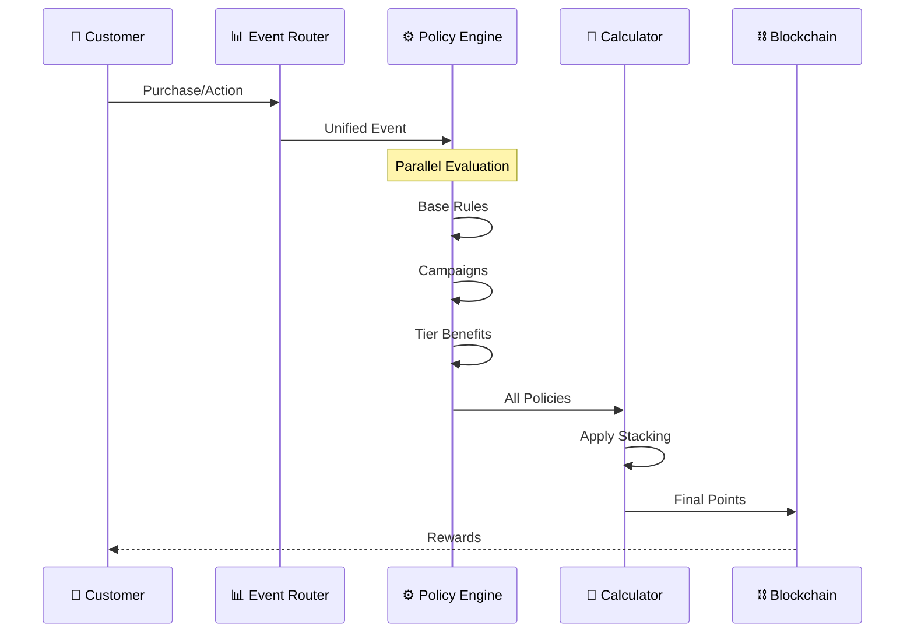

# Conditional Policies & System Flexibility

## Overview

The Blockchain Loyalty Platform supports highly flexible conditional policies with a **hybrid reward approach** that combines action-based achievements with purchase multipliers. This document details the comprehensive policy framework that supports both primary action-based rewards and secondary purchase-based multipliers.

## Policy Architecture

### Core Policy Engine

```typescript
interface PolicyEngine {
  // Policy evaluation
  evaluate(context: PolicyContext): PolicyResult;
  
  // Policy combination
  combine(policies: Policy[], operator: 'AND' | 'OR'): Policy;
  
  // Dynamic policy loading
  loadPolicy(policyId: string): Promise<Policy>;
  
  // Policy versioning
  getActiveVersion(policyId: string): PolicyVersion;
}

interface PolicyContext {
  tenant: Tenant;
  member: Member;
  transaction: Transaction;
  metadata: Record<string, any>;
  timestamp: Date;
  environment: 'development' | 'staging' | 'production';
}

interface PolicyResult {
  applied: boolean;
  policyId: string;
  pointsAwarded?: number;
  breakdown?: {
    basePoints: number;
    actionBonus: number;
    purchaseMultiplier: number;
  };
  multiplierApplied?: number;
  trackType: 'action' | 'purchase' | 'hybrid';
  metadata?: Record<string, any>;
}

interface PolicyVersion {
  id: string;
  version: number;
  active: boolean;
  createdAt: Date;
  changes: string[];
}
```

## Conditional Policy Types

### 1. Points Earning Policies

#### Basic Earning Rules
```json
{
  "policyType": "POINTS_EARNING",
  "name": "Tiered Cashback",
  "conditions": [
    {
      "type": "MEMBER_TIER",
      "operator": "IN",
      "value": ["bronze", "silver", "gold", "platinum"]
    }
  ],
  "actions": {
    "bronze": {
      "multiplier": 1,
      "basePoints": 1,
      "maxPointsPerTransaction": 100
    },
    "silver": {
      "multiplier": 1.5,
      "basePoints": 1.5,
      "maxPointsPerTransaction": 200
    },
    "gold": {
      "multiplier": 2,
      "basePoints": 2,
      "maxPointsPerTransaction": 500
    },
    "platinum": {
      "multiplier": 3,
      "basePoints": 3,
      "maxPointsPerTransaction": 1000
    }
  }
}
```

#### Industry-Specific Earning Rules

##### SaaS Platform Earning
```json
{
  "policyType": "SAAS_EARNING",
  "name": "Developer API Usage Rewards",
  "conditions": [
    {
      "type": "API_CALLS_MONTHLY",
      "operator": "GREATER_THAN",
      "value": 10000
    },
    {
      "type": "FEATURE_ADOPTION",
      "operator": "CONTAINS",
      "value": ["premium_endpoints", "webhooks", "analytics"]
    }
  ],
  "actions": {
    "pointsPerApiCall": 0.1,
    "featureAdoptionBonus": 500,
    "monthlyActiveBonus": 2000,
    "tierUpgradeMultiplier": 1.5
  }
}
```

##### E-commerce Transaction Earning
```json
{
  "policyType": "ECOMMERCE_EARNING",
  "name": "Purchase Volume Incentives",
  "conditions": [
    {
      "type": "ORDER_FREQUENCY",
      "operator": "GREATER_THAN",
      "value": 5,
      "period": "monthly"
    },
    {
      "type": "CATEGORY_DIVERSITY",
      "operator": "MINIMUM",
      "value": 3
    }
  ],
  "actions": {
    "loyaltyBonus": 300,
    "categoryDiversityMultiplier": 1.2,
    "freeShippingThreshold": 0.8
  }
}
```

##### FinTech Behavior Earning
```json
{
  "policyType": "FINTECH_EARNING",
  "name": "Financial Wellness Rewards",
  "conditions": [
    {
      "type": "SAVINGS_GOAL_PROGRESS",
      "operator": "GREATER_THAN",
      "value": 80,
      "unit": "percentage"
    },
    {
      "type": "BUDGET_ADHERENCE",
      "operator": "GREATER_THAN",
      "value": 90,
      "period": "monthly"
    }
  ],
  "actions": {
    "savingsAchievementBonus": 1000,
    "budgetComplianceMultiplier": 1.3,
    "investmentUnlockBonus": 500
  }
}
```

##### Gaming Achievement Earning
```json
{
  "policyType": "GAMING_EARNING",
  "name": "Tournament Performance Rewards",
  "conditions": [
    {
      "type": "TOURNAMENT_PLACEMENT",
      "operator": "LESS_THAN_OR_EQUAL",
      "value": 10
    },
    {
      "type": "MATCH_COMPLETION_RATE",
      "operator": "GREATER_THAN",
      "value": 95
    }
  ],
  "actions": {
    "placementBonus": 2000,
    "completionRateMultiplier": 1.4,
    "championshipQualificationBonus": 5000
  }
}
```

##### Travel Experience Earning
```json
{
  "policyType": "TRAVEL_EARNING",
  "name": "Destination Explorer Rewards",
  "conditions": [
    {
      "type": "UNIQUE_DESTINATIONS",
      "operator": "GREATER_THAN",
      "value": 5,
      "period": "yearly"
    },
    {
      "type": "BOOKING_ADVANCE_DAYS",
      "operator": "GREATER_THAN",
      "value": 30
    }
  ],
  "actions": {
    "explorerBonus": 1500,
    "earlyBookingMultiplier": 1.25,
    "eliteStatusAcceleration": 2,
    "purchaseMultiplierUnlock": 1.15
  }
}
```

##### Healthcare Wellness Earning
```json
{
  "policyType": "HEALTHCARE_EARNING",
  "name": "Preventive Care Incentives",
  "conditions": [
    {
      "type": "ANNUAL_CHECKUP_COMPLETED",
      "operator": "EQUALS",
      "value": true
    },
    {
      "type": "HEALTH_METRICS_IMPROVEMENT",
      "operator": "GREATER_THAN",
      "value": 15,
      "unit": "percentage"
    }
  ],
  "actions": {
    "preventiveCareBonus": 2000,
    "improvementMultiplier": 1.6,
    "insuranceDiscountUnlock": 500,
    "purchaseMultiplierUnlock": 1.2
  }
}
```

##### Food & Dining Experience Earning
```json
{
  "policyType": "FOOD_EARNING",
  "name": "Culinary Adventure Rewards",
  "conditions": [
    {
      "type": "CUISINE_VARIETY",
      "operator": "GREATER_THAN",
      "value": 8,
      "period": "monthly"
    },
    {
      "type": "REVIEW_QUALITY_SCORE",
      "operator": "GREATER_THAN",
      "value": 4.5
    }
  ],
  "actions": {
    "adventurerBonus": 800,
    "reviewQualityMultiplier": 1.3,
    "chefTableReservationAccess": true,
    "purchaseMultiplierUnlock": 1.1
  }
}
```

##### Cloud Infrastructure Optimization Earning
```json
{
  "policyType": "CLOUD_EARNING",
  "name": "Resource Efficiency Rewards",
  "conditions": [
    {
      "type": "COST_OPTIMIZATION_PERCENTAGE",
      "operator": "GREATER_THAN",
      "value": 20,
      "period": "monthly"
    },
    {
      "type": "SUSTAINABILITY_SCORE",
      "operator": "GREATER_THAN",
      "value": 85
    }
  ],
  "actions": {
    "efficiencyBonus": 1200,
    "sustainabilityMultiplier": 1.4,
    "certificationAcceleration": 3
  }
}
```

#### Time-Based Earning
```json
{
  "policyType": "TIME_BASED_EARNING",
  "name": "Happy Hour Bonus",
  "conditions": [
    {
      "type": "TIME_OF_DAY",
      "operator": "BETWEEN",
      "value": ["14:00", "17:00"]
    },
    {
      "type": "DAY_OF_WEEK",
      "operator": "IN",
      "value": ["monday", "tuesday", "wednesday", "thursday", "friday"]
    }
  ],
  "actions": {
    "bonusMultiplier": 2,
    "notification": "Happy Hour! Earn 2x points on all purchases"
  }
}
```

#### Category-Specific Earning
```json
{
  "policyType": "CATEGORY_EARNING",
  "name": "Premium Category Bonus",
  "conditions": [
    {
      "type": "PRODUCT_CATEGORY",
      "operator": "IN",
      "value": ["electronics", "luxury", "premium_services"]
    },
    {
      "type": "TRANSACTION_AMOUNT",
      "operator": "GREATER_THAN",
      "value": 100
    }
  ],
  "actions": {
    "additionalPoints": 50,
    "percentageBonus": 10
  }
}
```

#### Location-Based Earning
```json
{
  "policyType": "LOCATION_EARNING",
  "name": "Store Opening Bonus",
  "conditions": [
    {
      "type": "STORE_LOCATION",
      "operator": "EQUALS",
      "value": "new_york_broadway"
    },
    {
      "type": "DATE_RANGE",
      "operator": "BETWEEN",
      "value": ["2024-01-01", "2024-01-31"]
    }
  ],
  "actions": {
    "multiplier": 5,
    "maxBonusPoints": 1000,
    "oneTimeOnly": true
  }
}
```

### 2. Redemption Policies

#### Dynamic Redemption Rates
```json
{
  "policyType": "REDEMPTION_RATE",
  "name": "Flexible Redemption",
  "conditions": [
    {
      "type": "REDEMPTION_TYPE",
      "operator": "EQUALS",
      "value": "direct_discount"
    }
  ],
  "tiers": [
    {
      "minPoints": 100,
      "maxPoints": 999,
      "rate": 0.01
    },
    {
      "minPoints": 1000,
      "maxPoints": 4999,
      "rate": 0.012
    },
    {
      "minPoints": 5000,
      "maxPoints": null,
      "rate": 0.015
    }
  ]
}
```

#### Product-Specific Redemption
```json
{
  "policyType": "PRODUCT_REDEMPTION",
  "name": "Free Product Rewards",
  "products": [
    {
      "productId": "coffee_regular",
      "pointsCost": 500,
      "availability": "always",
      "maxPerMember": 10
    },
    {
      "productId": "lunch_special",
      "pointsCost": 1500,
      "availability": {
        "days": ["monday", "tuesday", "wednesday"],
        "hours": ["11:00", "14:00"]
      }
    },
    {
      "productId": "premium_service",
      "pointsCost": 5000,
      "availability": "tier:gold,platinum",
      "requiresApproval": true
    }
  ]
}
```

### 3. Cancellation & Refund Policies

#### Flexible Cancellation Windows
```json
{
  "policyType": "CANCELLATION_POLICY",
  "name": "Dynamic Cancellation Rules",
  "rules": [
    {
      "serviceType": "hotel_booking",
      "conditions": [
        {
          "type": "DAYS_BEFORE_SERVICE",
          "operator": "GREATER_THAN",
          "value": 7
        }
      ],
      "actions": {
        "refundPercentage": 100,
        "pointsRevoked": false,
        "cancellationFee": 0
      }
    },
    {
      "serviceType": "hotel_booking",
      "conditions": [
        {
          "type": "DAYS_BEFORE_SERVICE",
          "operator": "BETWEEN",
          "value": [3, 7]
        }
      ],
      "actions": {
        "refundPercentage": 50,
        "pointsRevoked": true,
        "cancellationFee": 25
      }
    },
    {
      "serviceType": "hotel_booking",
      "conditions": [
        {
          "type": "DAYS_BEFORE_SERVICE",
          "operator": "LESS_THAN",
          "value": 3
        }
      ],
      "actions": {
        "refundPercentage": 0,
        "pointsRevoked": true,
        "cancellationFee": 0,
        "allowRebooking": true,
        "rebookingWindow": 90
      }
    }
  ]
}
```

#### Partial Refund Calculations
```json
{
  "policyType": "PARTIAL_REFUND",
  "name": "Item-Level Refund Policy",
  "calculation": {
    "method": "ITEM_BASED",
    "rules": [
      {
        "itemCategory": "non_refundable",
        "refundPercentage": 0,
        "pointsHandling": "keep_earned"
      },
      {
        "itemCategory": "standard",
        "refundPercentage": 100,
        "pointsHandling": "proportional_revoke"
      },
      {
        "itemCategory": "final_sale",
        "refundPercentage": 0,
        "pointsHandling": "keep_if_over_30_days"
      }
    ]
  }
}
```

### 4. Fraud Prevention Policies

#### Behavioral Analysis Rules
```json
{
  "policyType": "FRAUD_DETECTION",
  "name": "Suspicious Activity Detection",
  "rules": [
    {
      "pattern": "RAPID_POINT_ACCUMULATION",
      "conditions": [
        {
          "type": "POINTS_EARNED_PERIOD",
          "operator": "GREATER_THAN",
          "value": 10000,
          "period": "24_hours"
        }
      ],
      "actions": {
        "flag": "high_risk",
        "notification": "admin",
        "freezeAccount": false,
        "requireVerification": true
      }
    },
    {
      "pattern": "CYCLICAL_BEHAVIOR",
      "conditions": [
        {
          "type": "PATTERN_MATCH",
          "value": "purchase->redeem->cancel",
          "frequency": 3,
          "period": "30_days"
        }
      ],
      "actions": {
        "flag": "medium_risk",
        "limitRedemption": true,
        "manualReview": true
      }
    }
  ]
}
```

#### Account Limits
```json
{
  "policyType": "ACCOUNT_LIMITS",
  "name": "Risk-Based Limits",
  "limits": {
    "low_risk": {
      "maxDailyEarning": 5000,
      "maxDailyRedemption": 5000,
      "maxMonthlyTransactions": 100
    },
    "medium_risk": {
      "maxDailyEarning": 1000,
      "maxDailyRedemption": 500,
      "maxMonthlyTransactions": 50,
      "cooldownPeriod": "24_hours"
    },
    "high_risk": {
      "maxDailyEarning": 100,
      "maxDailyRedemption": 0,
      "requiresApproval": true,
      "notifyCompliance": true
    }
  }
}
```

### 5. Special Event Policies

#### Holiday Campaigns
```json
{
  "policyType": "CAMPAIGN",
  "name": "Black Friday Special",
  "active": {
    "from": "2024-11-29T00:00:00Z",
    "to": "2024-11-29T23:59:59Z"
  },
  "conditions": [
    {
      "type": "MINIMUM_PURCHASE",
      "value": 50
    }
  ],
  "actions": {
    "pointsMultiplier": 5,
    "bonusPoints": 500,
    "specialBadge": "black_friday_shopper",
    "unlockSpecialRewards": true
  }
}
```

#### Referral Programs
```json
{
  "policyType": "REFERRAL",
  "name": "Member Referral Bonus",
  "conditions": [
    {
      "type": "REFERRAL_STATUS",
      "value": "completed_first_purchase"
    }
  ],
  "rewards": {
    "referrer": {
      "points": 1000,
      "bonusMultiplier": 1.1,
      "duration": "30_days"
    },
    "referee": {
      "points": 500,
      "welcomeBonus": 100,
      "firstPurchaseMultiplier": 2
    }
  }
}
```

## Policy Combination & Hierarchy

### Policy Precedence Rules
```typescript
enum PolicyPrecedence {
  GLOBAL = 0,        // Platform-wide policies
  TENANT = 1,        // Tenant-specific policies
  CAMPAIGN = 2,      // Time-limited campaigns
  MEMBER_GROUP = 3,  // Group-specific rules
  MEMBER = 4         // Individual member overrides
}

class PolicyResolver {
  resolve(policies: Policy[]): Policy {
    // Sort by precedence
    const sorted = policies.sort((a, b) => 
      b.precedence - a.precedence
    );
    
    // Apply combination strategy
    return this.combineByStrategy(sorted);
  }
  
  combineByStrategy(policies: Policy[]): Policy {
    // Strategies: OVERRIDE, MERGE, ACCUMULATE
    switch (this.strategy) {
      case 'OVERRIDE':
        return policies[0]; // Highest precedence wins
      
      case 'MERGE':
        return this.mergeCompatible(policies);
      
      case 'ACCUMULATE':
        return this.accumulateBenefits(policies);
    }
  }
}
```

### Conflict Resolution
```json
{
  "conflictResolution": {
    "pointsEarning": "HIGHEST_BENEFIT",
    "redemptionRate": "MOST_FAVORABLE",
    "cancellationTerms": "MOST_FLEXIBLE",
    "fraudLimits": "MOST_RESTRICTIVE"
  }
}
```

## Implementation Examples

### Dynamic Policy Loading
```typescript
class DynamicPolicyService {
  async loadPoliciesForTransaction(
    context: TransactionContext
  ): Promise<Policy[]> {
    const policies = [];
    
    // Load global policies
    policies.push(...await this.loadGlobalPolicies());
    
    // Load tenant policies
    policies.push(...await this.loadTenantPolicies(
      context.tenantId
    ));
    
    // Load campaign policies
    const activeCampaigns = await this.getActiveCampaigns(
      context.timestamp
    );
    policies.push(...activeCampaigns);
    
    // Load member-specific policies
    const memberPolicies = await this.loadMemberPolicies(
      context.memberId
    );
    policies.push(...memberPolicies);
    
    // Apply context filters
    return this.filterByContext(policies, context);
  }
}
```

### Real-time Policy Evaluation
```typescript
class PolicyEvaluator {
  async evaluateTransaction(
    transaction: Transaction
  ): Promise<EvaluationResult> {
    const context = await this.buildContext(transaction);
    const policies = await this.policyService
      .loadPoliciesForTransaction(context);
    
    const results = await Promise.all(
      policies.map(policy => 
        this.evaluatePolicy(policy, context)
      )
    );
    
    return this.aggregateResults(results);
  }
  
  private async evaluatePolicy(
    policy: Policy,
    context: PolicyContext
  ): Promise<PolicyResult> {
    // Check all conditions
    const conditionsMet = await this.checkConditions(
      policy.conditions,
      context
    );
    
    if (!conditionsMet) {
      return { applied: false, policy: policy.id };
    }
    
    // Apply actions
    const actions = await this.applyActions(
      policy.actions,
      context
    );
    
    return {
      applied: true,
      policy: policy.id,
      actions: actions,
      metadata: {
        evaluatedAt: new Date(),
        version: policy.version
      }
    };
  }
}
```

### Policy Testing Framework
```typescript
describe('Conditional Policy Engine', () => {
  it('should apply time-based earning bonus', async () => {
    const transaction = createMockTransaction({
      amount: 100,
      timestamp: '2024-01-15T15:30:00Z' // Happy hour
    });
    
    const result = await policyEngine.evaluate(transaction);
    
    expect(result.pointsEarned).toBe(200); // 2x multiplier
    expect(result.appliedPolicies).toContain('happy_hour');
  });
  
  it('should handle policy conflicts correctly', async () => {
    const transaction = createMockTransaction({
      memberTier: 'gold',
      hasActiveCampaign: true,
      isFirstPurchase: true
    });
    
    const result = await policyEngine.evaluate(transaction);
    
    // Should apply highest benefit
    expect(result.multiplier).toBe(5); // Campaign multiplier
    expect(result.bonusPoints).toBe(1500); // All bonuses
  });
});
```

## Consolidated Order Purchase & Campaign Flow

### Overview
The platform consolidates order purchase rewards and campaign mechanics into a single, unified processing flow that eliminates redundancies and provides better flexibility.

### Unified Event Processing Architecture



### Unified Reward Event Model

```typescript
// Type definitions for unified flow
interface UserHistory {
  totalPurchases: number;
  totalPointsEarned: number;
  lastPurchaseDate: Date;
  averageOrderValue: number;
}

interface OrderItem {
  sku: string;
  category: string;
  amount: number;
  quantity: number;
}

interface RewardResult {
  success: boolean;
  pointsAwarded: number;
  transactionHash?: string;
  appliedPolicies: string[];
  breakdown: RewardBreakdown;
}

interface RewardCalculation {
  base: number;
  multipliers: MultiplierComponent[];
  bonuses: BonusComponent[];
  campaigns: CampaignComponent[];
  total: number;
}

interface UnifiedRewardEvent {
  eventId: string;
  eventType: 'order' | 'action' | 'milestone';
  userId: string;
  timestamp: Date;
  
  // Contextual data
  context: {
    tier: string;
    location?: string;
    channel: string;
    history: UserHistory;
  };
  
  // Event-specific data
  data: {
    // For orders
    orderId?: string;
    amount?: number;
    items?: OrderItem[];
    
    // For campaigns
    campaignIds?: string[];
    actionType?: string;
  };
}

class UnifiedRewardProcessor {
  async processEvent(event: UnifiedRewardEvent): Promise<RewardResult> {
    try {
      // 1. Load all applicable policies
      const policies = await this.loadApplicablePolicies(event);
      
      // 2. Calculate rewards with all layers
      const calculation = await this.calculateRewards(event, policies);
      
      // 3. Apply business rules and limits
      const validated = await this.validateRewards(calculation);
      
      // 4. Process on blockchain
      return await this.processOnChain(validated);
    } catch (error) {
      // Handle errors gracefully
      return this.handleProcessingError(error, event);
    }
  }
  
  private handleProcessingError(error: Error, event: UnifiedRewardEvent): RewardResult {
    console.error(`Error processing event ${event.eventId}:`, error);
    
    // Log to monitoring system
    this.monitor.logError({
      eventId: event.eventId,
      error: error.message,
      stack: error.stack,
      timestamp: new Date()
    });
    
    // Return error result
    return {
      success: false,
      pointsAwarded: 0,
      appliedPolicies: [],
      breakdown: { error: error.message }
    };
  }
  
  private async calculateRewards(
    event: UnifiedRewardEvent,
    policies: Policy[]
  ): Promise<RewardCalculation> {
    const calc = new RewardCalculation();
    
    // Base points (orders, actions, etc.)
    calc.base = this.calculateBasePoints(event);
    
    // Apply all policies in priority order
    for (const policy of this.sortByPriority(policies)) {
      switch (policy.type) {
        case 'MULTIPLIER':
          calc.addMultiplier(policy);
          break;
        case 'BONUS':
          calc.addBonus(policy);
          break;
        case 'CAMPAIGN':
          calc.addCampaign(policy);
          break;
      }
    }
    
    // Smart stacking resolution
    return this.resolveStacking(calc);
  }
}
```

### Campaign & Order Integration

```typescript
// Example: Order with Multiple Campaigns
const orderWithCampaigns = {
  eventType: 'order',
  orderId: 'ORD-12345',
  amount: 150.00,
  items: [
    { category: 'electronics', amount: 100 },
    { category: 'accessories', amount: 50 }
  ],
  applicableCampaigns: [
    'black_friday_2024',     // 5x multiplier
    'electronics_boost',      // +200 points
    'new_customer_bonus'      // +500 points (if eligible)
  ]
};

// Unified processing result:
{
  basePoints: 150,
  multipliers: [
    { source: 'tier_gold', value: 1.5 },
    { source: 'black_friday_2024', value: 5.0 }
  ],
  bonuses: [
    { source: 'electronics_boost', value: 200 },
    { source: 'new_customer_bonus', value: 500 }
  ],
  stackingRule: 'best_multiplier_plus_all_bonuses',
  totalPoints: 1450  // (150 * 5.0) + 200 + 500
}
```

### Stacking Rules Engine

```typescript
enum StackingStrategy {
  EXCLUSIVE = 'exclusive',           // Only highest value
  ADDITIVE = 'additive',            // Sum all values
  MULTIPLICATIVE = 'multiplicative', // Multiply all values
  HYBRID = 'hybrid'                 // Custom rules
}

class StackingRulesEngine {
  resolveConflicts(rewards: RewardComponent[]): number {
    // Group by stacking strategy
    const groups = this.groupByStrategy(rewards);
    
    // Apply each strategy
    let total = 0;
    
    // Exclusive: take highest
    if (groups.exclusive.length > 0) {
      total += Math.max(...groups.exclusive.map(r => r.value));
    }
    
    // Additive: sum all
    total += groups.additive.reduce((sum, r) => sum + r.value, 0);
    
    // Multiplicative: apply to base
    const multiplier = groups.multiplicative.reduce(
      (prod, r) => prod * r.value, 1
    );
    
    return Math.floor(total * multiplier);
  }
  
  private groupByStrategy(rewards: RewardComponent[]): GroupedRewards {
    const groups: GroupedRewards = {
      exclusive: [],
      additive: [],
      multiplicative: [],
      hybrid: []
    };
    
    rewards.forEach(reward => {
      groups[reward.strategy].push(reward);
    });
    
    return groups;
  }
}
```

### Benefits of Consolidation

1. **Simplified Processing**: Single entry point for all reward events
2. **Better Campaign Management**: Campaigns integrate seamlessly with base rewards
3. **Flexible Stacking**: Clear rules for combining multiple rewards
4. **Performance**: Reduced redundant calculations and API calls
5. **Maintainability**: Easier to modify and test unified flow

## Policy Administration

### Policy Management Dashboard
```typescript
interface PolicyAdminInterface {
  // Policy CRUD operations
  createPolicy(policy: PolicyDefinition): Promise<Policy>;
  updatePolicy(id: string, updates: Partial<Policy>): Promise<Policy>;
  deletePolicy(id: string): Promise<void>;
  
  // Policy testing
  testPolicy(policy: Policy, testCases: TestCase[]): TestResult[];
  simulatePolicy(policy: Policy, sample: Transaction[]): SimulationResult;
  
  // Policy analytics
  getPolicyMetrics(id: string): PolicyMetrics;
  getPolicyConflicts(id: string): ConflictReport;
  
  // Policy versioning
  createVersion(id: string, changes: PolicyChanges): PolicyVersion;
  rollbackVersion(id: string, version: number): Promise<void>;
}
```

### Policy Templates
```json
{
  "templates": [
    {
      "id": "standard_earning",
      "name": "Standard Points Earning",
      "description": "Basic 1 point per dollar spent",
      "customizable": ["rate", "minimum", "maximum"]
    },
    {
      "id": "tiered_benefits",
      "name": "Tiered Member Benefits",
      "description": "Different rates by membership level",
      "customizable": ["tiers", "multipliers", "thresholds"]
    },
    {
      "id": "time_limited_campaign",
      "name": "Time-Limited Campaign",
      "description": "Special earning rates for limited time",
      "customizable": ["start_date", "end_date", "multiplier"]
    }
  ]
}
```

## Best Practices

### 1. Policy Design
- Keep policies simple and testable
- Use clear naming conventions
- Document all conditions and actions
- Version all policy changes
- Test edge cases thoroughly

### 2. Performance Optimization
- Cache frequently used policies
- Index policy conditions for fast lookup
- Use async evaluation for complex policies
- Batch policy evaluations when possible

### 3. Security Considerations
- Validate all policy inputs
- Implement rate limiting on policy changes
- Audit all policy modifications
- Use role-based access for policy management

### 4. Monitoring & Analytics
- Track policy application rates
- Monitor policy conflicts
- Measure business impact
- Set up alerts for anomalies

## Migration & Compatibility

### Policy Migration Strategy
```typescript
class PolicyMigration {
  async migrate(fromVersion: string, toVersion: string): Promise<void> {
    const policies = await this.loadPolicies(fromVersion);
    
    for (const policy of policies) {
      const migrated = await this.migratePolicy(policy, toVersion);
      await this.savePolicy(migrated);
      await this.validateMigration(policy, migrated);
    }
  }
}
```

### Backward Compatibility
- Support multiple policy versions simultaneously
- Provide deprecation warnings
- Maintain compatibility layer for 2 major versions
- Document breaking changes clearly

---

This comprehensive conditional policy system ensures maximum flexibility while maintaining security and performance. The modular design allows for easy extension and customization to meet evolving business requirements.