# Cross-Platform Integration: Universal Login & Token Exchange

## Overview

The Ploy Cross-Platform Integration system combines Universal Login SSO and Unified Token Exchange into a seamless ecosystem where users authenticate once and access their complete loyalty portfolio across all 9 supported industries. This system works with both **traditional database storage** and **blockchain storage modes**, enabling flexible value transfer, goal management, and portfolio optimization that scales with business needs.

### Storage Mode Integration

The cross-platform system supports both storage approaches:
- **Traditional Mode**: Fast cross-platform point transfers using database transactions
- **Blockchain Mode**: True token ownership with on-chain transfers and NFT portability
- **Hybrid Operations**: Mix traditional and blockchain assets in unified portfolios
- **Seamless Upgrades**: Migrate from traditional to blockchain without losing integrations

## Universal Login & SSO Architecture

### Core Authentication Flow

```mermaid
graph TD
    subgraph "User Authentication Flow"
        A[👤 User] --> B[🔐 Universal Login]
        B --> C[🎯 Identity Provider]
        C --> D[🔑 Multi-Factor Auth]
        D --> E[✅ Authentication Success]
    end
    
    subgraph "Industry Platform Integration"
        E --> F[☁️ SaaS Platform]
        E --> G[🛒 E-commerce Platform]
        E --> H[💰 FinTech Platform]
        E --> I[🎮 Gaming Platform]
        E --> J[✈️ Travel Platform]
        E --> K[💪 Health Platform]
        E --> L[🍽️ Food Platform]
        E --> M[☁️ Cloud Platform]
        E --> N[🌐 Web3/DeFi Platform]
    end
    
    subgraph "Unified Services"
        E --> O[📊 Portfolio Dashboard]
        E --> P[💱 Token Exchange]
        E --> Q[🏪 NFT Marketplace]
        E --> R[🎯 Goal Management]
        E --> S[📈 Analytics]
    end
    
    subgraph "Session Management"
        T[🕒 Session Store] --> U[🔄 Auto-Refresh]
        T --> V[🔐 Security Monitor]
        T --> W[📱 Multi-Device Sync]
    end
    
    E --> T
    
    style B fill:#4DA2FF
    style C fill:#FFD700
    style O fill:#FF6B6B
```



### Universal Authentication Service

```typescript
interface UniversalLoginRequest {
  email: string;
  password?: string;
  auth_method: 'password' | 'oauth' | 'web3' | 'biometric';
  device_info: {
    device_id: string;
    platform: string;
    user_agent: string;
    ip_address: string;
  };
  remember_me: boolean;
}

interface UniversalSession {
  session_id: string;
  user_id: string;
  access_token: string;
  refresh_token: string;
  expires_at: Date;
  connected_industries: string[];
  permissions: string[];
  device_sessions: DeviceSession[];
  security_flags: SecurityFlags;
}

class UniversalLoginService {
  async authenticateUser(request: UniversalLoginRequest): Promise<AuthenticationResult> {
    // Step 1: Primary authentication
    const primaryAuth = await this.validateCredentials(request);
    if (!primaryAuth.success) {
      throw new AuthenticationError('Invalid credentials');
    }
    
    // Step 2: Security checks
    await this.performSecurityChecks(request);
    
    // Step 3: Multi-factor authentication if required
    const user = await this.getUser(request.email);
    if (user.mfa_enabled || this.requiresMFA(request)) {
      return await this.initiateMFAFlow(user, request);
    }
    
    // Step 4: Create universal session
    const session = await this.createUniversalSession(user, request);
    
    // Step 5: Initialize industry connections
    await this.initializeIndustryConnections(session);
    
    // Step 6: Sync user data across platforms
    await this.syncCrossIndustryData(session.user_id);
    
    return {
      success: true,
      session: session,
      connected_industries: session.connected_industries,
      portfolio_summary: await this.getPortfolioSummary(session.user_id),
      pending_actions: await this.getPendingActions(session.user_id)
    };
  }
  
  async createUniversalSession(
    user: User, 
    request: UniversalLoginRequest
  ): Promise<UniversalSession> {
    const sessionId = this.generateSecureSessionId();
    const tokens = await this.generateJWTTokens(user.id, sessionId);
    
    const session: UniversalSession = {
      session_id: sessionId,
      user_id: user.id,
      access_token: tokens.access_token,
      refresh_token: tokens.refresh_token,
      expires_at: new Date(Date.now() + 24 * 60 * 60 * 1000), // 24 hours
      connected_industries: await this.getUserConnectedIndustries(user.id),
      permissions: await this.getUserPermissions(user.id),
      device_sessions: await this.getActiveDeviceSessions(user.id),
      security_flags: await this.getSecurityFlags(user.id)
    };
    
    // Store session in Redis for fast access
    await this.sessionStore.set(sessionId, session, { ttl: 86400 });
    
    // Store in database for persistence
    await this.database.sessions.create({
      data: {
        session_id: sessionId,
        user_id: user.id,
        created_at: new Date(),
        expires_at: session.expires_at,
        device_info: request.device_info,
        last_activity: new Date()
      }
    });
    
    return session;
  }
}
```

## Token Exchange System

### Universal App Architecture

```mermaid
graph TD
    subgraph "Ploy Universal App"
        A[🔐 Universal Login] --> B[📊 Portfolio Dashboard]
        B --> C[💱 Token Exchange]
        B --> D[🎯 Goal Management]
        B --> E[📈 Analytics & Insights]
        
        C --> F[🔄 Real-time Rates]
        C --> G[⚡ Instant Exchange]
        C --> H[📋 Exchange History]
        
        D --> I[🎮 Gaming Goals]
        D --> J[✈️ Travel Goals]
        D --> K[💪 Fitness Goals]
        D --> L[🍽️ Food Goals]
    end
    
    subgraph "Industry Platforms"
        M[☁️ SaaS Platform]
        N[🛒 E-commerce Platform]
        O[💰 FinTech Platform]
        P[🎮 Gaming Platform]
        Q[✈️ Travel Platform]
        R[💪 Health Platform]
        S[🍽️ Food Platform]
        T[☁️ Cloud Platform]
        U[🌐 Web3/DeFi Platform]
    end
    
    A --> M
    A --> N
    A --> O
    A --> P
    A --> Q
    A --> R
    A --> S
    A --> T
    A --> U
    
    style A fill:#4DA2FF
    style B fill:#FFD700
    style C fill:#FF6B6B
```



### Exchange Rate Engine

```typescript
interface TokenExchangeRate {
  from_industry: string;
  to_industry: string;
  rate: number;
  spread: number; // Platform fee
  last_updated: Date;
  24h_change: number;
  volume_24h: number;
  liquidity_score: number;
}

class UniversalTokenExchange {
  private exchangeRates: Map<string, TokenExchangeRate> = new Map();
  private liquidityPools: Map<string, LiquidityPool> = new Map();
  
  async getExchangeRates(): Promise<TokenExchangeRate[]> {
    // Fetch real-time rates from all industry platforms
    const rates = await Promise.all([
      this.fetchSaaSRates(),
      this.fetchTravelRates(),
      this.fetchHealthRates(),
      this.fetchFoodRates(),
      this.fetchGamingRates(),
      this.fetchEcommerceRates(),
      this.fetchFinTechRates(),
      this.fetchCloudRates(),
      this.fetchWeb3DeFiRates()
    ]);
    
    // Calculate cross-industry exchange rates
    return this.calculateCrossRates(rates);
  }
  
  async executeExchange(
    userId: string,
    fromIndustry: string,
    toIndustry: string,
    amount: number,
    options: ExchangeOptions = {}
  ): Promise<ExchangeResult> {
    // Validate exchange parameters
    await this.validateExchange(userId, fromIndustry, toIndustry, amount);
    
    // Get current exchange rate
    const rate = await this.getCurrentRate(fromIndustry, toIndustry);
    
    // Calculate fees and final amount
    const fees = await this.calculateFees(userId, amount, fromIndustry, toIndustry);
    const finalAmount = Math.floor((amount * rate.rate) * (1 - fees.total_fee_rate));
    
    // Execute the exchange
    const transaction = await this.processExchange({
      userId,
      fromIndustry,
      toIndustry,
      sourceAmount: amount,
      targetAmount: finalAmount,
      rate: rate.rate,
      fees: fees,
      timestamp: new Date(),
      transaction_id: this.generateTransactionId()
    });
    
    // Update user balances
    await this.updateUserBalances(userId, fromIndustry, toIndustry, amount, finalAmount);
    
    // Record transaction history
    await this.recordTransaction(transaction);
    
    return {
      success: true,
      transaction_id: transaction.transaction_id,
      exchanged_amount: amount,
      received_amount: finalAmount,
      exchange_rate: rate.rate,
      fees_paid: fees.total_fee,
      new_balances: await this.getUserBalances(userId)
    };
  }
  
  async getOptimalExchangePath(
    fromIndustry: string,
    toIndustry: string,
    amount: number
  ): Promise<ExchangePath> {
    // Find the most efficient exchange route (direct vs multi-hop)
    const directPath = await this.getDirectRate(fromIndustry, toIndustry);
    const multiHopPaths = await this.getMultiHopPaths(fromIndustry, toIndustry);
    
    // Compare all paths and return the best one
    const allPaths = [directPath, ...multiHopPaths];
    const bestPath = allPaths.reduce((best, current) => 
      current.final_amount > best.final_amount ? current : best
    );
    
    return bestPath;
  }
}
```

### Portfolio Management

```typescript
interface UserPortfolio {
  user_id: string;
  total_value_usd: number;
  token_balances: {
    [industry: string]: {
      balance: number;
      value_usd: number;
      percentage: number;
      24h_change: number;
      earning_rate: number; // Points per day
    };
  };
  nft_portfolio: {
    [industry: string]: {
      count: number;
      total_value: number;
      floor_value: number;
      rare_count: number;
    };
  };
  performance_metrics: {
    total_earned_30d: number;
    best_performing_industry: string;
    diversification_score: number;
    risk_score: number;
  };
}

class PortfolioManager {
  async getUserPortfolio(userId: string): Promise<UserPortfolio> {
    // Fetch balances from all connected industries
    const balances = await this.fetchAllBalances(userId);
    
    // Calculate portfolio metrics
    const totalValue = await this.calculateTotalValue(balances);
    const performance = await this.calculatePerformance(userId);
    const nftPortfolio = await this.getNFTPortfolio(userId);
    
    return {
      user_id: userId,
      total_value_usd: totalValue,
      token_balances: await this.enrichTokenBalances(balances),
      nft_portfolio: nftPortfolio,
      performance_metrics: performance
    };
  }
  
  async getOptimizationRecommendations(userId: string): Promise<Recommendation[]> {
    const portfolio = await this.getUserPortfolio(userId);
    const userGoals = await this.getUserGoals(userId);
    
    const recommendations = [];
    
    // Diversification recommendations
    if (portfolio.performance_metrics.diversification_score < 0.6) {
      recommendations.push({
        type: 'diversification',
        priority: 'high',
        title: 'Improve Portfolio Diversification',
        description: 'Your tokens are concentrated in few industries. Consider spreading across more sectors.',
        suggested_actions: [
          `Exchange 20% of ${this.getTopIndustry(portfolio)} tokens to Travel and Health sectors`,
          'Participate in Food & Drink activities to earn tokens in that sector'
        ],
        potential_benefit: 'Reduced risk and more stable earnings'
      });
    }
    
    // Arbitrage opportunities
    const arbitrageOpps = await this.findArbitrageOpportunities(portfolio);
    if (arbitrageOpps.length > 0) {
      recommendations.push({
        type: 'arbitrage',
        priority: 'medium',
        title: 'Exchange Rate Arbitrage Opportunity',
        description: `You can gain ${arbitrageOpps[0].profit_percentage}% by exchanging tokens`,
        suggested_actions: [
          `Exchange ${arbitrageOpps[0].amount} ${arbitrageOpps[0].from} tokens to ${arbitrageOpps[0].to}`,
          `Wait for rate normalization, then exchange back for profit`
        ],
        potential_benefit: `Estimated gain: ${arbitrageOpps[0].estimated_profit} tokens`
      });
    }
    
    // Goal-based recommendations
    for (const goal of userGoals) {
      const goalRec = await this.getGoalRecommendation(goal, portfolio);
      if (goalRec) {
        recommendations.push(goalRec);
      }
    }
    
    return recommendations;
  }
  
  async rebalancePortfolio(
    userId: string, 
    targetAllocation: { [industry: string]: number }
  ): Promise<RebalanceResult> {
    const currentPortfolio = await this.getUserPortfolio(userId);
    const rebalanceActions = [];
    
    // Calculate required exchanges
    for (const [industry, targetPercent] of Object.entries(targetAllocation)) {
      const currentPercent = currentPortfolio.token_balances[industry]?.percentage || 0;
      const difference = targetPercent - currentPercent;
      
      if (Math.abs(difference) > 5) { // Only rebalance if difference > 5%
        const targetValue = currentPortfolio.total_value_usd * (targetPercent / 100);
        const currentValue = currentPortfolio.token_balances[industry]?.value_usd || 0;
        const valueChange = targetValue - currentValue;
        
        rebalanceActions.push({
          industry,
          action: valueChange > 0 ? 'buy' : 'sell',
          amount_usd: Math.abs(valueChange),
          priority: Math.abs(difference)
        });
      }
    }
    
    // Execute rebalancing trades
    const executedTrades = [];
    for (const action of rebalanceActions.sort((a, b) => b.priority - a.priority)) {
      if (action.action === 'buy') {
        // Find best source industry to sell from
        const sourceIndustry = await this.findBestSourceForRebalance(
          userId, 
          action.industry, 
          action.amount_usd
        );
        
        const trade = await this.executeRebalanceTrade(
          userId,
          sourceIndustry,
          action.industry,
          action.amount_usd
        );
        
        executedTrades.push(trade);
      }
    }
    
    return {
      success: true,
      trades_executed: executedTrades.length,
      new_allocation: await this.calculateNewAllocation(userId),
      estimated_improvement: await this.calculateRebalanceBenefit(executedTrades)
    };
  }
}
```

## Industry Platform Integration

### Zero-Code Integration Options

```typescript
// Option 1: One-Line JavaScript Integration
<script src="https://cdn.ploy.io/widgets/loyalty-widget.js" 
        data-api-key="your_api_key" 
        data-theme="auto">
</script>

// Option 2: WordPress Plugin (Zero-Code)
// Install "Ploy Loyalty" plugin, enter API key, activate

// Option 3: Shopify App (Zero-Code)  
// Install from Shopify App Store, one-click setup

// Option 4: REST API Integration (Minimal Code)
const ploy = new PloySDK('your_api_key');
await ploy.trackAction('purchase', { amount: 100, user_email: 'user@example.com' });
```

### Partner Onboarding Workflow

```mermaid
sequenceDiagram
    participant Partner as 🏢 Business Partner
    participant PloyConsole as 🎛️ Ploy Partner Console
    participant AutoSetup as 🤖 Auto-Setup Engine
    participant UserExperience as 👤 End User Experience
    
    Note over Partner, UserExperience: Phase 1: Partner Registration (5 minutes)
    Partner->>PloyConsole: Sign up for Ploy partner account
    PloyConsole-->>Partner: Welcome! Choose your industry template
    Partner->>PloyConsole: Select "E-commerce" template
    PloyConsole->>AutoSetup: Initialize e-commerce loyalty program
    AutoSetup-->>PloyConsole: Template configured with best practices
    PloyConsole-->>Partner: 🎉 Setup complete! Here's your integration code
    
    Note over Partner, UserExperience: Phase 2: One-Click Integration
    Partner->>PloyConsole: Copy provided JavaScript snippet
    Partner->>Partner: Paste into website header (30 seconds)
    PloyConsole->>AutoSetup: Detect integration, auto-configure
    AutoSetup-->>Partner: ✅ Integration detected and verified
    
    Note over Partner, UserExperience: Phase 3: Instant User Experience
    UserExperience->>Partner: Make first purchase on partner website
    Partner->>PloyConsole: Automatic event tracking (zero code)
    PloyConsole->>AutoSetup: Process first user interaction
    AutoSetup->>AutoSetup: Create user account, mint welcome NFT
    AutoSetup-->>UserExperience: 🎁 Welcome! You earned 100 points + achievement NFT
    UserExperience->>PloyConsole: Access unified Ploy dashboard
    PloyConsole-->>UserExperience: Your cross-industry loyalty portfolio
```



### Integration Complexity Levels

#### Level 1: Zero-Code Integration (95% of partners)
```html
<!-- Add this ONE line to your website -->
<script src="https://cdn.ploy.io/loyalty.js" data-key="pk_live_your_key"></script>

<!-- That's it! Ploy automatically detects and tracks: -->
<!-- ✅ User registrations → Welcome points + NFT -->
<!-- ✅ Purchases → Points based on amount -->
<!-- ✅ Page views → Engagement points -->
<!-- ✅ Social shares → Viral bonuses -->
<!-- ✅ Reviews → Community contribution points -->
```

#### Level 2: Configuration-Only (4% of partners)
```javascript
// Optional: Customize point values and triggers
window.PloyConfig = {
  events: {
    purchase: { points: 10, multiplier: 'amount' },
    signup: { points: 500, nft: 'welcome_badge' },
    review: { points: 50, bonus_after: 10 }
  },
  ui: {
    theme: 'dark',
    position: 'bottom-right',
    auto_show: true
  }
};
```

#### Level 3: Custom Integration (1% of partners)
```javascript
// For advanced partners with specific needs
const ploy = new Ploy('your_api_key');

// Custom event tracking
await ploy.track('custom_milestone', {
  user_id: 'user123',
  event_data: { achievement: 'power_user', level: 5 },
  points: 1000,
  nft_eligibility: true
});
```

## Cross-Platform User Experience Workflows

### New User Onboarding - Partner to Core App

```mermaid
sequenceDiagram
    participant Customer as 👤 New Customer
    participant PartnerSite as 🛒 Partner Website
    participant PloyWidget as 📱 Ploy Widget
    participant PloyCore as 🎯 Ploy Core App
    participant AuthService as 🔐 Auth Service
    participant OnboardingEngine as 🚀 Onboarding Engine
    participant CrossIndustry as 🌐 Cross-Industry Engine
    
    Note over Customer, CrossIndustry: Phase 1: First Interaction on Partner Site
    Customer->>PartnerSite: Visit partner website (first time)
    PartnerSite->>PloyWidget: Load loyalty widget
    PloyWidget->>PloyWidget: Detect: new visitor, no Ploy account
    PloyWidget-->>Customer: 🎁 "Welcome! Join our rewards program for instant benefits"
    
    Customer->>PloyWidget: Click "Join Rewards" 
    PloyWidget-->>Customer: Quick signup form: Email + Password (15 seconds)
    Customer->>PloyWidget: Submit: "sarah@email.com" + password
    PloyWidget->>AuthService: Create Ploy account
    AuthService->>AuthService: Generate account, link to partner
    AuthService-->>PloyWidget: Account created + Welcome NFT earned!
    PloyWidget-->>Customer: 🏆 "Account created! You earned your first NFT + 100 points"
    
    Note over Customer, CrossIndustry: Phase 2: Discovery of Unified Ploy App
    PloyWidget-->>Customer: 🌟 "Unlock more rewards! Access your unified Ploy portfolio"
    Customer->>PloyWidget: Click "View My Complete Portfolio"
    PloyWidget->>PloyCore: Redirect to core app with SSO token
    PloyCore->>AuthService: Validate SSO token
    AuthService-->>PloyCore: Valid token, user authenticated
    
    PloyCore->>OnboardingEngine: Initialize new user onboarding
    OnboardingEngine-->>Customer: 🎯 "Welcome to Ploy! Let's unlock your full rewards potential"
    
    Note over Customer, CrossIndustry: Phase 3: Cross-Industry Discovery
    OnboardingEngine-->>Customer: "Connect more accounts to multiply your rewards"
    Customer->>OnboardingEngine: "I'm interested in Gaming and Travel"
    OnboardingEngine->>CrossIndustry: Initiate Gaming platform OAuth
    Customer->>CrossIndustry: Authorize gaming account connection
    CrossIndustry->>AuthService: Store gaming account connection
    AuthService-->>OnboardingEngine: Gaming account connected + historical data synced
    OnboardingEngine-->>Customer: 🎮 "Gaming connected! Found 5 existing achievements to convert to NFTs"
    
    Note over Customer, CrossIndustry: Phase 4: Portfolio Unification & Goals
    OnboardingEngine-->>Customer: 📊 "Your Unified Portfolio: E-commerce (175 points) + Gaming (5 NFTs)"
    OnboardingEngine-->>Customer: 💡 "Recommendation: Exchange gaming tokens for travel rewards"
    Customer->>OnboardingEngine: "Yes, make that exchange"
    OnboardingEngine->>CrossIndustry: Execute token exchange
    CrossIndustry-->>OnboardingEngine: Exchange completed successfully
    OnboardingEngine-->>Customer: ✅ "Exchange complete! Your travel miles: 170 (enough for flight upgrade)"
```



### Daily Multi-Industry Access

```mermaid
sequenceDiagram
    participant User as 👤 Active User
    participant PloyApp as 📱 Ploy App
    participant Auth as 🔐 Auth Service
    participant SaaS as ☁️ SaaS Platform
    participant Gaming as 🎮 Gaming Platform
    participant Travel as ✈️ Travel Platform
    participant Exchange as 💱 Token Exchange
    
    Note over User, Exchange: Morning: Check Portfolio & Plan Day
    User->>PloyApp: Open app (biometric login)
    PloyApp->>Auth: Validate biometric + session
    Auth-->>PloyApp: Session valid, user authenticated
    
    PloyApp->>Auth: Fetch unified portfolio
    par Parallel Data Sync
        Auth->>SaaS: Get latest SaaS points
        Auth->>Gaming: Get gaming achievements
        Auth->>Travel: Get travel miles
    end
    
    par Parallel Data Response
        SaaS-->>Auth: 2,750 points, new API milestone reached
        Gaming-->>Auth: 15,420 XP, tournament winner NFT earned
        Travel-->>Auth: 8,300 miles, elite status progress
    end
    
    Auth-->>PloyApp: Portfolio: Total value $847, +$23 today
    PloyApp-->>User: 📊 Good morning! Portfolio up 2.8% today
    
    Note over User, Exchange: Midday: Cross-Industry Activity
    User->>PloyApp: "I want to book travel using my gaming winnings"
    PloyApp->>Exchange: Calculate optimal exchange path
    Exchange-->>PloyApp: Exchange preview: 5000 XP → 4250 miles
    
    User->>PloyApp: Confirm exchange
    PloyApp->>Exchange: Execute exchange (gas-less transaction)
    Exchange-->>PloyApp: Exchange completed successfully
    
    User->>Travel: Book flight using newly acquired miles
    Travel-->>User: ✈️ Flight booked! 8,000 miles used, 4,550 remaining
```



## Smart Exchange Features

### Exchange Strategies

```typescript
class SmartExchangeStrategies {
  async dollarCostAveraging(
    userId: string,
    fromIndustry: string,
    toIndustry: string,
    totalAmount: number,
    duration: number // days
  ): Promise<DCAStrategy> {
    const dailyAmount = totalAmount / duration;
    const schedule = [];
    
    for (let day = 0; day < duration; day++) {
      schedule.push({
        date: new Date(Date.now() + day * 24 * 60 * 60 * 1000),
        amount: dailyAmount,
        status: 'pending'
      });
    }
    
    const strategy = await this.createDCAStrategy({
      userId,
      fromIndustry,
      toIndustry,
      schedule,
      status: 'active'
    });
    
    // Schedule automated executions
    await this.scheduleAutomatedExchanges(strategy);
    
    return strategy;
  }
  
  async arbitrageBot(
    userId: string,
    targetProfit: number, // minimum profit percentage
    maxRisk: number // maximum amount to risk
  ): Promise<ArbitrageBot> {
    const bot = await this.createArbitrageBot({
      userId,
      targetProfit,
      maxRisk,
      status: 'active',
      strategies: ['triangular', 'cross_industry', 'temporal']
    });
    
    // Start monitoring for opportunities
    this.monitorArbitrageOpportunities(bot);
    
    return bot;
  }
  
  async goalBasedStrategy(
    userId: string,
    goal: UserGoal
  ): Promise<GoalStrategy> {
    const currentPortfolio = await this.getPortfolio(userId);
    const requiredTokens = await this.calculateRequiredTokens(goal);
    
    const exchangePlan = [];
    
    for (const [industry, needed] of Object.entries(requiredTokens)) {
      const current = currentPortfolio.token_balances[industry]?.balance || 0;
      if (needed > current) {
        const deficit = needed - current;
        const sourceIndustry = await this.findBestSource(userId, industry, deficit);
        
        exchangePlan.push({
          from: sourceIndustry,
          to: industry,
          amount: deficit,
          deadline: goal.target_date,
          priority: goal.priority
        });
      }
    }
    
    return {
      goal_id: goal.id,
      exchange_plan: exchangePlan,
      estimated_completion: await this.estimateCompletion(exchangePlan),
      total_cost: await this.calculateTotalCost(exchangePlan)
    };
  }
}
```

## Security & Compliance

### Multi-Factor Authentication

```typescript
interface MFAConfiguration {
  enabled: boolean;
  methods: ('sms' | 'email' | 'authenticator' | 'hardware' | 'biometric')[];
  backup_codes: string[];
  trusted_devices: TrustedDevice[];
  risk_threshold: number;
}

class MFAService {
  async evaluateRiskAndRequireMFA(
    user: User, 
    loginRequest: UniversalLoginRequest
  ): Promise<boolean> {
    const riskFactors = [];
    
    // Geographic risk
    const lastKnownLocation = await this.getLastKnownLocation(user.id);
    const currentLocation = await this.getLocationFromIP(loginRequest.device_info.ip_address);
    if (this.calculateDistance(lastKnownLocation, currentLocation) > 500) { // 500km
      riskFactors.push({ factor: 'location_change', weight: 0.4 });
    }
    
    // Device risk
    const isKnownDevice = await this.isKnownDevice(user.id, loginRequest.device_info.device_id);
    if (!isKnownDevice) {
      riskFactors.push({ factor: 'new_device', weight: 0.3 });
    }
    
    // Time-based risk
    const isUnusualTime = await this.isUnusualLoginTime(user.id, new Date());
    if (isUnusualTime) {
      riskFactors.push({ factor: 'unusual_time', weight: 0.2 });
    }
    
    // Industry access pattern risk
    const hasHighValueIndustryAccess = await this.hasHighValueAccess(user.id);
    if (hasHighValueIndustryAccess) {
      riskFactors.push({ factor: 'high_value_access', weight: 0.1 });
    }
    
    const totalRisk = riskFactors.reduce((sum, factor) => sum + factor.weight, 0);
    const userMFAConfig = await this.getMFAConfiguration(user.id);
    
    return totalRisk >= userMFAConfig.risk_threshold || userMFAConfig.enabled;
  }
}
```

### Session Security Management

```typescript
interface SessionSecurityPolicy {
  max_concurrent_sessions: number;
  session_timeout_minutes: number;
  require_reauth_for_sensitive_actions: boolean;
  trusted_device_duration_days: number;
  suspicious_activity_lockout_hours: number;
}

class SessionSecurityManager {
  async validateSessionSecurity(sessionId: string): Promise<SecurityValidationResult> {
    const session = await this.getSession(sessionId);
    const user = await this.getUser(session.user_id);
    const policy = await this.getSecurityPolicy(user.tenant_id);
    
    // Check session expiration
    if (session.expires_at < new Date()) {
      return { valid: false, reason: 'session_expired' };
    }
    
    // Check concurrent session limit
    const activeSessions = await this.getActiveUserSessions(session.user_id);
    if (activeSessions.length > policy.max_concurrent_sessions) {
      await this.invalidateOldestSessions(session.user_id, activeSessions.length - policy.max_concurrent_sessions);
    }
    
    // Check for suspicious activity
    const suspiciousActivity = await this.detectSuspiciousActivity(session);
    if (suspiciousActivity.detected) {
      await this.triggerSecurityAlert(session, suspiciousActivity);
      return { valid: false, reason: 'suspicious_activity' };
    }
    
    // Update last activity
    await this.updateSessionActivity(sessionId);
    
    return { valid: true };
  }
}
```

## User Interface Components

### Universal Dashboard

```typescript
interface DashboardState {
  portfolio: UserPortfolio;
  exchangeRates: TokenExchangeRate[];
  recommendations: Recommendation[];
  recentTransactions: Transaction[];
  goals: UserGoal[];
  marketTrends: MarketTrend[];
}

const UniversalDashboard: React.FC = () => {
  const [dashboardData, setDashboardData] = useState<DashboardState>();
  
  return (
    <div className="dashboard-container">
      {/* Portfolio Overview */}
      <PortfolioOverview 
        portfolio={dashboardData?.portfolio}
        onRebalance={() => handleRebalance()}
      />
      
      {/* Quick Exchange Widget */}
      <QuickExchange 
        rates={dashboardData?.exchangeRates}
        userBalances={dashboardData?.portfolio?.token_balances}
        onExchange={handleQuickExchange}
      />
      
      {/* Recommendations Panel */}
      <RecommendationsPanel 
        recommendations={dashboardData?.recommendations}
        onExecuteRecommendation={handleExecuteRecommendation}
      />
      
      {/* Goals Tracking */}
      <GoalsTracker 
        goals={dashboardData?.goals}
        portfolio={dashboardData?.portfolio}
        onUpdateGoal={handleUpdateGoal}
      />
      
      {/* Market Insights */}
      <MarketInsights 
        trends={dashboardData?.marketTrends}
        rates={dashboardData?.exchangeRates}
      />
    </div>
  );
};
```

### Exchange Interface

```typescript
const TokenExchangeInterface: React.FC = () => {
  const [fromIndustry, setFromIndustry] = useState<string>('');
  const [toIndustry, setToIndustry] = useState<string>('');
  const [amount, setAmount] = useState<number>(0);
  const [exchangePreview, setExchangePreview] = useState<ExchangePreview>();
  
  const handleExchange = async () => {
    try {
      // Get optimal exchange path
      const optimalPath = await exchangeService.getOptimalExchangePath(
        fromIndustry, 
        toIndustry, 
        amount
      );
      
      // Execute exchange
      const result = await exchangeService.executeExchange(
        userId,
        fromIndustry,
        toIndustry,
        amount,
        { use_optimal_path: true }
      );
      
      // Show success message
      showSuccessNotification({
        title: 'Exchange Completed!',
        message: `Successfully exchanged ${amount} ${fromIndustry} tokens for ${result.received_amount} ${toIndustry} tokens`,
        duration: 5000
      });
      
      // Refresh portfolio
      await refreshPortfolio();
      
    } catch (error) {
      showErrorNotification({
        title: 'Exchange Failed',
        message: error.message,
        duration: 5000
      });
    }
  };
  
  return (
    <div className="exchange-interface">
      <div className="exchange-form">
        <TokenSelector 
          label="From"
          selectedIndustry={fromIndustry}
          userBalances={userBalances}
          onSelect={setFromIndustry}
        />
        
        <AmountInput 
          amount={amount}
          maxAmount={userBalances[fromIndustry]?.balance || 0}
          onChange={setAmount}
        />
        
        <SwapButton onClick={() => {
          setFromIndustry(toIndustry);
          setToIndustry(fromIndustry);
        }} />
        
        <TokenSelector 
          label="To"
          selectedIndustry={toIndustry}
          onSelect={setToIndustry}
        />
        
        <ExchangePreview 
          preview={exchangePreview}
          loading={previewLoading}
        />
        
        <ExchangeButton 
          onClick={handleExchange}
          disabled={!canExchange}
          loading={loading}
        />
      </div>
      
      <div className="exchange-info">
        <RateChart 
          fromIndustry={fromIndustry}
          toIndustry={toIndustry}
          timeframe="24h"
        />
        
        <ExchangeHistory 
          userId={userId}
          limit={10}
        />
        
        <ArbitrageOpportunities 
          userPortfolio={portfolio}
          currentRates={exchangeRates}
        />
      </div>
    </div>
  );
};
```

## Campaign-Specific Rewards System

### Zero-Code Campaign Setup

```typescript
interface CampaignConfig {
  campaign_name: string;
  campaign_type: 'app_download' | 'registration' | 'first_purchase' | 'referral' | 'custom';
  
  // Trigger configuration
  trigger: {
    action: 'app_download' | 'user_registration' | 'first_login' | 'tutorial_complete';
    platform: 'ios' | 'android' | 'web' | 'all';
    time_limit?: Date;
    user_limit?: number;
  };
  
  // Reward configuration
  rewards: {
    points: number;
    nft?: {
      enabled: boolean;
      template: string;
      rarity: 'common' | 'rare' | 'epic' | 'legendary';
    };
    bonus_multiplier?: number;
    exclusive_access?: string[];
  };
  
  // Tracking configuration (auto-generated)
  tracking: {
    campaign_id: string;
    tracking_url: string;
    attribution_window: number;
  };
}

// One-Line Integration with Campaign Codes
<script src="https://cdn.ploy.io/loyalty.js" 
        data-key="pk_live_your_key"
        data-campaign="new_user_2024">
</script>
```

### Campaign Implementation Example

```mermaid
sequenceDiagram
    participant Partner as 📱 Partner (App Developer)
    participant PloyDashboard as 🎛️ Ploy Dashboard
    participant CampaignEngine as 🎯 Campaign Engine
    participant User as 👤 User
    participant AppStore as 🏪 App Store
    participant PloyAPI as 🔌 Ploy API
    participant NFTMinter as 🎨 NFT Minter
    
    Note over Partner, NFTMinter: Campaign Setup (2 minutes)
    Partner->>PloyDashboard: Create new campaign "Mobile App Launch"
    PloyDashboard-->>Partner: Visual builder: App download → 1000 points + NFT
    Partner->>PloyDashboard: Set rewards: 1000 points + "Early Adopter" NFT
    PloyDashboard->>CampaignEngine: Generate campaign tracking
    CampaignEngine-->>PloyDashboard: Campaign ID: "mobile_launch_2024"
    
    Note over Partner, NFTMinter: User Campaign Journey
    Partner->>User: Share campaign link: "Download our app, get 1000 points + exclusive NFT!"
    User->>AppStore: Click tracking link, download app
    AppStore->>PloyAPI: App installed (via tracking pixel/SDK)
    PloyAPI->>CampaignEngine: Process campaign attribution
    
    User->>Partner: Open app for first time
    Partner->>PloyAPI: Track first app open
    PloyAPI->>CampaignEngine: Trigger campaign rewards
    CampaignEngine->>PloyAPI: Award 1000 points
    CampaignEngine->>NFTMinter: Mint "Early Adopter" NFT
    NFTMinter-->>CampaignEngine: NFT minted: "Early Adopter #4,237"
    
    CampaignEngine-->>User: 🎉 Campaign Success! +1000 points + exclusive NFT earned
    PloyAPI-->>User: 👑 "Early Adopter" NFT + 2x point multiplier activated (30 days)
```



## Performance Optimization

### Caching Strategy

```typescript
class UniversalLoginCacheManager {
  private redis: Redis;
  private localCache: LRUCache;
  
  async getCachedUserData(userId: string): Promise<CachedUserData | null> {
    // L1 Cache: Local memory (fastest)
    const localData = this.localCache.get(`user:${userId}`);
    if (localData) {
      return localData;
    }
    
    // L2 Cache: Redis (fast)
    const redisData = await this.redis.get(`user:${userId}`);
    if (redisData) {
      const userData = JSON.parse(redisData);
      this.localCache.set(`user:${userId}`, userData, { ttl: 300 }); // 5 minutes local cache
      return userData;
    }
    
    return null;
  }
  
  async cacheUserData(userId: string, data: CachedUserData): Promise<void> {
    // Cache in both layers
    this.localCache.set(`user:${userId}`, data, { ttl: 300 });
    await this.redis.setex(`user:${userId}`, 1800, JSON.stringify(data)); // 30 minutes Redis cache
  }
  
  async warmupUserCache(userId: string): Promise<void> {
    // Proactively load frequently accessed data
    const promises = [
      this.cacheUserConnections(userId),
      this.cacheUserPortfolio(userId),
      this.cacheUserPreferences(userId),
      this.cacheUserPermissions(userId)
    ];
    
    await Promise.all(promises);
  }
}
```

## Analytics & Monitoring

### Cross-Platform Analytics

```typescript
interface CrossPlatformAnalytics {
  // Login analytics
  total_logins_today: number;
  successful_logins: number;
  failed_logins: number;
  mfa_challenges: number;
  average_login_time_ms: number;
  industry_login_distribution: { [industry: string]: number };
  
  // Exchange analytics
  total_exchanges_today: number;
  exchange_volume_usd: number;
  most_popular_exchange_pairs: ExchangePair[];
  arbitrage_opportunities_found: number;
  
  // Portfolio analytics
  average_portfolio_diversity: number;
  total_cross_industry_users: number;
  portfolio_optimization_adoption: number;
  goal_completion_rate: number;
}

class CrossPlatformAnalyticsService {
  async generateDailyReport(): Promise<CrossPlatformAnalytics> {
    const today = new Date().toISOString().split('T')[0];
    
    const [
      loginMetrics,
      exchangeMetrics,
      portfolioMetrics
    ] = await Promise.all([
      this.getLoginMetrics(today),
      this.getExchangeMetrics(today),
      this.getPortfolioMetrics(today)
    ]);
    
    return {
      ...loginMetrics,
      ...exchangeMetrics,
      ...portfolioMetrics
    };
  }
}
```

This comprehensive Cross-Platform Integration system transforms Ploy into a unified ecosystem where users seamlessly access their complete loyalty universe through a single login, while efficiently managing and optimizing their cross-industry token portfolio through intelligent exchange mechanisms and goal-driven strategies.