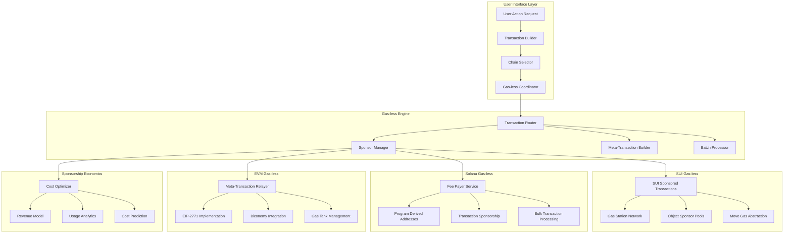

# Gas-less Transaction Mechanisms

## Overview

This document details comprehensive gas-less transaction implementations across SUI, Solana, and EVM networks. The system prioritizes user experience by eliminating gas fees through sponsored transactions, meta-transactions, and native gas-less capabilities.

## Gas-less Transaction Architecture



## SUI Gas-less Implementation

### SUI Native Sponsored Transactions

```move
module gasless::sponsored_loyalty {
    use sui::coin::{Self, Coin};
    use sui::transfer;
    use sui::tx_context::{Self, TxContext};
    use sui::object::{Self, UID};
    use loyalty_platform::loyalty_token::LOYALTY_TOKEN;
    
    /// Gas sponsor capability
    struct GasSponsorCap has key, store {
        id: UID,
        sponsor: address,
        daily_limit: u64,
        used_today: u64,
        last_reset: u64,
    }
    
    /// Sponsored transaction record
    struct SponsoredTransaction has key, store {
        id: UID,
        user: address,
        sponsor: address,
        gas_used: u64,
        transaction_type: vector<u8>,
        timestamp: u64,
    }
    
    /// Gas station for automatic sponsoring
    struct GasStation has key, store {
        id: UID,
        treasury: Coin<sui::sui::SUI>,
        sponsors: vector<address>,
        auto_sponsor_enabled: bool,
        min_balance_threshold: u64,
    }
    
    /// Initialize gas sponsoring system
    fun init(ctx: &mut TxContext) {
        let gas_station = GasStation {
            id: object::new(ctx),
            treasury: coin::zero(ctx),
            sponsors: vector::empty(),
            auto_sponsor_enabled: true,
            min_balance_threshold: 1000000, // 0.001 SUI
        };
        
        transfer::share_object(gas_station);
    }
    
    /// Sponsor a loyalty transaction (gas-less for user)
    public entry fun sponsor_loyalty_transaction<T>(
        gas_station: &mut GasStation,
        sponsor_cap: &mut GasSponsorCap,
        user: address,
        amount: u64,
        transaction_type: vector<u8>,
        ctx: &mut TxContext
    ) {
        // Check sponsor limits
        let current_epoch = tx_context::epoch(ctx);
        if (sponsor_cap.last_reset < current_epoch) {
            sponsor_cap.used_today = 0;
            sponsor_cap.last_reset = current_epoch;
        };
        
        assert!(sponsor_cap.used_today < sponsor_cap.daily_limit, 0);
        
        // Execute the actual loyalty transaction
        // This would call the main loyalty contract
        
        // Record sponsorship
        let sponsored_tx = SponsoredTransaction {
            id: object::new(ctx),
            user,
            sponsor: sponsor_cap.sponsor,
            gas_used: tx_context::gas_used(ctx),
            transaction_type,
            timestamp: tx_context::epoch_timestamp_ms(ctx),
        };
        
        sponsor_cap.used_today = sponsor_cap.used_today + 1;
        
        transfer::transfer(sponsored_tx, user);
    }
    
    /// Auto-sponsor transaction based on user tier
    public entry fun auto_sponsor_by_tier(
        gas_station: &mut GasStation,
        user: address,
        user_tier: u8,
        transaction_type: vector<u8>,
        ctx: &mut TxContext
    ) {
        assert!(gas_station.auto_sponsor_enabled, 1);
        
        // Higher tiers get more sponsorship
        let sponsor_eligible = match user_tier {
            4 => true,  // Platinum - always sponsored
            3 => true,  // Gold - always sponsored
            2 => tx_context::epoch(ctx) % 2 == 0, // Silver - 50% chance
            1 => tx_context::epoch(ctx) % 4 == 0, // Bronze - 25% chance
            _ => false  // Basic - no sponsorship
        };
        
        assert!(sponsor_eligible, 2);
        
        // Check gas station balance
        let gas_balance = coin::value(&gas_station.treasury);
        assert!(gas_balance > gas_station.min_balance_threshold, 3);
        
        // Record auto-sponsorship
        let sponsored_tx = SponsoredTransaction {
            id: object::new(ctx),
            user,
            sponsor: @gas_station_admin,
            gas_used: tx_context::gas_used(ctx),
            transaction_type,
            timestamp: tx_context::epoch_timestamp_ms(ctx),
        };
        
        transfer::transfer(sponsored_tx, user);
    }
    
    /// Bulk sponsor multiple transactions
    public entry fun bulk_sponsor_transactions(
        gas_station: &mut GasStation,
        users: vector<address>,
        amounts: vector<u64>,
        transaction_types: vector<vector<u8>>,
        ctx: &mut TxContext
    ) {
        let len = vector::length(&users);
        assert!(len == vector::length(&amounts), 4);
        assert!(len == vector::length(&transaction_types), 5);
        
        let i = 0;
        while (i < len) {
            let user = *vector::borrow(&users, i);
            let amount = *vector::borrow(&amounts, i);
            let tx_type = *vector::borrow(&transaction_types, i);
            
            // Execute sponsored transaction
            let sponsored_tx = SponsoredTransaction {
                id: object::new(ctx),
                user,
                sponsor: @bulk_sponsor,
                gas_used: tx_context::gas_used(ctx) / len, // Distribute gas cost
                transaction_type: tx_type,
                timestamp: tx_context::epoch_timestamp_ms(ctx),
            };
            
            transfer::transfer(sponsored_tx, user);
            i = i + 1;
        };
    }
    
    /// Refill gas station treasury
    public entry fun refill_gas_station(
        gas_station: &mut GasStation,
        payment: Coin<sui::sui::SUI>,
        ctx: &mut TxContext
    ) {
        coin::join(&mut gas_station.treasury, payment);
    }
    
    /// Add sponsor to gas station
    public entry fun add_sponsor(
        gas_station: &mut GasStation,
        sponsor: address,
        ctx: &mut TxContext
    ) {
        // Only admin can add sponsors
        assert!(tx_context::sender(ctx) == @gas_station_admin, 6);
        vector::push_back(&mut gas_station.sponsors, sponsor);
    }
}
```

### SUI Gas Station Network Service

```typescript
class SUIGasStationNetwork {
    private suiClient: SuiClient;
    private gasStationKeypair: Ed25519Keypair;
    private sponsorPool: Map<string, SponsorConfig>;
    private costTracker: CostTracker;
    
    constructor(
        rpcUrl: string,
        gasStationPrivateKey: string
    ) {
        this.suiClient = new SuiClient({ url: rpcUrl });
        this.gasStationKeypair = Ed25519Keypair.fromSecretKey(
            fromHEX(gasStationPrivateKey)
        );
        this.sponsorPool = new Map();
        this.costTracker = new CostTracker();
    }
    
    async sponsorUserTransaction(
        userAddress: string,
        transactionIntent: TransactionIntent
    ): Promise<SponsoredTransactionResult> {
        try {
            // Check if user is eligible for sponsorship
            const eligibility = await this.checkSponsorshipEligibility(
                userAddress,
                transactionIntent
            );
            
            if (!eligibility.eligible) {
                return {
                    success: false,
                    reason: eligibility.reason,
                    userMustPayGas: true
                };
            }
            
            // Build transaction block
            const txb = new TransactionBlock();
            
            // Add the loyalty transaction
            this.addLoyaltyTransaction(txb, transactionIntent);
            
            // Add sponsorship recording
            txb.moveCall({
                target: `${GASLESS_PACKAGE_ID}::sponsored_loyalty::sponsor_loyalty_transaction`,
                arguments: [
                    txb.object(GAS_STATION_ID),
                    txb.object(await this.getSponsorCap()),
                    txb.pure(userAddress),
                    txb.pure(transactionIntent.amount),
                    txb.pure(transactionIntent.type)
                ]
            });
            
            // Gas station pays for gas
            txb.setSender(userAddress);
            txb.setGasOwner(this.gasStationKeypair.getPublicKey().toSuiAddress());
            txb.setGasBudget(10000000); // 0.01 SUI
            
            // Execute transaction
            const result = await this.suiClient.signAndExecuteTransactionBlock({
                transactionBlock: txb,
                signer: this.gasStationKeypair,
                options: {
                    showEffects: true,
                    showEvents: true,
                    showObjectChanges: true
                }
            });
            
            // Track costs
            const gasCost = this.extractGasCost(result);
            await this.costTracker.recordSponsoredTransaction({
                userAddress,
                gasCost,
                transactionType: transactionIntent.type,
                timestamp: new Date()
            });
            
            return {
                success: true,
                transactionDigest: result.digest,
                gasCost: 0, // User pays nothing
                sponsorCost: gasCost,
                events: result.events
            };
            
        } catch (error) {
            return {
                success: false,
                error: error.message,
                userMustPayGas: true
            };
        }
    }
    
    async batchSponsorTransactions(
        transactions: BatchSponsorRequest[]
    ): Promise<BatchSponsorResult> {
        const batchSize = 50; // SUI can handle larger batches
        const batches = this.chunkArray(transactions, batchSize);
        const results = [];
        
        for (const batch of batches) {
            const batchTxb = new TransactionBlock();
            const userAddresses = [];
            const amounts = [];
            const transactionTypes = [];
            
            for (const tx of batch) {
                userAddresses.push(tx.userAddress);
                amounts.push(tx.amount);
                transactionTypes.push(tx.transactionType);
            }
            
            // Bulk sponsor call
            batchTxb.moveCall({
                target: `${GASLESS_PACKAGE_ID}::sponsored_loyalty::bulk_sponsor_transactions`,
                arguments: [
                    batchTxb.object(GAS_STATION_ID),
                    batchTxb.pure(userAddresses),
                    batchTxb.pure(amounts),
                    batchTxb.pure(transactionTypes)
                ]
            });
            
            batchTxb.setGasOwner(this.gasStationKeypair.getPublicKey().toSuiAddress());
            
            try {
                const result = await this.suiClient.signAndExecuteTransactionBlock({
                    transactionBlock: batchTxb,
                    signer: this.gasStationKeypair,
                    options: { showEffects: true }
                });
                
                const batchResults = batch.map(tx => ({
                    userAddress: tx.userAddress,
                    success: true,
                    transactionDigest: result.digest,
                    gasCost: 0
                }));
                
                results.push(...batchResults);
                
            } catch (error) {
                const batchResults = batch.map(tx => ({
                    userAddress: tx.userAddress,
                    success: false,
                    error: error.message,
                    gasCost: 0
                }));
                
                results.push(...batchResults);
            }
        }
        
        return {
            total: transactions.length,
            successful: results.filter(r => r.success).length,
            failed: results.filter(r => !r.success).length,
            totalCost: await this.calculateBatchCost(results),
            results
        };
    }
    
    private async checkSponsorshipEligibility(
        userAddress: string,
        transactionIntent: TransactionIntent
    ): Promise<EligibilityResult> {
        // Check user tier
        const userTier = await this.getUserTier(userAddress);
        
        // Check daily sponsorship limits
        const dailyUsage = await this.getDailySponsorshipUsage(userAddress);
        const dailyLimit = this.getDailyLimitByTier(userTier);
        
        if (dailyUsage >= dailyLimit) {
            return {
                eligible: false,
                reason: 'Daily sponsorship limit exceeded'
            };
        }
        
        // Check gas station balance
        const gasStationBalance = await this.getGasStationBalance();
        if (gasStationBalance < 0.1) { // 0.1 SUI minimum
            return {
                eligible: false,
                reason: 'Gas station balance too low'
            };
        }
        
        // Check transaction value eligibility
        if (transactionIntent.amount < 100) { // Minimum 100 points
            return {
                eligible: false,
                reason: 'Transaction amount too small for sponsorship'
            };
        }
        
        return { eligible: true };
    }
    
    private getDailyLimitByTier(tier: number): number {
        const limits = {
            4: 100, // Platinum
            3: 50,  // Gold
            2: 20,  // Silver
            1: 5,   // Bronze
            0: 0    // Basic
        };
        
        return limits[tier] || 0;
    }
    
    async refillGasStation(amount: number): Promise<RefillResult> {
        const coinToAdd = await this.suiClient.getCoins({
            owner: this.gasStationKeypair.getPublicKey().toSuiAddress(),
            coinType: '0x2::sui::SUI'
        });
        
        if (coinToAdd.data.length === 0) {
            throw new Error('No SUI coins available for refill');
        }
        
        const txb = new TransactionBlock();
        txb.moveCall({
            target: `${GASLESS_PACKAGE_ID}::sponsored_loyalty::refill_gas_station`,
            arguments: [
                txb.object(GAS_STATION_ID),
                txb.object(coinToAdd.data[0].coinObjectId)
            ]
        });
        
        const result = await this.suiClient.signAndExecuteTransactionBlock({
            transactionBlock: txb,
            signer: this.gasStationKeypair
        });
        
        return {
            success: result.effects?.status?.status === 'success',
            transactionDigest: result.digest,
            amountAdded: amount
        };
    }
}
```

## Solana Gas-less Implementation

### Enhanced Solana Fee Payer Service

```rust
use anchor_lang::prelude::*;
use anchor_spl::token::{self, Token, TokenAccount, Transfer};

declare_id!("GaslessLoyalty1111111111111111111111111111");

#[program]
pub mod gasless_loyalty {
    use super::*;

    pub fn initialize_fee_payer_service(
        ctx: Context<InitializeFeePayerService>,
        daily_limits: Vec<u64>, // Limits by tier
        auto_sponsor_enabled: bool,
    ) -> Result<()> {
        let fee_payer_service = &mut ctx.accounts.fee_payer_service;
        fee_payer_service.authority = ctx.accounts.authority.key();
        fee_payer_service.treasury = ctx.accounts.treasury.key();
        fee_payer_service.daily_limits = daily_limits;
        fee_payer_service.auto_sponsor_enabled = auto_sponsor_enabled;
        fee_payer_service.total_sponsored = 0;
        fee_payer_service.daily_sponsored = 0;
        fee_payer_service.last_reset = Clock::get()?.unix_timestamp;
        
        Ok(())
    }

    pub fn sponsor_loyalty_transaction(
        ctx: Context<SponsorLoyaltyTransaction>,
        amount: u64,
        transaction_type: String,
        industry: String,
    ) -> Result<()> {
        let fee_payer_service = &mut ctx.accounts.fee_payer_service;
        let user_account = &mut ctx.accounts.user_account;
        
        // Check and reset daily limits
        let current_time = Clock::get()?.unix_timestamp;
        if current_time - fee_payer_service.last_reset > 86400 { // 24 hours
            fee_payer_service.daily_sponsored = 0;
            fee_payer_service.last_reset = current_time;
        }
        
        // Check sponsorship eligibility
        let user_tier = user_account.tier_level as usize;
        let daily_limit = fee_payer_service.daily_limits.get(user_tier).unwrap_or(&0);
        
        require!(
            user_account.daily_sponsored < *daily_limit,
            GaslessError::DailySponsorshipLimitExceeded
        );
        
        // Update user account (this would normally be done in the main loyalty program)
        user_account.points_balance += amount;
        user_account.tier_level = calculate_tier(user_account.points_balance);
        user_account.last_activity = current_time;
        user_account.daily_sponsored += 1;
        
        // Update service metrics
        fee_payer_service.total_sponsored += 1;
        fee_payer_service.daily_sponsored += 1;
        
        emit!(SponsoredTransactionEvent {
            user: ctx.accounts.user.key(),
            amount,
            transaction_type,
            industry,
            sponsor: fee_payer_service.authority,
            gas_cost: 5000, // Estimated lamports
            timestamp: current_time,
        });
        
        Ok(())
    }

    pub fn batch_sponsor_transactions(
        ctx: Context<BatchSponsorTransactions>,
        recipients: Vec<Pubkey>,
        amounts: Vec<u64>,
        transaction_types: Vec<String>,
    ) -> Result<()> {
        let fee_payer_service = &mut ctx.accounts.fee_payer_service;
        
        require!(
            recipients.len() == amounts.len() && amounts.len() == transaction_types.len(),
            GaslessError::InvalidBatchData
        );
        
        require!(
            recipients.len() <= 20, // Batch size limit
            GaslessError::BatchSizeTooLarge
        );
        
        let current_time = Clock::get()?.unix_timestamp;
        let total_transactions = recipients.len() as u64;
        
        // Update service metrics
        fee_payer_service.total_sponsored += total_transactions;
        fee_payer_service.daily_sponsored += total_transactions;
        
        emit!(BatchSponsoredEvent {
            sponsor: fee_payer_service.authority,
            batch_size: total_transactions,
            total_gas_cost: 5000 * total_transactions, // Estimated
            timestamp: current_time,
        });
        
        Ok(())
    }

    pub fn auto_sponsor_by_activity(
        ctx: Context<AutoSponsorByActivity>,
        activity_score: u64,
        activity_type: String,
    ) -> Result<()> {
        let fee_payer_service = &ctx.accounts.fee_payer_service;
        require!(
            fee_payer_service.auto_sponsor_enabled,
            GaslessError::AutoSponsorDisabled
        );
        
        let user_account = &mut ctx.accounts.user_account;
        
        // Determine sponsorship based on activity score
        let sponsor_eligible = match activity_score {
            90..=100 => true,  // High activity - always sponsored
            70..=89 => Clock::get()?.slot % 2 == 0, // Medium activity - 50% chance
            50..=69 => Clock::get()?.slot % 4 == 0, // Low activity - 25% chance
            _ => false         // Very low activity - no sponsorship
        };
        
        require!(sponsor_eligible, GaslessError::NotEligibleForAutoSponsor);
        
        // Award activity-based points with sponsorship
        let bonus_points = activity_score * 10;
        user_account.points_balance += bonus_points;
        user_account.last_activity = Clock::get()?.unix_timestamp;
        
        emit!(AutoSponsoredEvent {
            user: ctx.accounts.user.key(),
            activity_score,
            activity_type,
            bonus_points,
            timestamp: Clock::get()?.unix_timestamp,
        });
        
        Ok(())
    }

    pub fn refill_fee_payer_treasury(
        ctx: Context<RefillFeePayerTreasury>,
        amount: u64,
    ) -> Result<()> {
        let fee_payer_service = &mut ctx.accounts.fee_payer_service;
        
        // Transfer SOL to treasury (simplified - would use proper SOL transfer)
        **ctx.accounts.treasury.to_account_info().try_borrow_mut_lamports()? += amount;
        **ctx.accounts.refiller.to_account_info().try_borrow_mut_lamports()? -= amount;
        
        emit!(TreasuryRefilledEvent {
            refiller: ctx.accounts.refiller.key(),
            amount,
            new_balance: ctx.accounts.treasury.to_account_info().lamports(),
            timestamp: Clock::get()?.unix_timestamp,
        });
        
        Ok(())
    }
}

#[derive(Accounts)]
pub struct InitializeFeePayerService<'info> {
    #[account(mut)]
    pub authority: Signer<'info>,
    
    #[account(
        init,
        payer = authority,
        space = 8 + FeePayerService::INIT_SPACE,
        seeds = [b"fee_payer_service"],
        bump
    )]
    pub fee_payer_service: Account<'info, FeePayerService>,
    
    /// CHECK: Treasury account for holding SOL
    #[account(mut)]
    pub treasury: AccountInfo<'info>,
    
    pub system_program: Program<'info, System>,
}

#[derive(Accounts)]
pub struct SponsorLoyaltyTransaction<'info> {
    #[account(mut)]
    pub fee_payer: Signer<'info>, // Platform pays fees
    
    /// CHECK: User receiving points
    pub user: UncheckedAccount<'info>,
    
    #[account(
        mut,
        seeds = [b"fee_payer_service"],
        bump
    )]
    pub fee_payer_service: Account<'info, FeePayerService>,
    
    #[account(
        init_if_needed,
        payer = fee_payer,
        space = 8 + UserAccount::INIT_SPACE,
        seeds = [b"user_account", user.key().as_ref()],
        bump
    )]
    pub user_account: Account<'info, UserAccount>,
    
    pub system_program: Program<'info, System>,
}

#[account]
pub struct FeePayerService {
    pub authority: Pubkey,
    pub treasury: Pubkey,
    pub daily_limits: Vec<u64>, // Daily sponsorship limits by tier
    pub auto_sponsor_enabled: bool,
    pub total_sponsored: u64,
    pub daily_sponsored: u64,
    pub last_reset: i64,
}

#[account]
pub struct UserAccount {
    pub owner: Pubkey,
    pub points_balance: u64,
    pub tier_level: u8,
    pub last_activity: i64,
    pub daily_sponsored: u64,
    pub total_sponsored: u64,
}

#[event]
pub struct SponsoredTransactionEvent {
    pub user: Pubkey,
    pub amount: u64,
    pub transaction_type: String,
    pub industry: String,
    pub sponsor: Pubkey,
    pub gas_cost: u64,
    pub timestamp: i64,
}

#[event]
pub struct BatchSponsoredEvent {
    pub sponsor: Pubkey,
    pub batch_size: u64,
    pub total_gas_cost: u64,
    pub timestamp: i64,
}

#[event]
pub struct AutoSponsoredEvent {
    pub user: Pubkey,
    pub activity_score: u64,
    pub activity_type: String,
    pub bonus_points: u64,
    pub timestamp: i64,
}

#[event]
pub struct TreasuryRefilledEvent {
    pub refiller: Pubkey,
    pub amount: u64,
    pub new_balance: u64,
    pub timestamp: i64,
}

#[error_code]
pub enum GaslessError {
    #[msg("Daily sponsorship limit exceeded")]
    DailySponsorshipLimitExceeded,
    #[msg("Invalid batch data")]
    InvalidBatchData,
    #[msg("Batch size too large")]
    BatchSizeTooLarge,
    #[msg("Auto sponsorship is disabled")]
    AutoSponsorDisabled,
    #[msg("Not eligible for auto sponsorship")]
    NotEligibleForAutoSponsor,
}

impl FeePayerService {
    pub const INIT_SPACE: usize = 32 + 32 + 4 + (8 * 5) + 1 + 8 + 8 + 8; // Conservative estimate
}

impl UserAccount {
    pub const INIT_SPACE: usize = 32 + 8 + 1 + 8 + 8 + 8;
}

fn calculate_tier(points: u64) -> u8 {
    match points {
        100_000.. => 4,
        50_000..=99_999 => 3,
        10_000..=49_999 => 2,
        1_000..=9_999 => 1,
        _ => 0,
    }
}
```

### Solana Gas-less Service Implementation

```typescript
class SolanaGaslessService {
    private connection: Connection;
    private feePayerKeypair: Keypair;
    private programId: PublicKey;
    private costTracker: SolanaCostTracker;
    
    constructor(
        rpcUrl: string,
        feePayerPrivateKey: string,
        programId: string
    ) {
        this.connection = new Connection(rpcUrl, 'confirmed');
        this.feePayerKeypair = Keypair.fromSecretKey(
            bs58.decode(feePayerPrivateKey)
        );
        this.programId = new PublicKey(programId);
        this.costTracker = new SolanaCostTracker();
    }
    
    async sponsorLoyaltyTransaction(
        userAddress: string,
        amount: number,
        transactionType: string,
        industry: string
    ): Promise<SolanaGaslessResult> {
        try {
            const user = new PublicKey(userAddress);
            
            // Check eligibility
            const eligibility = await this.checkEligibility(user);
            if (!eligibility.eligible) {
                return {
                    success: false,
                    reason: eligibility.reason,
                    userMustPayGas: true
                };
            }
            
            // Derive PDAs
            const [feePayerService] = PublicKey.findProgramAddressSync(
                [Buffer.from('fee_payer_service')],
                this.programId
            );
            
            const [userAccount] = PublicKey.findProgramAddressSync(
                [Buffer.from('user_account'), user.toBuffer()],
                this.programId
            );
            
            // Create instruction
            const instruction = await this.createSponsorInstruction(
                user,
                feePayerService,
                userAccount,
                amount,
                transactionType,
                industry
            );
            
            // Build and send transaction
            const transaction = new Transaction().add(instruction);
            transaction.feePayer = this.feePayerKeypair.publicKey;
            transaction.recentBlockhash = (
                await this.connection.getLatestBlockhash()
            ).blockhash;
            
            const signature = await sendAndConfirmTransaction(
                this.connection,
                transaction,
                [this.feePayerKeypair],
                { commitment: 'confirmed' }
            );
            
            // Track costs
            const gasCost = await this.getTransactionFee(signature);
            await this.costTracker.recordSponsoredTransaction({
                user: userAddress,
                gasCost,
                transactionType,
                timestamp: new Date()
            });
            
            return {
                success: true,
                signature,
                userGasCost: 0,
                sponsorGasCost: gasCost
            };
            
        } catch (error) {
            return {
                success: false,
                error: error.message,
                userGasCost: 0,
                sponsorGasCost: 0
            };
        }
    }
    
    async batchSponsorTransactions(
        transactions: SolanaGaslessTransaction[]
    ): Promise<SolanaBatchGaslessResult> {
        const batchSize = 15; // Solana transaction limit considerations
        const batches = this.chunkArray(transactions, batchSize);
        const results = [];
        
        for (const batch of batches) {
            try {
                const recipients = batch.map(tx => new PublicKey(tx.userAddress));
                const amounts = batch.map(tx => tx.amount);
                const transactionTypes = batch.map(tx => tx.transactionType);
                
                const [feePayerService] = PublicKey.findProgramAddressSync(
                    [Buffer.from('fee_payer_service')],
                    this.programId
                );
                
                const instruction = await this.createBatchSponsorInstruction(
                    feePayerService,
                    recipients,
                    amounts,
                    transactionTypes
                );
                
                const transaction = new Transaction().add(instruction);
                transaction.feePayer = this.feePayerKeypair.publicKey;
                transaction.recentBlockhash = (
                    await this.connection.getLatestBlockhash()
                ).blockhash;
                
                const signature = await sendAndConfirmTransaction(
                    this.connection,
                    transaction,
                    [this.feePayerKeypair]
                );
                
                const batchResults = batch.map(tx => ({
                    userAddress: tx.userAddress,
                    success: true,
                    signature,
                    userGasCost: 0
                }));
                
                results.push(...batchResults);
                
            } catch (error) {
                const batchResults = batch.map(tx => ({
                    userAddress: tx.userAddress,
                    success: false,
                    error: error.message,
                    userGasCost: 0
                }));
                
                results.push(...batchResults);
            }
        }
        
        return {
            total: transactions.length,
            successful: results.filter(r => r.success).length,
            failed: results.filter(r => !r.success).length,
            totalSponsorCost: await this.calculateBatchCost(results),
            results
        };
    }
    
    async autoSponsorByActivity(
        userAddress: string,
        activityScore: number,
        activityType: string
    ): Promise<SolanaGaslessResult> {
        const user = new PublicKey(userAddress);
        
        const [feePayerService] = PublicKey.findProgramAddressSync(
            [Buffer.from('fee_payer_service')],
            this.programId
        );
        
        const [userAccount] = PublicKey.findProgramAddressSync(
            [Buffer.from('user_account'), user.toBuffer()],
            this.programId
        );
        
        try {
            const instruction = await this.createAutoSponsorInstruction(
                user,
                feePayerService,
                userAccount,
                activityScore,
                activityType
            );
            
            const transaction = new Transaction().add(instruction);
            transaction.feePayer = this.feePayerKeypair.publicKey;
            transaction.recentBlockhash = (
                await this.connection.getLatestBlockhash()
            ).blockhash;
            
            const signature = await sendAndConfirmTransaction(
                this.connection,
                transaction,
                [this.feePayerKeypair]
            );
            
            return {
                success: true,
                signature,
                userGasCost: 0,
                sponsorGasCost: await this.getTransactionFee(signature)
            };
            
        } catch (error) {
            return {
                success: false,
                error: error.message,
                userGasCost: 0,
                sponsorGasCost: 0
            };
        }
    }
    
    private async checkEligibility(user: PublicKey): Promise<EligibilityResult> {
        try {
            const [userAccount] = PublicKey.findProgramAddressSync(
                [Buffer.from('user_account'), user.toBuffer()],
                this.programId
            );
            
            const accountInfo = await this.connection.getAccountInfo(userAccount);
            if (!accountInfo) {
                return { eligible: true }; // New users are eligible
            }
            
            // Decode user account data to check limits
            // Implementation would decode the account data
            // For now, simplified eligibility check
            
            return { eligible: true };
            
        } catch (error) {
            return {
                eligible: false,
                reason: 'Error checking eligibility'
            };
        }
    }
    
    private async getTransactionFee(signature: string): Promise<number> {
        try {
            const transaction = await this.connection.getTransaction(signature);
            return transaction?.meta?.fee || 5000; // Default 5000 lamports
        } catch {
            return 5000; // Fallback estimate
        }
    }
    
    private chunkArray<T>(array: T[], size: number): T[][] {
        const chunks = [];
        for (let i = 0; i < array.length; i += size) {
            chunks.push(array.slice(i, i + size));
        }
        return chunks;
    }
}
```

## EVM Meta-Transaction Implementation

### EIP-2771 Meta-Transaction Support

```solidity
// SPDX-License-Identifier: MIT
pragma solidity ^0.8.19;

import "@openzeppelin/contracts/metatx/ERC2771Context.sol";
import "@openzeppelin/contracts/access/Ownable.sol";
import "@openzeppelin/contracts/security/ReentrancyGuard.sol";

contract LoyaltyPlatformMetaTx is ERC2771Context, Ownable, ReentrancyGuard {
    struct MetaTxConfig {
        address[] trustedForwarders;
        mapping(address => bool) isTrustedForwarder;
        uint256 gaslessLimit; // Max gas-less transactions per day per user
        uint256 feeRate; // Fee rate in basis points
        bool enabled;
    }
    
    struct UserGaslessData {
        uint256 dailyCount;
        uint256 lastResetDay;
        uint256 totalSponsored;
        uint8 tier;
    }
    
    MetaTxConfig private metaTxConfig;
    mapping(address => UserGaslessData) public userGaslessData;
    mapping(address => uint256) public relayerBalances;
    
    event MetaTransactionExecuted(
        address indexed user,
        address indexed relayer,
        bytes functionSignature,
        uint256 gasUsed,
        bool success
    );
    
    event GaslessTransactionSponsored(
        address indexed user,
        uint256 gasUsed,
        uint256 fee,
        address sponsor
    );
    
    constructor(address[] memory _trustedForwarders) 
        ERC2771Context(_trustedForwarders[0]) 
    {
        metaTxConfig.trustedForwarders = _trustedForwarders;
        for (uint i = 0; i < _trustedForwarders.length; i++) {
            metaTxConfig.isTrustedForwarder[_trustedForwarders[i]] = true;
        }
        metaTxConfig.gaslessLimit = 50; // 50 gas-less transactions per day
        metaTxConfig.feeRate = 10; // 0.1%
        metaTxConfig.enabled = true;
    }
    
    modifier onlyTrustedForwarder() {
        require(
            metaTxConfig.isTrustedForwarder[msg.sender],
            "Not a trusted forwarder"
        );
        _;
    }
    
    function executeMetaTransaction(
        address user,
        bytes calldata functionSignature,
        uint256 gasLimit
    ) external onlyTrustedForwarder nonReentrant returns (bool success, bytes memory returnData) {
        require(metaTxConfig.enabled, "Meta transactions disabled");
        
        uint256 initialGas = gasleft();
        
        // Check if user is eligible for gas-less transaction
        if (isEligibleForGasless(user)) {
            updateGaslessUsage(user);
            
            // Execute transaction with gas sponsorship
            (success, returnData) = address(this).call{gas: gasLimit}(
                abi.encodePacked(functionSignature, user)
            );
            
            uint256 gasUsed = initialGas - gasleft();
            
            emit GaslessTransactionSponsored(
                user,
                gasUsed,
                0, // No fee for sponsored transaction
                msg.sender
            );
        } else {
            // Execute transaction with fee collection
            uint256 estimatedGas = gasLimit;
            uint256 fee = calculateMetaTxFee(estimatedGas);
            
            // Deduct fee from user's balance or token allowance
            require(deductMetaTxFee(user, fee), "Insufficient balance for fee");
            
            (success, returnData) = address(this).call{gas: gasLimit}(
                abi.encodePacked(functionSignature, user)
            );
        }
        
        emit MetaTransactionExecuted(
            user,
            msg.sender,
            functionSignature,
            initialGas - gasleft(),
            success
        );
    }
    
    function batchExecuteMetaTransactions(
        address[] calldata users,
        bytes[] calldata functionSignatures,
        uint256[] calldata gasLimits
    ) external onlyTrustedForwarder nonReentrant {
        require(
            users.length == functionSignatures.length && 
            functionSignatures.length == gasLimits.length,
            "Array length mismatch"
        );
        
        require(users.length <= 20, "Batch size too large");
        
        for (uint256 i = 0; i < users.length; i++) {
            this.executeMetaTransaction(
                users[i],
                functionSignatures[i],
                gasLimits[i]
            );
        }
    }
    
    function sponsorUserTransactions(
        address user,
        uint256 sponsorshipAmount
    ) external payable {
        require(msg.value >= sponsorshipAmount, "Insufficient payment");
        
        relayerBalances[user] += sponsorshipAmount;
        
        // Optionally increase user's gas-less limit temporarily
        UserGaslessData storage userData = userGaslessData[user];
        if (userData.tier < 4) { // Below platinum tier
            userData.tier = 4; // Temporary platinum status
        }
    }
    
    function isEligibleForGasless(address user) public view returns (bool) {
        UserGaslessData memory userData = userGaslessData[user];
        
        // Check daily limit
        uint256 currentDay = block.timestamp / 1 days;
        if (userData.lastResetDay < currentDay) {
            // New day, user gets fresh limit
            return true;
        }
        
        uint256 dailyLimit = getDailyGaslessLimit(userData.tier);
        return userData.dailyCount < dailyLimit;
    }
    
    function getDailyGaslessLimit(uint8 tier) public pure returns (uint256) {
        if (tier >= 4) return 100; // Platinum+
        if (tier >= 3) return 50;  // Gold
        if (tier >= 2) return 20;  // Silver
        if (tier >= 1) return 5;   // Bronze
        return 0; // Basic
    }
    
    function updateGaslessUsage(address user) private {
        UserGaslessData storage userData = userGaslessData[user];
        uint256 currentDay = block.timestamp / 1 days;
        
        if (userData.lastResetDay < currentDay) {
            userData.dailyCount = 1;
            userData.lastResetDay = currentDay;
        } else {
            userData.dailyCount++;
        }
        
        userData.totalSponsored++;
    }
    
    function calculateMetaTxFee(uint256 gasUsed) public view returns (uint256) {
        // Base fee + percentage of gas cost
        uint256 baseFee = 0.001 ether; // Base fee in ETH
        uint256 gasFee = gasUsed * tx.gasprice;
        uint256 percentageFee = gasFee * metaTxConfig.feeRate / 10000;
        
        return baseFee + percentageFee;
    }
    
    function deductMetaTxFee(address user, uint256 fee) private returns (bool) {
        // Check if user has sufficient balance in relayer balance
        if (relayerBalances[user] >= fee) {
            relayerBalances[user] -= fee;
            return true;
        }
        
        // Alternative: Deduct from user's token balance
        // Implementation depends on token contract integration
        
        return false;
    }
    
    // Override _msgSender to support meta-transactions
    function _msgSender() internal view override(Context, ERC2771Context) returns (address sender) {
        return ERC2771Context._msgSender();
    }
    
    function _msgData() internal view override(Context, ERC2771Context) returns (bytes calldata) {
        return ERC2771Context._msgData();
    }
    
    // Admin functions
    function addTrustedForwarder(address forwarder) external onlyOwner {
        metaTxConfig.trustedForwarders.push(forwarder);
        metaTxConfig.isTrustedForwarder[forwarder] = true;
    }
    
    function removeTrustedForwarder(address forwarder) external onlyOwner {
        metaTxConfig.isTrustedForwarder[forwarder] = false;
    }
    
    function updateGaslessLimit(uint256 newLimit) external onlyOwner {
        metaTxConfig.gaslessLimit = newLimit;
    }
    
    function toggleMetaTx(bool enabled) external onlyOwner {
        metaTxConfig.enabled = enabled;
    }
    
    function withdrawRelayerFees() external onlyOwner {
        payable(owner()).transfer(address(this).balance);
    }
}
```

This comprehensive gas-less transaction system provides seamless user experiences across SUI, Solana, and EVM chains while managing costs effectively and encouraging users to migrate to preferred low-cost chains.