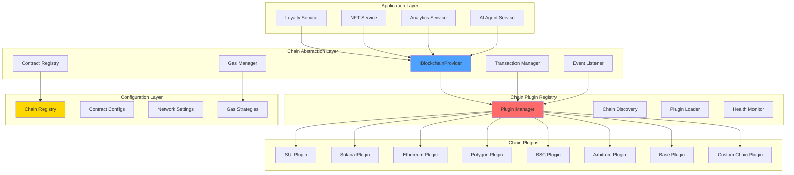
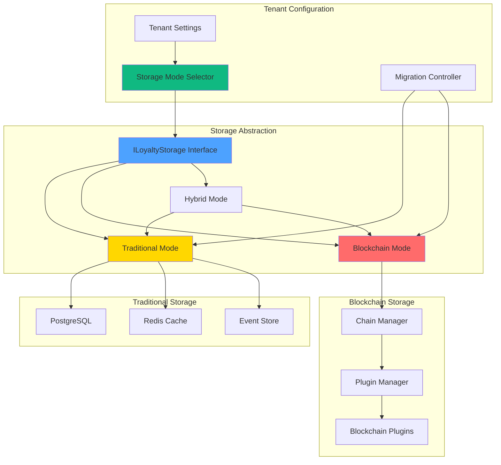

# Multi-Chain Architecture: Optional Blockchain Support

## Overview

This document outlines a modular, chain-agnostic architecture that enables optional blockchain functionality in the Ploy loyalty platform. Tenants can start with traditional storage and seamlessly enable blockchain features when needed. The design prioritizes flexibility, cost-effectiveness, and developer experience when integrating new chains.

## Core Design Principles

### 1. **Optional Blockchain Layer**
- Blockchain is an optional feature, not a requirement
- Traditional storage works perfectly for most use cases
- Seamless upgrade path when blockchain is needed

### 2. **Chain Abstraction Layer**
- Unified interface for all storage operations
- Chain-specific implementations when blockchain is enabled
- Consistent API regardless of storage mode

### 3. **Plugin-Based Architecture**
- Each blockchain is implemented as a self-contained plugin
- Hot-swappable chain modules without core system changes
- Plugins only loaded when blockchain is enabled

### 4. **Configuration-Driven Deployment**
- Storage mode selected through tenant configuration
- Dynamic chain discovery when blockchain is enabled
- Zero-downtime transitions between storage modes

## Architecture Overview



## Storage Mode Architecture

### Flexible Storage System



### Storage Mode Configuration

```typescript
interface StorageConfiguration {
  tenantId: string;
  mode: StorageMode;
  
  // Mode selection
  storageMode: 'traditional' | 'blockchain' | 'hybrid';
  
  // Traditional configuration
  traditional: {
    enabled: boolean;
    database: {
      type: 'postgresql';
      connectionPool: number;
      readReplicas: string[];
    };
    cache: {
      type: 'redis';
      ttl: number;
      maxMemory: string;
    };
    features: {
      pointsSystem: boolean;
      digitalBadges: boolean;
      campaigns: boolean;
      analytics: boolean;
    };
  };
  
  // Blockchain configuration (optional)
  blockchain?: {
    enabled: boolean;
    primaryChain: string;
    supportedChains: string[];
    gasSponsorship: boolean;
    fallbackEnabled: boolean;
    features: {
      nftMinting: boolean;
      crossChain: boolean;
      marketplace: boolean;
      governance: boolean;
    };
  };
  
  // Migration settings
  migration: {
    strategy: 'gradual' | 'bulk' | 'new_only' | 'manual';
    autoMigrationThreshold: number; // e.g., 10000 users
    preserveHistory: boolean;
    dualWritePeriod: number; // days
  };
}

## Chain Abstraction Interface

### Core Blockchain Provider Interface

```typescript
// Base interface that all chain plugins must implement
interface IBlockchainProvider {
  // Metadata
  readonly chainId: string;
  readonly name: string;
  readonly symbol: string;
  readonly type: ChainType;
  readonly capabilities: ChainCapability[];
  
  // Lifecycle
  initialize(config: ChainConfig): Promise<void>;
  connect(): Promise<boolean>;
  disconnect(): Promise<void>;
  isHealthy(): Promise<boolean>;
  
  // Transaction Operations
  sendTransaction(tx: UniversalTransaction): Promise<TransactionResult>;
  batchTransactions(txs: UniversalTransaction[]): Promise<BatchResult>;
  estimateGas(tx: UniversalTransaction): Promise<GasEstimate>;
  getTransactionStatus(txHash: string): Promise<TransactionStatus>;
  
  // Contract Operations
  deployContract(contract: ContractDeployment): Promise<DeploymentResult>;
  callContract(call: ContractCall): Promise<CallResult>;
  
  // Account Operations
  createAccount(): Promise<Account>;
  getBalance(address: string): Promise<Balance>;
  
  // Event Handling
  subscribeToEvents(filter: EventFilter): AsyncIterator<BlockchainEvent>;
  unsubscribe(subscriptionId: string): Promise<void>;
  
  // Gas Management
  getGasStrategy(): IGasStrategy;
  sponsorTransaction?(tx: UniversalTransaction): Promise<SponsoredTransaction>;
  
  // NFT Operations (if supported)
  mintNFT?(params: NFTMintParams): Promise<NFTResult>;
  transferNFT?(params: NFTTransferParams): Promise<TransferResult>;
  
  // Bridge Operations (if supported)
  bridgeToChain?(targetChain: string, params: BridgeParams): Promise<BridgeResult>;
}

// Universal transaction format
interface UniversalTransaction {
  id: string;
  type: TransactionType;
  from: string;
  to?: string;
  value?: string;
  data?: string;
  metadata: TransactionMetadata;
  chainSpecific?: Record<string, any>; // Chain-specific fields
}

enum ChainType {
  UTXO = 'utxo',           // Bitcoin-like
  ACCOUNT = 'account',      // Ethereum-like
  OBJECT = 'object',        // SUI-like
  SOLANA = 'solana',        // Solana-specific
  COSMOS = 'cosmos',        // Cosmos-based
  SUBSTRATE = 'substrate'   // Polkadot-based
}

enum ChainCapability {
  SMART_CONTRACTS = 'smart_contracts',
  NFT_NATIVE = 'nft_native',
  GAS_SPONSORSHIP = 'gas_sponsorship',
  INSTANT_FINALITY = 'instant_finality',
  CROSS_CHAIN_BRIDGE = 'cross_chain_bridge',
  GOVERNANCE = 'governance',
  STAKING = 'staking'
}
```

### Chain Plugin Implementation

```typescript
// Abstract base class for chain plugins
abstract class BaseChainPlugin implements IBlockchainProvider {
  protected config: ChainConfig;
  protected client: any;
  protected contracts: Map<string, ContractInstance> = new Map();
  
  constructor(config: ChainConfig) {
    this.config = config;
  }
  
  // Common functionality
  async initialize(config: ChainConfig): Promise<void> {
    this.config = { ...this.config, ...config };
    await this.setupClient();
    await this.loadContracts();
    await this.registerEventHandlers();
  }
  
  // Abstract methods that must be implemented
  abstract setupClient(): Promise<void>;
  abstract sendTransaction(tx: UniversalTransaction): Promise<TransactionResult>;
  abstract estimateGas(tx: UniversalTransaction): Promise<GasEstimate>;
  
  // Common utilities
  protected validateTransaction(tx: UniversalTransaction): void {
    if (!tx.from) throw new Error('Transaction must have from address');
    if (!this.isValidAddress(tx.from)) throw new Error('Invalid from address');
  }
  
  protected abstract isValidAddress(address: string): boolean;
}

// Example: SUI Chain Plugin
class SUIChainPlugin extends BaseChainPlugin {
  readonly chainId = 'sui';
  readonly name = 'SUI Network';
  readonly symbol = 'SUI';
  readonly type = ChainType.OBJECT;
  readonly capabilities = [
    ChainCapability.SMART_CONTRACTS,
    ChainCapability.NFT_NATIVE,
    ChainCapability.GAS_SPONSORSHIP,
    ChainCapability.INSTANT_FINALITY
  ];
  
  private suiClient: SuiClient;
  private keypair: Ed25519Keypair;
  
  async setupClient(): Promise<void> {
    this.suiClient = new SuiClient({ url: this.config.rpcUrl });
    this.keypair = Ed25519Keypair.fromSecretKey(
      fromHEX(this.config.privateKey)
    );
  }
  
  async sendTransaction(tx: UniversalTransaction): Promise<TransactionResult> {
    this.validateTransaction(tx);
    
    const txb = new TransactionBlock();
    
    // Convert universal transaction to SUI transaction
    const suiTx = this.convertToSuiTransaction(tx, txb);
    
    // Handle gas sponsorship if enabled
    if (this.config.gasSponsorship?.enabled) {
      txb.setGasOwner(this.config.gasSponsorship.sponsorAddress);
    }
    
    const result = await this.suiClient.signAndExecuteTransactionBlock({
      transactionBlock: txb,
      signer: this.keypair,
      options: { showEffects: true, showEvents: true }
    });
    
    return this.formatTransactionResult(result);
  }
  
  async estimateGas(tx: UniversalTransaction): Promise<GasEstimate> {
    // SUI has predictable gas costs
    return {
      gasPrice: '1000', // 1000 MIST
      gasLimit: '10000000', // 0.01 SUI
      estimatedCost: '0.01',
      currency: 'SUI'
    };
  }
  
  async sponsorTransaction(tx: UniversalTransaction): Promise<SponsoredTransaction> {
    const sponsored = { ...tx };
    sponsored.metadata.sponsored = true;
    sponsored.metadata.sponsor = this.config.gasSponsorship.sponsorAddress;
    return sponsored;
  }
  
  private convertToSuiTransaction(tx: UniversalTransaction, txb: TransactionBlock): any {
    switch (tx.type) {
      case TransactionType.TRANSFER:
        return this.buildTransferTransaction(tx, txb);
      case TransactionType.CONTRACT_CALL:
        return this.buildContractCallTransaction(tx, txb);
      case TransactionType.NFT_MINT:
        return this.buildNFTMintTransaction(tx, txb);
      default:
        throw new Error(`Unsupported transaction type: ${tx.type}`);
    }
  }
  
  protected isValidAddress(address: string): boolean {
    return /^0x[a-fA-F0-9]{64}$/.test(address);
  }
}

// Example: Solana Chain Plugin
class SolanaChainPlugin extends BaseChainPlugin {
  readonly chainId = 'solana';
  readonly name = 'Solana';
  readonly symbol = 'SOL';
  readonly type = ChainType.SOLANA;
  readonly capabilities = [
    ChainCapability.SMART_CONTRACTS,
    ChainCapability.NFT_NATIVE,
    ChainCapability.GAS_SPONSORSHIP,
    ChainCapability.INSTANT_FINALITY
  ];
  
  private connection: Connection;
  private keypair: Keypair;
  
  async setupClient(): Promise<void> {
    this.connection = new Connection(this.config.rpcUrl, 'confirmed');
    this.keypair = Keypair.fromSecretKey(
      bs58.decode(this.config.privateKey)
    );
  }
  
  async sendTransaction(tx: UniversalTransaction): Promise<TransactionResult> {
    this.validateTransaction(tx);
    
    const transaction = new Transaction();
    
    // Convert universal transaction to Solana transaction
    const instruction = this.convertToSolanaInstruction(tx);
    transaction.add(instruction);
    
    // Handle gas sponsorship
    if (this.config.gasSponsorship?.enabled) {
      transaction.feePayer = new PublicKey(this.config.gasSponsorship.sponsorAddress);
    } else {
      transaction.feePayer = this.keypair.publicKey;
    }
    
    const signature = await sendAndConfirmTransaction(
      this.connection,
      transaction,
      [this.keypair]
    );
    
    return {
      hash: signature,
      status: 'confirmed',
      gasUsed: '5000', // Typical Solana transaction
      chainId: this.chainId
    };
  }
  
  async estimateGas(tx: UniversalTransaction): Promise<GasEstimate> {
    return {
      gasPrice: '5000',
      gasLimit: '5000',
      estimatedCost: '0.000005',
      currency: 'SOL'
    };
  }
  
  protected isValidAddress(address: string): boolean {
    try {
      new PublicKey(address);
      return true;
    } catch {
      return false;
    }
  }
}
```

## Plugin Management System

### Chain Plugin Registry

```typescript
class ChainPluginRegistry {
  private plugins: Map<string, IBlockchainProvider> = new Map();
  private configs: Map<string, ChainConfig> = new Map();
  private healthMonitor: HealthMonitor;
  
  constructor() {
    this.healthMonitor = new HealthMonitor();
  }
  
  // Register a new chain plugin
  async registerPlugin(
    chainId: string, 
    pluginClass: new (config: ChainConfig) => IBlockchainProvider,
    config: ChainConfig
  ): Promise<void> {
    try {
      // Create plugin instance
      const plugin = new pluginClass(config);
      
      // Initialize plugin
      await plugin.initialize(config);
      
      // Verify plugin health
      const isHealthy = await plugin.isHealthy();
      if (!isHealthy) {
        throw new Error(`Plugin ${chainId} failed health check`);
      }
      
      // Register plugin
      this.plugins.set(chainId, plugin);
      this.configs.set(chainId, config);
      
      // Start health monitoring
      this.healthMonitor.monitor(chainId, plugin);
      
      console.log(`Successfully registered chain plugin: ${chainId}`);
      
    } catch (error) {
      console.error(`Failed to register plugin ${chainId}:`, error);
      throw error;
    }
  }
  
  // Get plugin by chain ID
  getPlugin(chainId: string): IBlockchainProvider {
    const plugin = this.plugins.get(chainId);
    if (!plugin) {
      throw new Error(`No plugin found for chain: ${chainId}`);
    }
    return plugin;
  }
  
  // Get all available chains
  getAvailableChains(): ChainInfo[] {
    return Array.from(this.plugins.entries()).map(([chainId, plugin]) => ({
      chainId,
      name: plugin.name,
      symbol: plugin.symbol,
      type: plugin.type,
      capabilities: plugin.capabilities,
      isHealthy: this.healthMonitor.getStatus(chainId)
    }));
  }
  
  // Load plugins from configuration
  async loadPluginsFromConfig(configPath: string): Promise<void> {
    const config = await this.loadConfig(configPath);
    
    for (const chainConfig of config.chains) {
      await this.loadAndRegisterPlugin(chainConfig);
    }
  }
  
  private async loadAndRegisterPlugin(chainConfig: any): Promise<void> {
    const { chainId, pluginModule, ...config } = chainConfig;
    
    // Dynamically import plugin
    const PluginClass = await import(pluginModule);
    
    // Register plugin
    await this.registerPlugin(chainId, PluginClass.default, config);
  }
}

// Health monitoring for chain plugins
class HealthMonitor {
  private healthStatus: Map<string, boolean> = new Map();
  private intervals: Map<string, NodeJS.Timeout> = new Map();
  
  monitor(chainId: string, plugin: IBlockchainProvider): void {
    // Initial health check
    this.checkHealth(chainId, plugin);
    
    // Periodic health checks
    const interval = setInterval(async () => {
      await this.checkHealth(chainId, plugin);
    }, 30000); // Check every 30 seconds
    
    this.intervals.set(chainId, interval);
  }
  
  private async checkHealth(chainId: string, plugin: IBlockchainProvider): Promise<void> {
    try {
      const isHealthy = await plugin.isHealthy();
      this.healthStatus.set(chainId, isHealthy);
      
      if (!isHealthy) {
        console.warn(`Chain ${chainId} is unhealthy`);
        // Emit event for potential failover
        EventBus.emit('chain.unhealthy', { chainId });
      }
    } catch (error) {
      console.error(`Health check failed for ${chainId}:`, error);
      this.healthStatus.set(chainId, false);
    }
  }
  
  getStatus(chainId: string): boolean {
    return this.healthStatus.get(chainId) ?? false;
  }
  
  stop(chainId: string): void {
    const interval = this.intervals.get(chainId);
    if (interval) {
      clearInterval(interval);
      this.intervals.delete(chainId);
    }
  }
}
```

## Configuration-Driven Chain Management

### Chain Configuration Schema

```typescript
interface ChainConfig {
  chainId: string;
  name: string;
  symbol: string;
  type: ChainType;
  
  // Network settings
  network: {
    rpcUrl: string;
    wsUrl?: string;
    explorerUrl: string;
    chainId: number | string;
  };
  
  // Authentication
  auth: {
    privateKey?: string;
    mnemonic?: string;
    keystorePath?: string;
  };
  
  // Gas settings
  gas: {
    strategy: GasStrategy;
    maxGasPrice?: string;
    gasMultiplier?: number;
    sponsorship?: GasSponsorshipConfig;
  };
  
  // Contract addresses
  contracts: {
    loyaltyToken?: string;
    nftCollection?: string;
    marketplace?: string;
    bridge?: string;
    [key: string]: string | undefined;
  };
  
  // Plugin-specific settings
  pluginSettings?: Record<string, any>;
  
  // Feature flags
  features: {
    enabled: boolean;
    gasSponsorship: boolean;
    nftSupport: boolean;
    bridgeSupport: boolean;
    governanceSupport: boolean;
  };
}

// Example configuration file
const chainConfigs: ChainConfig[] = [
  {
    chainId: 'sui',
    name: 'SUI Network',
    symbol: 'SUI',
    type: ChainType.OBJECT,
    network: {
      rpcUrl: 'https://fullnode.mainnet.sui.io:443',
      explorerUrl: 'https://explorer.sui.io',
      chainId: 'sui:mainnet'
    },
    auth: {
      privateKey: process.env.SUI_PRIVATE_KEY
    },
    gas: {
      strategy: GasStrategy.SPONSOR,
      sponsorship: {
        enabled: true,
        sponsorAddress: process.env.SUI_SPONSOR_ADDRESS,
        dailyLimit: 1000000 // 1 SUI
      }
    },
    contracts: {
      loyaltyToken: '0x...',
      nftCollection: '0x...',
      marketplace: '0x...'
    },
    features: {
      enabled: true,
      gasSponsorship: true,
      nftSupport: true,
      bridgeSupport: true,
      governanceSupport: false
    }
  },
  {
    chainId: 'solana',
    name: 'Solana',
    symbol: 'SOL',
    type: ChainType.SOLANA,
    network: {
      rpcUrl: 'https://api.mainnet-beta.solana.com',
      explorerUrl: 'https://explorer.solana.com',
      chainId: 'solana:mainnet'
    },
    auth: {
      privateKey: process.env.SOLANA_PRIVATE_KEY
    },
    gas: {
      strategy: GasStrategy.FEE_PAYER,
      sponsorship: {
        enabled: true,
        feePayerAddress: process.env.SOLANA_FEE_PAYER
      }
    },
    contracts: {
      loyaltyProgram: 'DZnkkTmCiFWfYTfT41X3Rd1kDgozqzxWaHqsw6W4x2oe',
      nftCollection: 'F7e4iBrxoSmHhEzhuBcXXs1KAknYvEoZWieiocPvrCD9'
    },
    features: {
      enabled: true,
      gasSponsorship: true,
      nftSupport: true,
      bridgeSupport: true,
      governanceSupport: true
    }
  }
];
```

### Dynamic Chain Registration

```typescript
class DynamicChainLoader {
  private registry: ChainPluginRegistry;
  
  constructor(registry: ChainPluginRegistry) {
    this.registry = registry;
  }
  
  // Add new chain at runtime
  async addChain(chainConfig: ChainConfig): Promise<void> {
    // Validate configuration
    this.validateChainConfig(chainConfig);
    
    // Load plugin dynamically
    const pluginPath = this.getPluginPath(chainConfig.type);
    const PluginClass = await this.loadPlugin(pluginPath);
    
    // Register with registry
    await this.registry.registerPlugin(
      chainConfig.chainId,
      PluginClass,
      chainConfig
    );
    
    // Update runtime configuration
    await this.updateRuntimeConfig(chainConfig);
    
    console.log(`Added new chain: ${chainConfig.chainId}`);
  }
  
  // Remove chain at runtime
  async removeChain(chainId: string): Promise<void> {
    const plugin = this.registry.getPlugin(chainId);
    
    // Gracefully disconnect
    await plugin.disconnect();
    
    // Remove from registry
    this.registry.unregister(chainId);
    
    // Update configuration
    await this.removeFromRuntimeConfig(chainId);
    
    console.log(`Removed chain: ${chainId}`);
  }
  
  private getPluginPath(chainType: ChainType): string {
    const pluginMap = {
      [ChainType.OBJECT]: './plugins/SUIChainPlugin',
      [ChainType.SOLANA]: './plugins/SolanaChainPlugin',
      [ChainType.ACCOUNT]: './plugins/EVMChainPlugin',
      [ChainType.COSMOS]: './plugins/CosmosChainPlugin',
      [ChainType.SUBSTRATE]: './plugins/SubstrateChainPlugin'
    };
    
    return pluginMap[chainType];
  }
  
  private async loadPlugin(pluginPath: string): Promise<any> {
    try {
      const module = await import(pluginPath);
      return module.default;
    } catch (error) {
      throw new Error(`Failed to load plugin: ${pluginPath}`);
    }
  }
}
```

## Universal Transaction Router

### Chain Selection Logic

```typescript
class UniversalTransactionRouter {
  private registry: ChainPluginRegistry;
  private chainSelector: ChainSelector;
  private fallbackManager: FallbackManager;
  
  constructor(registry: ChainPluginRegistry) {
    this.registry = registry;
    this.chainSelector = new ChainSelector(registry);
    this.fallbackManager = new FallbackManager(registry);
  }
  
  async executeTransaction(
    request: TransactionRequest
  ): Promise<TransactionResult> {
    try {
      // Select optimal chain
      const selectedChain = await this.chainSelector.selectChain(request);
      
      // Get plugin for selected chain
      const plugin = this.registry.getPlugin(selectedChain);
      
      // Convert to universal transaction
      const universalTx = this.convertToUniversalTransaction(request);
      
      // Execute transaction
      const result = await plugin.sendTransaction(universalTx);
      
      return result;
      
    } catch (error) {
      // Attempt fallback if primary chain fails
      return await this.fallbackManager.handleFailure(request, error);
    }
  }
  
  private convertToUniversalTransaction(
    request: TransactionRequest
  ): UniversalTransaction {
    return {
      id: generateTxId(),
      type: request.type,
      from: request.from,
      to: request.to,
      value: request.value,
      data: request.data,
      metadata: {
        timestamp: Date.now(),
        priority: request.priority || 'normal',
        maxRetries: 3
      },
      chainSpecific: request.chainSpecific || {}
    };
  }
}

class ChainSelector {
  private registry: ChainPluginRegistry;
  
  constructor(registry: ChainPluginRegistry) {
    this.registry = registry;
  }
  
  async selectChain(request: TransactionRequest): Promise<string> {
    // Get available chains
    const availableChains = this.registry.getAvailableChains()
      .filter(chain => chain.isHealthy);
    
    // Filter by capabilities
    const compatibleChains = availableChains.filter(chain =>
      this.isChainCompatible(chain, request)
    );
    
    if (compatibleChains.length === 0) {
      throw new Error('No compatible chains available');
    }
    
    // Apply selection strategy
    return this.applySelectionStrategy(compatibleChains, request);
  }
  
  private isChainCompatible(chain: ChainInfo, request: TransactionRequest): boolean {
    // Check if chain supports required capabilities
    const requiredCapabilities = this.getRequiredCapabilities(request);
    
    return requiredCapabilities.every(capability =>
      chain.capabilities.includes(capability)
    );
  }
  
  private applySelectionStrategy(
    chains: ChainInfo[],
    request: TransactionRequest
  ): string {
    switch (request.strategy) {
      case 'lowest_cost':
        return this.selectLowestCostChain(chains);
      case 'fastest':
        return this.selectFastestChain(chains);
      case 'most_reliable':
        return this.selectMostReliableChain(chains);
      default:
        return this.selectOptimalChain(chains, request);
    }
  }
  
  private selectOptimalChain(chains: ChainInfo[], request: TransactionRequest): string {
    // Score each chain based on multiple factors
    const scores = chains.map(chain => ({
      chainId: chain.chainId,
      score: this.calculateChainScore(chain, request)
    }));
    
    // Return chain with highest score
    return scores.reduce((best, current) =>
      current.score > best.score ? current : best
    ).chainId;
  }
  
  private calculateChainScore(chain: ChainInfo, request: TransactionRequest): number {
    let score = 0;
    
    // Gas cost factor (higher score for lower cost)
    if (chain.capabilities.includes(ChainCapability.GAS_SPONSORSHIP)) {
      score += 100;
    }
    
    // Speed factor
    if (chain.capabilities.includes(ChainCapability.INSTANT_FINALITY)) {
      score += 50;
    }
    
    // NFT support for NFT transactions
    if (request.type === TransactionType.NFT_MINT &&
        chain.capabilities.includes(ChainCapability.NFT_NATIVE)) {
      score += 75;
    }
    
    // Preference for specific chains
    if (request.preferredChains?.includes(chain.chainId)) {
      score += 25;
    }
    
    return score;
  }
}
```

## Adding a New Chain: Step-by-Step Guide

### 1. Create Chain Plugin

```typescript
// Example: Adding Polygon support
class PolygonChainPlugin extends BaseChainPlugin {
  readonly chainId = 'polygon';
  readonly name = 'Polygon';
  readonly symbol = 'MATIC';
  readonly type = ChainType.ACCOUNT;
  readonly capabilities = [
    ChainCapability.SMART_CONTRACTS,
    ChainCapability.NFT_NATIVE,
    ChainCapability.CROSS_CHAIN_BRIDGE
  ];
  
  private web3: Web3;
  private account: Account;
  
  async setupClient(): Promise<void> {
    this.web3 = new Web3(this.config.rpcUrl);
    this.account = this.web3.eth.accounts.privateKeyToAccount(this.config.privateKey);
    this.web3.eth.accounts.wallet.add(this.account);
  }
  
  async sendTransaction(tx: UniversalTransaction): Promise<TransactionResult> {
    this.validateTransaction(tx);
    
    const txParams = {
      from: tx.from,
      to: tx.to,
      value: tx.value,
      data: tx.data,
      gas: await this.estimateGas(tx).then(est => est.gasLimit),
      gasPrice: await this.web3.eth.getGasPrice()
    };
    
    const receipt = await this.web3.eth.sendTransaction(txParams);
    
    return {
      hash: receipt.transactionHash,
      status: receipt.status ? 'confirmed' : 'failed',
      gasUsed: receipt.gasUsed.toString(),
      chainId: this.chainId
    };
  }
  
  async estimateGas(tx: UniversalTransaction): Promise<GasEstimate> {
    const gasLimit = await this.web3.eth.estimateGas({
      from: tx.from,
      to: tx.to,
      value: tx.value,
      data: tx.data
    });
    
    const gasPrice = await this.web3.eth.getGasPrice();
    
    return {
      gasPrice,
      gasLimit: gasLimit.toString(),
      estimatedCost: this.web3.utils.fromWei(
        (BigInt(gasLimit) * BigInt(gasPrice)).toString(),
        'ether'
      ),
      currency: 'MATIC'
    };
  }
  
  protected isValidAddress(address: string): boolean {
    return this.web3.utils.isAddress(address);
  }
}
```

### 2. Add Configuration

```typescript
// Add to chain configuration
const polygonConfig: ChainConfig = {
  chainId: 'polygon',
  name: 'Polygon',
  symbol: 'MATIC',
  type: ChainType.ACCOUNT,
  network: {
    rpcUrl: 'https://polygon-rpc.com',
    explorerUrl: 'https://polygonscan.com',
    chainId: 137
  },
  auth: {
    privateKey: process.env.POLYGON_PRIVATE_KEY
  },
  gas: {
    strategy: GasStrategy.DYNAMIC,
    maxGasPrice: '100000000000', // 100 gwei
    gasMultiplier: 1.2
  },
  contracts: {
    loyaltyToken: '0x...',
    nftCollection: '0x...',
    marketplace: '0x...'
  },
  features: {
    enabled: true,
    gasSponsorship: false,
    nftSupport: true,
    bridgeSupport: true,
    governanceSupport: false
  }
};
```

### 3. Register Plugin

```typescript
// In application startup
async function initializeChains() {
  const registry = new ChainPluginRegistry();
  
  // Register existing chains
  await registry.registerPlugin('sui', SUIChainPlugin, suiConfig);
  await registry.registerPlugin('solana', SolanaChainPlugin, solanaConfig);
  
  // Register new Polygon chain
  await registry.registerPlugin('polygon', PolygonChainPlugin, polygonConfig);
  
  return registry;
}
```

### 4. Deploy Contracts (if needed)

```typescript
// Contract deployment for new chain
class ChainDeploymentManager {
  async deployToNewChain(chainId: string): Promise<DeploymentResult> {
    const plugin = registry.getPlugin(chainId);
    
    // Deploy loyalty token contract
    const tokenDeployment = await plugin.deployContract({
      contractName: 'LoyaltyToken',
      bytecode: contracts.loyaltyToken.bytecode,
      constructorArgs: ['Ploy Token', 'PLOY', 18]
    });
    
    // Deploy NFT collection contract
    const nftDeployment = await plugin.deployContract({
      contractName: 'PloyNFTCollection',
      bytecode: contracts.nftCollection.bytecode,
      constructorArgs: ['Ploy NFTs', 'PLOY-NFT']
    });
    
    // Update configuration with deployed addresses
    await this.updateChainConfig(chainId, {
      contracts: {
        loyaltyToken: tokenDeployment.address,
        nftCollection: nftDeployment.address
      }
    });
    
    return {
      chainId,
      deployments: [tokenDeployment, nftDeployment]
    };
  }
}
```

### 5. Test Integration

```typescript
// Automated testing for new chain
describe('Polygon Chain Integration', () => {
  let registry: ChainPluginRegistry;
  let plugin: IBlockchainProvider;
  
  beforeAll(async () => {
    registry = await initializeChains();
    plugin = registry.getPlugin('polygon');
  });
  
  it('should connect successfully', async () => {
    const isHealthy = await plugin.isHealthy();
    expect(isHealthy).toBe(true);
  });
  
  it('should send transaction', async () => {
    const tx: UniversalTransaction = {
      id: 'test-tx-1',
      type: TransactionType.TRANSFER,
      from: testAccount.address,
      to: recipientAddress,
      value: '1000000000000000000', // 1 MATIC
      metadata: {
        timestamp: Date.now(),
        priority: 'normal',
        maxRetries: 3
      }
    };
    
    const result = await plugin.sendTransaction(tx);
    expect(result.status).toBe('confirmed');
    expect(result.hash).toBeDefined();
  });
  
  it('should estimate gas correctly', async () => {
    const tx: UniversalTransaction = { /* ... */ };
    const estimate = await plugin.estimateGas(tx);
    
    expect(estimate.gasPrice).toBeDefined();
    expect(estimate.gasLimit).toBeDefined();
    expect(estimate.currency).toBe('MATIC');
  });
});
```

## Migration and Rollback Strategy

### Safe Chain Integration

```typescript
class ChainMigrationManager {
  async addChainSafely(chainConfig: ChainConfig): Promise<MigrationResult> {
    const migrationId = generateMigrationId();
    
    try {
      // 1. Validate configuration
      await this.validateChainConfig(chainConfig);
      
      // 2. Deploy contracts in testnet first
      await this.deployTestnetContracts(chainConfig);
      
      // 3. Run integration tests
      await this.runIntegrationTests(chainConfig);
      
      // 4. Create rollback point
      const rollbackPoint = await this.createRollbackPoint();
      
      // 5. Register chain in staging
      await this.registerInStaging(chainConfig);
      
      // 6. Gradual rollout
      await this.gradualRollout(chainConfig);
      
      // 7. Full activation
      await this.activateChain(chainConfig.chainId);
      
      return {
        migrationId,
        success: true,
        chainId: chainConfig.chainId,
        rollbackPoint
      };
      
    } catch (error) {
      // Automatic rollback on failure
      await this.rollback(migrationId);
      throw error;
    }
  }
  
  private async gradualRollout(chainConfig: ChainConfig): Promise<void> {
    // 10% of transactions
    await this.enableForPercentage(chainConfig.chainId, 10);
    await this.waitAndMonitor(5 * 60 * 1000); // 5 minutes
    
    // 50% of transactions
    await this.enableForPercentage(chainConfig.chainId, 50);
    await this.waitAndMonitor(10 * 60 * 1000); // 10 minutes
    
    // 100% of transactions
    await this.enableForPercentage(chainConfig.chainId, 100);
  }
}
```

## Monitoring and Observability

### Chain-Specific Metrics

```typescript
class ChainMetricsCollector {
  private metrics: Map<string, ChainMetrics> = new Map();
  
  collectMetrics(chainId: string, plugin: IBlockchainProvider): void {
    const metrics = {
      // Performance metrics
      transactionThroughput: gauge(`chain.${chainId}.throughput`),
      averageConfirmationTime: histogram(`chain.${chainId}.confirmation_time`),
      gasPrice: gauge(`chain.${chainId}.gas_price`),
      
      // Reliability metrics
      successRate: gauge(`chain.${chainId}.success_rate`),
      errorRate: counter(`chain.${chainId}.errors`),
      healthScore: gauge(`chain.${chainId}.health_score`),
      
      // Cost metrics
      totalGasSpent: counter(`chain.${chainId}.gas_spent`),
      avgTransactionCost: gauge(`chain.${chainId}.avg_cost`)
    };
    
    this.metrics.set(chainId, metrics);
    
    // Set up collection intervals
    setInterval(() => this.updateMetrics(chainId, plugin), 30000);
  }
  
  private async updateMetrics(chainId: string, plugin: IBlockchainProvider): Promise<void> {
    const metrics = this.metrics.get(chainId);
    if (!metrics) return;
    
    // Update health score
    const isHealthy = await plugin.isHealthy();
    metrics.healthScore.set(isHealthy ? 1 : 0);
    
    // Update gas price
    const gasEstimate = await plugin.estimateGas({
      id: 'metrics',
      type: TransactionType.TRANSFER,
      from: '0x...',
      to: '0x...',
      value: '1',
      metadata: { timestamp: Date.now(), priority: 'normal', maxRetries: 1 }
    });
    
    metrics.gasPrice.set(parseFloat(gasEstimate.gasPrice));
  }
}
```

This modular architecture ensures that adding support for new blockchains requires minimal changes to the core system, following the open/closed principle of software design. Each chain plugin is self-contained and can be developed, tested, and deployed independently.