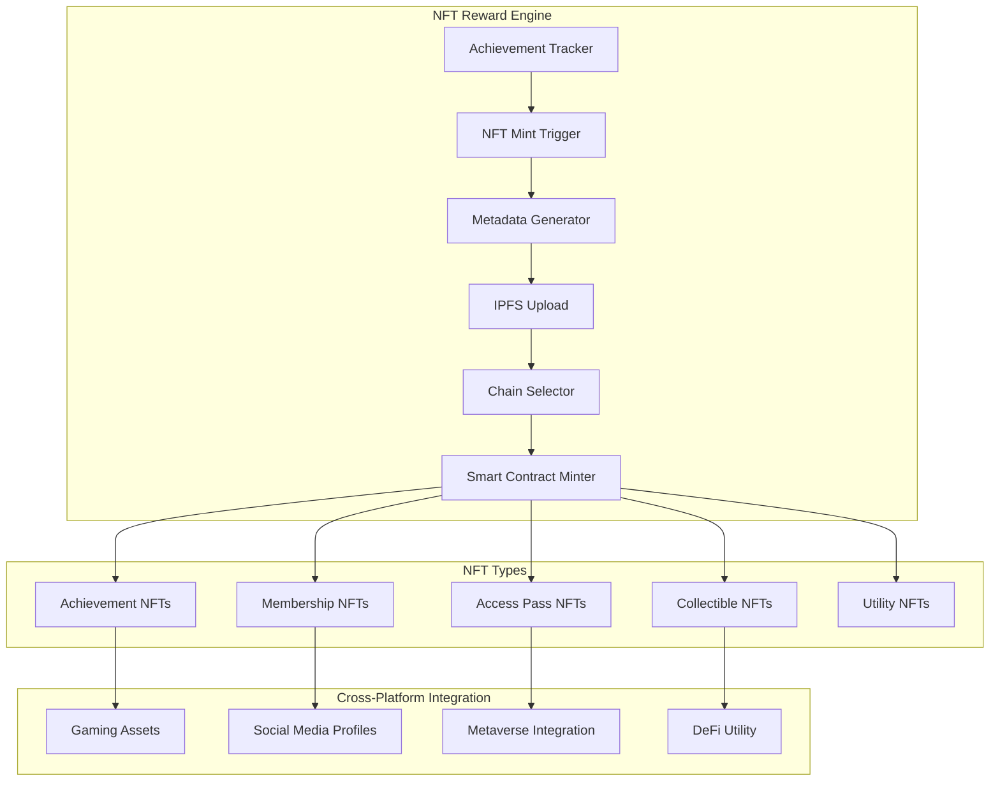
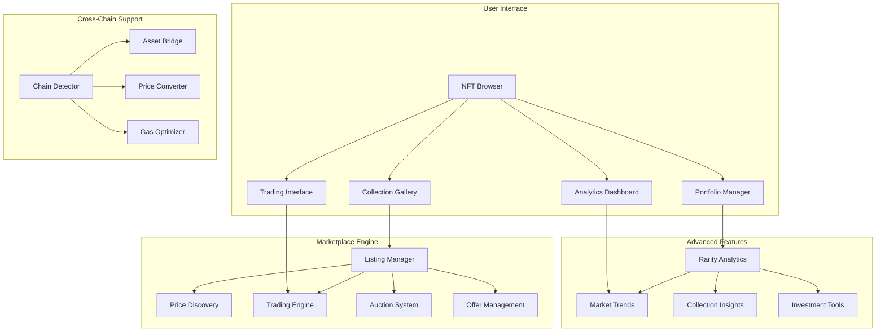
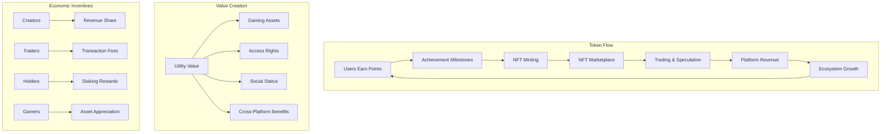

# NFT Complete Ecosystem: Digital Assets, Marketplace & Gaming Integration

## Overview

The Ploy platform integrates a comprehensive NFT ecosystem that transforms traditional loyalty rewards into digital assets with real ownership, provable scarcity, and cross-platform utility. This ecosystem includes NFT rewards, marketplace trading, gaming integration, and a complete token economy.

## Table of Contents

1. [NFT Rewards System](#nft-rewards-system)
2. [NFT Marketplace](#nft-marketplace)
3. [Gaming Integration](#gaming-integration)
4. [Token Economy](#token-economy)
5. [Industry-Specific Workflows](#industry-specific-workflows)

---

## NFT Rewards System

### Architecture



### NFT Categories

#### 1. Achievement NFTs
Earned through specific accomplishments across different industries:

```typescript
interface AchievementNFT {
  category: 'achievement';
  industry: 'saas' | 'ecommerce' | 'gaming' | 'health' | 'finance';
  achievement: {
    type: string;
    criteria: AchievementCriteria;
    rarity: 'common' | 'uncommon' | 'rare' | 'epic' | 'legendary';
    rewards: {
      points_bonus: number;
      special_access: string[];
      future_benefits: string[];
    };
  };
}

// Example: API Master Badge
const apiMasterNFT: AchievementNFT = {
  category: 'achievement',
  industry: 'saas',
  achievement: {
    type: 'api_mastery',
    criteria: {
      api_calls: 100000,
      success_rate: 95,
      consistent_usage: 30 // days
    },
    rarity: 'rare',
    rewards: {
      points_bonus: 1000,
      special_access: ['beta_features', 'priority_support'],
      future_benefits: ['api_rate_boost', 'advanced_analytics']
    }
  }
};
```

#### 2. Membership NFTs
Represent tier status and provide ongoing benefits:

```typescript
interface MembershipNFT {
  category: 'membership';
  tier: 'bronze' | 'silver' | 'gold' | 'platinum' | 'diamond';
  benefits: {
    point_multiplier: number;
    exclusive_events: boolean;
    priority_support: boolean;
    early_access: boolean;
    custom_rewards: string[];
  };
  evolution: {
    upgradeable: boolean;
    next_tier_requirements: TierRequirements;
    legacy_benefits: string[];
  };
}
```

### Dynamic NFT Features

#### Evolving NFTs
NFTs that change based on user behavior and achievements:

```typescript
class EvolvingNFT {
  private state: NFTState;
  private evolution_rules: EvolutionRule[];

  async updateNFT(userActivity: UserActivity): Promise<NFTUpdate> {
    const applicableRules = this.evolution_rules.filter(rule => 
      this.evaluateCondition(rule.condition, userActivity)
    );

    for (const rule of applicableRules) {
      await this.applyEvolution(rule);
    }

    return {
      updated: true,
      changes: this.getChanges(),
      new_metadata: this.generateMetadata()
    };
  }

  private async applyEvolution(rule: EvolutionRule): Promise<void> {
    switch (rule.type) {
      case 'visual_upgrade':
        this.state.visual_tier++;
        await this.updateIPFSMetadata();
        break;
      case 'utility_unlock':
        this.state.utilities.push(...rule.new_utilities);
        break;
      case 'rarity_increase':
        this.state.rarity = rule.new_rarity;
        break;
    }
  }
}
```

---

## NFT Marketplace

### Marketplace Architecture



### Trading Mechanics

#### Intelligent Pricing Engine
```typescript
class IntelligentPricingEngine {
  async calculateRecommendedPrice(nft: NFT): Promise<PriceRecommendation> {
    const factors = await this.analyzePricingFactors(nft);
    
    return {
      suggested_price: this.calculateBasePrice(factors),
      price_range: {
        min: factors.floor_price * 0.9,
        max: factors.ceiling_price * 1.1
      },
      market_sentiment: factors.sentiment,
      similar_sales: factors.recent_comparables,
      liquidity_score: factors.liquidity,
      recommendation: this.generateRecommendation(factors)
    };
  }

  private async analyzePricingFactors(nft: NFT): Promise<PricingFactors> {
    return {
      rarity_score: await this.calculateRarityScore(nft),
      utility_value: await this.assessUtilityValue(nft),
      collection_performance: await this.getCollectionMetrics(nft.collection),
      market_demand: await this.analyzeMarketDemand(nft.category),
      holder_behavior: await this.analyzeHolderPatterns(nft),
      seasonal_trends: await this.getSeasonalTrends(nft.industry)
    };
  }
}
```

### Cross-Platform Trading

#### Multi-Chain NFT Bridge
```typescript
interface CrossChainTrade {
  source_chain: ChainId;
  target_chain: ChainId;
  nft_contract: string;
  token_id: string;
  price: {
    amount: string;
    currency: 'points' | 'native' | 'stable';
  };
  bridge_fee: string;
  estimated_time: number; // minutes
}

class CrossChainTrading {
  async initiateCrossChainSale(trade: CrossChainTrade): Promise<TradeExecution> {
    // Lock NFT on source chain
    const lockTx = await this.lockNFTForBridge(trade);
    
    // Create listing on target chain
    const listingTx = await this.createCrossChainListing(trade);
    
    // Set up cross-chain communication
    const bridgeSetup = await this.setupBridgeMonitoring(trade, lockTx, listingTx);
    
    return {
      lock_transaction: lockTx,
      listing_transaction: listingTx,
      bridge_id: bridgeSetup.bridge_id,
      status: 'pending_sale',
      estimated_completion: Date.now() + (trade.estimated_time * 60 * 1000)
    };
  }
}
```

---

## Gaming Integration

### Gaming-Specific NFT Types

#### 1. In-Game Assets
```typescript
interface GameAssetNFT {
  category: 'game_asset';
  game: {
    title: string;
    studio: string;
    genre: string;
  };
  asset_type: 'character' | 'weapon' | 'skin' | 'land' | 'building' | 'pet';
  stats: {
    level: number;
    rarity: string;
    power_rating: number;
    special_abilities: string[];
  };
  transferable: boolean;
  game_bound: boolean;
  cross_game_compatible: string[]; // other games that accept this asset
}
```

#### 2. Tournament Rewards
```typescript
interface TournamentRewardNFT {
  category: 'tournament_reward';
  tournament: {
    name: string;
    date: string;
    participants: number;
    prize_pool: string;
  };
  placement: {
    rank: number;
    total_participants: number;
    percentile: number;
  };
  rewards: {
    immediate: string[];
    ongoing: string[];
    future_access: string[];
  };
  proof_of_skill: {
    games_played: number;
    win_rate: number;
    skill_rating: number;
  };
}
```

### Cross-Game Compatibility

#### Universal Gaming Passport
```typescript
class UniversalGamingPassport {
  private nft_collection: GameAssetNFT[];
  private achievements: AchievementNFT[];
  private reputation: GamingReputation;

  async getCompatibleAssets(target_game: string): Promise<CompatibleAsset[]> {
    const compatible = this.nft_collection.filter(nft => 
      nft.cross_game_compatible.includes(target_game)
    );

    return Promise.all(compatible.map(async nft => ({
      original_nft: nft,
      adapted_stats: await this.adaptStatsForGame(nft, target_game),
      benefits: await this.calculateGameBenefits(nft, target_game),
      transfer_requirements: await this.getTransferRequirements(nft, target_game)
    })));
  }

  async migrateAssetToGame(
    nft: GameAssetNFT, 
    target_game: string
  ): Promise<MigrationResult> {
    // Verify compatibility
    const compatibility = await this.verifyCompatibility(nft, target_game);
    if (!compatibility.compatible) {
      throw new Error(`Asset not compatible with ${target_game}`);
    }

    // Create wrapped version for target game
    const wrappedAsset = await this.createWrappedAsset(nft, target_game);
    
    // Lock original asset
    await this.lockOriginalAsset(nft);
    
    // Mint wrapped version
    const mintResult = await this.mintWrappedAsset(wrappedAsset, target_game);
    
    return {
      original_locked: true,
      wrapped_asset: mintResult,
      usable_in_game: target_game,
      revert_instructions: this.generateRevertInstructions(nft, mintResult)
    };
  }
}
```

---

## Token Economy

### Economic Model



### Staking and Rewards

#### NFT Staking System
```typescript
interface NFTStakingPool {
  pool_id: string;
  accepted_collections: string[];
  reward_token: 'points' | 'governance' | 'utility';
  staking_requirements: {
    minimum_rarity: string;
    minimum_stake_duration: number; // days
    maximum_slots: number;
  };
  rewards: {
    base_apr: number;
    rarity_multipliers: Map<string, number>;
    bonus_conditions: BonusCondition[];
  };
}

class NFTStaking {
  async stakeNFT(nft: NFT, pool_id: string, duration: number): Promise<StakeResult> {
    const pool = await this.getStakingPool(pool_id);
    
    // Validate staking requirements
    await this.validateStakingRequirements(nft, pool);
    
    // Calculate expected rewards
    const rewardCalculation = await this.calculateExpectedRewards(nft, pool, duration);
    
    // Lock NFT in staking contract
    const stakingTx = await this.lockNFTForStaking(nft, pool_id, duration);
    
    return {
      stake_id: stakingTx.stake_id,
      locked_until: new Date(Date.now() + duration * 24 * 60 * 60 * 1000),
      expected_rewards: rewardCalculation,
      early_withdrawal_penalty: pool.early_withdrawal_penalty,
      auto_compound: pool.auto_compound_available
    };
  }

  private async calculateExpectedRewards(
    nft: NFT, 
    pool: NFTStakingPool, 
    duration: number
  ): Promise<RewardCalculation> {
    const baseReward = pool.rewards.base_apr * duration / 365;
    const rarityMultiplier = pool.rewards.rarity_multipliers.get(nft.rarity) || 1;
    const bonusMultiplier = await this.calculateBonusMultiplier(nft, pool);
    
    return {
      base_reward: baseReward,
      rarity_bonus: baseReward * (rarityMultiplier - 1),
      special_bonuses: baseReward * (bonusMultiplier - 1),
      total_expected: baseReward * rarityMultiplier * bonusMultiplier,
      daily_rate: (baseReward * rarityMultiplier * bonusMultiplier) / duration
    };
  }
}
```

### Cross-Platform Value Transfer

#### Universal Token Bridge
```typescript
class UniversalTokenBridge {
  async bridgeNFTValue(
    nft: NFT, 
    source_platform: string, 
    target_platform: string
  ): Promise<BridgeResult> {
    // Assess NFT value on source platform
    const sourceValue = await this.assessPlatformValue(nft, source_platform);
    
    // Calculate equivalent value on target platform
    const targetValue = await this.calculateEquivalentValue(
      sourceValue, 
      source_platform, 
      target_platform
    );
    
    // Apply bridge fees and exchange rates
    const bridgeCalculation = await this.calculateBridgeCosts(
      sourceValue, 
      targetValue
    );
    
    // Execute bridge transaction
    if (bridgeCalculation.feasible) {
      return await this.executeBridge(nft, sourceValue, targetValue, bridgeCalculation);
    } else {
      throw new Error('Bridge not economically feasible');
    }
  }

  private async calculateEquivalentValue(
    sourceValue: PlatformValue,
    source_platform: string,
    target_platform: string
  ): Promise<PlatformValue> {
    const exchangeRate = await this.getExchangeRate(source_platform, target_platform);
    const marketConditions = await this.getMarketConditions(target_platform);
    
    return {
      points_value: sourceValue.points_value * exchangeRate.points_ratio,
      utility_value: this.adaptUtilityValue(sourceValue.utility_value, target_platform),
      social_value: sourceValue.social_value * marketConditions.social_premium,
      total_value: 0 // calculated from above
    };
  }
}
```

---

## Industry-Specific Workflows

### SaaS Industry NFT Integration

#### Developer Achievement System
```typescript
interface DeveloperAchievementNFT {
  achievement_type: 'api_mastery' | 'feature_adoption' | 'community_contribution';
  technical_proof: {
    api_calls: number;
    uptime_percentage: number;
    error_rate: number;
    feature_usage: string[];
  };
  community_impact: {
    documentation_contributions: number;
    forum_posts: number;
    open_source_contributions: number;
    mentorship_score: number;
  };
  progression_path: {
    current_level: number;
    next_milestone: Milestone;
    unlock_requirements: TechnicalRequirement[];
  };
}

const saasAchievementWorkflow = {
  "api_master_journey": {
    "bronze_level": {
      "requirements": {
        "api_calls": 10000,
        "success_rate": 95,
        "consistent_usage_days": 30
      },
      "rewards": {
        "nft": "API Explorer Badge",
        "points": 1000,
        "perks": ["priority_support", "beta_access"]
      }
    },
    "silver_level": {
      "requirements": {
        "api_calls": 100000,
        "success_rate": 98,
        "advanced_features_used": 5
      },
      "rewards": {
        "nft": "API Master Badge",
        "points": 5000,
        "perks": ["dedicated_support", "feature_requests"]
      }
    },
    "gold_level": {
      "requirements": {
        "api_calls": 1000000,
        "success_rate": 99,
        "community_contributions": 10
      },
      "rewards": {
        "nft": "API Grandmaster Badge",
        "points": 15000,
        "perks": ["advisory_board", "revenue_share"]
      }
    }
  }
};
```

### E-commerce NFT Integration

#### Customer Journey NFTs
```typescript
interface EcommerceJourneyNFT {
  journey_stage: 'first_purchase' | 'loyal_customer' | 'brand_ambassador' | 'vip_member';
  purchase_history: {
    total_orders: number;
    total_spent: number;
    favorite_categories: string[];
    return_rate: number;
    review_score: number;
  };
  social_engagement: {
    referrals_made: number;
    social_shares: number;
    user_generated_content: number;
    community_participation: number;
  };
  exclusive_access: {
    early_releases: boolean;
    exclusive_products: string[];
    personal_shopper: boolean;
    vip_events: boolean;
  };
}

const ecommerceWorkflow = {
  "fashion_collector_path": {
    "fashionista": {
      "requirements": {
        "brands_purchased": 5,
        "total_spent": 500,
        "style_consistency": 0.8
      },
      "nft_reward": {
        "name": "Fashion Explorer",
        "visual_elements": ["style_badge", "brand_logos"],
        "utility": ["style_recommendations", "early_access"]
      }
    },
    "style_icon": {
      "requirements": {
        "brands_purchased": 15,
        "total_spent": 2000,
        "social_shares": 10,
        "outfit_photos": 20
      },
      "nft_reward": {
        "name": "Style Icon",
        "visual_elements": ["crown", "fashion_collage"],
        "utility": ["personal_stylist", "exclusive_events"]
      }
    }
  }
};
```

### Gaming Industry NFT Integration

#### Competitive Gaming Achievements
```typescript
interface GamingAchievementNFT {
  achievement_category: 'skill' | 'community' | 'creativity' | 'dedication';
  skill_metrics: {
    rank: number;
    win_rate: number;
    kda_ratio: number;
    tournament_placements: TournamentResult[];
  };
  community_contribution: {
    tournaments_organized: number;
    players_mentored: number;
    content_created: number;
    community_reputation: number;
  };
  cross_game_recognition: {
    games_mastered: string[];
    universal_skill_rating: number;
    genre_expertise: string[];
  };
}

const gamingWorkflow = {
  "esports_champion_path": {
    "bronze_competitor": {
      "requirements": {
        "tournament_participations": 5,
        "win_rate": 0.6,
        "rank_percentile": 75
      },
      "nft_reward": {
        "name": "Rising Champion",
        "animated_elements": ["trophy_gleam", "rank_progression"],
        "cross_game_benefits": ["skill_boost", "tournament_priority"]
      }
    },
    "pro_player": {
      "requirements": {
        "tournament_wins": 3,
        "win_rate": 0.8,
        "rank_percentile": 95,
        "sponsorship_value": 1000
      },
      "nft_reward": {
        "name": "Professional Champion",
        "animated_elements": ["championship_aura", "victory_animation"],
        "cross_game_benefits": ["pro_status", "tournament_seeding", "sponsorship_boost"]
      }
    }
  }
};
```

### Health & Fitness NFT Integration

#### Wellness Achievement System
```typescript
interface WellnessAchievementNFT {
  wellness_category: 'fitness' | 'nutrition' | 'mental_health' | 'sleep' | 'social';
  health_metrics: {
    steps_total: number;
    workouts_completed: number;
    calories_burned: number;
    sleep_quality_average: number;
    nutrition_score: number;
  };
  consistency_tracking: {
    longest_streak: number;
    weekly_consistency: number;
    goal_achievement_rate: number;
  };
  community_impact: {
    challenges_completed: number;
    friends_motivated: number;
    group_activities: number;
    health_content_shared: number;
  };
}

const healthWorkflow = {
  "wellness_warrior_path": {
    "health_seeker": {
      "requirements": {
        "consecutive_workout_days": 30,
        "steps_milestone": 300000,
        "nutrition_consistency": 0.7
      },
      "nft_reward": {
        "name": "Wellness Warrior",
        "health_visualization": ["heartbeat_animation", "progress_chart"],
        "real_world_benefits": ["gym_discounts", "nutrition_consultation"]
      }
    },
    "fitness_champion": {
      "requirements": {
        "consecutive_workout_days": 100,
        "steps_milestone": 1000000,
        "community_challenges_won": 5
      },
      "nft_reward": {
        "name": "Fitness Champion",
        "health_visualization": ["champion_glow", "achievement_timeline"],
        "real_world_benefits": ["personal_trainer_session", "wellness_retreat_discount"]
      }
    }
  }
};
```

---

## Technical Implementation

### Smart Contract Architecture

```solidity
// Comprehensive NFT System Contract
contract PloyNFTEcosystem {
    // NFT Collections mapping
    mapping(string => NFTCollection) public collections;
    
    // Cross-platform compatibility
    mapping(uint256 => CrossPlatformMetadata) public crossPlatformData;
    
    // Staking functionality
    mapping(uint256 => StakingInfo) public stakedNFTs;
    
    // Evolution tracking
    mapping(uint256 => EvolutionHistory) public nftEvolution;
    
    struct NFTCollection {
        string name;
        string category; // achievement, membership, gaming, etc.
        address contractAddress;
        bool crossChainEnabled;
        uint256 totalSupply;
        uint256 floorPrice;
    }
    
    struct CrossPlatformMetadata {
        string[] compatibleGames;
        mapping(string => GameSpecificMetadata) gameAdaptations;
        bool transferable;
    }
    
    function mintAchievementNFT(
        address to,
        string memory achievementType,
        bytes memory proofData,
        string memory industry
    ) external returns (uint256) {
        // Verify achievement proof
        require(verifyAchievementProof(achievementType, proofData), "Invalid proof");
        
        // Generate unique metadata
        string memory metadata = generateAchievementMetadata(achievementType, proofData, industry);
        
        // Mint NFT
        uint256 tokenId = _mintNFT(to, metadata);
        
        // Set up cross-platform compatibility
        _setupCrossPlatformData(tokenId, achievementType, industry);
        
        emit AchievementNFTMinted(to, tokenId, achievementType, industry);
        return tokenId;
    }
    
    function evolveNFT(
        uint256 tokenId,
        bytes memory evolutionProof
    ) external {
        require(ownerOf(tokenId) == msg.sender, "Not NFT owner");
        require(verifyEvolutionCriteria(tokenId, evolutionProof), "Evolution criteria not met");
        
        // Apply evolution
        _applyEvolution(tokenId, evolutionProof);
        
        // Update metadata
        _updateMetadata(tokenId);
        
        emit NFTEvolved(tokenId, block.timestamp);
    }
    
    function bridgeToGame(
        uint256 tokenId,
        string memory targetGame,
        address gameContract
    ) external returns (uint256 wrappedTokenId) {
        require(ownerOf(tokenId) == msg.sender, "Not NFT owner");
        require(isGameCompatible(tokenId, targetGame), "Not compatible with target game");
        
        // Lock original NFT
        _lockForBridge(tokenId);
        
        // Create wrapped version for target game
        wrappedTokenId = IGameContract(gameContract).mintWrappedAsset(
            msg.sender,
            tokenId,
            _getGameSpecificMetadata(tokenId, targetGame)
        );
        
        emit NFTBridgedToGame(tokenId, wrappedTokenId, targetGame);
        return wrappedTokenId;
    }
}
```

### Integration APIs

```typescript
// Comprehensive NFT API for platform integration
class PloyNFTAPI {
  
  // Mint achievement NFT
  async mintAchievementNFT(request: MintAchievementRequest): Promise<MintResult> {
    const proofValidation = await this.validateAchievementProof(request);
    if (!proofValidation.valid) {
      throw new Error(`Invalid achievement proof: ${proofValidation.reason}`);
    }
    
    const metadata = await this.generateAchievementMetadata(request);
    const mintTx = await this.blockchain.mintNFT(request.recipient, metadata);
    
    // Set up cross-platform data
    await this.setupCrossPlatformCompatibility(mintTx.tokenId, request);
    
    // Index for marketplace
    await this.indexNFTForMarketplace(mintTx.tokenId, metadata);
    
    return {
      tokenId: mintTx.tokenId,
      transactionHash: mintTx.hash,
      metadata: metadata,
      marketplaceUrl: this.generateMarketplaceUrl(mintTx.tokenId)
    };
  }
  
  // Get cross-platform compatible games
  async getCompatibleGames(tokenId: string): Promise<CompatibleGame[]> {
    const nft = await this.getNFTMetadata(tokenId);
    const compatibility = await this.crossPlatformService.getCompatibility(nft);
    
    return compatibility.map(game => ({
      gameId: game.id,
      gameName: game.name,
      adaptedMetadata: game.adaptedMetadata,
      transferCost: game.transferCost,
      benefits: game.benefits
    }));
  }
  
  // Marketplace integration
  async listNFTForSale(listingRequest: ListingRequest): Promise<ListingResult> {
    const ownership = await this.verifyOwnership(listingRequest.tokenId, listingRequest.seller);
    if (!ownership.verified) {
      throw new Error('Ownership verification failed');
    }
    
    const pricing = await this.pricingEngine.suggestPrice(listingRequest.tokenId);
    const listing = await this.marketplace.createListing({
      ...listingRequest,
      suggestedPrice: pricing.recommendedPrice,
      marketAnalysis: pricing.analysis
    });
    
    return {
      listingId: listing.id,
      listingUrl: this.generateListingUrl(listing.id),
      priceRecommendation: pricing,
      estimatedSaleTime: pricing.estimatedSaleTime
    };
  }
  
  // Gaming integration
  async bridgeNFTToGame(bridgeRequest: BridgeRequest): Promise<BridgeResult> {
    const compatibility = await this.verifyGameCompatibility(
      bridgeRequest.tokenId, 
      bridgeRequest.targetGame
    );
    
    if (!compatibility.compatible) {
      throw new Error(`NFT not compatible with ${bridgeRequest.targetGame}`);
    }
    
    const bridgeResult = await this.crossChainBridge.initiateBridge(bridgeRequest);
    
    return {
      originalTokenLocked: true,
      wrappedTokenId: bridgeResult.wrappedTokenId,
      gameContract: bridgeResult.gameContract,
      revertInstructions: bridgeResult.revertInstructions,
      estimatedConfirmationTime: bridgeResult.estimatedTime
    };
  }
}
```

---

This comprehensive NFT ecosystem documentation consolidates all NFT-related features into a single, navigable resource while maintaining the depth and detail of the original separate files. The unified structure makes it easier for developers and businesses to understand how all NFT components work together within the Ploy platform.