# Policy Engine Workflows: Dynamic Engines for Different Tech Industries

## Overview

This document illustrates how different policy types interact with dynamic engines across various tech industries, showing the complete flow from policy definition to execution and optimization.

## Policy Engine Architecture

```typescript
interface PolicyEngine {
  // Core policy evaluation
  evaluate(context: PolicyContext): Promise<PolicyResult>;
  
  // Dynamic engine management
  loadEngine(industry: IndustryType): Promise<IndustryPolicyEngine>;
  
  // Policy composition
  combinepolicies(policies: Policy[], operator: CombinationOperator): Policy;
  
  // Real-time optimization
  optimizeForContext(context: PolicyContext): Promise<OptimizedPolicy>;
  
  // A/B testing
  testPolicyVariations(basePolicy: Policy, variations: PolicyVariation[]): Promise<TestResult>;
}

enum PolicyType {
  EARNING_RULES = 'earning_rules',
  REDEMPTION_RULES = 'redemption_rules',
  TIER_PROGRESSION = 'tier_progression',
  EXPIRATION_RULES = 'expiration_rules',
  FRAUD_DETECTION = 'fraud_detection',
  COMPLIANCE_RULES = 'compliance_rules',
  PROMOTIONAL_RULES = 'promotional_rules',
  CROSS_PLATFORM = 'cross_platform'
}

enum IndustryType {
  SAAS = 'saas',
  ECOMMERCE = 'ecommerce',
  CLOUD = 'cloud',
  FINTECH = 'fintech',
  GAMING = 'gaming'
}
```

## 1. SaaS Industry Policy Workflows

### Dynamic Engine: Usage-Based Policy Engine

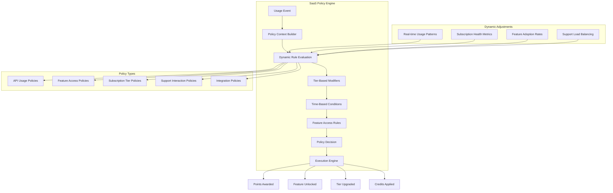

### SaaS Policy Engine Implementation

```typescript
class SaaSPolicyEngine implements IndustryPolicyEngine {
    private dynamicRules: Map<string, DynamicRule> = new Map();
    
    async initialize(): Promise<void> {
        // Load base SaaS policies
        await this.loadBasePolicies();
        
        // Initialize dynamic adjustments
        await this.initializeDynamicAdjustments();
        
        // Set up real-time monitoring
        await this.setupRealTimeMonitoring();
    }
    
    async evaluateUsagePolicy(context: SaaSPolicyContext): Promise<PolicyResult> {
        const policies = await this.getRelevantPolicies(context);
        const dynamicModifiers = await this.getDynamicModifiers(context);
        
        // Base policy evaluation
        let result = await this.evaluateBasePolicies(policies, context);
        
        // Apply dynamic modifiers
        result = await this.applyDynamicModifiers(result, dynamicModifiers);
        
        // Real-time optimization
        result = await this.optimizeForRealTime(result, context);
        
        return result;
    }
    
    private async getDynamicModifiers(context: SaaSPolicyContext): Promise<DynamicModifier[]> {
        const modifiers: DynamicModifier[] = [];
        
        // Usage pattern analysis
        const usagePattern = await this.analyzeUsagePattern(context.userId);
        if (usagePattern.isHighValue) {
            modifiers.push({
                type: 'POINTS_MULTIPLIER',
                value: 1.5,
                reason: 'high_value_user'
            });
        }
        
        // Feature adoption incentives
        const featureAdoption = await this.getFeatureAdoption(context.userId);
        if (featureAdoption.needsEncouragement) {
            modifiers.push({
                type: 'FEATURE_UNLOCK_BONUS',
                value: 500,
                reason: 'feature_adoption_incentive'
            });
        }
        
        // Subscription health
        const subscriptionHealth = await this.getSubscriptionHealth(context.userId);
        if (subscriptionHealth.risk === 'churn') {
            modifiers.push({
                type: 'RETENTION_BONUS',
                value: 1000,
                reason: 'churn_prevention'
            });
        }
        
        return modifiers;
    }
}
```

### SaaS Policy Workflow Example

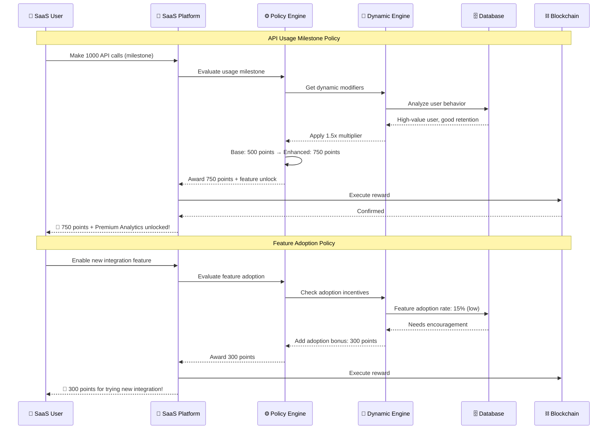

## 2. E-commerce Industry Policy Workflows

### Dynamic Engine: Commerce-Driven Policy Engine

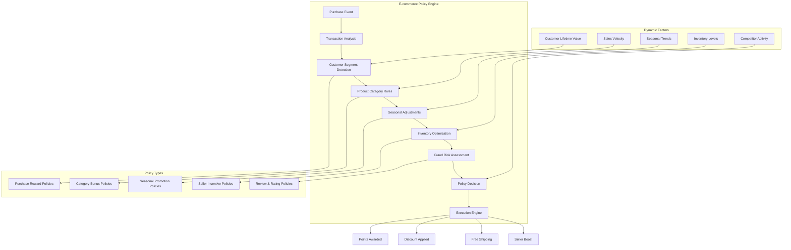

### E-commerce Policy Engine Implementation

```typescript
class EcommercePolicyEngine implements IndustryPolicyEngine {
    private marketDynamics: MarketDynamics;
    private inventoryOptimizer: InventoryOptimizer;
    private seasonalAdjuster: SeasonalAdjuster;
    
    async evaluateTransactionPolicy(context: EcommercePolicyContext): Promise<PolicyResult> {
        const transaction = context.transaction;
        
        // Base policy evaluation
        const baseReward = await this.calculateBaseReward(transaction);
        
        // Dynamic adjustments
        const dynamicModifiers = await this.getDynamicModifiers(context);
        
        // Apply all modifiers
        let finalReward = baseReward;
        for (const modifier of dynamicModifiers) {
            finalReward = await this.applyModifier(finalReward, modifier);
        }
        
        return {
            pointsAwarded: finalReward.points,
            bonuses: finalReward.bonuses,
            unlocks: finalReward.unlocks,
            reasoning: this.explainDecision(baseReward, dynamicModifiers)
        };
    }
    
    private async getDynamicModifiers(context: EcommercePolicyContext): Promise<DynamicModifier[]> {
        const modifiers: DynamicModifier[] = [];
        
        // Inventory optimization
        const inventoryStatus = await this.inventoryOptimizer.analyze(context.products);
        if (inventoryStatus.hasOverstock) {
            modifiers.push({
                type: 'INVENTORY_CLEARANCE',
                multiplier: 2.0,
                reason: 'help_clear_overstock'
            });
        }
        
        // Seasonal trends
        const seasonalFactor = await this.seasonalAdjuster.getFactor(context.timestamp);
        if (seasonalFactor > 1.0) {
            modifiers.push({
                type: 'SEASONAL_BONUS',
                multiplier: seasonalFactor,
                reason: 'seasonal_promotion'
            });
        }
        
        // Customer lifetime value
        const clv = await this.getCustomerLifetimeValue(context.customerId);
        if (clv.segment === 'high_value') {
            modifiers.push({
                type: 'VIP_TREATMENT',
                bonusPoints: 500,
                reason: 'high_value_customer'
            });
        }
        
        // New vs returning customer
        const customerType = await this.getCustomerType(context.customerId);
        if (customerType === 'new') {
            modifiers.push({
                type: 'NEW_CUSTOMER_BONUS',
                multiplier: 1.5,
                reason: 'welcome_bonus'
            });
        }
        
        return modifiers;
    }
}
```

### E-commerce Policy Workflow Example

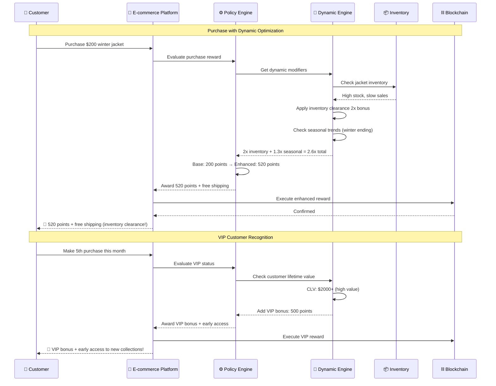

## 3. Cloud Infrastructure Policy Workflows

### Dynamic Engine: Resource Optimization Engine

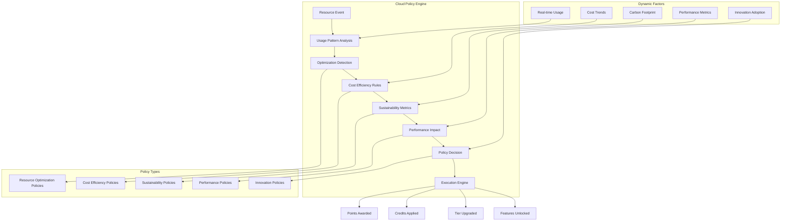

### Cloud Policy Engine Implementation

```typescript
class CloudPolicyEngine implements IndustryPolicyEngine {
    private optimizationDetector: OptimizationDetector;
    private costAnalyzer: CostAnalyzer;
    private sustainabilityTracker: SustainabilityTracker;
    
    async evaluateResourcePolicy(context: CloudPolicyContext): Promise<PolicyResult> {
        const optimization = await this.detectOptimization(context);
        const costImpact = await this.analyzeCostImpact(context);
        const sustainabilityImpact = await this.analyzeSustainability(context);
        
        return this.calculateRewards(optimization, costImpact, sustainabilityImpact);
    }
    
    private async detectOptimization(context: CloudPolicyContext): Promise<OptimizationResult> {
        const baseline = await this.optimizationDetector.getBaseline(context.userId);
        const current = await this.optimizationDetector.getCurrentMetrics(context.userId);
        
        return {
            costReduction: (baseline.cost - current.cost) / baseline.cost,
            performanceImprovement: current.performance / baseline.performance,
            resourceEfficiency: current.efficiency / baseline.efficiency,
            optimizationType: this.classifyOptimization(current, baseline)
        };
    }
    
    private async calculateRewards(
        optimization: OptimizationResult,
        costImpact: CostImpact,
        sustainabilityImpact: SustainabilityImpact
    ): Promise<PolicyResult> {
        let points = 0;
        const bonuses: string[] = [];
        
        // Cost optimization rewards
        if (optimization.costReduction > 0.1) {
            points += Math.floor(costImpact.savingsUSD * 10);
            bonuses.push('cost_optimization_master');
        }
        
        // Performance improvement rewards
        if (optimization.performanceImprovement > 1.05) {
            points += 500;
            bonuses.push('performance_enhancer');
        }
        
        // Sustainability bonuses
        if (sustainabilityImpact.carbonReduction > 0.05) {
            points += Math.floor(sustainabilityImpact.carbonReduction * 10000);
            bonuses.push('green_computing_champion');
        }
        
        // Innovation adoption
        if (optimization.optimizationType === 'innovative') {
            points *= 1.5;
            bonuses.push('innovation_adopter');
        }
        
        return {
            pointsAwarded: points,
            bonuses,
            reasoning: this.explainOptimization(optimization, costImpact, sustainabilityImpact)
        };
    }
}
```

### Cloud Policy Workflow Example

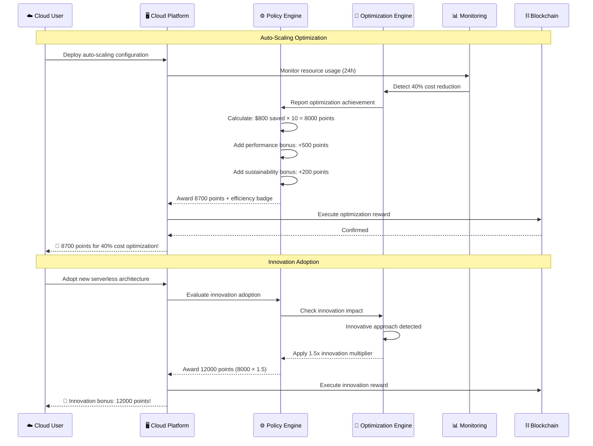

## 4. FinTech Industry Policy Workflows

### Dynamic Engine: Compliance-Aware Policy Engine

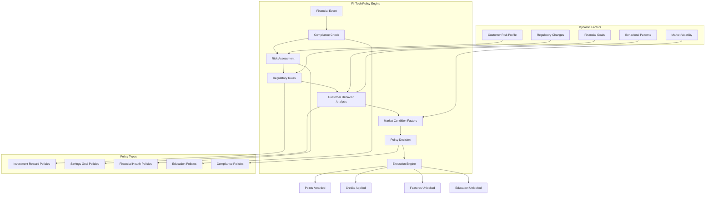

### FinTech Policy Engine Implementation

```typescript
class FinTechPolicyEngine implements IndustryPolicyEngine {
    private complianceChecker: ComplianceChecker;
    private riskAssessor: RiskAssessor;
    private behaviorAnalyzer: BehaviorAnalyzer;
    
    async evaluateFinancialPolicy(context: FinTechPolicyContext): Promise<PolicyResult> {
        // Compliance first
        const complianceResult = await this.complianceChecker.verify(context);
        if (!complianceResult.approved) {
            return {
                pointsAwarded: 0,
                blocked: true,
                reason: complianceResult.reason
            };
        }
        
        // Risk assessment
        const riskProfile = await this.riskAssessor.assess(context.userId);
        
        // Behavioral analysis
        const behaviorInsights = await this.behaviorAnalyzer.analyze(context.userId);
        
        return this.calculateFinancialRewards(context, riskProfile, behaviorInsights);
    }
    
    private async calculateFinancialRewards(
        context: FinTechPolicyContext,
        riskProfile: RiskProfile,
        behaviorInsights: BehaviorInsights
    ): Promise<PolicyResult> {
        let points = 0;
        const unlocks: string[] = [];
        
        // Investment behavior rewards
        if (context.eventType === 'investment' && behaviorInsights.isDiversified) {
            points += Math.floor(context.amount * 0.001); // 0.1% of investment
            unlocks.push('portfolio_analysis_tool');
        }
        
        // Savings goals
        if (context.eventType === 'savings_milestone') {
            points += behaviorInsights.goalProgress * 100;
            if (behaviorInsights.goalProgress >= 1.0) {
                unlocks.push('advanced_savings_strategies');
            }
        }
        
        // Financial health improvements
        if (behaviorInsights.creditScoreImprovement > 0) {
            points += behaviorInsights.creditScoreImprovement * 10;
            unlocks.push('credit_optimization_tools');
        }
        
        // Risk-adjusted bonuses
        if (riskProfile.level === 'conservative' && context.eventType === 'investment') {
            points *= 1.2; // Encourage conservative investors
        }
        
        return {
            pointsAwarded: points,
            unlocks,
            reasoning: this.explainFinancialReward(context, riskProfile, behaviorInsights)
        };
    }
}
```

### FinTech Policy Workflow Example

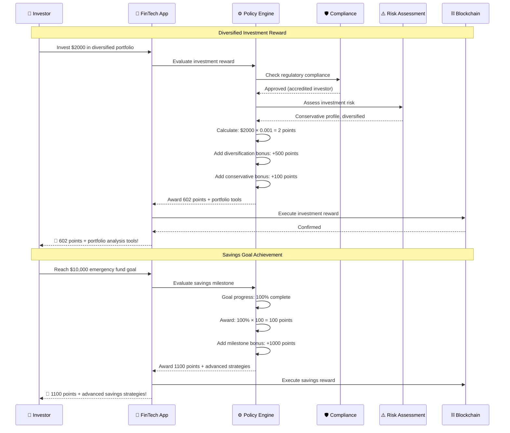

## 5. Gaming Industry Policy Workflows

### Dynamic Engine: Engagement-Driven Policy Engine

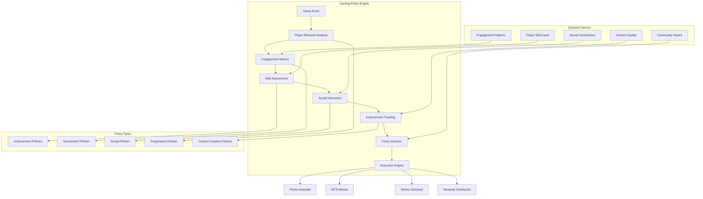

### Gaming Policy Engine Implementation

```typescript
class GamingPolicyEngine implements IndustryPolicyEngine {
    private skillAssessor: SkillAssessor;
    private engagementTracker: EngagementTracker;
    private socialAnalyzer: SocialAnalyzer;
    
    async evaluateGamePolicy(context: GamingPolicyContext): Promise<PolicyResult> {
        const playerProfile = await this.getPlayerProfile(context.playerId);
        const skillLevel = await this.skillAssessor.assess(context.playerId);
        const engagement = await this.engagementTracker.getMetrics(context.playerId);
        const socialImpact = await this.socialAnalyzer.analyzeSocialImpact(context.playerId);
        
        return this.calculateGamingRewards(context, playerProfile, skillLevel, engagement, socialImpact);
    }
    
    private async calculateGamingRewards(
        context: GamingPolicyContext,
        playerProfile: PlayerProfile,
        skillLevel: SkillLevel,
        engagement: EngagementMetrics,
        socialImpact: SocialImpact
    ): Promise<PolicyResult> {
        let points = 0;
        const nftRewards: NFTReward[] = [];
        const unlocks: string[] = [];
        
        // Achievement-based rewards
        if (context.eventType === 'achievement_unlocked') {
            const achievement = context.achievement;
            points += this.calculateAchievementPoints(achievement, skillLevel);
            
            if (achievement.rarity === 'legendary') {
                nftRewards.push({
                    type: 'achievement_nft',
                    metadata: achievement,
                    rarity: 'legendary'
                });
            }
        }
        
        // Tournament performance
        if (context.eventType === 'tournament_completion') {
            const tournamentReward = this.calculateTournamentReward(
                context.tournamentResult,
                skillLevel,
                engagement
            );
            points += tournamentReward.points;
            if (tournamentReward.nft) {
                nftRewards.push(tournamentReward.nft);
            }
        }
        
        // Social contribution rewards
        if (socialImpact.mentorshipScore > 0.8) {
            points += socialImpact.mentorshipScore * 500;
            unlocks.push('mentor_badge');
        }
        
        // Content creation rewards
        if (context.eventType === 'content_created') {
            const contentReward = this.calculateContentReward(
                context.content,
                socialImpact,
                engagement
            );
            points += contentReward.points;
            unlocks.push(...contentReward.unlocks);
        }
        
        return {
            pointsAwarded: points,
            nftRewards,
            unlocks,
            reasoning: this.explainGamingReward(context, playerProfile, skillLevel, engagement, socialImpact)
        };
    }
}
```

### Gaming Policy Workflow Example

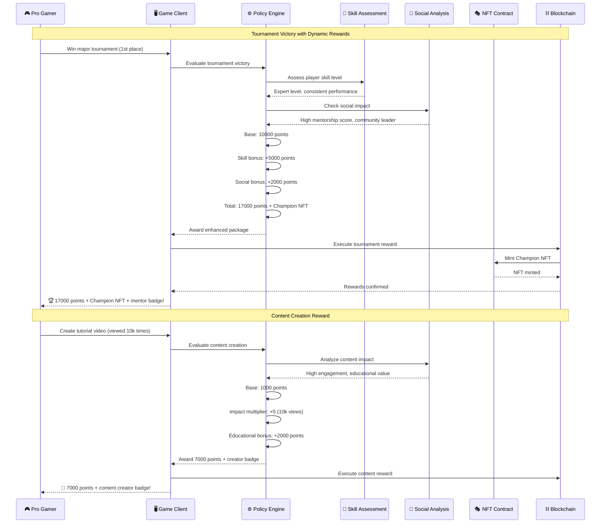

## 6. Cross-Industry Policy Orchestration

### Universal Policy Coordinator

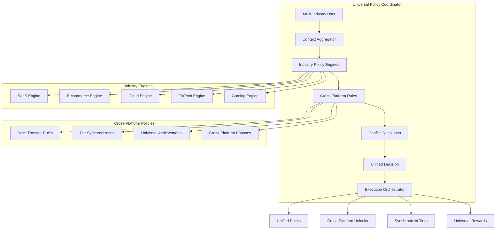

### Cross-Industry Policy Implementation

```typescript
class UniversalPolicyCoordinator {
    private industryEngines: Map<IndustryType, IndustryPolicyEngine>;
    private crossPlatformRules: CrossPlatformRules;
    private conflictResolver: ConflictResolver;
    
    async evaluateUniversalPolicy(contexts: MultiIndustryContext[]): Promise<UniversalPolicyResult> {
        const industryResults: Map<IndustryType, PolicyResult> = new Map();
        
        // Evaluate each industry context
        for (const context of contexts) {
            const engine = this.industryEngines.get(context.industry);
            const result = await engine.evaluate(context);
            industryResults.set(context.industry, result);
        }
        
        // Apply cross-platform rules
        const crossPlatformBonuses = await this.crossPlatformRules.evaluate(contexts);
        
        // Resolve conflicts
        const resolvedResults = await this.conflictResolver.resolve(industryResults, crossPlatformBonuses);
        
        // Generate unified result
        return this.generateUniversalResult(resolvedResults);
    }
    
    private async generateUniversalResult(results: Map<IndustryType, PolicyResult>): Promise<UniversalPolicyResult> {
        let totalPoints = 0;
        const allUnlocks: string[] = [];
        const allBonuses: string[] = [];
        
        // Aggregate all results
        for (const [industry, result] of results) {
            totalPoints += result.pointsAwarded;
            allUnlocks.push(...result.unlocks);
            allBonuses.push(...result.bonuses);
        }
        
        // Apply universal multipliers
        const universalMultiplier = await this.getUniversalMultiplier(results);
        totalPoints *= universalMultiplier;
        
        return {
            totalPoints,
            unlocks: allUnlocks,
            bonuses: allBonuses,
            industryBreakdown: results,
            universalMultiplier,
            reasoning: this.explainUniversalDecision(results)
        };
    }
}
```

## Best Practices for Policy Engine Implementation

### 1. **Performance Optimization**

```typescript
class PolicyEngineOptimizer {
    // Cache frequently accessed policies
    private policyCache: Map<string, Policy> = new Map();
    
    // Precompute common policy combinations
    private combinationCache: Map<string, PolicyResult> = new Map();
    
    // Batch policy evaluations
    async batchEvaluate(contexts: PolicyContext[]): Promise<PolicyResult[]> {
        const batches = this.groupContextsByType(contexts);
        const results = await Promise.all(
            batches.map(batch => this.evaluateBatch(batch))
        );
        return results.flat();
    }
    
    // Real-time policy updates
    async updatePolicyInRealTime(policyId: string, update: PolicyUpdate): Promise<void> {
        // Update policy without service restart
        await this.hotUpdatePolicy(policyId, update);
        
        // Invalidate related caches
        this.invalidateRelatedCaches(policyId);
        
        // Notify dependent systems
        await this.notifyPolicyUpdate(policyId, update);
    }
}
```

### 2. **Testing and Validation**

```typescript
class PolicyEngineValidator {
    async validatePolicyConfiguration(policy: Policy): Promise<ValidationResult> {
        const tests = [
            this.validateSyntax(policy),
            this.validateLogic(policy),
            this.validatePerformance(policy),
            this.validateCompliance(policy)
        ];
        
        const results = await Promise.all(tests);
        return this.aggregateValidationResults(results);
    }
    
    async runPolicySimulation(policy: Policy, scenarios: TestScenario[]): Promise<SimulationResult> {
        const results = [];
        
        for (const scenario of scenarios) {
            const result = await this.simulatePolicy(policy, scenario);
            results.push(result);
        }
        
        return this.analyzeSimulationResults(results);
    }
}
```

### 3. **Monitoring and Analytics**

```typescript
class PolicyEngineMonitor {
    async trackPolicyPerformance(policyId: string): Promise<PerformanceMetrics> {
        return {
            executionTime: await this.getAverageExecutionTime(policyId),
            successRate: await this.getSuccessRate(policyId),
            errorRate: await this.getErrorRate(policyId),
            resourceUsage: await this.getResourceUsage(policyId)
        };
    }
    
    async detectPolicyAnomalies(policyId: string): Promise<Anomaly[]> {
        const metrics = await this.collectMetrics(policyId);
        return this.anomalyDetector.detect(metrics);
    }
    
    async generatePolicyReport(period: TimePeriod): Promise<PolicyReport> {
        return {
            totalEvaluations: await this.getTotalEvaluations(period),
            topPerformingPolicies: await this.getTopPerformingPolicies(period),
            errorAnalysis: await this.analyzeErrors(period),
            recommendations: await this.generateRecommendations(period)
        };
    }
}
```

This comprehensive policy engine workflow system provides dynamic, industry-specific policy evaluation with real-time optimization, cross-platform coordination, and robust monitoring capabilities.