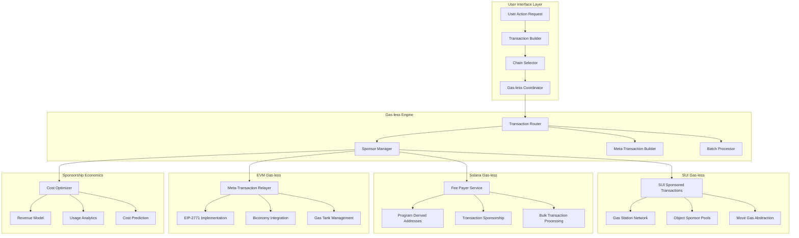

# Technical Implementation: Marketplace-Ready Multi-Service Architecture

## Overview

This document covers the comprehensive technical implementation of Ploy's marketplace-ready multi-service architecture, featuring dual storage systems (traditional and blockchain), dynamic field management, and gas-less transaction mechanisms. The platform's service-oriented design enables digital asset marketplaces from day one while providing seamless blockchain upgrade capabilities. The system prioritizes cost-effectiveness, flexibility, and marketplace readiness through optional blockchain features and sponsored transactions.

## Multi-Service Architecture Overview

### Service-Oriented Design Foundation

```typescript
// Core service interface that all services implement
interface IService {
  id: string;
  category: ServiceCategory;
  definition: ServiceDefinition;
  storage: IServiceStorage;
  marketplace: IMarketplaceProvider;
  
  // Service lifecycle
  initialize(config: ServiceConfig): Promise<void>;
  createInstance(data: ServiceInstanceData): Promise<ServiceInstance>;
  updateInstance(id: string, updates: Partial<ServiceInstanceData>): Promise<void>;
  deleteInstance(id: string): Promise<void>;
  
  // Marketplace operations
  listInMarketplace(instanceId: string, config: ListingConfig): Promise<Listing>;
  updateListing(listingId: string, updates: Partial<ListingConfig>): Promise<void>;
  removeListing(listingId: string): Promise<void>;
}

enum ServiceCategory {
  LOYALTY_PROGRAM = 'loyalty_program',
  NFT_COLLECTION = 'nft_collection',
  DIGITAL_REWARDS = 'digital_rewards',
  EXPERIENCE_PACKAGES = 'experience_packages',
  SUBSCRIPTION_TIERS = 'subscription_tiers',
  ACHIEVEMENT_BADGES = 'achievement_badges',
  MEMBERSHIP_TOKENS = 'membership_tokens',
  UTILITY_ASSETS = 'utility_assets'
}
```

### Dynamic Field System

```typescript
// Dynamic field engine for runtime schema extension
interface DynamicFieldEngine {
  // Field definition management
  createField(serviceId: string, field: DynamicFieldDefinition): Promise<void>;
  updateField(serviceId: string, fieldId: string, updates: Partial<DynamicFieldDefinition>): Promise<void>;
  deleteField(serviceId: string, fieldId: string): Promise<void>;
  
  // Field value operations
  setFieldValue(instanceId: string, fieldId: string, value: any): Promise<void>;
  getFieldValue(instanceId: string, fieldId: string): Promise<any>;
  validateFieldValue(fieldId: string, value: any): Promise<ValidationResult>;
  
  // Marketplace integration
  getMarketplaceFields(serviceId: string): Promise<DynamicFieldDefinition[]>;
  updateMarketplaceIndex(instanceId: string, fields: Record<string, any>): Promise<void>;
}

interface DynamicFieldDefinition {
  id: string;
  name: string;
  type: FieldType;
  required: boolean;
  defaultValue?: any;
  validation: ValidationRule[];
  
  // Database configuration
  indexed: boolean;
  searchable: boolean;
  
  // Marketplace configuration
  marketplace: {
    displayInListing: boolean;
    filterField: boolean;
    sortField: boolean;
    primaryAttribute: boolean;
    priceInfluencer: boolean;
  };
  
  // UI configuration
  ui: {
    displayName: string;
    description?: string;
    inputType: UIInputType;
    options?: string[];
    validation: UIValidationRule[];
  };
}
```

### Marketplace Service Implementation

```typescript
// Marketplace service for digital asset trading
interface IMarketplaceService extends IService {
  // Listing management
  createListing(asset: ServiceInstance, config: ListingConfig): Promise<Listing>;
  updateListing(listingId: string, updates: Partial<ListingConfig>): Promise<void>;
  removeListing(listingId: string): Promise<void>;
  
  // Trading operations
  makeBid(listingId: string, bidDetails: BidDetails): Promise<Bid>;
  acceptBid(listingId: string, bidId: string): Promise<Transaction>;
  executeDirectPurchase(listingId: string, buyerInfo: BuyerInfo): Promise<Transaction>;
  
  // Search and discovery
  searchListings(query: SearchQuery): Promise<SearchResult[]>;
  getRecommendations(userId: string, context: RecommendationContext): Promise<Listing[]>;
  
  // Analytics
  getMarketAnalytics(timeframe: TimeRange): Promise<MarketAnalytics>;
  getPriceHistory(assetId: string): Promise<PriceHistoryPoint[]>;
}

class MarketplaceServiceImpl implements IMarketplaceService {
  constructor(
    private storage: IServiceStorage,
    private searchEngine: SearchEngine,
    private pricingEngine: PricingEngine,
    private eventBus: EventBus
  ) {}
  
  async createListing(
    asset: ServiceInstance, 
    config: ListingConfig
  ): Promise<Listing> {
    // Validate asset ownership and transferability
    await this.validateAssetForListing(asset);
    
    // Calculate dynamic pricing if enabled
    let suggestedPrice;
    if (config.useDynamicPricing) {
      suggestedPrice = await this.pricingEngine.calculateOptimalPrice(asset);
    }
    
    // Create listing record
    const listing: Listing = {
      id: generateId(),
      assetId: asset.id,
      sellerId: asset.ownerId,
      listingType: config.type,
      price: config.price || suggestedPrice,
      startTime: config.startTime || new Date(),
      endTime: config.endTime,
      status: 'active',
      metadata: config.metadata,
      createdAt: new Date()
    };
    
    // Store in appropriate storage mode
    if (this.storage.storageType === 'blockchain') {
      await this.createBlockchainListing(listing, asset);
    } else {
      await this.createTraditionalListing(listing, asset);
    }
    
    // Index for search
    await this.searchEngine.indexListing(listing, asset);
    
    // Emit marketplace event
    await this.eventBus.emit('marketplace.listing.created', {
      listing,
      asset,
      seller: await this.getUserInfo(asset.ownerId)
    });
    
    return listing;
  }
  
  private async validateAssetForListing(asset: ServiceInstance): Promise<void> {
    // Check ownership
    if (!asset.ownerId) {
      throw new MarketplaceError('Asset has no owner');
    }
    
    // Check transferability
    if (!asset.marketplace?.transferable) {
      throw new MarketplaceError('Asset is not transferable');
    }
    
    // Check if already listed
    const existingListing = await this.getActiveListingForAsset(asset.id);
    if (existingListing) {
      throw new MarketplaceError('Asset is already listed');
    }
    
    // Validate custom field constraints
    await this.validateMarketplaceConstraints(asset);
  }
}
```

## Flexible Storage Architecture

### Storage Mode Selection

```typescript
// Universal storage interface for multi-service architecture
interface IServiceStorage {
  // Service instance operations
  createServiceInstance(serviceId: string, data: ServiceInstanceData): Promise<ServiceInstance>;
  updateServiceInstance(instanceId: string, updates: Partial<ServiceInstanceData>): Promise<void>;
  deleteServiceInstance(instanceId: string): Promise<void>;
  getServiceInstance(instanceId: string): Promise<ServiceInstance>;
  queryServiceInstances(serviceId: string, filters: QueryFilter[]): Promise<ServiceInstance[]>;
  
  // Dynamic field operations
  setCustomField(instanceId: string, fieldId: string, value: any): Promise<void>;
  getCustomField(instanceId: string, fieldId: string): Promise<any>;
  queryByCustomField(serviceId: string, fieldId: string, value: any): Promise<ServiceInstance[]>;
  
  // Marketplace operations
  createMarketplaceListing(listing: Listing): Promise<void>;
  updateMarketplaceListing(listingId: string, updates: Partial<Listing>): Promise<void>;
  getMarketplaceListings(filters: ListingFilter[]): Promise<Listing[]>;
  
  // Transaction and ownership
  transferOwnership(instanceId: string, fromUser: string, toUser: string): Promise<TransferResult>;
  recordTransaction(transaction: Transaction): Promise<void>;
  getTransactionHistory(instanceId: string): Promise<Transaction[]>;
  
  // Storage type identification
  readonly storageType: 'traditional' | 'blockchain' | 'hybrid';
  readonly capabilities: StorageCapability[];
}

// Legacy loyalty storage interface (extends service storage)
interface ILoyaltyStorage extends IServiceStorage {
  // Legacy loyalty operations for backward compatibility
  createUser(user: CreateUserInput): Promise<User>;
  awardPoints(userId: string, points: number, metadata: PointsMetadata): Promise<Transaction>;
  redeemPoints(userId: string, amount: number, redemption: RedemptionData): Promise<Redemption>;
  getUserBalance(userId: string): Promise<Balance>;
  getTransactionHistory(userId: string, filters?: TransactionFilter): Promise<Transaction[]>;
  
  // NFT operations (simulated in traditional, real in blockchain)
  createNFTReward?(nftData: NFTData): Promise<NFTResult>;
  transferNFT?(fromUser: string, toUser: string, nftId: string): Promise<TransferResult>;
}

// Tenant configuration determines storage mode
interface TenantConfig {
  tenantId: string;
  storageMode: 'traditional' | 'blockchain' | 'hybrid';
  
  // Traditional storage settings
  traditional?: {
    performanceLevel: 'basic' | 'premium';
    backupFrequency: 'hourly' | 'daily';
    retentionPeriod: number; // days
  };
  
  // Blockchain storage settings
  blockchain?: {
    preferredChains: string[]; // ['sui', 'solana', 'polygon']
    gasSponsorship: boolean;
    fallbackToTraditional: boolean;
    autoMigration: boolean;
  };
  
  // Cost optimization settings
  costLimits: {
    maxMonthlyCost: number;
    autoOptimize: boolean;
    alertThreshold: number;
  };
}
```

### Traditional Storage Implementation

```typescript
class TraditionalLoyaltyStorage implements ILoyaltyStorage {
  readonly storageType = 'traditional';
  readonly capabilities = [
    StorageCapability.INSTANT_TRANSACTIONS,
    StorageCapability.LOW_COST,
    StorageCapability.HIGH_THROUGHPUT,
    StorageCapability.CUSTOM_QUERIES
  ];
  
  private database: PostgreSQLDatabase;
  private cache: RedisCache;
  
  async awardPoints(userId: string, points: number, metadata: PointsMetadata): Promise<Transaction> {
    // Fast database transaction
    return await this.database.transaction(async (tx) => {
      // Update user balance
      const updatedUser = await tx.query(
        `UPDATE users 
         SET points_balance = points_balance + $1,
             lifetime_points = lifetime_points + $1,
             updated_at = NOW()
         WHERE id = $2
         RETURNING *`,
        [points, userId]
      );
      
      // Record transaction
      const transaction = await tx.query(
        `INSERT INTO transactions 
         (user_id, type, amount, metadata, status, created_at)
         VALUES ($1, 'points_award', $2, $3, 'completed', NOW())
         RETURNING *`,
        [userId, points, metadata]
      );
      
      // Update cache
      await this.cache.invalidate(`user:${userId}`);
      
      // Emit event for real-time updates
      await this.eventBus.emit('points.awarded', {
        userId,
        points,
        newBalance: updatedUser.rows[0].points_balance,
        transaction: transaction.rows[0]
      });
      
      return transaction.rows[0];
    });
  }
  
  async createNFTReward(nftData: NFTData): Promise<NFTResult> {
    // Simulated NFT in database (no blockchain costs)
    const nft = await this.database.query(
      `INSERT INTO nft_rewards 
       (user_id, name, description, image_url, metadata, rarity, is_blockchain)
       VALUES ($1, $2, $3, $4, $5, $6, false)
       RETURNING *`,
      [nftData.userId, nftData.name, nftData.description, 
       nftData.imageUrl, nftData.metadata, nftData.rarity]
    );
    
    return {
      id: nft.rows[0].id,
      displayId: `PLOY-${nft.rows[0].id.substring(0, 8)}`,
      ...nft.rows[0],
      isBlockchain: false,
      canUpgradeToBlockchain: true,
      estimatedMintCost: '$0.50 - $2.00'
    };
  }
}
```

### Blockchain Storage Implementation

```typescript
class BlockchainLoyaltyStorage implements ILoyaltyStorage {
  readonly storageType = 'blockchain';
  readonly capabilities = [
    StorageCapability.TRUE_OWNERSHIP,
    StorageCapability.CROSS_CHAIN,
    StorageCapability.NFT_TRADING,
    StorageCapability.IMMUTABLE_RECORDS,
    StorageCapability.GAS_SPONSORSHIP
  ];
  
  private chainManager: MultiChainManager;
  private database: PostgreSQLDatabase; // Still needed for indexing
  private fallbackStorage: TraditionalLoyaltyStorage;
  
  async awardPoints(userId: string, points: number, metadata: PointsMetadata): Promise<Transaction> {
    try {
      // Select optimal chain
      const chain = await this.chainManager.selectOptimalChain({
        operation: 'points_award',
        urgency: metadata.urgency || 'normal',
        userPreference: await this.getUserChainPreference(userId)
      });
      
      // Execute blockchain transaction
      const blockchainTx = await this.chainManager.executeTransaction(chain, {
        type: 'award_points',
        recipient: await this.getUserBlockchainAddress(userId),
        amount: points,
        metadata,
        gasless: true // Always sponsor gas
      });
      
      // Also store in traditional DB for fast queries
      const dbRecord = await this.database.query(
        `INSERT INTO transactions 
         (user_id, type, amount, blockchain_tx_hash, chain_id, status)
         VALUES ($1, 'points_award', $2, $3, $4, 'confirmed')
         RETURNING *`,
        [userId, points, blockchainTx.hash, chain]
      );
      
      return {
        ...dbRecord.rows[0],
        blockchainTx,
        gasSponsored: true
      };
      
    } catch (error) {
      // Fallback to traditional if blockchain fails
      if (this.config.fallbackToTraditional) {
        console.warn('Blockchain transaction failed, using fallback:', error);
        return await this.fallbackStorage.awardPoints(userId, points, {
          ...metadata,
          fallbackReason: error.message
        });
      }
      throw error;
    }
  }
}
```

### Seamless Migration Service

```typescript
class StorageMigrationService {
  async migrateToBlockchain(
    tenantId: string,
    strategy: 'gradual' | 'bulk' | 'new_only'
  ): Promise<MigrationResult> {
    const tenant = await this.getTenant(tenantId);
    
    switch (strategy) {
      case 'gradual':
        // Migrate users in batches over time
        return await this.gradualMigration(tenant);
        
      case 'bulk':
        // Migrate all at once (for smaller datasets)
        return await this.bulkMigration(tenant);
        
      case 'new_only':
        // Only new transactions on blockchain
        return await this.newOnlyMigration(tenant);
    }
  }
  
  private async gradualMigration(tenant: Tenant): Promise<MigrationResult> {
    // Enable dual-write mode
    await this.enableDualWriteMode(tenant.id);
    
    // Migrate historical data in batches
    const users = await this.getUsersForMigration(tenant.id);
    const batchSize = 100;
    const results = [];
    
    for (let i = 0; i < users.length; i += batchSize) {
      const batch = users.slice(i, i + batchSize);
      const batchResult = await this.migrateBatch(batch);
      results.push(batchResult);
      
      // Update progress
      await this.updateMigrationProgress(tenant.id, (i + batch.length) / users.length);
      
      // Rate limiting
      await this.delay(5000); // 5 seconds between batches
    }
    
    // Switch to blockchain-primary mode
    await this.switchToBlockchainPrimary(tenant.id);
    
    return {
      success: true,
      migratedUsers: users.length,
      migrationTime: Date.now() - startTime,
      results
    };
  }
}
```

## Gas-less Transaction Architecture (Blockchain Mode)



## SUI Gas-less Implementation

### SUI Native Sponsored Transactions

```move
module gasless::sponsored_loyalty {
    use sui::coin::{Self, Coin};
    use sui::transfer;
    use sui::tx_context::{Self, TxContext};
    use sui::object::{Self, UID};
    use loyalty_platform::loyalty_token::LOYALTY_TOKEN;
    
    /// Gas sponsor capability
    struct GasSponsorCap has key, store {
        id: UID,
        sponsor: address,
        daily_limit: u64,
        used_today: u64,
        last_reset: u64,
    }
    
    /// Sponsored transaction record
    struct SponsoredTransaction has key, store {
        id: UID,
        user: address,
        sponsor: address,
        gas_used: u64,
        transaction_type: vector<u8>,
        timestamp: u64,
    }
    
    /// Gas station for automatic sponsoring
    struct GasStation has key, store {
        id: UID,
        treasury: Coin<sui::sui::SUI>,
        sponsors: vector<address>,
        auto_sponsor_enabled: bool,
        min_balance_threshold: u64,
    }
    
    /// Initialize gas sponsoring system
    fun init(ctx: &mut TxContext) {
        let gas_station = GasStation {
            id: object::new(ctx),
            treasury: coin::zero(ctx),
            sponsors: vector::empty(),
            auto_sponsor_enabled: true,
            min_balance_threshold: 1000000, // 0.001 SUI
        };
        
        transfer::share_object(gas_station);
    }
    
    /// Sponsor a loyalty transaction (gas-less for user)
    public entry fun sponsor_loyalty_transaction<T>(
        gas_station: &mut GasStation,
        sponsor_cap: &mut GasSponsorCap,
        user: address,
        amount: u64,
        transaction_type: vector<u8>,
        ctx: &mut TxContext
    ) {
        // Check sponsor limits
        let current_epoch = tx_context::epoch(ctx);
        if (sponsor_cap.last_reset < current_epoch) {
            sponsor_cap.used_today = 0;
            sponsor_cap.last_reset = current_epoch;
        };
        
        assert!(sponsor_cap.used_today < sponsor_cap.daily_limit, 0);
        
        // Record sponsorship
        let sponsored_tx = SponsoredTransaction {
            id: object::new(ctx),
            user,
            sponsor: sponsor_cap.sponsor,
            gas_used: tx_context::gas_used(ctx),
            transaction_type,
            timestamp: tx_context::epoch_timestamp_ms(ctx),
        };
        
        sponsor_cap.used_today = sponsor_cap.used_today + 1;
        
        transfer::transfer(sponsored_tx, user);
    }
    
    /// Auto-sponsor transaction based on user tier
    public entry fun auto_sponsor_by_tier(
        gas_station: &mut GasStation,
        user: address,
        user_tier: u8,
        transaction_type: vector<u8>,
        ctx: &mut TxContext
    ) {
        assert!(gas_station.auto_sponsor_enabled, 1);
        
        // Higher tiers get more sponsorship
        let sponsor_eligible = match user_tier {
            4 => true,  // Platinum - always sponsored
            3 => true,  // Gold - always sponsored
            2 => tx_context::epoch(ctx) % 2 == 0, // Silver - 50% chance
            1 => tx_context::epoch(ctx) % 4 == 0, // Bronze - 25% chance
            _ => false  // Basic - no sponsorship
        };
        
        assert!(sponsor_eligible, 2);
        
        // Check gas station balance
        let gas_balance = coin::value(&gas_station.treasury);
        assert!(gas_balance > gas_station.min_balance_threshold, 3);
        
        // Record auto-sponsorship
        let sponsored_tx = SponsoredTransaction {
            id: object::new(ctx),
            user,
            sponsor: @gas_station_admin,
            gas_used: tx_context::gas_used(ctx),
            transaction_type,
            timestamp: tx_context::epoch_timestamp_ms(ctx),
        };
        
        transfer::transfer(sponsored_tx, user);
    }
}
```

### SUI Gas Station Network Service

```typescript
class SUIGasStationNetwork {
    private suiClient: SuiClient;
    private gasStationKeypair: Ed25519Keypair;
    private sponsorPool: Map<string, SponsorConfig>;
    private costTracker: CostTracker;
    
    async sponsorUserTransaction(
        userAddress: string,
        transactionIntent: TransactionIntent
    ): Promise<SponsoredTransactionResult> {
        try {
            // Check if user is eligible for sponsorship
            const eligibility = await this.checkSponsorshipEligibility(
                userAddress,
                transactionIntent
            );
            
            if (!eligibility.eligible) {
                return {
                    success: false,
                    reason: eligibility.reason,
                    userMustPayGas: true
                };
            }
            
            // Build transaction block
            const txb = new TransactionBlock();
            
            // Add the loyalty transaction
            this.addLoyaltyTransaction(txb, transactionIntent);
            
            // Gas station pays for gas
            txb.setSender(userAddress);
            txb.setGasOwner(this.gasStationKeypair.getPublicKey().toSuiAddress());
            txb.setGasBudget(10000000); // 0.01 SUI
            
            // Execute transaction
            const result = await this.suiClient.signAndExecuteTransactionBlock({
                transactionBlock: txb,
                signer: this.gasStationKeypair,
                options: {
                    showEffects: true,
                    showEvents: true,
                    showObjectChanges: true
                }
            });
            
            // Track costs
            const gasCost = this.extractGasCost(result);
            await this.costTracker.recordSponsoredTransaction({
                userAddress,
                gasCost,
                transactionType: transactionIntent.type,
                timestamp: new Date()
            });
            
            return {
                success: true,
                transactionDigest: result.digest,
                gasCost: 0, // User pays nothing
                sponsorCost: gasCost,
                events: result.events
            };
            
        } catch (error) {
            return {
                success: false,
                error: error.message,
                userMustPayGas: true
            };
        }
    }
    
    private async checkSponsorshipEligibility(
        userAddress: string,
        transactionIntent: TransactionIntent
    ): Promise<EligibilityResult> {
        // Check user tier
        const userTier = await this.getUserTier(userAddress);
        
        // Check daily sponsorship limits
        const dailyUsage = await this.getDailySponsorshipUsage(userAddress);
        const dailyLimit = this.getDailyLimitByTier(userTier);
        
        if (dailyUsage >= dailyLimit) {
            return {
                eligible: false,
                reason: 'Daily sponsorship limit exceeded'
            };
        }
        
        return { eligible: true };
    }
}
```

## Solana Gas-less Implementation

### Enhanced Solana Fee Payer Service

```rust
use anchor_lang::prelude::*;
use anchor_spl::token::{self, Token, TokenAccount, Transfer};

declare_id!("GaslessLoyalty1111111111111111111111111111");

#[program]
pub mod gasless_loyalty {
    use super::*;

    pub fn initialize_fee_payer_service(
        ctx: Context<InitializeFeePayerService>,
        daily_limits: Vec<u64>, // Limits by tier
        auto_sponsor_enabled: bool,
    ) -> Result<()> {
        let fee_payer_service = &mut ctx.accounts.fee_payer_service;
        fee_payer_service.authority = ctx.accounts.authority.key();
        fee_payer_service.treasury = ctx.accounts.treasury.key();
        fee_payer_service.daily_limits = daily_limits;
        fee_payer_service.auto_sponsor_enabled = auto_sponsor_enabled;
        fee_payer_service.total_sponsored = 0;
        fee_payer_service.daily_sponsored = 0;
        fee_payer_service.last_reset = Clock::get()?.unix_timestamp;
        
        Ok(())
    }

    pub fn sponsor_loyalty_transaction(
        ctx: Context<SponsorLoyaltyTransaction>,
        amount: u64,
        transaction_type: String,
        industry: String,
    ) -> Result<()> {
        let fee_payer_service = &mut ctx.accounts.fee_payer_service;
        let user_account = &mut ctx.accounts.user_account;
        
        // Check and reset daily limits
        let current_time = Clock::get()?.unix_timestamp;
        if current_time - fee_payer_service.last_reset > 86400 { // 24 hours
            fee_payer_service.daily_sponsored = 0;
            fee_payer_service.last_reset = current_time;
        }
        
        // Check sponsorship eligibility
        let user_tier = user_account.tier_level as usize;
        let daily_limit = fee_payer_service.daily_limits.get(user_tier).unwrap_or(&0);
        
        require!(
            user_account.daily_sponsored < *daily_limit,
            GaslessError::DailySponsorshipLimitExceeded
        );
        
        // Update user account
        user_account.points_balance += amount;
        user_account.tier_level = calculate_tier(user_account.points_balance);
        user_account.last_activity = current_time;
        user_account.daily_sponsored += 1;
        
        // Update service metrics
        fee_payer_service.total_sponsored += 1;
        fee_payer_service.daily_sponsored += 1;
        
        emit!(SponsoredTransactionEvent {
            user: ctx.accounts.user.key(),
            amount,
            transaction_type,
            industry,
            sponsor: fee_payer_service.authority,
            gas_cost: 5000, // Estimated lamports
            timestamp: current_time,
        });
        
        Ok(())
    }

    pub fn batch_sponsor_transactions(
        ctx: Context<BatchSponsorTransactions>,
        recipients: Vec<Pubkey>,
        amounts: Vec<u64>,
        transaction_types: Vec<String>,
    ) -> Result<()> {
        let fee_payer_service = &mut ctx.accounts.fee_payer_service;
        
        require!(
            recipients.len() == amounts.len() && amounts.len() == transaction_types.len(),
            GaslessError::InvalidBatchData
        );
        
        require!(
            recipients.len() <= 20, // Batch size limit
            GaslessError::BatchSizeTooLarge
        );
        
        let current_time = Clock::get()?.unix_timestamp;
        let total_transactions = recipients.len() as u64;
        
        // Update service metrics
        fee_payer_service.total_sponsored += total_transactions;
        fee_payer_service.daily_sponsored += total_transactions;
        
        emit!(BatchSponsoredEvent {
            sponsor: fee_payer_service.authority,
            batch_size: total_transactions,
            total_gas_cost: 5000 * total_transactions, // Estimated
            timestamp: current_time,
        });
        
        Ok(())
    }
}

#[account]
pub struct FeePayerService {
    pub authority: Pubkey,
    pub treasury: Pubkey,
    pub daily_limits: Vec<u64>, // Daily sponsorship limits by tier
    pub auto_sponsor_enabled: bool,
    pub total_sponsored: u64,
    pub daily_sponsored: u64,
    pub last_reset: i64,
}

#[account]
pub struct UserAccount {
    pub owner: Pubkey,
    pub points_balance: u64,
    pub tier_level: u8,
    pub last_activity: i64,
    pub daily_sponsored: u64,
    pub total_sponsored: u64,
}

fn calculate_tier(points: u64) -> u8 {
    match points {
        100_000.. => 4,
        50_000..=99_999 => 3,
        10_000..=49_999 => 2,
        1_000..=9_999 => 1,
        _ => 0,
    }
}
```

## EVM Meta-Transaction Implementation

### EIP-2771 Meta-Transaction Support

```solidity
// SPDX-License-Identifier: MIT
pragma solidity ^0.8.19;

import "@openzeppelin/contracts/metatx/ERC2771Context.sol";
import "@openzeppelin/contracts/access/Ownable.sol";
import "@openzeppelin/contracts/security/ReentrancyGuard.sol";

contract LoyaltyPlatformMetaTx is ERC2771Context, Ownable, ReentrancyGuard {
    struct MetaTxConfig {
        address[] trustedForwarders;
        mapping(address => bool) isTrustedForwarder;
        uint256 gaslessLimit; // Max gas-less transactions per day per user
        uint256 feeRate; // Fee rate in basis points
        bool enabled;
    }
    
    struct UserGaslessData {
        uint256 dailyCount;
        uint256 lastResetDay;
        uint256 totalSponsored;
        uint8 tier;
    }
    
    MetaTxConfig private metaTxConfig;
    mapping(address => UserGaslessData) public userGaslessData;
    mapping(address => uint256) public relayerBalances;
    
    event MetaTransactionExecuted(
        address indexed user,
        address indexed relayer,
        bytes functionSignature,
        uint256 gasUsed,
        bool success
    );
    
    event GaslessTransactionSponsored(
        address indexed user,
        uint256 gasUsed,
        uint256 fee,
        address sponsor
    );
    
    modifier onlyTrustedForwarder() {
        require(
            metaTxConfig.isTrustedForwarder[msg.sender],
            "Not a trusted forwarder"
        );
        _;
    }
    
    function executeMetaTransaction(
        address user,
        bytes calldata functionSignature,
        uint256 gasLimit
    ) external onlyTrustedForwarder nonReentrant returns (bool success, bytes memory returnData) {
        require(metaTxConfig.enabled, "Meta transactions disabled");
        
        uint256 initialGas = gasleft();
        
        // Check if user is eligible for gas-less transaction
        if (isEligibleForGasless(user)) {
            updateGaslessUsage(user);
            
            // Execute transaction with gas sponsorship
            (success, returnData) = address(this).call{gas: gasLimit}(
                abi.encodePacked(functionSignature, user)
            );
            
            uint256 gasUsed = initialGas - gasleft();
            
            emit GaslessTransactionSponsored(
                user,
                gasUsed,
                0, // No fee for sponsored transaction
                msg.sender
            );
        } else {
            // Execute transaction with fee collection
            uint256 estimatedGas = gasLimit;
            uint256 fee = calculateMetaTxFee(estimatedGas);
            
            // Deduct fee from user's balance or token allowance
            require(deductMetaTxFee(user, fee), "Insufficient balance for fee");
            
            (success, returnData) = address(this).call{gas: gasLimit}(
                abi.encodePacked(functionSignature, user)
            );
        }
        
        emit MetaTransactionExecuted(
            user,
            msg.sender,
            functionSignature,
            initialGas - gasleft(),
            success
        );
    }
    
    function isEligibleForGasless(address user) public view returns (bool) {
        UserGaslessData memory userData = userGaslessData[user];
        
        // Check daily limit
        uint256 currentDay = block.timestamp / 1 days;
        if (userData.lastResetDay < currentDay) {
            return true; // New day, user gets fresh limit
        }
        
        uint256 dailyLimit = getDailyGaslessLimit(userData.tier);
        return userData.dailyCount < dailyLimit;
    }
    
    function getDailyGaslessLimit(uint8 tier) public pure returns (uint256) {
        if (tier >= 4) return 100; // Platinum+
        if (tier >= 3) return 50;  // Gold
        if (tier >= 2) return 20;  // Silver
        if (tier >= 1) return 5;   // Bronze
        return 0; // Basic
    }
}
```

## Platform Flexibility Framework

### Configuration-Driven Architecture

```typescript
interface TenantConfiguration {
  // Basic Settings
  branding: {
    logo: string;
    primaryColor: string;
    secondaryColor: string;
    customCSS?: string;
    emailTemplates: Map<string, EmailTemplate>;
  };
  
  // Business Rules
  loyaltyProgram: {
    pointsCalculation: PointsCalculationStrategy;
    tierSystem: TierConfiguration;
    expirationPolicy: ExpirationPolicy;
    specialRules: CustomRule[];
  };
  
  // Feature Toggles
  features: {
    nftMembership: boolean;
    referralProgram: boolean;
    gamification: boolean;
    socialSharing: boolean;
    advancedAnalytics: boolean;
  };
  
  // Integration Settings
  integrations: {
    paymentGateways: PaymentGateway[];
    shippingProviders: ShippingProvider[];
    marketingTools: MarketingIntegration[];
    customWebhooks: WebhookEndpoint[];
  };
}
```

### Dynamic Feature Modules

```typescript
class DynamicFeatureLoader {
  private featureRegistry: Map<string, FeatureModule> = new Map();
  
  async loadFeatures(tenant: Tenant): Promise<void> {
    const enabledFeatures = await this.getEnabledFeatures(tenant.id);
    
    for (const feature of enabledFeatures) {
      if (this.featureRegistry.has(feature.name)) {
        const module = this.featureRegistry.get(feature.name);
        await module.initialize(tenant, feature.config);
      }
    }
  }
  
  registerFeature(name: string, module: FeatureModule): void {
    this.featureRegistry.set(name, module);
  }
}

// Example: Gamification Module
class GamificationModule implements FeatureModule {
  async initialize(tenant: Tenant, config: GamificationConfig): Promise<void> {
    // Set up achievements
    await this.setupAchievements(tenant.id, config.achievements);
    
    // Configure leaderboards
    await this.configureLeaderboards(tenant.id, config.leaderboards);
    
    // Enable badges
    await this.enableBadges(tenant.id, config.badges);
  }
}
```

### Rule Engine System

```typescript
interface BusinessRule {
  id: string;
  name: string;
  description: string;
  trigger: RuleTrigger;
  conditions: RuleCondition[];
  actions: RuleAction[];
  priority: number;
  enabled: boolean;
}

class FlexibleRuleEngine {
  async evaluateRules(
    event: BusinessEvent,
    context: RuleContext
  ): Promise<RuleExecutionResult[]> {
    // Get applicable rules
    const rules = await this.getApplicableRules(
      event.type,
      context.tenantId
    );
    
    // Sort by priority
    const sortedRules = rules.sort((a, b) => b.priority - a.priority);
    
    const results: RuleExecutionResult[] = [];
    
    for (const rule of sortedRules) {
      if (!rule.enabled) continue;
      
      // Evaluate conditions
      const conditionsMet = await this.evaluateConditions(
        rule.conditions,
        context
      );
      
      if (conditionsMet) {
        // Execute actions
        const actionResults = await this.executeActions(
          rule.actions,
          context
        );
        
        results.push({
          ruleId: rule.id,
          executed: true,
          actions: actionResults
        });
        
        // Check if rule stops further processing
        if (rule.stopProcessing) break;
      }
    }
    
    return results;
  }
}
```

### Workflow Customization

```typescript
interface WorkflowDefinition {
  id: string;
  name: string;
  trigger: WorkflowTrigger;
  nodes: WorkflowNode[];
  connections: WorkflowConnection[];
  variables: WorkflowVariable[];
}

class WorkflowExecutor {
  async executeWorkflow(
    workflow: WorkflowDefinition,
    context: WorkflowContext
  ): Promise<WorkflowResult> {
    const execution = new WorkflowExecution(workflow, context);
    
    // Start from trigger node
    const startNode = this.findStartNode(workflow);
    
    // Execute nodes recursively
    await this.executeNode(startNode, execution);
    
    return execution.getResult();
  }
  
  private async executeNode(
    node: WorkflowNode,
    execution: WorkflowExecution
  ): Promise<void> {
    switch (node.type) {
      case 'condition':
        const result = await this.evaluateCondition(node, execution);
        const nextNode = result ? node.trueBranch : node.falseBranch;
        if (nextNode) await this.executeNode(nextNode, execution);
        break;
        
      case 'action':
        await this.executeAction(node, execution);
        if (node.next) await this.executeNode(node.next, execution);
        break;
        
      case 'parallel':
        await Promise.all(
          node.branches.map(branch => 
            this.executeNode(branch, execution)
          )
        );
        break;
    }
  }
}
```

### Custom Field Support

```typescript
interface CustomFieldDefinition {
  tenantId: string;
  entity: 'member' | 'order' | 'product';
  fields: CustomField[];
}

interface CustomField {
  name: string;
  type: 'string' | 'number' | 'boolean' | 'date' | 'json';
  required: boolean;
  validation?: ValidationRule;
  defaultValue?: any;
  indexed: boolean;
}

class CustomFieldService {
  async defineCustomFields(
    definition: CustomFieldDefinition
  ): Promise<void> {
    // Validate field definitions
    this.validateFields(definition.fields);
    
    // Create database columns dynamically
    for (const field of definition.fields) {
      await this.createDatabaseColumn(
        definition.entity,
        field
      );
      
      // Update API schema
      await this.updateAPISchema(
        definition.entity,
        field
      );
      
      // Create indexes if needed
      if (field.indexed) {
        await this.createIndex(
          definition.entity,
          field.name
        );
      }
    }
  }
}
```

### Plugin System

```typescript
interface Plugin {
  name: string;
  version: string;
  hooks: PluginHook[];
  components?: PluginComponent[];
  api?: PluginAPI[];
  permissions: string[];
}

class PluginManager {
  private plugins: Map<string, Plugin> = new Map();
  
  async loadPlugin(plugin: Plugin): Promise<void> {
    // Validate plugin
    await this.validatePlugin(plugin);
    
    // Check permissions
    await this.checkPermissions(plugin.permissions);
    
    // Register hooks
    for (const hook of plugin.hooks) {
      this.eventBus.on(hook.event, hook.handler, hook.priority);
    }
    
    // Register components
    if (plugin.components) {
      await this.registerComponents(plugin.components);
    }
    
    // Register API endpoints
    if (plugin.api) {
      await this.registerAPIEndpoints(plugin.api);
    }
    
    this.plugins.set(plugin.name, plugin);
  }
}
```

### Multi-Environment Support

```typescript
interface EnvironmentConfig {
  name: string;
  variables: Record<string, any>;
  features: Record<string, boolean>;
  limits: {
    rateLimit: number;
    maxBatchSize: number;
    timeout: number;
  };
  services: {
    database: DatabaseConfig;
    cache: CacheConfig;
    blockchain: BlockchainConfig;
  };
}

class EnvironmentManager {
  private configs: Map<string, EnvironmentConfig> = new Map();
  
  async loadEnvironment(env: string): Promise<void> {
    const config = await this.loadConfig(env);
    
    // Apply environment-specific settings
    process.env = { ...process.env, ...config.variables };
    
    // Configure services
    await this.configureDatabase(config.services.database);
    await this.configureCache(config.services.cache);
    await this.configureBlockchain(config.services.blockchain);
    
    // Set feature flags
    await this.setFeatureFlags(config.features);
    
    // Apply limits
    await this.applyLimits(config.limits);
  }
}
```

### Dynamic Configuration Updates

```typescript
class ConfigurationWatcher {
  private watchers: Map<string, ConfigWatcher> = new Map();
  
  watch(configPath: string, callback: ConfigChangeCallback): void {
    const watcher = new ConfigWatcher(configPath, async (change) => {
      // Validate new configuration
      const valid = await this.validateConfig(change.newValue);
      
      if (valid) {
        // Apply change without restart
        await this.applyConfigChange(change);
        
        // Notify callback
        await callback(change);
        
        // Log configuration change
        await this.auditLog.logConfigChange(change);
      }
    });
    
    this.watchers.set(configPath, watcher);
  }
}
```

---

This comprehensive technical implementation provides gas-less transaction capabilities across all major blockchain networks while maintaining a highly flexible, configuration-driven architecture that adapts to any business requirement without code changes.