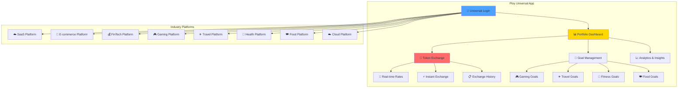
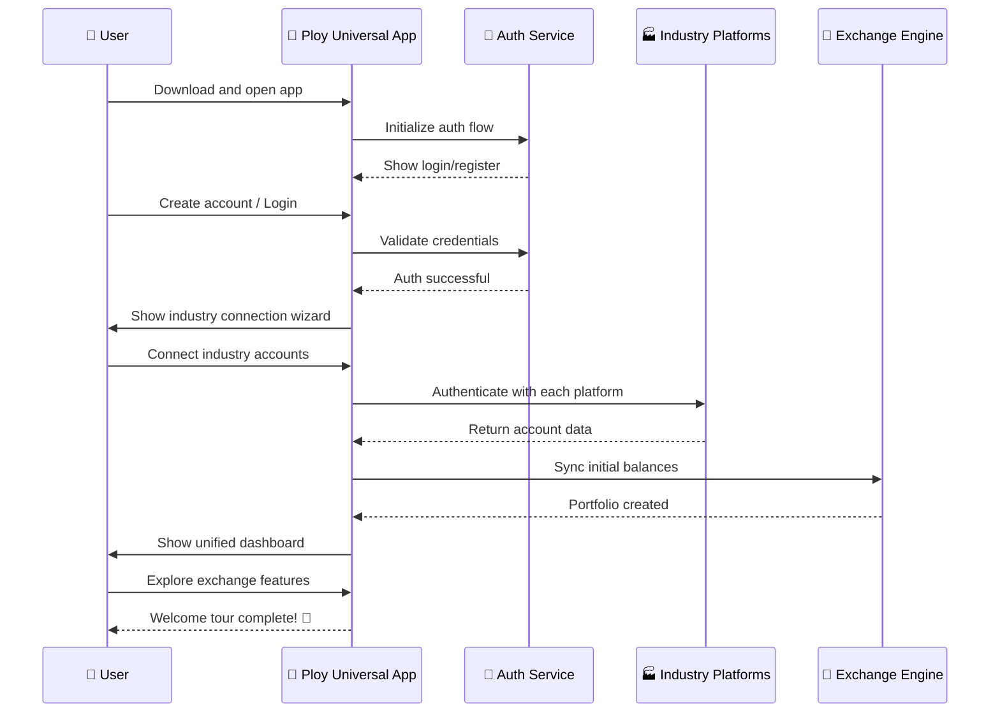

# Unified Token Exchange & Management System

## Overview

The Ploy Universal App serves as the central hub where users can login once and manage all their loyalty points/tokens across all 8 supported industries. Users can view their complete portfolio, exchange tokens between industries, track earnings, and optimize their rewards strategy - all from a single, intuitive interface.

## Core Features

### 1. **Universal Login & Portfolio Dashboard**
- Single sign-on access to all industry accounts
- Unified portfolio view across all platforms
- Real-time token balances and valuations
- Cross-industry achievement tracking

### 2. **Token Exchange Engine**
- Real-time exchange rates between all industry tokens
- Smart arbitrage recommendations
- Bulk exchange operations
- Exchange history and analytics

### 3. **Portfolio Optimization**
- AI-powered recommendations for token allocation
- Earning potential calculations
- Risk assessment and diversification metrics
- Goal-based investment strategies

## Universal App Architecture



## Token Exchange System

### Exchange Rate Engine

```typescript
interface TokenExchangeRate {
  from_industry: string;
  to_industry: string;
  rate: number;
  spread: number; // Platform fee
  last_updated: Date;
  24h_change: number;
  volume_24h: number;
  liquidity_score: number;
}

class UniversalTokenExchange {
  private exchangeRates: Map<string, TokenExchangeRate> = new Map();
  private liquidityPools: Map<string, LiquidityPool> = new Map();
  
  async getExchangeRates(): Promise<TokenExchangeRate[]> {
    // Fetch real-time rates from all industry platforms
    const rates = await Promise.all([
      this.fetchSaaSRates(),
      this.fetchTravelRates(),
      this.fetchHealthRates(),
      this.fetchFoodRates(),
      this.fetchGamingRates(),
      this.fetchEcommerceRates(),
      this.fetchFinTechRates(),
      this.fetchCloudRates()
    ]);
    
    // Calculate cross-industry exchange rates
    return this.calculateCrossRates(rates);
  }
  
  async executeExchange(
    userId: string,
    fromIndustry: string,
    toIndustry: string,
    amount: number,
    options: ExchangeOptions = {}
  ): Promise<ExchangeResult> {
    // Validate exchange parameters
    await this.validateExchange(userId, fromIndustry, toIndustry, amount);
    
    // Get current exchange rate
    const rate = await this.getCurrentRate(fromIndustry, toIndustry);
    
    // Calculate fees and final amount
    const fees = await this.calculateFees(userId, amount, fromIndustry, toIndustry);
    const finalAmount = Math.floor((amount * rate.rate) * (1 - fees.total_fee_rate));
    
    // Execute the exchange
    const transaction = await this.processExchange({
      userId,
      fromIndustry,
      toIndustry,
      sourceAmount: amount,
      targetAmount: finalAmount,
      rate: rate.rate,
      fees: fees,
      timestamp: new Date(),
      transaction_id: this.generateTransactionId()
    });
    
    // Update user balances
    await this.updateUserBalances(userId, fromIndustry, toIndustry, amount, finalAmount);
    
    // Record transaction history
    await this.recordTransaction(transaction);
    
    return {
      success: true,
      transaction_id: transaction.transaction_id,
      exchanged_amount: amount,
      received_amount: finalAmount,
      exchange_rate: rate.rate,
      fees_paid: fees.total_fee,
      new_balances: await this.getUserBalances(userId)
    };
  }
  
  async getOptimalExchangePath(
    fromIndustry: string,
    toIndustry: string,
    amount: number
  ): Promise<ExchangePath> {
    // Find the most efficient exchange route (direct vs multi-hop)
    const directPath = await this.getDirectRate(fromIndustry, toIndustry);
    const multiHopPaths = await this.getMultiHopPaths(fromIndustry, toIndustry);
    
    // Compare all paths and return the best one
    const allPaths = [directPath, ...multiHopPaths];
    const bestPath = allPaths.reduce((best, current) => 
      current.final_amount > best.final_amount ? current : best
    );
    
    return bestPath;
  }
}
```

### Portfolio Management

```typescript
interface UserPortfolio {
  user_id: string;
  total_value_usd: number;
  token_balances: {
    [industry: string]: {
      balance: number;
      value_usd: number;
      percentage: number;
      24h_change: number;
      earning_rate: number; // Points per day
    };
  };
  nft_portfolio: {
    [industry: string]: {
      count: number;
      total_value: number;
      floor_value: number;
      rare_count: number;
    };
  };
  performance_metrics: {
    total_earned_30d: number;
    best_performing_industry: string;
    diversification_score: number;
    risk_score: number;
  };
}

class PortfolioManager {
  async getUserPortfolio(userId: string): Promise<UserPortfolio> {
    // Fetch balances from all connected industries
    const balances = await this.fetchAllBalances(userId);
    
    // Calculate portfolio metrics
    const totalValue = await this.calculateTotalValue(balances);
    const performance = await this.calculatePerformance(userId);
    const nftPortfolio = await this.getNFTPortfolio(userId);
    
    return {
      user_id: userId,
      total_value_usd: totalValue,
      token_balances: await this.enrichTokenBalances(balances),
      nft_portfolio: nftPortfolio,
      performance_metrics: performance
    };
  }
  
  async getOptimizationRecommendations(userId: string): Promise<Recommendation[]> {
    const portfolio = await this.getUserPortfolio(userId);
    const userGoals = await this.getUserGoals(userId);
    
    const recommendations = [];
    
    // Diversification recommendations
    if (portfolio.performance_metrics.diversification_score < 0.6) {
      recommendations.push({
        type: 'diversification',
        priority: 'high',
        title: 'Improve Portfolio Diversification',
        description: 'Your tokens are concentrated in few industries. Consider spreading across more sectors.',
        suggested_actions: [
          `Exchange 20% of ${this.getTopIndustry(portfolio)} tokens to Travel and Health sectors`,
          'Participate in Food & Drink activities to earn tokens in that sector'
        ],
        potential_benefit: 'Reduced risk and more stable earnings'
      });
    }
    
    // Arbitrage opportunities
    const arbitrageOpps = await this.findArbitrageOpportunities(portfolio);
    if (arbitrageOpps.length > 0) {
      recommendations.push({
        type: 'arbitrage',
        priority: 'medium',
        title: 'Exchange Rate Arbitrage Opportunity',
        description: `You can gain ${arbitrageOpps[0].profit_percentage}% by exchanging tokens`,
        suggested_actions: [
          `Exchange ${arbitrageOpps[0].amount} ${arbitrageOpps[0].from} tokens to ${arbitrageOpps[0].to}`,
          `Wait for rate normalization, then exchange back for profit`
        ],
        potential_benefit: `Estimated gain: ${arbitrageOpps[0].estimated_profit} tokens`
      });
    }
    
    // Goal-based recommendations
    for (const goal of userGoals) {
      const goalRec = await this.getGoalRecommendation(goal, portfolio);
      if (goalRec) {
        recommendations.push(goalRec);
      }
    }
    
    return recommendations;
  }
  
  async rebalancePortfolio(
    userId: string, 
    targetAllocation: { [industry: string]: number }
  ): Promise<RebalanceResult> {
    const currentPortfolio = await this.getUserPortfolio(userId);
    const rebalanceActions = [];
    
    // Calculate required exchanges
    for (const [industry, targetPercent] of Object.entries(targetAllocation)) {
      const currentPercent = currentPortfolio.token_balances[industry]?.percentage || 0;
      const difference = targetPercent - currentPercent;
      
      if (Math.abs(difference) > 5) { // Only rebalance if difference > 5%
        const targetValue = currentPortfolio.total_value_usd * (targetPercent / 100);
        const currentValue = currentPortfolio.token_balances[industry]?.value_usd || 0;
        const valueChange = targetValue - currentValue;
        
        rebalanceActions.push({
          industry,
          action: valueChange > 0 ? 'buy' : 'sell',
          amount_usd: Math.abs(valueChange),
          priority: Math.abs(difference)
        });
      }
    }
    
    // Execute rebalancing trades
    const executedTrades = [];
    for (const action of rebalanceActions.sort((a, b) => b.priority - a.priority)) {
      if (action.action === 'buy') {
        // Find best source industry to sell from
        const sourceIndustry = await this.findBestSourceForRebalance(
          userId, 
          action.industry, 
          action.amount_usd
        );
        
        const trade = await this.executeRebalanceTrade(
          userId,
          sourceIndustry,
          action.industry,
          action.amount_usd
        );
        
        executedTrades.push(trade);
      }
    }
    
    return {
      success: true,
      trades_executed: executedTrades.length,
      new_allocation: await this.calculateNewAllocation(userId),
      estimated_improvement: await this.calculateRebalanceBenefit(executedTrades)
    };
  }
}
```

## User Interface Components

### Dashboard View

```typescript
interface DashboardState {
  portfolio: UserPortfolio;
  exchangeRates: TokenExchangeRate[];
  recommendations: Recommendation[];
  recentTransactions: Transaction[];
  goals: UserGoal[];
  marketTrends: MarketTrend[];
}

const UniversalDashboard: React.FC = () => {
  const [dashboardData, setDashboardData] = useState<DashboardState>();
  const [selectedExchange, setSelectedExchange] = useState<ExchangePair>();
  
  return (
    <div className="dashboard-container">
      {/* Portfolio Overview */}
      <PortfolioOverview 
        portfolio={dashboardData?.portfolio}
        onRebalance={() => handleRebalance()}
      />
      
      {/* Quick Exchange Widget */}
      <QuickExchange 
        rates={dashboardData?.exchangeRates}
        userBalances={dashboardData?.portfolio?.token_balances}
        onExchange={handleQuickExchange}
      />
      
      {/* Recommendations Panel */}
      <RecommendationsPanel 
        recommendations={dashboardData?.recommendations}
        onExecuteRecommendation={handleExecuteRecommendation}
      />
      
      {/* Goals Tracking */}
      <GoalsTracker 
        goals={dashboardData?.goals}
        portfolio={dashboardData?.portfolio}
        onUpdateGoal={handleUpdateGoal}
      />
      
      {/* Market Insights */}
      <MarketInsights 
        trends={dashboardData?.marketTrends}
        rates={dashboardData?.exchangeRates}
      />
    </div>
  );
};
```

### Exchange Interface

```typescript
const TokenExchangeInterface: React.FC = () => {
  const [fromIndustry, setFromIndustry] = useState<string>('');
  const [toIndustry, setToIndustry] = useState<string>('');
  const [amount, setAmount] = useState<number>(0);
  const [exchangePreview, setExchangePreview] = useState<ExchangePreview>();
  
  const handleExchange = async () => {
    try {
      setLoading(true);
      
      // Get optimal exchange path
      const optimalPath = await exchangeService.getOptimalExchangePath(
        fromIndustry, 
        toIndustry, 
        amount
      );
      
      // Execute exchange
      const result = await exchangeService.executeExchange(
        userId,
        fromIndustry,
        toIndustry,
        amount,
        { use_optimal_path: true }
      );
      
      // Show success message
      showSuccessNotification({
        title: 'Exchange Completed!',
        message: `Successfully exchanged ${amount} ${fromIndustry} tokens for ${result.received_amount} ${toIndustry} tokens`,
        duration: 5000
      });
      
      // Refresh portfolio
      await refreshPortfolio();
      
    } catch (error) {
      showErrorNotification({
        title: 'Exchange Failed',
        message: error.message,
        duration: 5000
      });
    } finally {
      setLoading(false);
    }
  };
  
  return (
    <div className="exchange-interface">
      <div className="exchange-form">
        <TokenSelector 
          label="From"
          selectedIndustry={fromIndustry}
          userBalances={userBalances}
          onSelect={setFromIndustry}
        />
        
        <AmountInput 
          amount={amount}
          maxAmount={userBalances[fromIndustry]?.balance || 0}
          onChange={setAmount}
        />
        
        <SwapButton onClick={() => {
          setFromIndustry(toIndustry);
          setToIndustry(fromIndustry);
        }} />
        
        <TokenSelector 
          label="To"
          selectedIndustry={toIndustry}
          onSelect={setToIndustry}
        />
        
        <ExchangePreview 
          preview={exchangePreview}
          loading={previewLoading}
        />
        
        <ExchangeButton 
          onClick={handleExchange}
          disabled={!canExchange}
          loading={loading}
        />
      </div>
      
      <div className="exchange-info">
        <RateChart 
          fromIndustry={fromIndustry}
          toIndustry={toIndustry}
          timeframe="24h"
        />
        
        <ExchangeHistory 
          userId={userId}
          limit={10}
        />
        
        <ArbitrageOpportunities 
          userPortfolio={portfolio}
          currentRates={exchangeRates}
        />
      </div>
    </div>
  );
};
```

## Advanced Features

### Smart Exchange Strategies

```typescript
class SmartExchangeStrategies {
  async dollarCostAveraging(
    userId: string,
    fromIndustry: string,
    toIndustry: string,
    totalAmount: number,
    duration: number // days
  ): Promise<DCAStrategy> {
    const dailyAmount = totalAmount / duration;
    const schedule = [];
    
    for (let day = 0; day < duration; day++) {
      schedule.push({
        date: new Date(Date.now() + day * 24 * 60 * 60 * 1000),
        amount: dailyAmount,
        status: 'pending'
      });
    }
    
    const strategy = await this.createDCAStrategy({
      userId,
      fromIndustry,
      toIndustry,
      schedule,
      status: 'active'
    });
    
    // Schedule automated executions
    await this.scheduleAutomatedExchanges(strategy);
    
    return strategy;
  }
  
  async arbitrageBot(
    userId: string,
    targetProfit: number, // minimum profit percentage
    maxRisk: number // maximum amount to risk
  ): Promise<ArbitrageBot> {
    const bot = await this.createArbitrageBot({
      userId,
      targetProfit,
      maxRisk,
      status: 'active',
      strategies: ['triangular', 'cross_industry', 'temporal']
    });
    
    // Start monitoring for opportunities
    this.monitorArbitrageOpportunities(bot);
    
    return bot;
  }
  
  async goalBasedStrategy(
    userId: string,
    goal: UserGoal
  ): Promise<GoalStrategy> {
    const currentPortfolio = await this.getPortfolio(userId);
    const requiredTokens = await this.calculateRequiredTokens(goal);
    
    const exchangePlan = [];
    
    for (const [industry, needed] of Object.entries(requiredTokens)) {
      const current = currentPortfolio.token_balances[industry]?.balance || 0;
      if (needed > current) {
        const deficit = needed - current;
        const sourceIndustry = await this.findBestSource(userId, industry, deficit);
        
        exchangePlan.push({
          from: sourceIndustry,
          to: industry,
          amount: deficit,
          deadline: goal.target_date,
          priority: goal.priority
        });
      }
    }
    
    return {
      goal_id: goal.id,
      exchange_plan: exchangePlan,
      estimated_completion: await this.estimateCompletion(exchangePlan),
      total_cost: await this.calculateTotalCost(exchangePlan)
    };
  }
}
```

### Industry Integration APIs

```typescript
interface IndustryIntegration {
  industry: string;
  api_endpoint: string;
  auth_method: 'oauth' | 'api_key' | 'jwt';
  supported_operations: string[];
  rate_limits: {
    requests_per_minute: number;
    daily_limit: number;
  };
}

class IndustryIntegrationManager {
  private integrations: Map<string, IndustryIntegration> = new Map();
  
  async connectIndustryAccount(
    userId: string,
    industry: string,
    credentials: any
  ): Promise<ConnectionResult> {
    const integration = this.integrations.get(industry);
    if (!integration) {
      throw new Error(`Industry ${industry} not supported`);
    }
    
    // Authenticate with industry platform
    const authResult = await this.authenticateWithIndustry(industry, credentials);
    
    // Fetch initial user data
    const userData = await this.fetchUserData(industry, authResult.access_token);
    
    // Store connection
    await this.storeConnection({
      userId,
      industry,
      access_token: authResult.access_token,
      refresh_token: authResult.refresh_token,
      expires_at: authResult.expires_at,
      account_id: userData.account_id,
      connected_at: new Date()
    });
    
    // Initial sync
    await this.syncUserData(userId, industry);
    
    return {
      success: true,
      industry,
      account_connected: userData.account_id,
      initial_balance: userData.token_balance
    };
  }
  
  async syncAllAccounts(userId: string): Promise<SyncResult> {
    const connections = await this.getUserConnections(userId);
    const syncResults = [];
    
    for (const connection of connections) {
      try {
        const result = await this.syncUserData(userId, connection.industry);
        syncResults.push({
          industry: connection.industry,
          success: true,
          data: result
        });
      } catch (error) {
        syncResults.push({
          industry: connection.industry,
          success: false,
          error: error.message
        });
      }
    }
    
    return {
      total_synced: syncResults.filter(r => r.success).length,
      total_failed: syncResults.filter(r => !r.success).length,
      results: syncResults
    };
  }
}
```

## Security & Compliance

### Multi-Factor Authentication

```typescript
class UniversalAuthSystem {
  async authenticateUser(credentials: LoginCredentials): Promise<AuthResult> {
    // Primary authentication
    const primaryAuth = await this.validateCredentials(credentials);
    if (!primaryAuth.success) {
      throw new Error('Invalid credentials');
    }
    
    // Check if MFA is required
    const user = await this.getUser(credentials.email);
    if (user.mfa_enabled) {
      const mfaToken = await this.generateMFAChallenge(user.id);
      return {
        success: false,
        requires_mfa: true,
        mfa_token: mfaToken,
        message: 'MFA verification required'
      };
    }
    
    // Generate session tokens
    const sessionTokens = await this.generateSessionTokens(user.id);
    
    // Log successful login
    await this.logAuthEvent({
      user_id: user.id,
      event_type: 'login_success',
      ip_address: credentials.ip_address,
      user_agent: credentials.user_agent,
      timestamp: new Date()
    });
    
    return {
      success: true,
      user: user,
      access_token: sessionTokens.access_token,
      refresh_token: sessionTokens.refresh_token,
      expires_at: sessionTokens.expires_at
    };
  }
  
  async verifyMFA(mfaToken: string, code: string): Promise<AuthResult> {
    const challenge = await this.getMFAChallenge(mfaToken);
    if (!challenge || challenge.expires_at < new Date()) {
      throw new Error('Invalid or expired MFA token');
    }
    
    // Verify MFA code
    const isValid = await this.verifyMFACode(challenge.user_id, code);
    if (!isValid) {
      await this.logAuthEvent({
        user_id: challenge.user_id,
        event_type: 'mfa_failed',
        timestamp: new Date()
      });
      throw new Error('Invalid MFA code');
    }
    
    // Complete authentication
    const user = await this.getUser(challenge.user_id);
    const sessionTokens = await this.generateSessionTokens(user.id);
    
    // Clean up MFA challenge
    await this.deleteMFAChallenge(mfaToken);
    
    return {
      success: true,
      user: user,
      access_token: sessionTokens.access_token,
      refresh_token: sessionTokens.refresh_token,
      expires_at: sessionTokens.expires_at
    };
  }
}
```

## Implementation Workflow

### User Onboarding Flow



### Exchange Transaction Flow

```mermaid
sequenceDiagram
    participant User as 👤 User
    participant App as 📱 Ploy App
    participant Exchange as 💱 Exchange Engine
    participant RateEngine as 📊 Rate Engine
    participant IndustryA as 🏭 Source Industry
    parameter IndustryB as 🏭 Target Industry
    
    User->>App: Select exchange (A → B)
    App->>RateEngine: Get current rates
    RateEngine-->>App: Current rate + fees
    
    User->>App: Enter amount to exchange
    App->>Exchange: Calculate preview
    Exchange-->>App: Show preview (amount, fees, final)
    
    User->>App: Confirm exchange
    App->>Exchange: Execute exchange
    
    Exchange->>IndustryA: Deduct tokens
    Exchange->>IndustryB: Add tokens
    IndustryA-->>Exchange: Deduction confirmed
    IndustryB-->>Exchange: Addition confirmed
    
    Exchange->>Exchange: Record transaction
    Exchange-->>App: Exchange completed
    App-->>User: Success! Balances updated ✅
```

This unified token exchange system transforms Ploy into a comprehensive financial ecosystem where users have complete control over their cross-industry token portfolio, enabling strategic optimization, arbitrage opportunities, and goal-based token allocation - all through a single, powerful application.