# Universal Login & Single Sign-On (SSO) System

## Overview

The Ploy Universal Login system provides seamless single sign-on (SSO) access across all industry platforms and services. Users authenticate once and gain immediate access to their entire loyalty ecosystem, portfolio, and cross-industry benefits through a unified identity management system.

## Core SSO Architecture

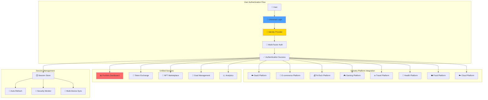

## Technical Implementation

### Universal Authentication Service

```typescript
interface UniversalLoginRequest {
  email: string;
  password?: string;
  auth_method: 'password' | 'oauth' | 'web3' | 'biometric';
  device_info: {
    device_id: string;
    platform: string;
    user_agent: string;
    ip_address: string;
  };
  remember_me: boolean;
}

interface UniversalSession {
  session_id: string;
  user_id: string;
  access_token: string;
  refresh_token: string;
  expires_at: Date;
  connected_industries: string[];
  permissions: string[];
  device_sessions: DeviceSession[];
  security_flags: SecurityFlags;
}

class UniversalLoginService {
  async authenticateUser(request: UniversalLoginRequest): Promise<AuthenticationResult> {
    // Step 1: Primary authentication
    const primaryAuth = await this.validateCredentials(request);
    if (!primaryAuth.success) {
      throw new AuthenticationError('Invalid credentials');
    }
    
    // Step 2: Security checks
    await this.performSecurityChecks(request);
    
    // Step 3: Multi-factor authentication if required
    const user = await this.getUser(request.email);
    if (user.mfa_enabled || this.requiresMFA(request)) {
      return await this.initiateMFAFlow(user, request);
    }
    
    // Step 4: Create universal session
    const session = await this.createUniversalSession(user, request);
    
    // Step 5: Initialize industry connections
    await this.initializeIndustryConnections(session);
    
    // Step 6: Sync user data across platforms
    await this.syncCrossIndustryData(session.user_id);
    
    return {
      success: true,
      session: session,
      connected_industries: session.connected_industries,
      portfolio_summary: await this.getPortfolioSummary(session.user_id),
      pending_actions: await this.getPendingActions(session.user_id)
    };
  }
  
  async createUniversalSession(
    user: User, 
    request: UniversalLoginRequest
  ): Promise<UniversalSession> {
    const sessionId = this.generateSecureSessionId();
    const tokens = await this.generateJWTTokens(user.id, sessionId);
    
    const session: UniversalSession = {
      session_id: sessionId,
      user_id: user.id,
      access_token: tokens.access_token,
      refresh_token: tokens.refresh_token,
      expires_at: new Date(Date.now() + 24 * 60 * 60 * 1000), // 24 hours
      connected_industries: await this.getUserConnectedIndustries(user.id),
      permissions: await this.getUserPermissions(user.id),
      device_sessions: await this.getActiveDeviceSessions(user.id),
      security_flags: await this.getSecurityFlags(user.id)
    };
    
    // Store session in Redis for fast access
    await this.sessionStore.set(sessionId, session, { ttl: 86400 });
    
    // Store in database for persistence
    await this.database.sessions.create({
      data: {
        session_id: sessionId,
        user_id: user.id,
        created_at: new Date(),
        expires_at: session.expires_at,
        device_info: request.device_info,
        last_activity: new Date()
      }
    });
    
    return session;
  }
  
  async initializeIndustryConnections(session: UniversalSession): Promise<void> {
    const user = await this.getUser(session.user_id);
    const connectedAccounts = await this.getConnectedAccounts(session.user_id);
    
    // Initialize connections to each industry platform
    const connectionPromises = connectedAccounts.map(async (account) => {
      try {
        // Refresh industry-specific access tokens
        const refreshedTokens = await this.refreshIndustryTokens(account);
        
        // Validate connection health
        await this.validateIndustryConnection(account.industry, refreshedTokens);
        
        // Mark as active in session
        session.connected_industries.push(account.industry);
        
        return {
          industry: account.industry,
          status: 'connected',
          last_sync: new Date()
        };
      } catch (error) {
        console.warn(`Failed to connect to ${account.industry}:`, error.message);
        return {
          industry: account.industry,
          status: 'disconnected',
          error: error.message
        };
      }
    });
    
    const connectionResults = await Promise.allSettled(connectionPromises);
    
    // Update session with connection status
    await this.updateSessionConnections(session.session_id, connectionResults);
  }
}
```

### Industry Platform Integration

```typescript
interface IndustryConnection {
  industry: string;
  platform_name: string;
  account_id: string;
  access_token: string;
  refresh_token: string;
  token_expires_at: Date;
  connection_status: 'active' | 'inactive' | 'error';
  last_sync: Date;
  permissions: string[];
  user_profile: any;
}

class IndustryIntegrationManager {
  private integrations: Map<string, IndustryIntegration> = new Map([
    ['saas', new SaaSIntegration()],
    ['ecommerce', new EcommerceIntegration()],
    ['cloud', new CloudIntegration()],
    ['fintech', new FinTechIntegration()],
    ['gaming', new GamingIntegration()],
    ['travel', new TravelIntegration()],
    ['health', new HealthIntegration()],
    ['food', new FoodIntegration()]
  ]);
  
  async connectIndustryAccount(
    userId: string,
    industry: string,
    authCode: string
  ): Promise<IndustryConnection> {
    const integration = this.integrations.get(industry);
    if (!integration) {
      throw new Error(`Industry ${industry} not supported`);
    }
    
    // Exchange auth code for access tokens
    const tokens = await integration.exchangeAuthCode(authCode);
    
    // Fetch user profile from industry platform
    const userProfile = await integration.fetchUserProfile(tokens.access_token);
    
    // Store connection
    const connection: IndustryConnection = {
      industry,
      platform_name: integration.platformName,
      account_id: userProfile.id,
      access_token: tokens.access_token,
      refresh_token: tokens.refresh_token,
      token_expires_at: tokens.expires_at,
      connection_status: 'active',
      last_sync: new Date(),
      permissions: tokens.scope.split(' '),
      user_profile: userProfile
    };
    
    await this.storeConnection(userId, connection);
    
    // Initial data sync
    await this.syncUserData(userId, industry);
    
    // Trigger connection success event
    await this.eventBus.emit('industry.connected', {
      user_id: userId,
      industry,
      connection
    });
    
    return connection;
  }
  
  async syncUserData(userId: string, industry: string): Promise<SyncResult> {
    const connection = await this.getConnection(userId, industry);
    const integration = this.integrations.get(industry);
    
    try {
      // Fetch latest user data
      const userData = await integration.fetchUserData(connection.access_token);
      
      // Sync loyalty points/tokens
      await this.syncLoyaltyData(userId, industry, userData.loyalty);
      
      // Sync achievements/milestones
      await this.syncAchievements(userId, industry, userData.achievements);
      
      // Sync transaction history
      await this.syncTransactionHistory(userId, industry, userData.transactions);
      
      // Update last sync timestamp
      await this.updateLastSync(userId, industry);
      
      return {
        success: true,
        industry,
        synced_data: {
          loyalty_balance: userData.loyalty.balance,
          new_achievements: userData.achievements.filter(a => a.earned_after > connection.last_sync),
          recent_transactions: userData.transactions.slice(0, 10)
        }
      };
    } catch (error) {
      console.error(`Sync failed for ${industry}:`, error);
      
      // Handle token expiration
      if (error.code === 'TOKEN_EXPIRED') {
        await this.refreshConnection(userId, industry);
        return this.syncUserData(userId, industry); // Retry once
      }
      
      throw error;
    }
  }
}
```

## Business Partner Integration

### Zero-Code Integration Options

Ploy provides multiple integration methods to minimize technical burden on business partners:

```typescript
// Option 1: One-Line JavaScript Integration
<script src="https://cdn.ploy.io/widgets/loyalty-widget.js" 
        data-api-key="your_api_key" 
        data-theme="auto">
</script>

// Option 2: WordPress Plugin (Zero-Code)
// Install "Ploy Loyalty" plugin, enter API key, activate

// Option 3: Shopify App (Zero-Code)  
// Install from Shopify App Store, one-click setup

// Option 4: REST API Integration (Minimal Code)
const ploy = new PloySDK('your_api_key');
await ploy.trackAction('purchase', { amount: 100, user_email: 'user@example.com' });
```

### Partner Onboarding Workflow

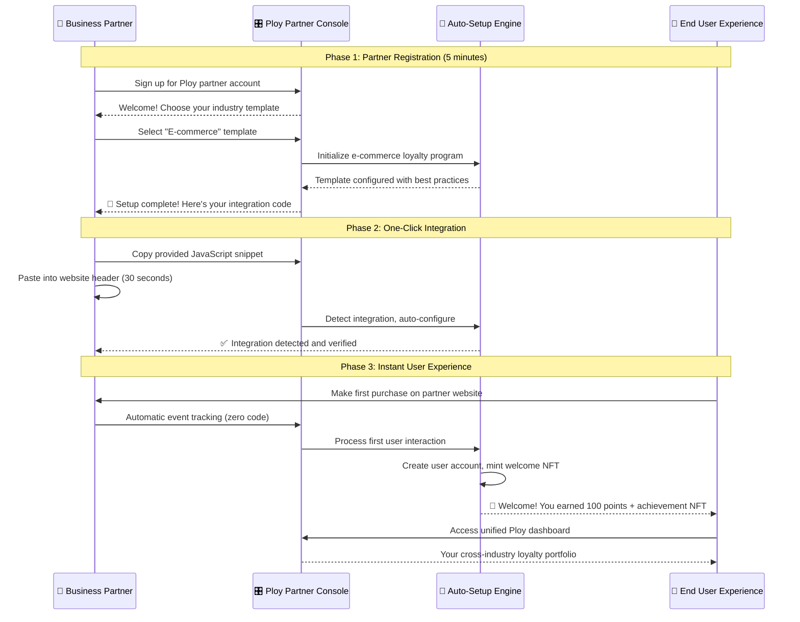

### Integration Complexity Levels

#### Level 1: Zero-Code Integration (95% of partners)
```html
<!-- Add this ONE line to your website -->
<script src="https://cdn.ploy.io/loyalty.js" data-key="pk_live_your_key"></script>

<!-- That's it! Ploy automatically detects and tracks: -->
<!-- ✅ User registrations → Welcome points + NFT -->
<!-- ✅ Purchases → Points based on amount -->
<!-- ✅ Page views → Engagement points -->
<!-- ✅ Social shares → Viral bonuses -->
<!-- ✅ Reviews → Community contribution points -->
```

#### Level 2: Configuration-Only (4% of partners)
```javascript
// Optional: Customize point values and triggers
window.PloyConfig = {
  events: {
    purchase: { points: 10, multiplier: 'amount' },
    signup: { points: 500, nft: 'welcome_badge' },
    review: { points: 50, bonus_after: 10 }
  },
  ui: {
    theme: 'dark',
    position: 'bottom-right',
    auto_show: true
  }
};
```

#### Level 3: Custom Integration (1% of partners)
```javascript
// For advanced partners with specific needs
const ploy = new Ploy('your_api_key');

// Custom event tracking
await ploy.track('custom_milestone', {
  user_id: 'user123',
  event_data: { achievement: 'power_user', level: 5 },
  points: 1000,
  nft_eligibility: true
});
```

## Use Case Workflows

### Use Case 1: E-commerce Partner Zero-Code Integration

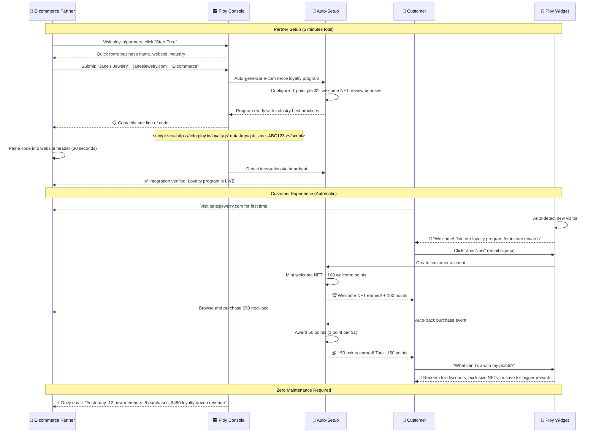

### Use Case 2: New User Onboarding - Partner to Core Ploy App

```mermaid
sequenceDiagram
    participant Customer as 👤 New Customer
    participant PartnerSite as 🛒 Partner Website
    participant PloyWidget as 📱 Ploy Widget
    participant PloyCore as 🎯 Ploy Core App
    participant AuthService as 🔐 Auth Service
    participant OnboardingEngine as 🚀 Onboarding Engine
    participant NFTMinter as 🎨 NFT Minter
    participant CrossIndustry as 🌐 Cross-Industry Engine
    
    Note over Customer, CrossIndustry: Phase 1: First Interaction on Partner Site
    Customer->>PartnerSite: Visit partner website (first time)
    PartnerSite->>PloyWidget: Load loyalty widget
    PloyWidget->>PloyWidget: Detect: new visitor, no Ploy account
    PloyWidget-->>Customer: 🎁 "Welcome! Join our rewards program for instant benefits"
    
    Customer->>PloyWidget: Click "Join Rewards" 
    PloyWidget-->>Customer: Quick signup form: Email + Password (15 seconds)
    Customer->>PloyWidget: Submit: "sarah@email.com" + password
    PloyWidget->>AuthService: Create Ploy account
    AuthService->>AuthService: Generate account, link to partner
    AuthService->>NFTMinter: Mint welcome NFT for partner platform
    NFTMinter-->>AuthService: Welcome NFT created
    AuthService-->>PloyWidget: Account created + Welcome NFT earned!
    PloyWidget-->>Customer: 🏆 "Account created! You earned your first NFT + 100 points"
    
    Note over Customer, CrossIndustry: Phase 2: Immediate Partner Engagement
    Customer->>PartnerSite: Make first purchase ($75)
    PartnerSite->>PloyWidget: Track purchase event
    PloyWidget->>AuthService: Process: $75 purchase = 75 points
    AuthService->>AuthService: Check milestones: First purchase = achievement
    AuthService->>NFTMinter: Mint "First Purchase" achievement NFT
    NFTMinter-->>AuthService: Achievement NFT created
    AuthService-->>PloyWidget: +75 points + achievement NFT earned!
    PloyWidget-->>Customer: 💰 "Purchase complete! +75 points + 'First Buyer' NFT earned"
    
    Note over Customer, CrossIndustry: Phase 3: Discovery of Unified Ploy App
    PloyWidget-->>Customer: 🌟 "Unlock more rewards! Access your unified Ploy portfolio"
    Customer->>PloyWidget: Click "View My Complete Portfolio"
    PloyWidget->>PloyCore: Redirect to core app with SSO token
    PloyCore->>AuthService: Validate SSO token
    AuthService-->>PloyCore: Valid token, user authenticated
    
    PloyCore->>OnboardingEngine: Initialize new user onboarding
    OnboardingEngine-->>Customer: 🎯 "Welcome to Ploy! Let's unlock your full rewards potential"
    
    Note over Customer, CrossIndustry: Phase 4: Cross-Industry Discovery
    OnboardingEngine-->>Customer: "Connect more accounts to multiply your rewards"
    OnboardingEngine-->>Customer: Show industry options: Gaming, Travel, Health, SaaS, etc.
    Customer->>OnboardingEngine: "I'm interested in Gaming and Travel"
    
    OnboardingEngine->>OnboardingEngine: Personalize onboarding for Gaming + Travel
    OnboardingEngine-->>Customer: 🎮 "Gaming: Earn NFTs for achievements, trade with other players"
    OnboardingEngine-->>Customer: ✈️ "Travel: Convert points to miles, earn destination badges"
    
    Customer->>OnboardingEngine: "Connect my Steam account"
    OnboardingEngine->>CrossIndustry: Initiate Steam/Gaming platform OAuth
    CrossIndustry-->>Customer: Redirect to Steam authorization
    Customer->>CrossIndustry: Authorize gaming account connection
    CrossIndustry->>AuthService: Store gaming account connection
    AuthService->>AuthService: Sync existing gaming achievements
    AuthService-->>OnboardingEngine: Gaming account connected + historical data synced
    OnboardingEngine-->>Customer: 🎮 "Gaming connected! Found 5 existing achievements to convert to NFTs"
    
    Note over Customer, CrossIndustry: Phase 5: Portfolio Unification & Goals
    OnboardingEngine->>OnboardingEngine: Analyze user's cross-platform potential
    OnboardingEngine-->>Customer: 📊 "Your Unified Portfolio: E-commerce (175 points) + Gaming (5 NFTs)"
    OnboardingEngine-->>Customer: 💡 "Recommendation: Exchange gaming tokens for travel rewards"
    
    Customer->>OnboardingEngine: "Show me exchange options"
    OnboardingEngine->>CrossIndustry: Calculate optimal exchange rates
    CrossIndustry-->>OnboardingEngine: Best rate: 100 gaming tokens → 85 travel miles
    OnboardingEngine-->>Customer: ⚡ "Exchange 200 gaming tokens → 170 travel miles (you'll have enough for a flight upgrade!)"
    
    Customer->>OnboardingEngine: "Yes, make that exchange"
    OnboardingEngine->>CrossIndustry: Execute token exchange
    CrossIndustry->>CrossIndustry: Gaming tokens → Travel miles (gas-less transaction)
    CrossIndustry-->>OnboardingEngine: Exchange completed successfully
    OnboardingEngine-->>Customer: ✅ "Exchange complete! Your travel miles: 170 (enough for flight upgrade)"
    
    Note over Customer, CrossIndustry: Phase 6: Goal Setting & Future Engagement
    OnboardingEngine-->>Customer: 🎯 "Set your first cross-industry goal?"
    OnboardingEngine-->>Customer: Suggestions: "Save for vacation", "Upgrade gaming setup", "Fitness journey"
    Customer->>OnboardingEngine: "I want to save for a vacation to Japan"
    
    OnboardingEngine->>OnboardingEngine: Calculate Japan trip requirements
    OnboardingEngine-->>Customer: 🗾 "Japan Trip Goal: Need 50,000 travel miles + $500 spending money"
    OnboardingEngine-->>Customer: 📈 "Your Progress: 170/50,000 miles (0.3%) + $0/$500 (0%)"
    OnboardingEngine-->>Customer: 💡 "Earn Strategy: Shop more (+points→miles), Game achievements (+NFTs→trade value)"
    
    Customer->>OnboardingEngine: "Set up automatic progress tracking"
    OnboardingEngine->>AuthService: Create goal with automated tracking
    AuthService-->>OnboardingEngine: Goal created with smart notifications
    OnboardingEngine-->>Customer: 🎉 "Goal set! We'll notify you of optimal exchange opportunities"
    
    Note over Customer, CrossIndustry: Phase 7: Onboarding Complete - Ongoing Engagement
    OnboardingEngine-->>Customer: 🏁 "Onboarding Complete! Your Ploy ecosystem is ready"
    OnboardingEngine-->>Customer: 📱 "Download mobile app for real-time notifications"
    OnboardingEngine-->>Customer: 🔔 "We'll email you weekly progress updates and exchange opportunities"
    
    Customer->>PloyCore: Access main dashboard
    PloyCore-->>Customer: 🌟 "Welcome to your unified loyalty universe!"
    PloyCore-->>Customer: Portfolio: 2 platforms connected, 1 active goal, 3 NFTs owned
```

### Use Case 3: SaaS Platform One-Click Integration

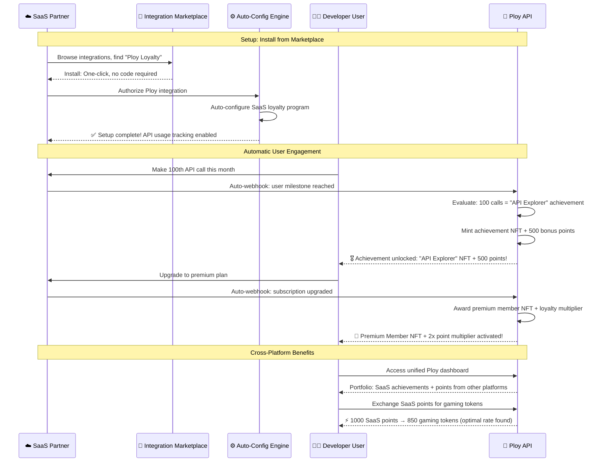

## Technical Implementation: Partner-to-Core Onboarding

### Seamless Transition Architecture

```typescript
interface OnboardingFlow {
  user_id: string;
  entry_point: 'partner_widget' | 'direct_signup' | 'referral';
  partner_context: {
    partner_id: string;
    industry: string;
    initial_activity: string;
    earned_rewards: {
      points: number;
      nfts: string[];
    };
  };
  onboarding_stage: 'discovery' | 'connection' | 'unification' | 'goal_setting' | 'complete';
  personalization: {
    interested_industries: string[];
    goals: UserGoal[];
    preferences: UserPreferences;
  };
}

class OnboardingEngine {
  async initializeFromPartner(
    userId: string,
    partnerContext: PartnerContext,
    ssoToken: string
  ): Promise<OnboardingSession> {
    
    // Validate SSO token and get user context
    const authResult = await this.authService.validateSSOToken(ssoToken);
    if (!authResult.valid) {
      throw new Error('Invalid SSO token');
    }
    
    // Create personalized onboarding based on partner industry
    const onboardingFlow = await this.createPersonalizedFlow(
      userId, 
      partnerContext.industry,
      partnerContext.initial_activity
    );
    
    // Analyze user's potential based on partner activity
    const crossIndustryPotential = await this.analyzeCrossIndustryPotential(
      partnerContext.industry,
      partnerContext.initial_activity
    );
    
    return {
      session_id: this.generateSessionId(),
      user_id: userId,
      flow: onboardingFlow,
      recommendations: crossIndustryPotential,
      entry_context: partnerContext
    };
  }
  
  async createPersonalizedFlow(
    userId: string,
    entryIndustry: string,
    initialActivity: string
  ): Promise<OnboardingStep[]> {
    
    const baseSteps = [
      {
        id: 'welcome',
        type: 'introduction',
        content: this.generateWelcomeContent(entryIndustry),
        duration_estimate: 30 // seconds
      },
      {
        id: 'cross_industry_discovery',
        type: 'industry_selection',
        content: this.generateIndustryOptions(entryIndustry),
        duration_estimate: 60
      },
      {
        id: 'account_connections',
        type: 'oauth_connections',
        content: this.generateConnectionOptions(),
        duration_estimate: 120
      },
      {
        id: 'portfolio_unification',
        type: 'data_sync',
        content: this.generatePortfolioPreview(),
        duration_estimate: 45
      },
      {
        id: 'exchange_demo',
        type: 'interactive_demo',
        content: this.generateExchangeDemo(entryIndustry),
        duration_estimate: 90
      },
      {
        id: 'goal_setting',
        type: 'goal_creation',
        content: this.generateGoalSuggestions(entryIndustry),
        duration_estimate: 120
      }
    ];
    
    // Customize based on entry industry
    return this.customizeForIndustry(baseSteps, entryIndustry);
  }
  
  async analyzeCrossIndustryPotential(
    entryIndustry: string,
    initialActivity: string
  ): Promise<CrossIndustryRecommendations> {
    
    const recommendations = [];
    
    // Industry-specific cross-recommendations
    switch (entryIndustry) {
      case 'ecommerce':
        recommendations.push(
          { industry: 'travel', reason: 'Convert shopping points to travel miles', priority: 'high' },
          { industry: 'gaming', reason: 'Gamify shopping with achievement NFTs', priority: 'medium' },
          { industry: 'fitness', reason: 'Reward healthy lifestyle choices', priority: 'medium' }
        );
        break;
        
      case 'gaming':
        recommendations.push(
          { industry: 'ecommerce', reason: 'Trade gaming achievements for real rewards', priority: 'high' },
          { industry: 'fitness', reason: 'Gamify your workout routine', priority: 'high' },
          { industry: 'travel', reason: 'Earn destination achievements', priority: 'medium' }
        );
        break;
        
      case 'fitness':
        recommendations.push(
          { industry: 'food', reason: 'Connect nutrition with fitness goals', priority: 'high' },
          { industry: 'gaming', reason: 'Compete in fitness challenges', priority: 'medium' },
          { industry: 'travel', reason: 'Earn travel rewards for fitness milestones', priority: 'medium' }
        );
        break;
    }
    
    return {
      primary_recommendations: recommendations.filter(r => r.priority === 'high'),
      secondary_recommendations: recommendations.filter(r => r.priority === 'medium'),
      estimated_value_increase: this.calculateValueIncrease(recommendations)
    };
  }
  
  async executeOnboardingStep(
    sessionId: string,
    stepId: string,
    userInput: any
  ): Promise<OnboardingStepResult> {
    
    const session = await this.getOnboardingSession(sessionId);
    const step = session.flow.find(s => s.id === stepId);
    
    switch (step.type) {
      case 'industry_selection':
        return await this.handleIndustrySelection(session, userInput.selected_industries);
        
      case 'oauth_connections':
        return await this.handleAccountConnection(session, userInput.platform, userInput.auth_code);
        
      case 'data_sync':
        return await this.handleDataSync(session);
        
      case 'interactive_demo':
        return await this.handleExchangeDemo(session, userInput.demo_action);
        
      case 'goal_creation':
        return await this.handleGoalCreation(session, userInput.goal);
        
      default:
        return { success: false, error: 'Unknown step type' };
    }
  }
  
  async handleIndustrySelection(
    session: OnboardingSession,
    selectedIndustries: string[]
  ): Promise<OnboardingStepResult> {
    
    // Store user preferences
    await this.updateUserPreferences(session.user_id, {
      interested_industries: selectedIndustries
    });
    
    // Generate personalized connection options
    const connectionOptions = selectedIndustries.map(industry => ({
      industry,
      platforms: this.getPopularPlatforms(industry),
      benefits: this.getIndustryBenefits(industry),
      estimated_setup_time: this.getSetupTime(industry)
    }));
    
    // Update onboarding flow
    await this.updateOnboardingProgress(session.session_id, 'industry_selection', {
      selected_industries: selectedIndustries,
      next_step: 'account_connections'
    });
    
    return {
      success: true,
      data: {
        connection_options: connectionOptions,
        next_step: 'account_connections',
        progress: '33%'
      }
    };
  }
  
  async handleAccountConnection(
    session: OnboardingSession,
    platform: string,
    authCode: string
  ): Promise<OnboardingStepResult> {
    
    try {
      // Process OAuth connection
      const connection = await this.industryIntegrationManager.connectAccount(
        session.user_id,
        platform,
        authCode
      );
      
      // Sync historical data
      const syncResult = await this.syncHistoricalData(session.user_id, platform);
      
      // Check for existing achievements to convert to NFTs
      const nftOpportunities = await this.identifyNFTOpportunities(syncResult.achievements);
      
      // Update session with connection success
      await this.updateOnboardingProgress(session.session_id, 'account_connection', {
        connected_platform: platform,
        synced_data: syncResult,
        nft_opportunities: nftOpportunities
      });
      
      return {
        success: true,
        data: {
          platform_connected: platform,
          synced_achievements: syncResult.achievements.length,
          available_nfts: nftOpportunities.length,
          portfolio_preview: await this.generatePortfolioPreview(session.user_id)
        }
      };
      
    } catch (error) {
      return {
        success: false,
        error: `Failed to connect ${platform}: ${error.message}`,
        retry_available: true
      };
    }
  }
  
  async handleGoalCreation(
    session: OnboardingSession,
    goalInput: GoalCreationInput
  ): Promise<OnboardingStepResult> {
    
    // Create cross-industry goal
    const goal = await this.goalManager.createGoal({
      user_id: session.user_id,
      title: goalInput.title,
      description: goalInput.description,
      target_date: goalInput.target_date,
      requirements: goalInput.requirements,
      cross_industry: true
    });
    
    // Calculate earning strategy
    const strategy = await this.calculateEarningStrategy(session.user_id, goal);
    
    // Set up automated tracking
    await this.setupAutomatedTracking(goal.id, strategy);
    
    // Complete onboarding
    await this.completeOnboarding(session.session_id);
    
    return {
      success: true,
      data: {
        goal_created: goal,
        earning_strategy: strategy,
        estimated_completion: strategy.estimated_completion_date,
        onboarding_complete: true,
        next_action: 'dashboard'
      }
    };
  }
}
```

### Widget-to-App Transition Component

```typescript
// Partner Widget Integration
class PloyPartnerWidget {
  private onboardingEngine: OnboardingEngine;
  
  async handleNewUserSignup(
    email: string,
    password: string,
    partnerContext: PartnerContext
  ): Promise<WidgetSignupResult> {
    
    // Create Ploy account
    const user = await this.authService.createUser({
      email,
      password,
      entry_point: 'partner_widget',
      partner_id: partnerContext.partner_id
    });
    
    // Mint welcome NFT immediately
    const welcomeNFT = await this.nftMinter.mintWelcomeNFT(
      user.id,
      partnerContext.industry,
      partnerContext.partner_id
    );
    
    // Award initial points
    await this.rewardService.awardPoints(user.id, 100, 'welcome_bonus');
    
    return {
      user_id: user.id,
      welcome_rewards: {
        points: 100,
        nft: welcomeNFT
      },
      core_app_transition: {
        sso_token: await this.generateSSOToken(user.id),
        redirect_url: `${CORE_APP_URL}/onboarding?token=${ssoToken}&partner=${partnerContext.partner_id}`
      }
    };
  }
  
  generateCoreAppTransition(userId: string, partnerContext: PartnerContext): string {
    const ssoToken = this.generateSSOToken(userId);
    const params = new URLSearchParams({
      token: ssoToken,
      partner: partnerContext.partner_id,
      industry: partnerContext.industry,
      source: 'widget'
    });
    
    return `${CORE_APP_URL}/onboarding?${params.toString()}`;
  }
  
  // Progressive disclosure UI
  renderTransitionPrompt(userRewards: UserRewards): JSX.Element {
    return (
      <div className="ploy-transition-prompt">
        <div className="rewards-summary">
          <h3>🎉 Great start! You've earned:</h3>
          <ul>
            <li>💰 {userRewards.points} points</li>
            <li>🏆 {userRewards.nfts.length} NFT{userRewards.nfts.length !== 1 ? 's' : ''}</li>
          </ul>
        </div>
        
        <div className="potential-unlock">
          <h4>🌟 Unlock even more rewards:</h4>
          <ul>
            <li>✈️ Convert points to travel miles</li>
            <li>🎮 Trade NFTs with other users</li>
            <li>🎯 Set cross-platform goals</li>
            <li>📈 Track your unified portfolio</li>
          </ul>
        </div>
        
        <button 
          className="transition-button"
          onClick={() => this.transitionToCoreApp()}
        >
          View My Complete Portfolio →
        </button>
        
        <div className="trust-indicators">
          <small>
            ✓ Same account  ✓ Instant access  ✓ All rewards preserved
          </small>
        </div>
      </div>
    );
  }
}
```

### Use Case 4: Daily Multi-Industry Access

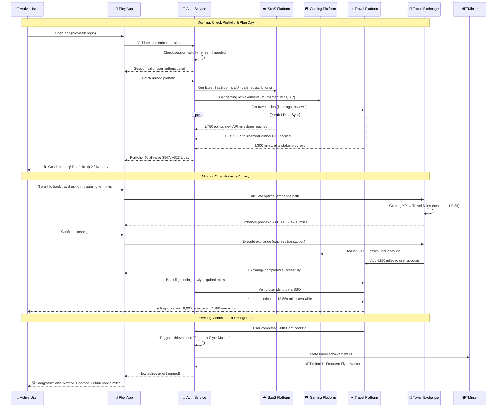

### Use Case 3: Cross-Industry Goal Achievement

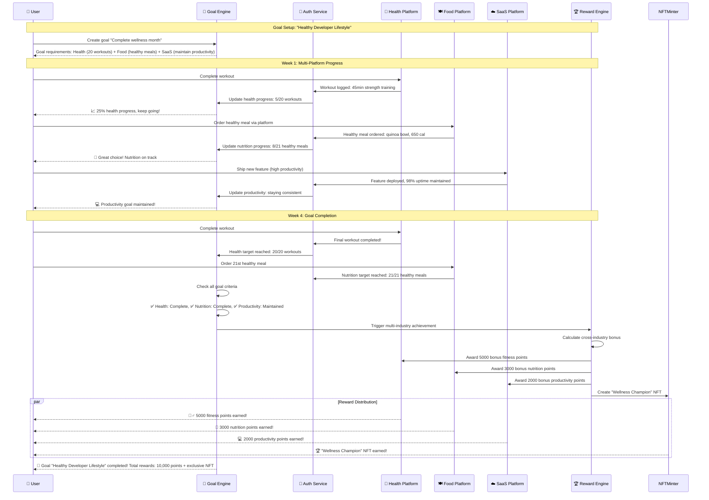

### Use Case 4: Enterprise SSO Integration

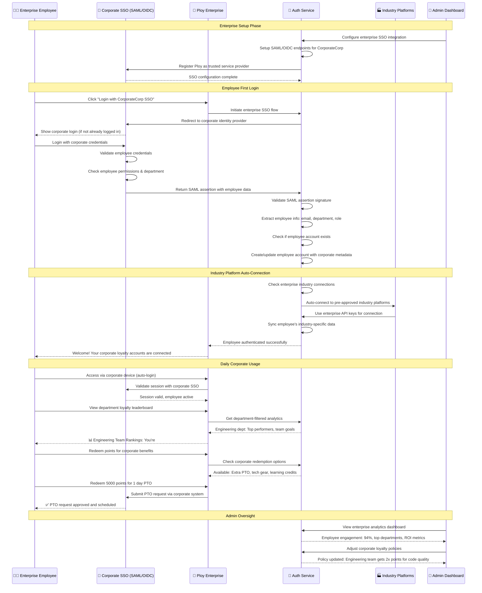

### Use Case 5: Web3 Wallet Authentication

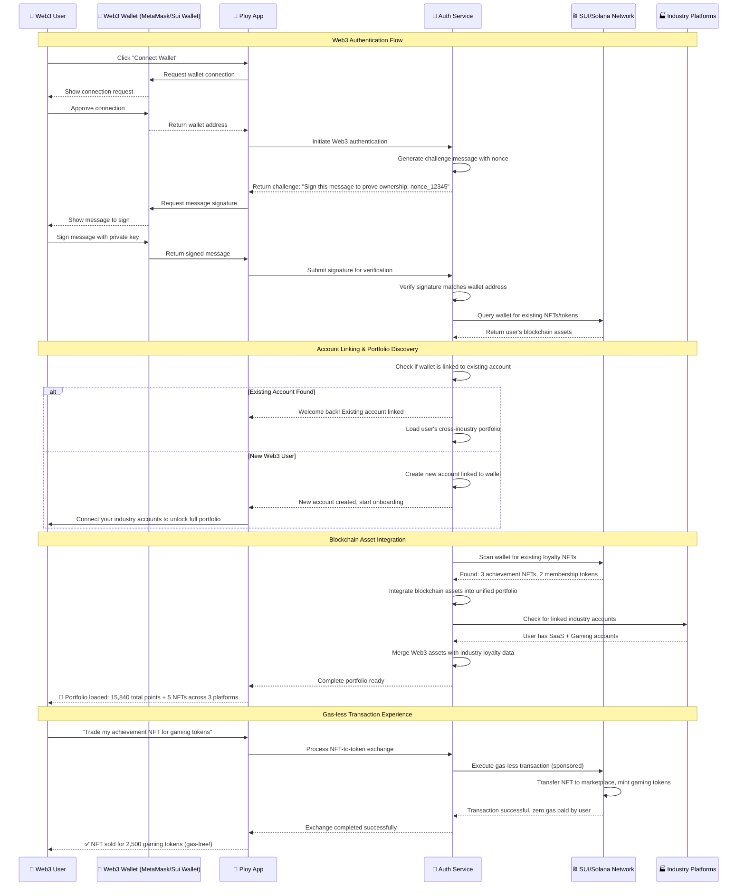

## Security & Compliance Features

### Multi-Factor Authentication Workflow

```typescript
interface MFAConfiguration {
  enabled: boolean;
  methods: ('sms' | 'email' | 'authenticator' | 'hardware' | 'biometric')[];
  backup_codes: string[];
  trusted_devices: TrustedDevice[];
  risk_threshold: number;
}

class MFAService {
  async evaluateRiskAndRequireMFA(
    user: User, 
    loginRequest: UniversalLoginRequest
  ): Promise<boolean> {
    const riskFactors = [];
    
    // Geographic risk
    const lastKnownLocation = await this.getLastKnownLocation(user.id);
    const currentLocation = await this.getLocationFromIP(loginRequest.device_info.ip_address);
    if (this.calculateDistance(lastKnownLocation, currentLocation) > 500) { // 500km
      riskFactors.push({ factor: 'location_change', weight: 0.4 });
    }
    
    // Device risk
    const isKnownDevice = await this.isKnownDevice(user.id, loginRequest.device_info.device_id);
    if (!isKnownDevice) {
      riskFactors.push({ factor: 'new_device', weight: 0.3 });
    }
    
    // Time-based risk
    const isUnusualTime = await this.isUnusualLoginTime(user.id, new Date());
    if (isUnusualTime) {
      riskFactors.push({ factor: 'unusual_time', weight: 0.2 });
    }
    
    // Industry access pattern risk
    const hasHighValueIndustryAccess = await this.hasHighValueAccess(user.id);
    if (hasHighValueIndustryAccess) {
      riskFactors.push({ factor: 'high_value_access', weight: 0.1 });
    }
    
    const totalRisk = riskFactors.reduce((sum, factor) => sum + factor.weight, 0);
    const userMFAConfig = await this.getMFAConfiguration(user.id);
    
    return totalRisk >= userMFAConfig.risk_threshold || userMFAConfig.enabled;
  }
  
  async initiateMFAChallenge(
    user: User, 
    preferredMethod?: string
  ): Promise<MFAChallenge> {
    const config = await this.getMFAConfiguration(user.id);
    const method = preferredMethod || config.methods[0];
    
    const challenge: MFAChallenge = {
      challenge_id: this.generateChallengeId(),
      user_id: user.id,
      method: method,
      created_at: new Date(),
      expires_at: new Date(Date.now() + 5 * 60 * 1000), // 5 minutes
      attempts_remaining: 3
    };
    
    switch (method) {
      case 'sms':
        const code = this.generateSMSCode();
        await this.sendSMS(user.phone, `Your Ploy verification code: ${code}`);
        challenge.expected_code = code;
        break;
        
      case 'email':
        const emailCode = this.generateEmailCode();
        await this.sendEmail(user.email, 'Ploy Login Verification', emailCode);
        challenge.expected_code = emailCode;
        break;
        
      case 'authenticator':
        // TOTP verification - no code sent, user provides from authenticator app
        challenge.expects_totp = true;
        break;
        
      case 'biometric':
        // Challenge for biometric verification
        challenge.biometric_challenge = await this.generateBiometricChallenge(user.id);
        break;
    }
    
    await this.storeMFAChallenge(challenge);
    return challenge;
  }
}
```

### Session Management & Security

```typescript
interface SessionSecurityPolicy {
  max_concurrent_sessions: number;
  session_timeout_minutes: number;
  require_reauth_for_sensitive_actions: boolean;
  trusted_device_duration_days: number;
  suspicious_activity_lockout_hours: number;
}

class SessionSecurityManager {
  async validateSessionSecurity(sessionId: string): Promise<SecurityValidationResult> {
    const session = await this.getSession(sessionId);
    const user = await this.getUser(session.user_id);
    const policy = await this.getSecurityPolicy(user.tenant_id);
    
    const validations = [];
    
    // Check session expiration
    if (session.expires_at < new Date()) {
      return { valid: false, reason: 'session_expired' };
    }
    
    // Check concurrent session limit
    const activeSessions = await this.getActiveUserSessions(session.user_id);
    if (activeSessions.length > policy.max_concurrent_sessions) {
      await this.invalidateOldestSessions(session.user_id, activeSessions.length - policy.max_concurrent_sessions);
    }
    
    // Check for suspicious activity
    const suspiciousActivity = await this.detectSuspiciousActivity(session);
    if (suspiciousActivity.detected) {
      await this.triggerSecurityAlert(session, suspiciousActivity);
      return { valid: false, reason: 'suspicious_activity' };
    }
    
    // Update last activity
    await this.updateSessionActivity(sessionId);
    
    return { valid: true };
  }
  
  async detectSuspiciousActivity(session: UniversalSession): Promise<SuspiciousActivityResult> {
    const activities = await this.getRecentSessionActivity(session.session_id);
    const suspiciousIndicators = [];
    
    // Multiple rapid location changes
    const locationChanges = activities.filter(a => a.type === 'location_change');
    if (locationChanges.length > 3 && this.within(locationChanges, '1 hour')) {
      suspiciousIndicators.push('rapid_location_changes');
    }
    
    // Unusual API access patterns
    const apiCalls = activities.filter(a => a.type === 'api_call');
    const unusualPattern = await this.analyzeAPICallPattern(apiCalls);
    if (unusualPattern.is_unusual) {
      suspiciousIndicators.push('unusual_api_pattern');
    }
    
    // High-value transaction attempts
    const transactions = activities.filter(a => a.type === 'transaction' && a.value > 10000);
    if (transactions.length > 0) {
      suspiciousIndicators.push('high_value_transactions');
    }
    
    return {
      detected: suspiciousIndicators.length > 0,
      indicators: suspiciousIndicators,
      risk_score: this.calculateRiskScore(suspiciousIndicators)
    };
  }
}
```

## Performance Optimization

### Caching Strategy

```typescript
class UniversalLoginCacheManager {
  private redis: Redis;
  private localCache: LRUCache;
  
  async getCachedUserData(userId: string): Promise<CachedUserData | null> {
    // L1 Cache: Local memory (fastest)
    const localData = this.localCache.get(`user:${userId}`);
    if (localData) {
      return localData;
    }
    
    // L2 Cache: Redis (fast)
    const redisData = await this.redis.get(`user:${userId}`);
    if (redisData) {
      const userData = JSON.parse(redisData);
      this.localCache.set(`user:${userId}`, userData, { ttl: 300 }); // 5 minutes local cache
      return userData;
    }
    
    return null;
  }
  
  async cacheUserData(userId: string, data: CachedUserData): Promise<void> {
    // Cache in both layers
    this.localCache.set(`user:${userId}`, data, { ttl: 300 });
    await this.redis.setex(`user:${userId}`, 1800, JSON.stringify(data)); // 30 minutes Redis cache
  }
  
  async warmupUserCache(userId: string): Promise<void> {
    // Proactively load frequently accessed data
    const promises = [
      this.cacheUserConnections(userId),
      this.cacheUserPortfolio(userId),
      this.cacheUserPreferences(userId),
      this.cacheUserPermissions(userId)
    ];
    
    await Promise.all(promises);
  }
  
  async invalidateUserCache(userId: string, reason: string): Promise<void> {
    this.localCache.del(`user:${userId}`);
    await this.redis.del(`user:${userId}`);
    
    // Log cache invalidation for debugging
    console.log(`Cache invalidated for user ${userId}: ${reason}`);
  }
}
```

## Analytics & Monitoring

### Login Analytics Dashboard

```typescript
interface LoginAnalytics {
  total_logins_today: number;
  successful_logins: number;
  failed_logins: number;
  mfa_challenges: number;
  average_login_time_ms: number;
  unique_users_today: number;
  industry_login_distribution: { [industry: string]: number };
  geographic_distribution: { [country: string]: number };
  device_type_distribution: { [device: string]: number };
  peak_login_hours: number[];
}

class LoginAnalyticsService {
  async generateDailyReport(): Promise<LoginAnalytics> {
    const today = new Date().toISOString().split('T')[0];
    
    const [
      totalLogins,
      successfulLogins,
      failedLogins,
      mfaChallenges,
      avgLoginTime,
      uniqueUsers,
      industryDist,
      geoDist,
      deviceDist,
      peakHours
    ] = await Promise.all([
      this.countLoginsByDate(today),
      this.countSuccessfulLoginsByDate(today),
      this.countFailedLoginsByDate(today),
      this.countMFAChallengesByDate(today),
      this.calculateAverageLoginTime(today),
      this.countUniqueUsersByDate(today),
      this.getIndustryLoginDistribution(today),
      this.getGeographicDistribution(today),
      this.getDeviceTypeDistribution(today),
      this.getPeakLoginHours(today)
    ]);
    
    return {
      total_logins_today: totalLogins,
      successful_logins: successfulLogins,
      failed_logins: failedLogins,
      mfa_challenges: mfaChallenges,
      average_login_time_ms: avgLoginTime,
      unique_users_today: uniqueUsers,
      industry_login_distribution: industryDist,
      geographic_distribution: geoDist,
      device_type_distribution: deviceDist,
      peak_login_hours: peakHours
    };
  }
  
  async trackLoginEvent(event: LoginEvent): Promise<void> {
    // Real-time analytics tracking
    await Promise.all([
      this.incrementCounter(`logins:${event.date}`),
      this.incrementCounter(`logins:${event.industry}:${event.date}`),
      this.recordLatency(`login_time:${event.date}`, event.duration_ms),
      this.recordGeolocation(event.user_id, event.ip_address),
      this.updateUserLoginStreaks(event.user_id)
    ]);
    
    // Trigger alerts if needed
    if (event.failed) {
      await this.checkFailedLoginThresholds(event);
    }
  }
}
```

## Partner Integration SDK & Tools

### Auto-Generated Integration Packages

```typescript
// WordPress Plugin (Auto-Generated)
class PloyWordPressPlugin {
  constructor(apiKey: string) {
    this.ploy = new PloySDK(apiKey);
    this.autoSetupHooks();
  }
  
  private autoSetupHooks(): void {
    // Automatically track WooCommerce events
    add_action('woocommerce_payment_complete', (orderId) => {
      this.ploy.trackPurchase(orderId);
    });
    
    // Track user registrations
    add_action('user_register', (userId) => {
      this.ploy.trackSignup(userId);
    });
    
    // Track post comments as engagement
    add_action('comment_post', (commentId) => {
      this.ploy.trackEngagement('comment', commentId);
    });
  }
}

// Shopify App (Auto-Generated)
class PloyShopifyApp {
  install(): void {
    // One-click install process
    this.setupWebhooks([
      'orders/paid',        // → Purchase tracking
      'customers/create',   // → Welcome rewards
      'app/uninstalled'     // → Cleanup
    ]);
    
    this.injectLoyaltyWidget();
    this.enableAutomaticPointsDisplay();
  }
}

// Generic E-commerce Integration
class PloyEcommerceSDK {
  // Zero-configuration setup
  constructor(config: { apiKey: string; platform?: string }) {
    this.autoDetectPlatform();
    this.setupUniversalTracking();
  }
  
  private autoDetectPlatform(): void {
    // Automatically detect: Shopify, WooCommerce, Magento, BigCommerce, etc.
    if (window.Shopify) this.platform = 'shopify';
    else if (window.wc) this.platform = 'woocommerce';
    // ... auto-detect other platforms
  }
}
```

### No-Code Configuration Dashboard

```typescript
interface PartnerDashboardConfig {
  // Visual rule builder - no coding required
  loyaltyRules: {
    pointsPerDollar: number;              // Slider: 0.1 to 10 points per $1
    welcomeBonus: number;                 // Input: Welcome points (default: 100)
    referralBonus: number;                // Input: Referral reward (default: 500)
    reviewReward: number;                 // Input: Review points (default: 50)
    
    // NFT rewards - toggle on/off
    welcomeNFT: boolean;                  // Toggle: Mint welcome NFT
    milestoneNFTs: MilestoneConfig[];     // Visual builder: spending milestones
    
    // Advanced features - one-click enable
    crossIndustryExchange: boolean;       // Toggle: Allow point exchange
    gamification: boolean;                // Toggle: Enable achievement system
    socialSharing: boolean;               // Toggle: Social sharing bonuses
  };
  
  // UI customization - drag & drop
  widgetCustomization: {
    theme: 'light' | 'dark' | 'auto';
    primaryColor: string;                 // Color picker
    position: 'bottom-right' | 'bottom-left' | 'top-right' | 'top-left';
    showPointsBalance: boolean;           // Toggle
    showRecentActivity: boolean;          // Toggle
  };
  
  // Automated notifications - pre-built templates
  notifications: {
    welcomeMessage: boolean;              // Toggle: Send welcome email
    pointsEarned: boolean;                // Toggle: Point earning notifications
    rewardAvailable: boolean;             // Toggle: Redemption reminders
    nftMinted: boolean;                   // Toggle: NFT earned notifications
  };
}
```

### Industry-Specific Templates

```typescript
// Pre-configured industry templates for instant setup
const INDUSTRY_TEMPLATES = {
  ecommerce: {
    name: "E-commerce Store",
    description: "Perfect for online retailers and marketplaces",
    rules: {
      pointsPerDollar: 1,
      welcomeBonus: 100,
      reviewReward: 50,
      referralBonus: 500
    },
    nfts: ['welcome_badge', 'loyal_customer', 'review_champion'],
    features: ['wishlist_rewards', 'cart_abandonment_recovery', 'vip_tiers']
  },
  
  saas: {
    name: "SaaS Platform",
    description: "Engage developers and increase API adoption",
    rules: {
      apiCallRewards: 1,           // 1 point per API call
      integrationBonus: 1000,      // Bonus for successful integration
      uptimeRewards: 50            // Daily bonus for 99%+ uptime
    },
    nfts: ['api_explorer', 'integration_master', 'power_user'],
    features: ['usage_milestones', 'developer_leaderboard', 'beta_access']
  },
  
  fitness: {
    name: "Health & Fitness",
    description: "Motivate users with wellness achievements",
    rules: {
      workoutPoints: 50,           // 50 points per workout
      dailyGoalBonus: 25,          // Bonus for hitting daily goals
      streakMultiplier: 1.5        // 1.5x points for 7+ day streaks
    },
    nfts: ['workout_warrior', 'streak_champion', 'transformation'],
    features: ['goal_tracking', 'social_challenges', 'trainer_rewards']
  },
  
  restaurant: {
    name: "Food & Dining",
    description: "Build customer loyalty and increase visits",
    rules: {
      pointsPerDollar: 2,          // 2 points per $1 (food has higher margins)
      checkInBonus: 25,            // Bonus for location check-in
      reviewBonus: 100             // Higher review rewards for restaurants
    },
    nfts: ['regular_customer', 'food_critic', 'dining_explorer'],
    features: ['reservation_rewards', 'chef_specials', 'dietary_tracking']
  }
};
```

### Integration Success Metrics

```typescript
interface PartnerSuccessMetrics {
  // Real-time dashboard for partners
  integration_health: {
    status: 'active' | 'inactive' | 'error';
    events_tracked_today: number;
    last_event_timestamp: Date;
    api_response_time_ms: number;
  };
  
  // Customer engagement metrics
  loyalty_impact: {
    total_members: number;
    new_members_this_week: number;
    member_retention_rate: number;
    average_points_per_user: number;
    loyalty_driven_revenue: number;      // Revenue from loyalty members
    loyalty_conversion_lift: number;     // % increase vs non-members
  };
  
  // NFT ecosystem metrics
  nft_engagement: {
    total_nfts_minted: number;
    nfts_traded_on_marketplace: number;
    average_nft_value: number;
    customer_nft_collection_rate: number;
  };
  
  // Cross-platform benefits
  cross_industry_activity: {
    users_with_multiple_platforms: number;
    point_exchanges_volume: number;
    cross_platform_revenue_attribution: number;
  };
}
```

## Partner Support & Resources

### Instant Support Features

```typescript
// Built-in support chat widget for partners
class PartnerSupportSystem {
  features = [
    'live_chat_with_integration_experts',
    'ai_powered_troubleshooting',
    'video_call_screen_sharing',
    'dedicated_success_manager',
    'community_forums',
    'integration_templates_library'
  ];
  
  // Automatic issue detection and resolution
  autoTroubleshoot(): void {
    this.detectCommonIssues([
      'script_not_loading',
      'events_not_tracking', 
      'api_key_misconfigured',
      'webhook_failures',
      'user_authentication_errors'
    ]);
    
    this.provideSolutions();
  }
}
```

### Migration & Data Import Tools

```typescript
// Automated migration from existing loyalty systems
class LoyaltyMigrationTool {
  async migrateFromExistingSystem(
    source: 'smile.io' | 'loyaltylion' | 'custom' | 'other',
    dataFile: File
  ): Promise<MigrationResult> {
    
    // Auto-detect data format and map to Ploy structure
    const mappedData = await this.autoMapData(dataFile);
    
    // Preserve customer points and history
    await this.importCustomerData(mappedData.customers);
    
    // Recreate reward rules in Ploy format
    await this.recreateRewardRules(mappedData.rules);
    
    // Generate equivalent NFTs for existing achievements
    await this.mintRetroactiveNFTs(mappedData.achievements);
    
    return {
      customers_migrated: mappedData.customers.length,
      points_transferred: mappedData.totalPoints,
      achievements_converted: mappedData.achievements.length,
      estimated_downtime: '0 minutes' // Zero downtime migration
    };
  }
}
```

## Best Practices for Partners

### Integration Checklist (2 minutes)

```markdown
## ✅ Ploy Integration Checklist

### Before Integration (30 seconds)
- [ ] Sign up at ploy.io/partners
- [ ] Choose your industry template
- [ ] Copy your unique script tag

### Integration (30 seconds)  
- [ ] Paste script tag in website header
- [ ] Verify integration via green checkmark
- [ ] Test with a demo purchase/action

### Customization (Optional - 1 minute)
- [ ] Adjust point values via dashboard sliders
- [ ] Pick your brand colors and widget position  
- [ ] Enable/disable NFT features as desired

### Launch (30 seconds)
- [ ] Announce loyalty program to customers
- [ ] Share unique Ploy portfolio link
- [ ] Monitor real-time analytics dashboard

### Total Time: 2 minutes for basic setup, 3 minutes with customization
```

## Campaign-Specific Rewards System

### App Download & Registration Campaigns

Ploy provides multiple ways to reward users for specific actions like app downloads, registrations, or campaign participation with zero technical complexity for partners.

#### Method 1: Zero-Code Campaign Setup (Recommended)

```typescript
// Partner Dashboard - Visual Campaign Builder
interface CampaignConfig {
  campaign_name: string;
  campaign_type: 'app_download' | 'registration' | 'first_purchase' | 'referral' | 'custom';
  
  // Trigger configuration
  trigger: {
    action: 'app_download' | 'user_registration' | 'first_login' | 'tutorial_complete';
    platform: 'ios' | 'android' | 'web' | 'all';
    time_limit?: Date; // Optional campaign end date
    user_limit?: number; // Optional max participants
  };
  
  // Reward configuration
  rewards: {
    points: number;
    nft?: {
      enabled: boolean;
      template: string; // 'early_adopter' | 'beta_tester' | 'launch_warrior'
      rarity: 'common' | 'rare' | 'epic' | 'legendary';
    };
    bonus_multiplier?: number; // 2x points for 30 days
    exclusive_access?: string[]; // Special features/content
  };
  
  // Tracking configuration (auto-generated)
  tracking: {
    campaign_id: string; // Auto-generated: camp_abc123
    tracking_url: string; // Auto-generated tracking link
    attribution_window: number; // Days to attribute downloads (default: 7)
  };
}

// Example: Mobile App Launch Campaign
const appLaunchCampaign: CampaignConfig = {
  campaign_name: "Mobile App Launch - Early Adopters",
  campaign_type: "app_download",
  
  trigger: {
    action: "app_download",
    platform: "all", // iOS + Android
    time_limit: new Date("2024-12-31"),
    user_limit: 10000 // First 10,000 users
  },
  
  rewards: {
    points: 1000, // 1000 points for downloading
    nft: {
      enabled: true,
      template: "early_adopter",
      rarity: "rare"
    },
    bonus_multiplier: 2, // 2x points for first 30 days
    exclusive_access: ["beta_features", "premium_support"]
  }
};
```

#### Method 2: One-Line Integration with Campaign Codes

```html
<!-- For Web App Registration Campaign -->
<script src="https://cdn.ploy.io/loyalty.js" 
        data-key="pk_live_your_key"
        data-campaign="new_user_2024">
</script>

<!-- For Mobile App Download Campaign -->
<!-- iOS App Store Link -->
<a href="https://apps.apple.com/app/yourapp?ploy_campaign=mobile_launch_ios">
  Download iOS App
</a>

<!-- Android Play Store Link -->
<a href="https://play.google.com/store/apps/details?id=com.yourapp&ploy_campaign=mobile_launch_android">
  Download Android App
</a>

<!-- Ploy automatically tracks and rewards these downloads -->
```

#### Method 3: Advanced Campaign Tracking

```typescript
// For more complex campaign tracking
class PloyCampaignTracker {
  // Track app download with custom parameters
  async trackAppDownload(campaignId: string, userContext: any): Promise<void> {
    await ploy.track('app_download', {
      campaign_id: campaignId,
      platform: userContext.platform,
      device_info: userContext.device,
      referral_source: userContext.referrer,
      user_metadata: userContext.user
    });
  }
  
  // Track registration with campaign attribution
  async trackRegistration(campaignId: string, userData: any): Promise<void> {
    await ploy.track('user_registration', {
      campaign_id: campaignId,
      user_email: userData.email,
      registration_source: 'campaign',
      attribution_data: userData.attribution
    });
  }
}
```

### Campaign Implementation Examples

#### Example 1: Mobile App Launch Campaign

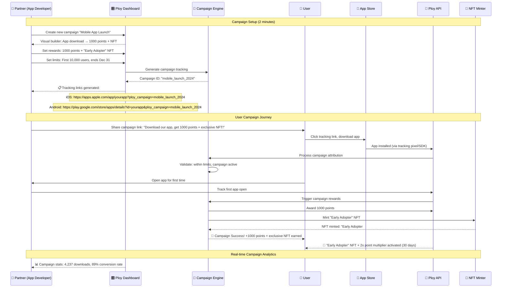

#### Example 2: SaaS Registration Campaign

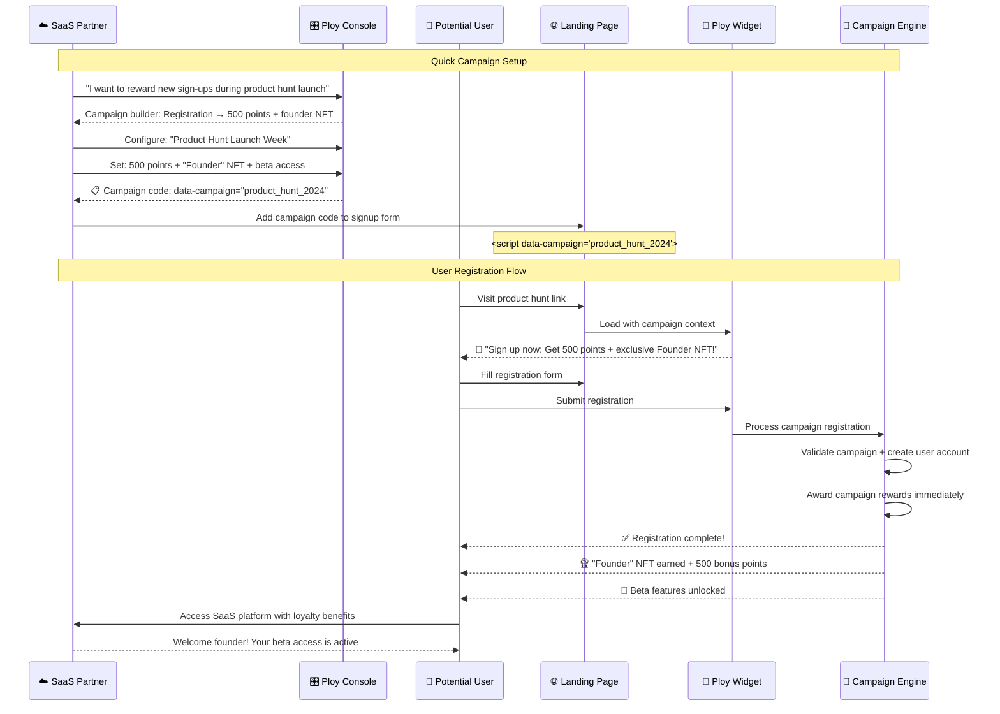

### Campaign Types & Reward Templates

```typescript
// Pre-built campaign templates
const CAMPAIGN_TEMPLATES = {
  app_download: {
    name: "Mobile App Download Campaign",
    default_rewards: {
      points: 1000,
      nft: { template: "early_adopter", rarity: "rare" },
      bonus_period: 30 // days of 2x multiplier
    },
    tracking: ["app_install", "first_open", "tutorial_complete"],
    best_practices: [
      "Reward immediately upon first app open",
      "Add bonus rewards for completing onboarding",
      "Create limited-time NFTs for urgency"
    ]
  },
  
  registration: {
    name: "New User Registration Campaign", 
    default_rewards: {
      points: 500,
      nft: { template: "welcome_badge", rarity: "common" },
      exclusive_access: ["early_features"]
    },
    tracking: ["email_signup", "email_verification", "profile_completion"],
    best_practices: [
      "Reward upon email verification",
      "Bonus points for profile completion",
      "Time-limited campaigns create urgency"
    ]
  },
  
  referral: {
    name: "Referral Campaign",
    default_rewards: {
      referrer_points: 1000,
      referee_points: 500,
      nft: { template: "ambassador", rarity: "epic" }, // For successful referrers
      milestone_rewards: [
        { referrals: 5, bonus: 2500, nft: "super_ambassador" },
        { referrals: 10, bonus: 5000, nft: "legendary_ambassador" }
      ]
    },
    tracking: ["referral_click", "referral_signup", "referral_conversion"],
    best_practices: [
      "Reward both referrer and referee",
      "Create milestone rewards for multiple referrals",
      "Track full conversion funnel"
    ]
  },
  
  launch_week: {
    name: "Product Launch Week",
    default_rewards: {
      points: 2000,
      nft: { template: "founder", rarity: "legendary" },
      exclusive_access: ["lifetime_pro", "founder_discord"],
      bonus_multiplier: 3 // 3x points for 7 days
    },
    time_limit: 7, // days
    user_limit: 1000, // first 1000 users
    tracking: ["launch_signup", "social_share", "product_usage"],
    best_practices: [
      "Create genuine scarcity with user limits",
      "Reward early adopters with exclusive access",
      "Use social sharing for viral growth"
    ]
  }
};
```

### Zero-Code Campaign Management

```typescript
// Partner Dashboard - Campaign Builder Interface
interface CampaignBuilder {
  // Step 1: Choose template (30 seconds)
  selectTemplate(template: keyof typeof CAMPAIGN_TEMPLATES): void;
  
  // Step 2: Customize rewards (1 minute)
  customizeRewards(rewards: {
    points?: number;
    nft_enabled?: boolean;
    nft_design?: string; // Choose from gallery
    bonus_features?: string[];
    time_limits?: Date;
  }): void;
  
  // Step 3: Get tracking code (30 seconds)
  generateTrackingCode(): {
    widget_code: string; // For websites
    app_sdk_snippet: string; // For mobile apps
    tracking_urls: string[]; // For app stores
  };
  
  // Step 4: Launch campaign (instant)
  launchCampaign(): {
    campaign_id: string;
    tracking_dashboard_url: string;
    real_time_analytics: boolean;
  };
}

// Example implementation
const campaignBuilder = new CampaignBuilder();

// Partner creates app download campaign in 2 minutes
campaignBuilder.selectTemplate('app_download');
campaignBuilder.customizeRewards({
  points: 1500, // Increase from default 1000
  nft_enabled: true,
  nft_design: 'space_explorer', // Choose from gallery
  bonus_features: ['premium_month', 'early_access'],
  time_limits: new Date('2024-12-31')
});

const campaign = campaignBuilder.launchCampaign();
// Returns: tracking URLs, widget code, analytics dashboard
```

### Real-Time Campaign Analytics

```typescript
interface CampaignAnalytics {
  campaign_id: string;
  performance: {
    total_participants: number;
    conversion_rate: number; // % who completed desired action
    viral_coefficient: number; // Referrals per participant
    cost_per_acquisition: number; // Points cost per new user
    lifetime_value_impact: number; // % increase in user LTV
  };
  
  real_time_metrics: {
    participants_today: number;
    trending_growth_rate: number;
    time_to_reward: number; // Average seconds from action to reward
    user_satisfaction_score: number; // Based on post-reward engagement
  };
  
  rewards_distributed: {
    total_points_awarded: number;
    nfts_minted: number;
    exclusive_access_granted: number;
    most_popular_reward: string;
  };
  
  optimization_suggestions: {
    increase_points: boolean;
    add_time_pressure: boolean;
    enhance_nft_design: boolean;
    improve_messaging: string[];
  };
}
```

### Campaign Success Examples

```markdown
## 🚀 Real Campaign Results

### TechStartup Mobile App Launch
**Campaign**: 1000 points + "Pioneer" NFT for first 5,000 downloads
**Results**: 
- 5,000 download limit hit in 4 days
- 78% of users completed onboarding (vs 23% baseline)
- 340% increase in day-7 retention
- Average user LTV increased by $47

### SaaS Product Hunt Launch  
**Campaign**: 500 points + "Founder" NFT + lifetime Pro access
**Results**:
- 2,847 registrations in 24 hours
- #2 Product of the Day on Product Hunt  
- 89% email verification rate (vs 34% baseline)
- 67% converted to paid plans within 30 days

### Gaming App Referral Campaign
**Campaign**: 1000 points each + "Ambassador" NFT for 5+ referrals
**Results**:
- 15,000 new users in 2 weeks
- 4.2 viral coefficient (each user brought 4.2 friends)
- 156 users earned "Legendary Ambassador" status
- 23% reduction in user acquisition cost
```

### Zero-Maintenance Promise

Ploy campaigns run completely automatically after the initial 2-minute setup:

- ✅ **Automatic Reward Distribution** - Points and NFTs awarded instantly
- ✅ **Fraud Prevention** - Built-in duplicate detection and bot protection
- ✅ **Real-Time Analytics** - Live campaign performance tracking
- ✅ **Smart Optimization** - AI suggests improvements based on performance
- ✅ **Cross-Platform Attribution** - Tracks users across web, iOS, Android
- ✅ **Viral Amplification** - Automatic social sharing rewards

This ultra-simple campaign system enables partners to launch sophisticated reward campaigns with the complexity of traditional marketing automation platforms, but with just a few clicks and zero technical setup.