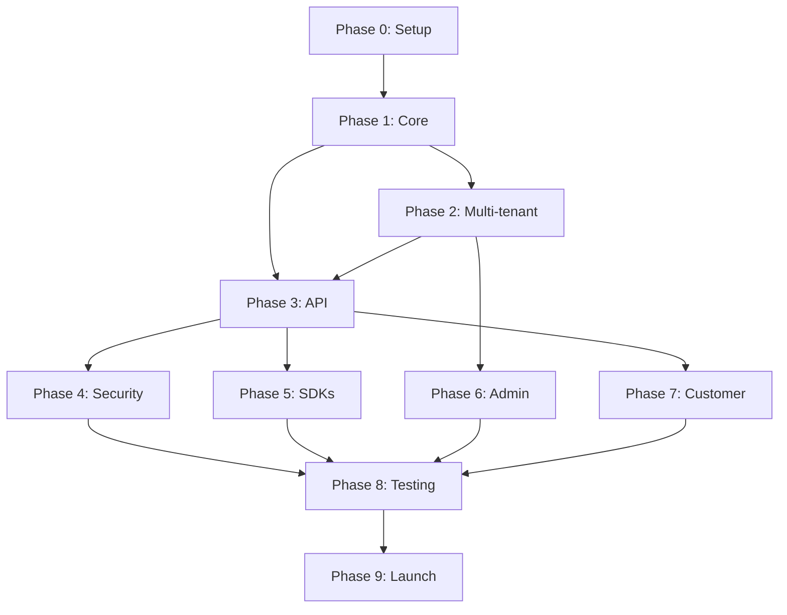

# Blockchain Loyalty Platform - Implementation Plan

## Overview
This plan breaks down the platform development into manageable modules that can be completed in 2-4 hour daily sessions over 13 weeks.

## Timeline: 13 Weeks to Beta Launch

### Phase 0: Project Setup & Foundation (Week 1)
**Daily commitment: 2-3 hours**

#### Day 1-2: Development Environment
- Set up Git repository structure
- Initialize monorepo with Lerna/Nx
- Configure TypeScript, ESLint, Prettier
- Set up Docker containers for local development
- Create initial project documentation

#### Day 3-4: Database & Infrastructure
- Design PostgreSQL schema
- Set up Redis for caching
- Configure development databases
- Create database migration system
- Set up basic CI/CD pipeline

#### Day 5-7: Blockchain Development Setup
- Install Hardhat/Truffle framework
- Configure Polygon Mumbai testnet
- Set up wallet management
- Create deployment scripts
- Test basic smart contract deployment

### Phase 1: Core Backend & Smart Contracts (Weeks 2-3)
**Daily commitment: 3-4 hours**

#### Week 2: Smart Contract Development
- Day 1-2: Master Registry contract
- Day 3-4: Loyalty Token template (ERC20)
- Day 5-6: Points management logic
- Day 7: Testing & deployment scripts

#### Week 3: Backend Foundation
- Day 1-2: NestJS setup with modules structure
- Day 3-4: Database models & repositories
- Day 5-6: Blockchain service integration
- Day 7: Basic authentication system

### Phase 2: Multi-Tenant System (Weeks 4-5)
**Daily commitment: 3-4 hours**

#### Week 4: Tenant Management
- Day 1-2: Tenant isolation middleware
- Day 3-4: Tenant registration system
- Day 5-6: Settings & configuration management
- Day 7: Subdomain routing

#### Week 5: Tenant Features
- Day 1-2: Per-tenant smart contract deployment
- Day 3-4: Custom branding system
- Day 5-6: Feature flags implementation
- Day 7: Testing & optimization

### Phase 3: API Development (Week 6)
**Daily commitment: 3-4 hours**

- Day 1: Members management endpoints
- Day 2: Points award/revoke endpoints
- Day 3: Balance & transaction endpoints
- Day 4: Webhook system
- Day 5: API documentation (OpenAPI)
- Day 6-7: Rate limiting & API security

### Phase 4: Security & Fraud Prevention (Week 7)
**Daily commitment: 3-4 hours**

- Day 1-2: Fraud detection algorithms
- Day 3: Risk scoring system
- Day 4: Account monitoring service
- Day 5: Smart contract security features
- Day 6-7: Security testing & auditing

### Phase 5: Integration Tools & SDKs (Week 8)
**Daily commitment: 2-3 hours**

- Day 1-2: JavaScript SDK
- Day 3: WordPress plugin basics
- Day 4: Shopify app foundation
- Day 5: Webhook testing tools
- Day 6-7: Integration documentation

### Phase 6: Admin Dashboard (Weeks 9-10)
**Daily commitment: 3-4 hours**

#### Week 9: Dashboard Foundation
- Day 1-2: React/Next.js setup
- Day 3-4: Authentication & routing
- Day 5-7: Core UI components

#### Week 10: Dashboard Features
- Day 1-2: Tenant management interface
- Day 3-4: Analytics & reporting
- Day 5-6: Member management
- Day 7: Settings & configuration

### Phase 7: Customer Portal & Wallet (Week 11)
**Daily commitment: 3-4 hours**

- Day 1-2: Customer authentication
- Day 3-4: Wallet interface
- Day 5: Transaction history
- Day 6: Points redemption flow
- Day 7: Mobile responsiveness

### Phase 8: Testing & Optimization (Week 12)
**Daily commitment: 2-3 hours**

- Day 1-2: Unit & integration tests
- Day 3: End-to-end testing
- Day 4: Performance optimization
- Day 5: Security penetration testing
- Day 6-7: Bug fixes & polish

### Phase 9: Beta Launch & Deployment (Week 13)
**Daily commitment: 2-4 hours**

- Day 1-2: Production infrastructure setup
- Day 3: Deployment automation
- Day 4: Monitoring & logging
- Day 5: Beta user onboarding
- Day 6-7: Launch & initial support

## Daily Work Structure

### Recommended Schedule (3 hours/day)
```
Hour 1: Review & Planning
- Check previous day's progress
- Review current module objectives
- Plan today's tasks

Hour 2-3: Implementation
- Code development
- Testing
- Documentation

Final 15 min: Commit & Notes
- Git commits
- Update progress tracker
- Note blockers/questions
```

## Module Dependencies



## Minimum Viable Product (MVP) Features

### Week 6 Checkpoint - Core MVP
- Basic multi-tenant system
- Points award/revoke functionality
- Simple API endpoints
- Basic security measures

### Week 10 Checkpoint - Extended MVP
- Admin dashboard
- Fraud detection
- Integration tools
- Customer wallet interface

### Week 13 - Beta Ready
- Full feature set
- Tested & optimized
- Documentation complete
- Ready for beta users

## Risk Mitigation

### Technical Risks
1. **Blockchain complexity**: Start with testnet, use proven libraries
2. **Multi-tenant isolation**: Implement thorough testing
3. **Performance**: Design for horizontal scaling from start

### Time Risks
1. **Buffer time**: Each phase has 1-2 days buffer
2. **Parallel work**: Some modules can progress simultaneously
3. **MVP focus**: Non-critical features can be post-launch

## Success Metrics

### Development Milestones
- [ ] Smart contracts deployed to testnet (Week 2)
- [ ] First API endpoint working (Week 3)
- [ ] Multi-tenant demo ready (Week 5)
- [ ] Security audit passed (Week 7)
- [ ] Admin dashboard functional (Week 10)
- [ ] Beta user onboarded (Week 13)

### Launch Criteria
- All core features implemented
- Security measures in place
- Documentation complete
- 95%+ test coverage
- Performance benchmarks met
- Beta feedback incorporated

## Post-Launch Roadmap

### Month 4-5: Stabilization
- Bug fixes from beta feedback
- Performance optimization
- Additional payment integrations
- Mobile app development

### Month 6: Growth Features
- Advanced analytics
- AI-powered insights
- Additional blockchain networks
- White-label enhancements

## Resources & Tools

### Development Tools
- **IDE**: VS Code with blockchain extensions
- **Blockchain**: Hardhat, ethers.js, OpenZeppelin
- **Backend**: NestJS, TypeORM, Bull queues
- **Frontend**: Next.js, TailwindCSS, React Query
- **Testing**: Jest, Cypress, Hardhat testing
- **Monitoring**: Grafana, Prometheus, Sentry

### Learning Resources
- OpenZeppelin documentation
- NestJS courses
- Polygon developer docs
- Security best practices guides

## Getting Started Checklist

### Week 1 Prerequisites
- [ ] Development machine setup
- [ ] Node.js 18+ installed
- [ ] PostgreSQL & Redis installed
- [ ] Blockchain wallet created
- [ ] Polygon testnet tokens acquired
- [ ] Git repository initialized

### First Day Tasks
1. Clone repository structure
2. Install dependencies
3. Run hello-world smart contract
4. Set up local databases
5. Configure environment variables

---

This plan provides a structured approach to building the platform with realistic daily time commitments. Adjust the pace based on your experience level and available time.