# Ploy Platform Overview & Architecture

## Executive Summary

Ploy is a revolutionary blockchain-powered loyalty platform that transforms traditional points into valuable digital assets. Built with a multi-chain architecture prioritizing SUI and Solana for zero gas fees, Ploy enables businesses across all industries to create comprehensive loyalty programs with NFT ecosystems, cross-chain compatibility, and advanced policy engines.

---

## 🏗️ Complete Blockchain Architecture

### Multi-Chain Infrastructure

Ploy operates on a sophisticated multi-chain architecture designed for optimal performance, cost-efficiency, and user experience across different blockchain networks.

#### Primary Chains
```yaml
primary_chains:
  sui:
    priority: "Tier 1"
    benefits: ["Gas sponsorship", "Object-centric", "Sub-second finality"]
    use_cases: ["Customer transactions", "NFT operations", "Real-time rewards"]
    
  solana:
    priority: "Tier 1" 
    benefits: ["Fee payer service", "Compressed NFTs", "High throughput"]
    use_cases: ["Bulk operations", "Gaming integration", "DeFi protocols"]
    
  polygon:
    priority: "Tier 2"
    benefits: ["EVM compatibility", "Low costs", "Enterprise adoption"]
    use_cases: ["Business integration", "Legacy compatibility", "Cross-chain bridge"]
```

#### Cross-Chain Bridge Infrastructure

```typescript
interface CrossChainBridge {
  architecture: {
    validator_network: "Decentralized validator set",
    consensus_mechanism: "Multi-signature + time locks",
    security_model: "2/3 validator consensus required",
    monitoring: "Real-time cross-chain state sync"
  },
  
  supported_operations: {
    token_transfers: "Loyalty points between chains",
    nft_bridging: "Achievement NFTs cross-chain",
    state_synchronization: "Customer data consistency",
    metadata_sync: "Program configuration updates"
  },
  
  performance_metrics: {
    transfer_time: "< 5 minutes average",
    success_rate: "99.5%+",
    gas_optimization: "Batch processing for efficiency",
    cost_structure: "Platform-sponsored for users"
  }
}
```

### Blockchain Token Lifecycle Management

#### Token Creation and Distribution


#### Multi-Chain Policy Engines

Each blockchain network has specialized policy engines optimized for their unique characteristics:

```typescript
interface MultiChainPolicyEngines {
  sui_policy_engine: {
    focus: "Real-time customer interactions",
    features: ["Object-based rewards", "Gas-sponsored transactions", "Instant confirmations"],
    optimization: "Customer experience priority"
  },
  
  solana_policy_engine: {
    focus: "High-volume operations and gaming",
    features: ["Compressed NFT rewards", "Bulk processing", "DeFi integration"],
    optimization: "Throughput and gaming features"
  },
  
  evm_policy_engine: {
    focus: "Enterprise integration and compatibility",
    features: ["Standard compliance", "Enterprise tools", "Legacy integration"],
    optimization: "Business adoption and compliance"
  }
}
```

---

## 💎 NFT Complete Ecosystem

### NFT Rewards System Architecture

Ploy's NFT ecosystem transforms traditional loyalty rewards into valuable, tradeable digital assets that customers truly own.

#### Achievement NFT Categories

```yaml
nft_categories:
  milestone_achievements:
    examples: ["First Purchase", "Loyalty Anniversary", "Spending Milestones"]
    characteristics: ["Permanent ownership", "Verifiable accomplishment", "Social sharing"]
    utility: ["Status display", "Exclusive access", "Tier benefits"]
    
  membership_nfts:
    examples: ["VIP Status", "Premium Member", "Founder Edition"]
    characteristics: ["Dynamic attributes", "Evolving benefits", "Transferable status"]
    utility: ["Ongoing perks", "Priority access", "Enhanced earning rates"]
    
  gaming_nfts:
    examples: ["Tournament Victories", "Skill Badges", "Rare Collectibles"]
    characteristics: ["Cross-game utility", "Competitive value", "Trading potential"]
    utility: ["Gaming advantages", "Tournament entry", "Bragging rights"]
    
  utility_nfts:
    examples: ["Discount Coupons", "Service Access", "Experience Tickets"]
    characteristics: ["Functional utility", "Time-limited", "Specific benefits"]
    utility: ["Direct value", "Service access", "Experience redemption"]
```

#### NFT Marketplace Infrastructure

```typescript
interface NFTMarketplace {
  trading_features: {
    instant_trading: "Direct NFT purchases with loyalty points",
    auction_system: "Timed auctions with automatic bid extensions",
    bundle_sales: "Multiple NFT collections in single transaction",
    rental_system: "Temporary NFT access with smart contract protection"
  },
  
  marketplace_economics: {
    transaction_fees: "2.5% platform fee on trades",
    royalty_system: "5% back to original issuing business",
    point_conversion: "Dynamic pricing based on rarity and demand",
    liquidity_incentives: "Market maker rewards for active trading"
  },
  
  cross_chain_compatibility: {
    multi_chain_trading: "Trade NFTs across SUI, Solana, and EVM",
    bridge_integration: "Seamless NFT transfers between chains",
    unified_metadata: "Consistent NFT properties across networks",
    gas_optimization: "Platform-sponsored cross-chain operations"
  }
}
```

### Gaming Integration & Token Economy

#### Cross-Game Asset System
```yaml
gaming_integration:
  asset_interoperability:
    - cross_game_nfts: "Loyalty NFTs usable in partner games"
    - universal_achievements: "Accomplishments recognized across platforms"
    - skill_verification: "Blockchain-verified gaming credentials"
    
  play_to_earn_synergy:
    - gaming_rewards: "Earn loyalty points through gaming activities"
    - tournament_prizes: "NFT rewards for competitive achievements"
    - community_challenges: "Collaborative gaming experiences"
    
  web3_gaming_features:
    - true_ownership: "Players own their gaming achievements"
    - trading_economy: "Active marketplace for gaming NFTs"
    - guild_systems: "Team-based loyalty and rewards"
```

#### NFT Staking and Value Creation

```typescript
interface NFTValueSystem {
  staking_mechanisms: {
    nft_staking: {
      concept: "Stake NFTs to earn additional loyalty points",
      rewards: "5-15% APY based on NFT rarity and lock period",
      utility: "Passive income while maintaining NFT ownership",
      flexibility: "Unstake anytime with reward calculation"
    },
    
    liquidity_provision: {
      concept: "Provide NFTs to rental pools",
      rewards: "Earn fees from NFT rentals",
      risk_management: "Smart contract protection and insurance",
      market_making: "Help create liquid NFT rental markets"
    }
  },
  
  value_appreciation: {
    rarity_system: "Limited edition NFTs increase in value",
    utility_growth: "More use cases increase NFT utility",
    community_value: "Network effects drive ecosystem value",
    cross_platform: "Multi-platform utility increases demand"
  }
}
```

---

## ⚡ Gas-less Transactions & Cross-Chain Features

### Zero-Fee Transaction Implementation

Ploy eliminates blockchain complexity and costs for end users through comprehensive gas sponsorship across all supported chains.

#### SUI Gas-less Implementation
```typescript
// SUI Move smart contract for gas sponsorship
module loyalty::gas_sponsor {
    struct GasSponsorCap has key {
        id: UID,
        sponsored_operations: vector<String>,
        daily_limit: u64,
        current_usage: u64
    }
    
    public fun sponsor_loyalty_transaction(
        sponsor_cap: &mut GasSponsorCap,
        operation_type: String,
        gas_budget: u64
    ): bool {
        // Verify operation is sponsored
        assert!(vector::contains(&sponsor_cap.sponsored_operations, &operation_type), 1);
        
        // Check daily limits
        assert!(sponsor_cap.current_usage + gas_budget <= sponsor_cap.daily_limit, 2);
        
        // Update usage tracking
        sponsor_cap.current_usage = sponsor_cap.current_usage + gas_budget;
        
        true
    }
}
```

#### Solana Fee Payer Service
```typescript
interface SolanaFeePayerService {
  architecture: {
    fee_payer_accounts: "Pool of funded accounts for transaction sponsorship",
    rotation_strategy: "Automatic rotation to prevent rate limiting",
    monitoring_system: "Real-time balance and performance tracking",
    refill_automation: "Automatic funding when balances run low"
  },
  
  sponsored_operations: {
    loyalty_transactions: "Point earning, redemption, transfers",
    nft_operations: "Minting, trading, metadata updates",
    cross_chain_bridges: "Token transfers between networks",
    governance_actions: "DAO voting, proposal creation"
  },
  
  cost_optimization: {
    batch_processing: "Bundle multiple operations in single transaction",
    priority_fees: "Optimize for speed vs cost based on operation type",
    compression: "Use compressed NFTs for cost efficiency",
    state_compression: "Reduce on-chain storage requirements"
  }
}
```

### Unified Token Exchange System

#### Cross-Platform Token Exchange
```yaml
token_exchange_features:
  universal_exchange:
    concept: "Trade loyalty tokens across different business platforms"
    mechanism: "Automated market maker (AMM) with dynamic pricing"
    liquidity: "Platform-provided base liquidity + user contributions"
    benefits: "Unlock value from unused loyalty points"
    
  cross_chain_liquidity:
    concept: "Seamless token transfers between blockchain networks"
    mechanism: "Bridge contracts with validator network consensus"
    speed: "< 5 minutes for cross-chain transfers"
    cost: "Platform-sponsored for users, minimal fees for businesses"
    
  value_preservation:
    concept: "Maintain token value during platform migrations"
    mechanism: "Smart contract escrow with governance oversight"
    protection: "Insurance fund for migration guarantee"
    flexibility: "Gradual migration with partial transfers"
```

#### Dynamic Exchange Rate System
```typescript
interface ExchangeRateEngine {
  pricing_factors: {
    platform_utility: "Higher utility platforms command premium rates",
    demand_supply: "Market forces determine relative values",
    network_effects: "Larger networks create higher token value",
    business_performance: "Successful businesses increase token worth"
  },
  
  rate_calculation: {
    base_rate: "1:1 for tokens within same business category",
    utility_multiplier: "0.8x to 1.5x based on platform utility scores",
    liquidity_factor: "Higher liquidity pools get better rates",
    volume_incentives: "Large exchanges get improved rates"
  },
  
  market_making: {
    algorithm: "Constant product AMM with concentrated liquidity",
    slippage_protection: "Maximum 5% slippage for standard trades",
    arbitrage_prevention: "MEV protection and fair ordering",
    fee_structure: "0.3% trading fee split between liquidity providers"
  }
}
```

---

## 🔑 Universal Login SSO & Identity Management

### Single Sign-On Architecture

Ploy provides seamless authentication across all integrated platforms while maintaining user privacy and security.

#### Identity Management System
```typescript
interface UniversalIdentity {
  authentication_methods: {
    web2_options: ["Email/Password", "Social OAuth", "Phone SMS"],
    web3_options: ["Wallet Connect", "MetaMask", "Hardware Wallets"],
    biometric_options: ["Face ID", "Touch ID", "Hardware Keys"],
    multi_factor: "Configurable 2FA with backup codes"
  },
  
  privacy_controls: {
    data_sharing: "Granular permissions for each business platform",
    anonymization: "Zero-knowledge proofs for sensitive operations",
    consent_management: "Easy opt-in/opt-out for data sharing",
    right_to_erasure: "GDPR-compliant data deletion options"
  },
  
  profile_synchronization: {
    unified_wallet: "Single wallet address across all platforms",
    preference_sync: "Communication and privacy settings",
    achievement_display: "Showcase accomplishments across platforms",
    reputation_portability: "Trust scores transfer between businesses"
  }
}
```

#### Cross-Platform Authentication Flow

```mermaid
sequenceDiagram
    participant User as 👤 User
    participant Platform as 🏢 Business Platform
    participant PloySSO as 🔑 Ploy SSO
    participant Identity as 🆔 Identity Provider
    participant Blockchain as ⛓️ Blockchain
    
    User->>Platform: Access loyalty features
    Platform->>PloySSO: Authentication request
    PloySSO->>User: Show unified login options
    User->>Identity: Choose authentication method
    Identity->>PloySSO: Verify credentials
    PloySSO->>Blockchain: Create/verify wallet association
    Blockchain-->>PloySSO: Wallet verification complete
    PloySSO->>Platform: Authenticated user session
    Platform->>User: Access granted with loyalty features
    
    Note over User, Blockchain: Seamless experience across all platforms
```


### Multi-Platform Access Control

#### Permission Management System
```yaml
access_control:
  platform_permissions:
    read_access:
      - basic_profile: "Name, email, preferences"
      - loyalty_balance: "Current points and tier status"
      - achievement_history: "Earned NFTs and milestones"
      
    write_access:
      - transaction_signing: "Approve point earning and redemption"
      - profile_updates: "Modify preferences and settings"
      - social_sharing: "Share achievements and referrals"
      
    administrative_access:
      - data_export: "Download complete loyalty history"
      - account_deletion: "Request account and data removal"
      - consent_management: "Modify data sharing permissions"
  
  business_integration:
    api_access_levels:
      - basic_tier: "Read-only access to public profile data"
      - standard_tier: "Transaction creation and loyalty operations"
      - premium_tier: "Advanced analytics and custom integrations"
      - enterprise_tier: "Full platform access and white-label options"
```

---

## 🔧 Advanced Features & Specialized Systems

### Flexibility Framework

Ploy's platform is designed for maximum flexibility and customization to accommodate diverse business needs and evolving requirements.

#### Configuration-Driven Architecture
```typescript
interface FlexibilityFramework {
  dynamic_configuration: {
    business_rules: "Runtime modification of loyalty program rules",
    reward_structures: "A/B testing for different reward mechanisms",
    user_interfaces: "Customizable branding and user experience",
    integration_settings: "Flexible API and webhook configurations"
  },
  
  plugin_ecosystem: {
    core_plugins: "Essential loyalty functionality modules",
    marketplace_plugins: "Community-contributed extensions",
    custom_plugins: "Business-specific functionality development",
    plugin_security: "Sandboxed execution with permission system"
  },
  
  workflow_builder: {
    visual_editor: "Drag-and-drop loyalty program design",
    template_library: "Pre-built workflows for common use cases",
    custom_logic: "Advanced scripting for complex requirements",
    testing_environment: "Safe testing of new configurations"
  }
}
```

#### Multi-Environment Management
```yaml
environment_strategy:
  development:
    purpose: "Feature development and testing"
    blockchain: "Testnets for all supported chains"
    data: "Synthetic test data and scenarios"
    monitoring: "Development-focused debugging tools"
    
  staging:
    purpose: "Pre-production validation and integration testing"
    blockchain: "Testnet with production-like conditions"
    data: "Anonymized production data for realistic testing"
    monitoring: "Production-equivalent monitoring and alerting"
    
  production:
    purpose: "Live customer-facing operations"
    blockchain: "Mainnet with full security measures"
    data: "Real customer and business data"
    monitoring: "24/7 monitoring with automatic alerting"
    
  sandbox:
    purpose: "Customer testing and experimentation"
    blockchain: "Isolated testnet environment"
    data: "Customer-controlled test scenarios"
    monitoring: "Basic monitoring for customer support"
```

### Edge Cases & Reliability Handling

#### Complex Scenario Management
```typescript
interface EdgeCaseHandling {
  transaction_scenarios: {
    split_payments: {
      challenge: "Customer pays with multiple methods",
      solution: "Proportional point allocation based on payment splits",
      implementation: "Smart contract handles multi-input transactions"
    },
    
    partial_fulfillment: {
      challenge: "Order partially shipped or cancelled",
      solution: "Pro-rated point earning based on fulfilled amount",
      implementation: "Event-driven point adjustments with audit trail"
    },
    
    cross_border_transactions: {
      challenge: "Currency conversion and international regulations",
      solution: "Real-time exchange rates with compliance checking",
      implementation: "Multi-currency support with regulatory validation"
    }
  },
  
  network_resilience: {
    blockchain_outages: {
      mitigation: "Multi-chain failover with automatic switching",
      fallback: "Off-chain transaction queuing for later processing",
      recovery: "Automatic sync when networks restore"
    },
    
    api_failures: {
      mitigation: "Circuit breaker pattern with exponential backoff",
      fallback: "Cached responses for critical operations",
      recovery: "Health checks and automatic service restoration"
    }
  }
}
```

### Redemption & Void Mechanisms

#### Advanced Point Management
```yaml
redemption_strategies:
  industry_specific:
    saas_platforms:
      - feature_unlocks: "Premium functionality access"
      - service_credits: "Additional API calls or storage"
      - priority_support: "Enhanced customer service tier"
      
    ecommerce:
      - discount_codes: "Percentage or fixed amount discounts"
      - free_shipping: "Waived delivery fees"
      - product_rewards: "Free items or upgrades"
      
    web3_defi:
      - protocol_benefits: "Reduced fees or enhanced yields"
      - governance_power: "Additional voting weight in DAOs"
      - exclusive_access: "Early access to new protocol features"
  
  void_scenarios:
    fraud_detection:
      trigger: "Suspicious activity patterns detected"
      action: "Temporary point freeze and investigation"
      resolution: "Manual review with customer communication"
      
    policy_violations:
      trigger: "Terms of service violations"
      action: "Point forfeiture with detailed explanation"
      appeal: "Customer appeals process with human review"
      
    technical_errors:
      trigger: "System errors causing incorrect point allocation"
      action: "Automatic correction with customer notification"
      compensation: "Bonus points for inconvenience when appropriate"
```

#### Smart Caching & Performance Optimization
```typescript
interface PerformanceOptimization {
  caching_strategy: {
    redis_layers: {
      hot_cache: "Frequently accessed user balances and profiles",
      warm_cache: "Recent transaction history and preferences",
      cold_cache: "Historical data and analytics aggregations"
    },
    
    cache_invalidation: {
      real_time: "Immediate updates for critical operations",
      batch_updates: "Periodic refresh for non-critical data",
      event_driven: "Smart invalidation based on business events"
    }
  },
  
  batch_processing: {
    point_allocation: "Bundle multiple rewards in single blockchain transaction",
    notification_delivery: "Aggregate notifications for better user experience",
    analytics_computation: "Periodic calculation of insights and reports",
    blockchain_sync: "Efficient state synchronization across chains"
  }
}
```

---

## 📊 System Integration & Performance

### Enterprise Integration Capabilities

Ploy is designed to integrate seamlessly with existing business systems and workflows.

#### API Architecture
```yaml
api_design:
  rest_endpoints:
    - authentication: "/auth/* - OAuth, JWT, and session management"
    - loyalty_operations: "/loyalty/* - Points, rewards, and redemptions"
    - nft_management: "/nft/* - NFT minting, trading, and metadata"
    - analytics: "/analytics/* - Reporting and business intelligence"
    
  graphql_gateway:
    - unified_queries: "Single endpoint for complex data requirements"
    - real_time_subscriptions: "Live updates for balances and transactions"
    - schema_stitching: "Combine multiple data sources efficiently"
    
  webhook_system:
    - event_notifications: "Real-time business event delivery"
    - retry_logic: "Guaranteed delivery with exponential backoff"
    - security: "HMAC signatures and IP whitelisting"
```

#### Enterprise System Integrations
```typescript
interface EnterpriseIntegrations {
  erp_systems: {
    sap: "Native SAP Business One and S/4HANA connectors",
    oracle: "Oracle ERP Cloud and NetSuite integration",
    microsoft: "Dynamics 365 Business Central connectivity",
    workday: "Financial and HCM system integration"
  },
  
  crm_platforms: {
    salesforce: "Native Salesforce app with custom objects",
    hubspot: "Complete CRM integration with workflow automation",
    microsoft_dynamics: "Customer 360 with loyalty data integration",
    pipedrive: "Sales process integration with loyalty insights"
  },
  
  ecommerce_platforms: {
    shopify: "Native Shopify app with checkout integration",
    magento: "Adobe Commerce integration with loyalty widgets",
    woocommerce: "WordPress plugin with extensive customization",
    bigcommerce: "Native app with advanced reporting features"
  }
}
```

### Performance & Scalability Metrics

#### System Performance Targets
```yaml
performance_benchmarks:
  api_response_times:
    - authentication: "< 100ms (95th percentile)"
    - balance_queries: "< 150ms (95th percentile)"
    - transaction_processing: "< 300ms (95th percentile)"
    - complex_analytics: "< 2s (95th percentile)"
    
  blockchain_performance:
    - sui_transactions: "< 2s confirmation time"
    - solana_operations: "< 10s confirmation time"
    - cross_chain_transfers: "< 5 minutes end-to-end"
    - gas_sponsorship: "100% success rate for sponsored operations"
    
  scalability_targets:
    - concurrent_users: "100,000+ simultaneous active users"
    - transactions_per_second: "10,000+ TPS during peak usage"
    - data_storage: "Petabyte-scale with sub-second query performance"
    - global_latency: "< 100ms response time from any region"
```

---

## 🔒 Security & Compliance Framework

### Comprehensive Security Architecture

Security is paramount in Ploy's design, with multi-layered protection for both businesses and customers.

#### Smart Contract Security
```typescript
interface SecurityFramework {
  smart_contract_protection: {
    formal_verification: "Mathematical proof of contract correctness",
    multi_signature_controls: "Admin operations require multiple approvals",
    time_locks: "Critical changes have mandatory waiting periods",
    emergency_pause: "Circuit breakers for incident response"
  },
  
  operational_security: {
    infrastructure: "SOC2 Type II compliant hosting and operations",
    access_control: "Zero-trust architecture with minimal privileges",
    monitoring: "24/7 security monitoring with automated alerting",
    incident_response: "Dedicated security team with escalation procedures"
  },
  
  data_protection: {
    encryption: "AES-256 encryption for data at rest and in transit",
    key_management: "Hardware security modules for key storage",
    privacy_preservation: "Zero-knowledge proofs for sensitive operations",
    compliance: "GDPR, CCPA, HIPAA, and SOX compliance frameworks"
  }
}
```

#### Regulatory Compliance
```yaml
compliance_framework:
  data_privacy:
    gdpr: "Complete European data protection compliance"
    ccpa: "California consumer privacy act compliance"
    pipeda: "Canadian personal information protection"
    lgpd: "Brazilian general data protection law"
    
  financial_regulations:
    money_transmission: "Licensed in required jurisdictions"
    aml_kyc: "Anti-money laundering and know-your-customer procedures"
    sanctions_screening: "OFAC and international sanctions compliance"
    reporting: "Automated regulatory reporting and audit trails"
    
  blockchain_regulations:
    token_classification: "Utility token design for regulatory clarity"
    cross_border: "Compliance with international blockchain regulations"
    dao_governance: "Structured governance for regulatory alignment"
    tax_reporting: "Support for cryptocurrency tax obligations"
```

This comprehensive platform overview consolidates the core architecture, NFT ecosystem, blockchain features, and advanced systems into a single, navigable document that provides complete visibility into Ploy's capabilities and technical implementation.