# Policies & Workflows Comprehensive Guide

## Overview

This comprehensive document consolidates all policy configurations, workflow patterns, and operational mechanisms for the Ploy blockchain loyalty platform. It covers conditional policies, industry-specific configurations, advanced features, and complete workflow implementations across all supported business types.

## Table of Contents

1. [Policy Engine Architecture](#policy-engine-architecture)
2. [Conditional Policies](#conditional-policies)
3. [Industry-Specific Policies](#industry-specific-policies)
4. [Policy Engine Workflows](#policy-engine-workflows)
5. [Advanced Features & Edge Cases](#advanced-features--edge-cases)
6. [Redemption & Void Mechanisms](#redemption--void-mechanisms)
7. [Implementation Examples](#implementation-examples)

---

## 🏗️ Policy Engine Architecture

### Core Policy Framework

The Ploy platform uses a sophisticated policy engine that enables dynamic rule evaluation, real-time adjustments, and complex conditional logic for loyalty program management.

#### Policy Engine Components
```typescript
interface PolicyEngine {
  rule_evaluation: {
    real_time_processing: "Sub-second policy evaluation",
    conditional_logic: "Complex if-then-else rule chains",
    context_awareness: "User, business, and environmental factors",
    dynamic_updates: "Live policy modifications without downtime"
  },
  
  policy_types: {
    earning_policies: "Point accumulation rules and multipliers",
    redemption_policies: "Spending rules and restrictions",
    tier_policies: "Membership level progression rules",
    expiration_policies: "Point lifecycle and validity rules",
    fraud_policies: "Anomaly detection and prevention rules"
  },
  
  execution_layers: {
    blockchain_layer: "Smart contract enforcement",
    application_layer: "Business logic implementation",
    user_interface_layer: "Real-time policy display",
    analytics_layer: "Policy performance tracking"
  }
}
```

### Multi-Chain Policy Coordination
```yaml
cross_chain_policies:
  policy_synchronization:
    - consistent_rules: "Same policies across all supported chains"
    - chain_specific_optimizations: "Gas-less transaction handling"
    - bridge_coordination: "Cross-chain transfer policies"
    - failover_mechanisms: "Alternative chain execution"
    
  smart_contract_policies:
    sui_contracts:
      - object_centric_rewards: "SUI's object model optimization"
      - sponsored_transactions: "Gas-less user experience"
      - instant_finality: "Real-time policy execution"
      
    solana_contracts:
      - high_throughput_batch: "Bulk policy execution"
      - compressed_nfts: "Efficient achievement NFTs"
      - fee_payer_integration: "Sponsored transaction framework"
      
    evm_contracts:
      - standard_compatibility: "OpenZeppelin policy patterns"
      - meta_transaction_support: "Gasless transaction relaying"
      - multi_chain_bridges: "Cross-EVM policy coordination"
```

---

## ⚙️ Conditional Policies

### Dynamic Rule Engine

The conditional policy system enables businesses to create sophisticated, context-aware loyalty programs that adapt to user behavior, business conditions, and external factors.

#### Context-Aware Policy Evaluation
```typescript
interface ConditionalPolicyFramework {
  context_factors: {
    user_context: {
      loyalty_tier: "Bronze, Silver, Gold, Platinum tiers",
      purchase_history: "Historical transaction patterns",
      engagement_level: "Platform interaction frequency",
      referral_status: "Customer advocacy activities"
    },
    
    business_context: {
      inventory_levels: "Stock-based dynamic pricing",
      seasonal_factors: "Holiday and seasonal adjustments",
      performance_metrics: "Revenue and growth targets",
      competitive_landscape: "Market-responsive policies"
    },
    
    temporal_context: {
      time_of_day: "Peak vs off-peak reward rates",
      day_of_week: "Weekend vs weekday policies",
      seasonal_periods: "Holiday-specific rules",
      campaign_windows: "Limited-time promotional periods"
    },
    
    environmental_context: {
      location_based: "Geographic policy variations",
      weather_conditions: "Weather-responsive campaigns",
      economic_indicators: "Market-adaptive policies",
      regulatory_environment: "Compliance-driven rule adjustments"
    }
  }
}
```

#### Advanced Conditional Logic Patterns
```yaml
conditional_patterns:
  progressive_earning:
    concept: "Increasing rewards for sustained engagement"
    implementation:
      - week_1_4: "Base earning rate"
      - week_5_8: "1.2x multiplier for sustained engagement"
      - week_9_12: "1.5x multiplier for long-term loyalty"
      - week_13+: "2x multiplier for power users"
      
  purchase_velocity_bonuses:
    concept: "Reward frequent purchasing patterns"
    rules:
      - single_purchase: "1x base points"
      - 2_purchases_week: "1.25x multiplier"
      - 3_purchases_week: "1.5x multiplier"
      - 4+_purchases_week: "2x multiplier + bonus NFT"
      
  social_engagement_multipliers:
    concept: "Amplify rewards for social sharing"
    triggers:
      - social_share: "+50% points bonus"
      - review_posting: "+75% points bonus"
      - referral_signup: "+100% points bonus"
      - viral_content: "+200% points bonus for trending posts"
      
  inventory_based_incentives:
    concept: "Dynamic rewards based on business needs"
    logic:
      - high_inventory: "2x points for overstocked items"
      - normal_inventory: "1x standard point rate"
      - low_inventory: "0.5x points to preserve stock"
      - out_of_stock: "0x points + waitlist NFT reward"
```

### A/B Testing Integration
```typescript
interface ABTestingPolicies {
  experimentation_framework: {
    policy_variants: {
      control_group: "Standard 1x earning rate",
      variant_a: "1.5x earning rate with reduced redemption options",
      variant_b: "1x earning rate with premium redemption options",
      variant_c: "Tiered earning (1x-3x) based on spend levels"
    },
    
    testing_methodology: {
      random_assignment: "Statistical user distribution",
      cohort_tracking: "Long-term behavior analysis",
      conversion_metrics: "Purchase frequency and value tracking",
      statistical_significance: "95% confidence interval requirements"
    },
    
    dynamic_optimization: {
      real_time_adjustment: "Policy performance monitoring",
      automated_graduation: "Promote winning variants automatically",
      rollback_mechanisms: "Instant reversion for underperforming policies",
      multi_variant_testing: "Complex policy combination testing"
    }
  }
}
```

---

## 🏭 Industry-Specific Policies

### SaaS & Technology Platforms

#### Hybrid Reward Implementation
```yaml
saas_policy_framework:
  primary_track_action_based:
    api_usage_milestones:
      first_api_call: "50 points + welcome NFT"
      1000_api_calls: "200 points + integration badge"
      10000_api_calls: "500 points + developer certificate NFT"
      100000_api_calls: "1000 points + API master achievement"
      
    feature_adoption_rewards:
      first_integration: "100 points"
      advanced_feature_usage: "250 points per feature"
      full_platform_utilization: "1000 points + power user status"
      
    community_contribution:
      documentation_contribution: "150 points per accepted PR"
      community_forum_help: "25 points per helpful answer"
      tutorial_creation: "500 points + content creator badge"
      
  secondary_track_purchase_multipliers:
    subscription_tier_bonuses:
      basic_tier: "1x base earning rate"
      professional_tier: "1.5x earning multiplier"
      enterprise_tier: "2x earning multiplier + exclusive features"
      
    annual_payment_bonuses:
      monthly_billing: "1x base rate"
      annual_billing: "1.25x multiplier + loyalty appreciation bonus"
      
    usage_volume_rewards:
      under_quota: "1x standard rate"
      at_quota: "1.2x multiplier"
      over_quota: "1.5x multiplier + efficiency achievement"
      
  advanced_saas_features:
    developer_advocacy_program:
      blog_post_mentions: "200 points + social proof NFT"
      conference_presentations: "1000 points + speaker certificate"
      case_study_participation: "500 points + success story badge"
      
    integration_ecosystem_rewards:
      marketplace_app_publish: "1000 points + developer badge"
      app_download_milestones: "100 points per 1000 downloads"
      5_star_app_rating: "250 point bonus"
```

### E-commerce & Retail

#### Omnichannel Policy Configuration
```typescript
interface EcommercePolicy {
  hybrid_reward_structure: {
    action_based_primary: {
      product_reviews: {
        text_review: "25 points",
        photo_review: "50 points", 
        video_review: "100 points",
        verified_purchase_bonus: "+50% multiplier"
      },
      
      social_engagement: {
        product_share: "15 points",
        outfit_sharing: "30 points (fashion)",
        recipe_sharing: "30 points (food)",
        unboxing_video: "100 points + influencer consideration"
      },
      
      community_participation: {
        q_and_a_answers: "20 points per helpful answer",
        style_advice: "25 points (fashion vertical)",
        product_comparisons: "35 points",
        user_generated_content: "50-200 points based on engagement"
      }
    },
    
    purchase_multipliers_secondary: {
      order_value_tiers: {
        under_50: "1x base rate",
        fifty_to_100: "1.2x multiplier",
        hundred_to_250: "1.5x multiplier",
        over_250: "2x multiplier + VIP shipping"
      },
      
      frequency_bonuses: {
        first_time_customer: "Welcome bonus: 200 points",
        monthly_shopper: "1.25x earning multiplier",
        weekly_shopper: "1.5x earning multiplier",
        multiple_weekly: "2x multiplier + early access"
      },
      
      category_specialization: {
        single_category_focus: "1x base rate",
        multi_category_shopper: "1.3x cross-category bonus",
        brand_ambassador: "1.5x for brand-specific purchases",
        trendsetter: "2x for new product early adoption"
      }
    }
  },
  
  seasonal_and_event_policies: {
    holiday_campaigns: {
      black_friday: "3x points + exclusive NFT collection",
      cyber_monday: "2.5x points + tech category focus",
      valentine_day: "2x points + romantic collection NFTs",
      back_to_school: "2x points + educational discounts"
    },
    
    inventory_management_rewards: {
      clearance_incentives: "3x points for end-of-season items",
      new_arrival_bonuses: "1.5x points for first 48 hours",
      pre_order_rewards: "2x points + exclusive access NFT",
      bundle_purchase_bonuses: "2.5x points for curated bundles"
    }
  }
}
```

### Financial Services & FinTech

#### Compliance-First Policy Framework
```yaml
fintech_policy_architecture:
  regulatory_compliance_layer:
    kyc_integration:
      - verified_identity_bonus: "100 points + verification badge"
      - full_profile_completion: "50 points"
      - document_verification: "75 points + security achievement"
      
    transaction_monitoring:
      - aml_compliance_checks: "Automatic policy adjustment for suspicious activity"
      - velocity_limits: "Point earning caps based on transaction patterns"
      - geographic_restrictions: "Location-based policy modifications"
      
  hybrid_rewards_implementation:
    financial_wellness_actions:
      budget_goal_completion: "100 points + financial health NFT"
      savings_milestone_achievement: "200 points per milestone"
      investment_education_completion: "150 points + investor certificate"
      credit_score_improvement: "500 points + financial progress badge"
      
    transaction_based_multipliers:
      account_balance_tiers:
        under_1k: "1x base earning rate"
        1k_to_10k: "1.25x multiplier" 
        10k_to_50k: "1.5x multiplier + premium features"
        over_50k: "2x multiplier + wealth management perks"
        
      product_usage_bonuses:
        single_product: "1x base rate"
        multi_product_customer: "1.3x cross-product bonus"
        full_suite_adoption: "1.7x complete ecosystem bonus"
        premium_service_user: "2x premium customer multiplier"
        
  risk_adjusted_rewards:
    credit_products:
      - on_time_payments: "Standard earning rate maintenance"
      - early_payments: "1.25x bonus for early payment"
      - autopay_setup: "1.15x convenience bonus"
      - payment_miss_penalty: "0.5x earning rate for 30 days"
      
    investment_products:
      - portfolio_diversification: "Bonus points for balanced portfolios"
      - long_term_holding: "1.5x bonus for 1+ year holds"
      - educational_engagement: "Points for completing investment courses"
      - risk_assessment_participation: "Bonus for risk profile updates"
```

### Gaming & Entertainment

#### Play-to-Earn Integration Policies
```typescript
interface GamingPolicy {
  achievement_based_rewards: {
    skill_progression: {
      level_up_rewards: "Base: 100 points per level",
      skill_mastery: "500 points + mastery NFT certificate",
      leaderboard_positions: {
        top_1_percent: "1000 points + champion badge",
        top_5_percent: "500 points + elite player status",
        top_10_percent: "250 points + skilled gamer recognition"
      }
    },
    
    tournament_participation: {
      tournament_entry: "50 points for participation",
      qualifying_rounds: "100 points per round advancement",
      finals_participation: "500 points + finalist badge",
      championship_victory: "2000 points + championship NFT"
    },
    
    community_contributions: {
      content_creation: "200 points + creator badge per tutorial",
      community_moderation: "25 points per moderation action",
      bug_reporting: "100 points + tester recognition",
      strategy_guide_creation: "500 points + strategist badge"
    }
  },
  
  spending_multipliers: {
    in_game_purchases: {
      cosmetic_items: "1x base earning rate",
      gameplay_enhancements: "1.5x strategic investment bonus",
      premium_content: "2x content supporter multiplier",
      limited_edition_items: "3x collector bonus + rarity NFT"
    },
    
    subscription_tiers: {
      free_to_play: "1x base earning rate",
      premium_monthly: "1.5x subscriber bonus",
      annual_subscription: "2x loyalty subscriber multiplier",
      lifetime_membership: "3x lifetime member status"
    },
    
    social_spending: {
      friend_gifting: "1.5x generosity bonus",
      guild_contributions: "2x team player multiplier",
      community_event_support: "2.5x community champion bonus",
      charity_fundraising: "3x social impact multiplier"
    }
  },
  
  cross_game_asset_policies: {
    nft_utility_rewards: {
      asset_transfer_between_games: "100 points + interoperability bonus",
      cross_platform_achievement_sync: "200 points + universal gamer status",
      asset_trading_activity: "Trading volume-based point bonuses",
      collection_completion: "1000 points + master collector NFT"
    }
  }
}
```

### Healthcare & Wellness

#### Privacy-Compliant Wellness Rewards
```yaml
healthcare_policy_framework:
  privacy_first_design:
    anonymized_participation:
      - wellness_goal_completion: "Points without revealing specific health data"
      - aggregate_community_challenges: "Group achievements with individual privacy"
      - encrypted_health_metrics: "Zero-knowledge proof rewards"
      
    hipaa_compliant_rewards:
      - provider_visit_confirmation: "Points for preventive care without diagnosis data"
      - medication_adherence: "Adherence rewards without medication specifics"
      - exercise_participation: "Activity points without detailed health metrics"
      
  wellness_action_rewards:
    preventive_care_engagement:
      annual_checkup_completion: "200 points + preventive care badge"
      vaccination_updates: "100 points + health protection achievement"
      screening_participation: "150 points + health awareness certificate"
      
    lifestyle_improvement_actions:
      fitness_goal_achievement: "100 points + fitness milestone NFT"
      nutrition_goal_completion: "75 points + healthy eating badge"
      stress_management_participation: "125 points + wellness warrior status"
      sleep_quality_improvement: "100 points + rest champion achievement"
      
  provider_network_multipliers:
    in_network_utilization:
      preferred_provider_visits: "1.5x network optimization bonus"
      telemedicine_usage: "1.25x digital health adoption bonus"
      integrated_care_coordination: "2x comprehensive care multiplier"
      
    health_plan_tier_bonuses:
      basic_plan: "1x base earning rate"
      premium_plan: "1.5x enhanced benefits multiplier"
      comprehensive_plan: "2x complete coverage bonus"
```

### Travel & Hospitality

#### Experience-Based Loyalty Policies
```typescript
interface TravelPolicy {
  destination_achievement_system: {
    geographic_exploration: {
      new_city_visit: "200 points + city explorer badge",
      new_country_visit: "500 points + international traveler NFT",
      continent_completion: "2000 points + world explorer status",
      unesco_site_visit: "300 points + heritage site certificate"
    },
    
    experience_diversity: {
      cultural_experience: "150 points + culture enthusiast badge",
      adventure_activity: "200 points + adventure seeker status",
      culinary_exploration: "100 points + foodie achievement",
      wellness_retreat: "250 points + wellness traveler NFT"
    },
    
    social_travel_rewards: {
      group_booking_organizer: "300 points + trip organizer badge",
      solo_traveler_achievements: "200 points + independent explorer status",
      family_travel_coordination: "250 points + family travel champion",
      couple_travel_milestones: "200 points + romantic getaway certificate"
    }
  },
  
  spending_tier_multipliers: {
    accommodation_levels: {
      budget_conscious: "1x base earning rate",
      mid_range_comfort: "1.5x balanced traveler bonus",
      luxury_experience: "2x premium experience multiplier",
      ultra_luxury: "3x ultimate luxury bonus + concierge NFT"
    },
    
    booking_pattern_rewards: {
      advance_booking: "1.25x planning ahead bonus",
      spontaneous_booking: "1.15x adventure spirit bonus",
      package_deal_booking: "1.4x comprehensive booking multiplier",
      loyalty_program_booking: "1.6x program loyalty bonus"
    },
    
    seasonal_and_peak_adjustments: {
      off_season_travel: "1.5x off-peak explorer bonus",
      shoulder_season: "1.25x balanced season multiplier",
      peak_season: "1x standard rate",
      holiday_travel: "0.9x rate + holiday spirit NFT"
    }
  }
}
```

### Cloud Infrastructure & B2B Services

#### Enterprise Efficiency Reward Policies
```yaml
cloud_infrastructure_policies:
  optimization_achievement_rewards:
    cost_efficiency_improvements:
      10_percent_cost_reduction: "500 points + efficiency expert badge"
      automated_scaling_implementation: "300 points + automation champion NFT"
      resource_utilization_optimization: "200 points + optimization specialist status"
      
    sustainability_achievements:
      carbon_footprint_reduction: "400 points + green computing certificate"
      renewable_energy_usage: "300 points + sustainable tech advocate badge"
      efficiency_benchmark_achievement: "600 points + sustainability leader NFT"
      
    innovation_adoption_rewards:
      new_service_early_adoption: "250 points + innovation pioneer badge"
      beta_testing_participation: "200 points + beta tester recognition"
      feedback_contribution: "100 points + product development contributor"
      
  spending_and_usage_multipliers:
    volume_tier_bonuses:
      startup_tier: "1x base earning rate"
      growth_tier: "1.5x scale-up multiplier"
      enterprise_tier: "2x enterprise customer bonus"
      strategic_account: "3x strategic partner multiplier"
      
    commitment_level_rewards:
      pay_as_you_go: "1x flexible usage rate"
      annual_commitment: "1.25x planning commitment bonus"
      multi_year_contract: "1.5x long-term partnership multiplier"
      
    service_breadth_bonuses:
      single_service_user: "1x focused usage rate"
      multi_service_adoption: "1.3x ecosystem utilization bonus"
      full_platform_integration: "1.7x comprehensive adoption multiplier"
      strategic_partnership: "2x strategic ecosystem bonus"
```

### Web3/DeFi Platforms

#### Protocol-Native Reward Mechanisms
```typescript
interface Web3DeFiPolicy {
  defi_participation_rewards: {
    liquidity_provision: {
      first_liquidity_addition: "100 points + DeFi beginner NFT",
      consistent_liquidity_provider: "200 points monthly + reliable provider badge",
      large_liquidity_provider: "Volume-based points + whale status",
      impermanent_loss_compensation: "Bonus points to offset IL during volatility"
    },
    
    governance_participation: {
      first_vote_cast: "50 points + governance participant badge",
      proposal_creation: "200 points + community leader recognition",
      regular_voting_participation: "25 points per vote + active citizen status",
      governance_forum_contribution: "150 points + community contributor NFT"
    },
    
    security_contributions: {
      bug_bounty_participation: "Variable points based on severity + security researcher badge",
      protocol_audit_engagement: "500 points + security specialist recognition",
      vulnerability_disclosure: "1000+ points + responsible disclosure certificate",
      educational_security_content: "300 points + security educator badge"
    }
  },
  
  token_economy_multipliers: {
    staking_participation: {
      short_term_staking: "1x base earning rate",
      medium_term_commitment: "1.5x commitment bonus (6+ months)",
      long_term_staking: "2x long-term vision multiplier (1+ year)",
      validator_participation: "3x network security contribution bonus"
    },
    
    cross_chain_activities: {
      single_chain_usage: "1x focused usage rate",
      multi_chain_portfolio: "1.4x cross-chain explorer bonus",
      bridge_utilization: "1.2x interoperability bonus per bridge use",
      ecosystem_diversification: "1.6x ecosystem maximalist multiplier"
    },
    
    nft_marketplace_engagement: {
      nft_creation: "200 points + creator recognition badge",
      active_trading: "Trading volume-based points + trader status",
      collection_curation: "300 points + curator specialist NFT",
      marketplace_promotion: "150 points + community promoter badge"
    }
  },
  
  risk_adjusted_reward_mechanisms: {
    smart_contract_interaction_bonuses: {
      audited_protocol_usage: "1x standard rate",
      new_protocol_early_adoption: "1.5x pioneer bonus + risk-taker badge",
      bug_bounty_protected_protocols: "1.25x security-conscious bonus",
      insurance_covered_activities: "1.1x protected participation bonus"
    },
    
    market_volatility_adjustments: {
      stable_market_conditions: "1x base earning rate",
      high_volatility_periods: "1.3x volatility resilience bonus",
      market_crash_participation: "1.5x diamond hands multiplier",
      recovery_period_engagement: "1.4x market recovery champion bonus"
    }
  }
}
```

### Food & Beverage Industry

#### Culinary Experience & Community Policies
```yaml
food_beverage_policy_framework:
  culinary_exploration_rewards:
    menu_diversity_engagement:
      new_item_trial: "25 points + culinary explorer badge"
      seasonal_menu_participation: "50 points + seasonal food enthusiast"
      chef_special_ordering: "75 points + chef's choice adventurer"
      full_menu_exploration: "300 points + menu master achievement"
      
    dietary_preference_support:
      healthy_choice_selection: "40 points + wellness-focused diner badge"
      sustainable_option_choice: "50 points + eco-conscious consumer NFT"
      local_ingredient_preference: "35 points + local food supporter status"
      plant_based_choice: "45 points + plant-based lifestyle advocate"
      
  social_dining_and_sharing_rewards:
    community_engagement:
      restaurant_review_posting: "100 points + food critic badge"
      recipe_sharing: "150 points + home chef recognition"
      food_photography_sharing: "75 points + food photographer status"
      dining_experience_storytelling: "200 points + food storyteller NFT"
      
    group_dining_coordination:
      group_reservation_organizer: "100 points + social dining coordinator"
      special_occasion_planning: "150 points + celebration organizer badge"
      corporate_event_coordination: "200 points + business dining specialist"
      
  purchase_pattern_multipliers:
    frequency_and_loyalty_bonuses:
      occasional_visitor: "1x base earning rate"
      regular_customer: "1.3x frequent diner bonus (weekly visits)"
      daily_customer: "1.7x daily routine customer multiplier"
      multiple_daily_visits: "2x ultra-loyal customer status"
      
    order_value_tier_rewards:
      small_order: "1x base rate"
      average_order: "1.2x standard dining multiplier"
      large_order: "1.5x generous dining bonus"
      group_order_coordinator: "1.8x group dining organizer multiplier"
      
    delivery_vs_dine_in_policies:
      dine_in_experience: "1.4x in-person dining premium"
      takeout_convenience: "1.1x takeout efficiency bonus"
      delivery_service_usage: "1x delivery convenience rate"
      curbside_pickup: "1.2x hybrid convenience bonus"
```

---

## 🔧 Policy Engine Workflows

### Real-Time Policy Evaluation

#### Dynamic Rule Processing Architecture
```typescript
interface PolicyWorkflowEngine {
  real_time_evaluation: {
    event_triggers: {
      user_action_events: "Purchase, login, share, review, referral",
      business_context_changes: "Inventory, pricing, seasonal adjustments",
      external_data_updates: "Weather, market conditions, competitive intel",
      time_based_triggers: "Schedule-based policy activations"
    },
    
    evaluation_pipeline: {
      event_ingestion: "Real-time event stream processing",
      context_enrichment: "Add user, business, and environmental context",
      rule_matching: "Pattern matching against active policies",
      calculation_engine: "Points, multipliers, and reward computation",
      execution_validation: "Fraud checks and limit enforcement",
      blockchain_commitment: "Smart contract execution",
      notification_delivery: "Real-time user and business notifications"
    },
    
    performance_optimization: {
      rule_caching: "Frequently accessed rules in memory",
      batch_processing: "Group similar evaluations for efficiency",
      predictive_pre_computation: "Anticipate common scenarios",
      load_balancing: "Distribute evaluation across multiple nodes"
    }
  }
}
```

#### Multi-Industry Policy Orchestration
```yaml
policy_orchestration:
  industry_specific_engines:
    saas_policy_engine:
      focus: "API usage, feature adoption, developer engagement"
      specialization: "Technical integration depth tracking"
      unique_features: ["code_contribution_rewards", "integration_complexity_bonuses"]
      
    ecommerce_policy_engine:
      focus: "Purchase behavior, social engagement, brand loyalty"
      specialization: "Omnichannel customer journey optimization"
      unique_features: ["inventory_based_dynamic_pricing", "social_commerce_integration"]
      
    fintech_policy_engine:
      focus: "Financial wellness, regulatory compliance, risk management"
      specialization: "Regulatory-compliant reward mechanisms"
      unique_features: ["kyc_milestone_rewards", "financial_education_bonuses"]
      
    gaming_policy_engine:
      focus: "Achievement progression, community participation, competition"
      specialization: "Real-time skill and engagement tracking"
      unique_features: ["tournament_performance_rewards", "cross_game_asset_bonuses"]
      
  universal_coordination_layer:
    cross_industry_policies:
      - referral_rewards: "Universal referral bonus structure"
      - tier_progression: "Standardized loyalty tier advancement"
      - fraud_detection: "Cross-industry suspicious activity patterns"
      - data_privacy: "Universal privacy-preserving reward mechanisms"
      
    policy_conflict_resolution:
      - priority_hierarchy: "Industry-specific > universal > default policies"
      - rule_override_mechanisms: "Business-specific policy customizations"
      - temporal_policy_management: "Time-based policy activation and deactivation"
```

### Cross-Platform Policy Coordination

#### Multi-Business Ecosystem Policies
```typescript
interface EcosystemPolicyCoordination {
  cross_business_rewards: {
    partner_network_benefits: {
      gym_to_restaurant: "Fitness achievement points usable at healthy restaurants",
      bookstore_to_cafe: "Reading milestone rewards transferable to coffee shops",
      automotive_to_parts: "Service loyalty points for parts and accessories",
      travel_to_activities: "Destination points for local experience bookings"
    },
    
    ecosystem_point_sharing: {
      value_preservation: "Maintain point value across partner businesses",
      conversion_rates: "Dynamic exchange rates based on business relationships",
      network_effects: "Increased value for broader ecosystem participation",
      loyalty_portability: "Seamless point transfer and redemption"
    }
  },
  
  consortium_management: {
    shared_policy_governance: {
      democratic_policy_updates: "Voting-based consortium policy changes",
      benefit_sharing_agreements: "Revenue and cost distribution frameworks",
      common_fraud_protection: "Shared security and fraud prevention",
      collective_customer_acquisition: "Joint marketing and customer acquisition"
    },
    
    individual_business_autonomy: {
      custom_policy_overlays: "Business-specific policy customizations",
      brand_specific_rewards: "Unique rewards maintaining brand identity",
      competitive_differentiation: "Policies that maintain competitive advantages",
      opt_out_mechanisms: "Selective participation in consortium policies"
    }
  }
}
```

---

## 🛡️ Advanced Features & Edge Cases

### Comprehensive Edge Case Handling

#### Complex Transaction Scenarios
```typescript
interface EdgeCaseHandling {
  split_payment_transactions: {
    scenario: "Customer pays with multiple payment methods",
    policy_approach: {
      proportional_allocation: "Points distributed based on payment method ratios",
      primary_method_bonus: "Extra points for largest payment method",
      multi_method_complexity_bonus: "Bonus for using multiple payment methods",
      fraud_detection_enhanced: "Additional verification for complex payments"
    },
    
    implementation: {
      real_time_calculation: "Instant point allocation across payment methods",
      audit_trail_maintenance: "Complete transaction decomposition tracking",
      reconciliation_mechanisms: "Automated correction for processing errors",
      customer_transparency: "Clear breakdown of point allocation sources"
    }
  },
  
  partial_order_fulfillment: {
    scenario: "Orders partially shipped, cancelled, or modified",
    policy_responses: {
      pro_rated_earning: "Points proportional to fulfilled order value",
      shipping_delay_compensation: "Bonus points for delivery delays",
      cancellation_fee_offset: "Points to offset cancellation charges",
      upgrade_surprise_bonuses: "Extra points for free upgrades"
    },
    
    workflow_automation: {
      event_driven_adjustments: "Automatic point recalculation on order changes",
      customer_communication: "Transparent notification of point adjustments",
      exception_handling: "Manual review queue for complex scenarios",
      appeal_process: "Customer dispute resolution mechanism"
    }
  },
  
  cross_border_transactions: {
    scenario: "International transactions with currency conversion",
    policy_considerations: {
      currency_normalization: "Convert all transactions to base currency for point calculation",
      exchange_rate_timing: "Use transaction-time exchange rates",
      international_fee_compensation: "Bonus points to offset international fees",
      regulatory_compliance: "Country-specific legal requirement adherence"
    },
    
    implementation_challenges: {
      real_time_currency_data: "Live exchange rate integration",
      tax_implication_handling: "International tax law compliance",
      multi_jurisdiction_privacy: "Cross-border data protection compliance",
      dispute_resolution: "International customer service processes"
    }
  }
}
```

#### Network Resilience and Failover
```yaml
network_resilience_policies:
  blockchain_outage_management:
    primary_chain_failure:
      - automatic_failover: "Switch to secondary blockchain network"
      - transaction_queuing: "Store pending transactions for later processing"
      - customer_communication: "Transparent status updates during outages"
      - manual_override: "Emergency manual processing capabilities"
      
    multi_chain_coordination:
      - cross_chain_validation: "Verify transaction consistency across networks"
      - bridge_failure_handling: "Alternative cross-chain transfer mechanisms"
      - chain_specific_optimizations: "Leverage unique chain capabilities"
      - unified_user_experience: "Seamless experience regardless of underlying chain"
      
  api_and_service_failures:
    circuit_breaker_patterns:
      - automatic_service_isolation: "Isolate failing services to prevent cascade failures"
      - graceful_degradation: "Maintain core functionality during partial outages"
      - exponential_backoff: "Smart retry mechanisms with increasing delays"
      - health_check_automation: "Continuous service monitoring and recovery"
      
    cached_response_strategies:
      - critical_operation_caching: "Cache essential data for offline operation"
      - stale_data_policies: "Define acceptable data freshness levels"
      - cache_invalidation_rules: "Smart cache refresh based on business rules"
      - offline_mode_capabilities: "Limited functionality during complete outages"
```

### Fraud Detection and Prevention

#### ML-Powered Anomaly Detection
```typescript
interface FraudDetectionPolicies {
  behavioral_anomaly_detection: {
    user_pattern_analysis: {
      velocity_checks: "Detect unusually high transaction frequencies",
      geographic_anomalies: "Flag transactions from unexpected locations",
      device_fingerprinting: "Track device-based behavior patterns",
      time_pattern_analysis: "Identify unusual timing of activities"
    },
    
    earning_pattern_scrutiny: {
      point_accumulation_spikes: "Flag sudden large point accumulations",
      referral_fraud_detection: "Identify fake referral networks",
      gaming_behavior_identification: "Detect attempts to exploit reward mechanisms",
      social_engagement_authenticity: "Verify genuine social media interactions"
    },
    
    redemption_behavior_monitoring: {
      bulk_redemption_flags: "Detect unusual redemption patterns",
      high_value_redemption_verification: "Additional verification for large redemptions",
      redemption_velocity_limits: "Limit redemption frequency to prevent abuse",
      cross_platform_redemption_tracking: "Monitor redemptions across business ecosystem"
    }
  },
  
  automated_response_mechanisms: {
    real_time_intervention: {
      transaction_blocking: "Immediately halt suspicious transactions",
      account_temporary_suspension: "Freeze accounts pending investigation",
      enhanced_verification_triggers: "Require additional identity verification",
      manual_review_queue: "Escalate complex cases to human reviewers"
    },
    
    graduated_response_system: {
      warning_notifications: "Alert users about suspicious activity",
      temporary_earning_restrictions: "Limit point earning during investigation",
      redemption_hold_periods: "Delay redemptions for verification",
      permanent_account_restrictions: "Long-term limitations for confirmed fraud"
    }
  }
}
```

---

## 🔥 Redemption & Void Mechanisms

### Industry-Specific Redemption Strategies

#### Dynamic Redemption Options
```yaml
redemption_strategies:
  saas_platforms:
    feature_unlocks:
      premium_functionality: "Advanced analytics, API access, integrations"
      usage_limit_increases: "Additional API calls, storage, bandwidth"
      priority_support_access: "Dedicated support channels, faster response times"
      
    service_credits:
      billing_discounts: "Apply points as credits against monthly bills"
      feature_trial_extensions: "Extended access to premium features"
      usage_overage_forgiveness: "Offset overages with loyalty points"
      
  ecommerce_retail:
    discount_mechanisms:
      percentage_discounts: "5%, 10%, 15%, 20% off orders"
      fixed_amount_discounts: "$5, $10, $25, $50 off purchases"
      free_shipping_offers: "Standard, expedited, overnight shipping"
      
    product_rewards:
      free_items: "Sample products, accessories, add-ons"
      product_upgrades: "Size upgrades, premium versions, enhanced features"
      exclusive_access: "Limited edition items, pre-orders, VIP sales"
      
  gaming_entertainment:
    virtual_asset_redemptions:
      cosmetic_items: "Skins, themes, avatar customizations"
      gameplay_enhancements: "Power-ups, boosters, special abilities"
      exclusive_content: "Levels, characters, storylines"
      
    real_world_rewards:
      merchandise: "Branded apparel, collectibles, gaming accessories"
      event_access: "Tournament entries, exclusive events, meet-and-greets"
      physical_collectibles: "Limited edition items, signed memorabilia"
      
  travel_hospitality:
    experience_redemptions:
      room_upgrades: "Suite upgrades, better views, premium amenities"
      service_enhancements: "Late checkout, priority boarding, lounge access"
      local_experiences: "Tours, activities, restaurant reservations"
      
    travel_convenience:
      fee_waivers: "Baggage fees, change fees, booking fees"
      travel_credits: "Future booking credits, airline vouchers"
      loyalty_status_boosts: "Tier upgrades, status extensions"
```

### Smart Point Burning and Void Scenarios

#### Automated Void Management
```typescript
interface VoidMechanisms {
  fraud_detection_voids: {
    suspicious_activity_triggers: {
      velocity_anomalies: "Unusually high point accumulation rates",
      referral_fraud: "Fake referral network detection",
      gaming_exploitation: "Attempts to exploit reward mechanisms",
      account_sharing: "Multiple users sharing single account"
    },
    
    void_procedures: {
      immediate_point_freeze: "Suspend point earning during investigation",
      graduated_void_percentages: "25%, 50%, 75%, 100% point forfeiture based on severity",
      appeal_process: "Allow customers to dispute void decisions",
      restoration_mechanisms: "Restore points for false positives"
    }
  },
  
  policy_violation_voids: {
    terms_of_service_violations: {
      minor_violations: "Warning + temporary point earning suspension",
      moderate_violations: "Partial point forfeiture + account restrictions",
      severe_violations: "Complete point forfeiture + account termination",
      repeat_offenses: "Escalating penalties for repeat violations"
    },
    
    business_rule_violations: {
      redemption_abuse: "Attempting to exploit redemption mechanisms",
      point_transfer_violations: "Unauthorized point transfers or sales",
      fake_engagement: "Artificially inflating social engagement metrics",
      system_exploitation: "Technical exploitation of platform vulnerabilities"
    }
  },
  
  technical_error_corrections: {
    over_allocation_corrections: {
      system_bug_over_awards: "Automatic correction of technical over-awards",
      duplicate_transaction_cleanup: "Remove points from duplicate transactions",
      calculation_error_fixes: "Correct mathematical errors in point calculations",
      integration_error_remediation: "Fix points from third-party integration errors"
    },
    
    correction_procedures: {
      transparent_customer_communication: "Clear explanation of corrections",
      goodwill_gestures: "Bonus points for inconvenience when appropriate",
      audit_trail_maintenance: "Complete record of all corrections",
      prevention_system_updates: "Improve systems to prevent similar errors"
    }
  }
}
```

### Batch Processing and Performance Optimization

#### High-Performance Redemption Engine
```yaml
batch_processing_architecture:
  redemption_queue_management:
    priority_queues:
      - high_value_redemptions: "VIP customers and large redemptions"
      - standard_redemptions: "Regular customer redemptions"
      - bulk_processing: "Batch redemptions and automated processing"
      
    processing_optimization:
      - parallel_processing: "Multiple redemption streams"
      - database_connection_pooling: "Efficient database resource utilization"
      - caching_strategies: "Frequent redemption option caching"
      - load_balancing: "Distribute processing across multiple servers"
      
  smart_caching_mechanisms:
    redemption_option_caching:
      - hot_cache: "Most popular redemption options"
      - warm_cache: "Frequently accessed business-specific options"
      - cold_cache: "Historical redemption data and analytics"
      
    cache_invalidation_strategies:
      - real_time_updates: "Immediate cache refresh for inventory changes"
      - scheduled_refreshes: "Periodic cache updates for dynamic pricing"
      - event_driven_invalidation: "Cache refresh triggered by business events"
      
  performance_monitoring:
    real_time_metrics:
      - redemption_processing_time: "Average and 95th percentile processing times"
      - queue_length_monitoring: "Real-time queue depth tracking"
      - error_rate_tracking: "Failed redemption attempt monitoring"
      - customer_satisfaction: "Redemption experience feedback tracking"
```

---

## 📊 Implementation Examples

### Complete Workflow Examples

#### End-to-End SaaS Platform Workflow

```mermaid
sequenceDiagram
    participant User as 👤 SaaS User
    participant Frontend as 🖥️ SaaS Dashboard
    participant API as 🔗 API Gateway
    participant PolicyEngine as ⚙️ Policy Engine
    participant Database as 🗄️ PostgreSQL
    participant BlockchainService as 🔗 Blockchain Service
    participant LoyaltyContract as ⛓️ Loyalty Contract
    
    Note over User, LoyaltyContract: HYBRID REWARDS: Action-Based + Purchase Multipliers
    
    User->>Frontend: Complete API integration (1000 calls milestone)
    Frontend->>API: Track integration milestone event
    API->>PolicyEngine: Evaluate: API milestone + Pro tier multiplier
    PolicyEngine->>Database: Check: user tier, usage history, referral status
    Database-->>PolicyEngine: Pro tier: 1.5x multiplier, 900 calls previous
    PolicyEngine-->>API: Award: 300 base points × 1.5 tier multiplier = 450 points
    
    API->>BlockchainService: Mint 450 points + integration NFT
    BlockchainService->>LoyaltyContract: awardPoints(user, 450, "api_integration_hybrid")
    LoyaltyContract-->>BlockchainService: Transaction confirmed + NFT minted
    BlockchainService-->>API: Success: 450 points + achievement NFT
    API->>Database: Update balance, record hybrid calculation
    API-->>Frontend: Display: Points earned + achievement unlocked
    Frontend-->>User: "🎉 450 points + Integration Master NFT!"
```


#### Cross-Industry Consortium Workflow
```typescript
interface ConsortiumWorkflowExample {
  scenario: "Coffee shop customer earns points redeemable at partner bookstore",
  
  participants: {
    coffee_shop: "Primary earning business",
    bookstore: "Partner redemption business", 
    ploy_platform: "Orchestrating loyalty ecosystem",
    customer: "Multi-business loyalty member"
  },
  
  workflow_steps: {
    step_1: {
      action: "Customer purchases coffee",
      processing: "Coffee shop awards points through Ploy platform",
      result: "100 points earned + coffee lover badge"
    },
    
    step_2: {
      action: "Customer visits partner bookstore",
      processing: "Ploy platform recognizes customer and available points",
      result: "Display: 100 coffee points available for book purchase"
    },
    
    step_3: {
      action: "Customer redeems points for book discount",
      processing: "Cross-business redemption with value conversion",
      result: "100 coffee points = $5 book discount applied"
    },
    
    step_4: {
      action: "Revenue sharing between businesses",
      processing: "Automated financial settlement between partners",
      result: "Coffee shop receives redemption fee, bookstore gets new customer"
    }
  }
}
```

#### Multi-Chain Policy Execution
```yaml
multi_chain_workflow_example:
  scenario: "E-commerce customer earning rewards across SUI and Solana"
  
  chains_involved:
    sui_network:
      role: "Primary customer-facing transactions"
      advantages: "Gas-sponsored transactions, instant finality"
      use_cases: ["point_earning", "real_time_rewards", "customer_notifications"]
      
    solana_network:
      role: "Bulk processing and NFT operations"
      advantages: "High throughput, compressed NFTs, cost efficiency"
      use_cases: ["batch_processing", "nft_minting", "cross_chain_bridges"]
      
  execution_flow:
    customer_action:
      event: "Customer makes $100 purchase"
      immediate_processing: "SUI network for instant point allocation"
      background_processing: "Solana network for NFT milestone checking"
      
    policy_evaluation:
      sui_execution: "Real-time: 100 points for purchase"
      solana_analysis: "Background: Check if qualifies for milestone NFT"
      cross_chain_coordination: "Sync customer state across networks"
      
    reward_delivery:
      immediate: "100 points credited via SUI (gas-less)"
      delayed: "Milestone NFT minted on Solana if threshold reached"
      notification: "Customer receives combined notification of all rewards"
```

This comprehensive policies and workflows guide provides complete implementation guidance for all aspects of the Ploy loyalty platform's policy engine, from basic conditional logic to advanced multi-chain coordination and industry-specific optimizations.