# Complete Workflows & Implementation Examples

## Overview

This comprehensive document combines end-to-end workflows, implementation patterns, and real-world use cases with sample data to demonstrate how the Ploy blockchain loyalty platform works in practice across different industries.

## Table of Contents

1. [Architecture Overview](#architecture-overview)
2. [End-to-End Industry Workflows](#end-to-end-industry-workflows)
3. [Implementation Patterns](#implementation-patterns)
4. [Sample Data & Use Cases](#sample-data--use-cases)
5. [Advanced Workflow Examples](#advanced-workflow-examples)
6. [Data Visualization Examples](#data-visualization-examples)

---

## Architecture Overview

### Workflow Architecture Components

#### Web2 Layer
- **Frontend Applications**: Customer portals, admin dashboards
- **API Gateway**: Request routing, authentication, rate limiting
- **Business Logic Layer**: Industry-specific logic, policy engines
- **Database**: PostgreSQL for application data, Redis for caching
- **External Integrations**: Payment processors, third-party APIs

#### Blockchain Layer
- **Smart Contracts**: Loyalty tokens, NFT memberships, factory contracts
- **Blockchain Network**: SUI, Solana, Polygon, BSC, or other chains
- **IPFS**: Metadata storage for NFTs and certificates
- **Oracles**: External data feeds for dynamic policies

#### Bridge Layer
- **Blockchain Service**: Web3 interaction layer
- **Event Listeners**: Blockchain event monitoring
- **Transaction Queue**: Batch processing and retry logic
- **State Sync**: Keep Web2 and blockchain data consistent

---

## End-to-End Industry Workflows

### 1. SaaS Industry Workflow

#### Scenario: Hybrid Rewards - Action-Based Achievements + Purchase Multipliers

**Primary Track (Action-Based)**: API usage milestones, integration completions, documentation engagement
**Secondary Track (Purchase Multipliers)**: Subscription upgrades unlock higher earning rates

```mermaid
sequenceDiagram
    participant User as 👤 SaaS User
    participant Frontend as 🖥️ SaaS Dashboard
    participant API as 🔗 API Gateway
    participant PolicyEngine as ⚙️ Policy Engine
    participant Database as 🗄️ PostgreSQL
    participant BlockchainService as 🔗 Blockchain Service
    participant LoyaltyContract as ⛓️ Loyalty Contract
    participant TreasuryContract as 🏦 Treasury Contract

    Note over User, TreasuryContract: 1. FEATURE USAGE TRACKING
    User->>Frontend: Use API endpoint (500 calls)
    Frontend->>API: Track usage event
    API->>PolicyEngine: Evaluate usage milestone
    PolicyEngine->>Database: Check user tier & history
    Database-->>PolicyEngine: User: Pro tier, 400 calls this month
    PolicyEngine-->>API: Award 200 base points + 50 bonus (milestone: 500 calls)
    
    Note over User, TreasuryContract: 2. POINTS EARNING (WEB2 → BLOCKCHAIN)
    API->>BlockchainService: Award points request
    BlockchainService->>LoyaltyContract: awardPoints(user, 250, "api_milestone_hybrid")
    LoyaltyContract->>LoyaltyContract: _mint(user, 250) // 200 base + 50 achievement bonus
    LoyaltyContract-->>BlockchainService: Points awarded (tx hash)
    BlockchainService-->>API: Transaction confirmed
    API->>Database: Update user points balance
    API-->>Frontend: Show points notification
    Frontend-->>User: "🎉 250 points earned! 200 base + 50 achievement bonus"

    Note over User, TreasuryContract: 3. REDEMPTION REQUEST
    User->>Frontend: Request premium analytics unlock
    Frontend->>API: Redeem 1500 points for premium feature
    API->>PolicyEngine: Validate redemption eligibility
    PolicyEngine->>Database: Check user subscription & points
    Database-->>PolicyEngine: Valid: Pro user, 2000 points available

    Note over User, TreasuryContract: 4. POINTS BURNING & FEATURE UNLOCK
    API->>BlockchainService: Burn points for redemption
    BlockchainService->>LoyaltyContract: burnForRedemption(user, 1500, "premium_analytics")
    LoyaltyContract->>TreasuryContract: Transfer 1500 to treasury
    TreasuryContract-->>LoyaltyContract: Treasury updated
    LoyaltyContract-->>BlockchainService: Points moved to treasury
    
    Note over User, TreasuryContract: 5. WEB2 FEATURE ACTIVATION
    BlockchainService-->>API: Redemption confirmed
    API->>Database: Activate premium analytics (30 days)
    API->>Database: Record redemption transaction
    API-->>Frontend: Feature unlocked successfully
    Frontend-->>User: "✨ Premium Analytics unlocked for 30 days!"

    Note over User, TreasuryContract: 6. BACKGROUND PROCESSES
    loop Every 5 minutes
        BlockchainService->>LoyaltyContract: Listen for events
        LoyaltyContract-->>BlockchainService: PointsAwarded/Redeemed events
        BlockchainService->>Database: Sync blockchain state
    end
```



#### Real Implementation Example with Actual Data

```typescript
class SaaSTrialToEnterpriseWorkflow {
  // Real implementation example with actual data
  async processRealCustomerExample(): Promise<void> {
    const customerData = {
      customerId: "cust_john_dev_123",
      email: "john.developer@techcorp.com",
      company: "TechCorp Solutions",
      trialStartDate: "2024-03-01T10:00:00Z"
    };

    // Day 1: Trial start
    await this.executeAction(customerData.customerId, {
      type: "award_points",
      amount: 100,
      reason: "trial_welcome",
      metadata: { source: "workflow_automation" }
    });

    // Day 2: Onboarding completed (score: 85/100)
    const onboardingData = {
      score: 85,
      steps_completed: 4,
      time_to_complete: "45_minutes",
      integrations_connected: ["github", "slack"]
    };
    
    if (onboardingData.score >= 80) {
      await this.executeAction(customerData.customerId, {
        type: "award_points",
        amount: 500,
        reason: "onboarding_excellence",
        metadata: { 
          score: onboardingData.score,
          completion_time: onboardingData.time_to_complete
        }
      });
    }

    // Day 14: Trial end evaluation
    const trialUsageData = {
      api_calls: 8500,
      features_used: 6,
      days_active: 12,
      conversion_score: 78
    };

    if (trialUsageData.conversion_score >= 70) {
      // Convert to paid plan
      await this.executeAction(customerData.customerId, {
        type: "convert_to_paid",
        plan: "professional",
        points_awarded: 1000,
        metadata: {
          trial_usage: trialUsageData,
          conversion_probability: "high"
        }
      });
    }
  }
}
```

### 2. E-commerce Industry Workflow

#### Scenario: Shopping Journey with Dynamic Pricing & Cross-Platform Rewards

```mermaid
sequenceDiagram
    participant Sarah as 👩 Sarah Customer
    participant Shop as 🛍️ StyleMarket
    participant Cart as 🛒 Shopping Cart
    participant Loyalty as 🎁 Loyalty Engine
    participant Payment as 💳 Payment Service
    participant Blockchain as ⛓️ Blockchain
    participant Shipping as 📦 Shipping Service

    Note over Sarah, Shipping: Fashion Purchase Flow
    
    Sarah->>Shop: Browse summer dresses
    Shop->>Sarah: Show dress + points earning info
    Sarah->>Cart: Add dress ($89.99) to cart
    Cart->>Sarah: Cart total: $89.99 (90 points available)
    
    Sarah->>Loyalty: Check points balance: 1,200 points
    Sarah->>Cart: Apply 500 points discount ($25 off)
    Cart->>Cart: New total: $64.99 + tax
    
    Note over Cart: Order Summary:
    Note over Cart: - Summer Dress: $89.99
    Note over Cart: - Points Discount: -$25.00
    Note over Cart: - Tax: $5.19
    Note over Cart: - Total: $70.18
    
    Sarah->>Payment: Process payment
    Payment->>Blockchain: Burn 500 points
    Blockchain-->>Payment: Confirm burn
    Payment->>Payment: Charge $70.18 to credit card
    Payment-->>Shop: Payment confirmed
    
    Shop->>Loyalty: Calculate hybrid reward
    Loyalty->>Loyalty: Base: 70 points + Premium tier multiplier (1.25) = 87 points
    Loyalty->>Loyalty: Action bonus: Recent review + social share = +25 points
    Loyalty->>Blockchain: Mint 112 points (87 purchase + 25 action)
    Blockchain-->>Loyalty: Confirm mint
    
    Shop->>Shipping: Create shipping label
    Shipping->>Sarah: Shipping confirmation
    Loyalty->>Sarah: "💰 Earned 112 points! (87 purchase + 25 action bonus) Balance: 812 points"
    
    Note over Sarah: Final State:
    Note over Sarah: - Points spent: 500
    Note over Sarah: - Points earned: 112
    Note over Sarah: - Net change: -388 points
    Note over Sarah: - New balance: 812 points
```



#### Real Customer Example - Sarah's Shopping Journey

```typescript
async processRealShoppingExample(): Promise<PricingResult> {
  const sarahsShoppingData = {
    customerId: "cust_sarah_style_456",
    customerTier: "premium",
    purchaseHistory: {
      totalSpent: 1247.50,
      purchaseCount: 8,
      lastPurchase: 12, // days ago
      favoriteCategories: ["casual_wear", "accessories"],
      averageOrderValue: 155.94
    },
    currentCart: {
      total: 245.99,
      items: [
        { id: "dress_001", name: "Summer Dress", price: 89.99, category: "casual_wear" },
        { id: "bag_002", name: "Designer Handbag", price: 156.00, category: "accessories" }
      ]
    },
    seasonalEvents: [
      { name: "spring_sale", active: true, discount: 0.10 },
      { name: "category_boost", category: "casual_wear", pointsMultiplier: 1.5 }
    ]
  };

  // Process dynamic pricing
  let result: PricingResult = {
    originalPrice: 245.99,
    finalPrice: 245.99,
    pointsEarned: 246, // base points = floor(price)
    appliedRules: []
  };

  // Apply hybrid reward calculation
  const basePoints = Math.floor(result.originalPrice * 0.4); // 40% of purchase as base points
  const actionBonus = await calculateActionBonus(sarahsShoppingData.customerId);
  
  // Premium tier benefits (earned through actions)
  if (sarahsShoppingData.customerTier === "premium") {
    result.finalPrice *= 0.95; // 5% discount = $233.69
    result.pointsEarned = Math.floor(basePoints * 1.25) + actionBonus; // 25% multiplier + action bonus
    result.appliedRules.push({
      name: "hybrid_premium_rewards",
      discount: 0.05,
      basePoints: basePoints,
      multiplier: 1.25,
      actionBonus: actionBonus
    });
  }

  // Apply category-specific boost for casual wear
  const categoryBonus = result.pointsEarned * 0.5 * 0.37; // 50% boost on 37% of cart (dress)
  result.pointsEarned += Math.floor(categoryBonus); // +56 points
  result.appliedRules.push({
    name: "casual_wear_category_boost",
    pointsBonus: categoryBonus,
    applicableAmount: 89.99
  });

  // Spring sale discount
  result.finalPrice *= 0.90; // Additional 10% off = $210.32
  result.appliedRules.push({
    name: "spring_sale_2024",
    discount: 0.10
  });

  // Final hybrid calculation
  result.finalPrice = Math.round(result.finalPrice * 100) / 100; // $210.32
  result.pointsEarned = basePoints + actionBonus + categoryBonus; // Base + Action + Category
  result.totalSavings = result.originalPrice - result.finalPrice; // $35.67
  result.breakdown = {
    basePoints: basePoints,
    actionBonus: actionBonus,
    categoryBonus: Math.floor(categoryBonus),
    total: result.pointsEarned
  };

  return result;
}
```

### 3. Cross-Platform Point Transfer Workflow

```mermaid
sequenceDiagram
    participant User as 👤 Alex Fitness Enthusiast
    participant HealthApp as 🏃‍♂️ FitLife Wellness
    participant TransferEngine as 🔄 Cross-Platform Engine
    participant GamingApp as 🎮 GameZone Arena
    participant Blockchain as ⛓️ Multi-Chain Bridge
    participant Analytics as 📊 Analytics Dashboard

    Note over User, Analytics: Cross-Industry Point Transfer Workflow
    
    User->>HealthApp: Complete 30-day fitness challenge
    HealthApp->>HealthApp: Validate challenge completion
    Note over HealthApp: Challenge Data:
    Note over HealthApp: - 30 workouts completed
    Note over HealthApp: - 15,000 calories burned
    Note over HealthApp: - 450,000 steps taken
    
    HealthApp->>HealthApp: Calculate rewards: 5,000 points
    HealthApp->>Blockchain: Mint 5,000 wellness points
    Blockchain-->>HealthApp: Confirm: Hash 0x123abc...
    
    User->>TransferEngine: Initiate transfer (2,500 points to gaming)
    TransferEngine->>TransferEngine: Calculate exchange rate (0.8x) + fee (50)
    
    Note over TransferEngine: Transfer Details:
    Note over TransferEngine: - Source: FitLife Wellness
    Note over TransferEngine: - Destination: GameZone Arena
    Note over TransferEngine: - Amount: 2,500 points
    Note over TransferEngine: - Exchange Rate: 0.8
    Note over TransferEngine: - Transfer Fee: 50 points
    Note over TransferEngine: - Net Transfer: 2,000 gaming points
    
    TransferEngine->>HealthApp: Deduct 2,550 points
    HealthApp->>Blockchain: Burn 2,550 wellness points
    Blockchain-->>TransferEngine: Confirm burn
    
    TransferEngine->>GamingApp: Credit 2,000 gaming points
    GamingApp->>GamingApp: Apply cross-platform bonus (1.1x)
    GamingApp->>GamingApp: Add 200 bonus points
    GamingApp->>Blockchain: Mint 2,200 gaming points
    Blockchain-->>GamingApp: Confirm mint
    
    GamingApp->>User: Transfer complete! 2,200 points available
    User->>GamingApp: Purchase Season 5 Battle Pass (1,500 points)
    GamingApp->>Blockchain: Burn 1,500 points
    Blockchain-->>GamingApp: Confirm burn
    GamingApp->>User: Battle Pass activated!
    
    Analytics->>Analytics: Track cross-platform engagement
    Analytics->>User: "Cross-platform synergy achieved! +35% engagement"
```



### 4. Fraud Detection and Automated Response

```mermaid
sequenceDiagram
    participant BadActor as 🤖 Suspicious User
    participant API as 🔗 DevTools API
    participant FraudEngine as 🚨 Fraud Detection
    participant SecurityTeam as 👮‍♂️ Security Team
    participant Loyalty as 🎁 Loyalty Engine
    participant Blockchain as ⛓️ Blockchain
    participant Notification as 📧 Alert System

    Note over BadActor, Notification: Fraud Detection & Response Workflow
    
    BadActor->>API: Make 500 API calls/minute
    API->>API: Log all requests with metadata
    
    Note over API: Suspicious Patterns Detected:
    Note over API: - Rate: 500 calls/minute
    Note over API: - Pattern: Identical endpoints
    Note over API: - User-Agent: curl/7.68.0
    Note over API: - Success Rate: 100%
    
    API->>FraudEngine: Send activity data for analysis
    FraudEngine->>FraudEngine: Run ML fraud detection models
    
    Note over FraudEngine: Risk Assessment:
    Note over FraudEngine: - Rapid API calls: Risk Score 95
    Note over FraudEngine: - Bot-like behavior: Risk Score 88
    Note over FraudEngine: - IP rotation detected: Risk Score 92
    Note over FraudEngine: - Overall Risk: HIGH (91.7)
    
    FraudEngine->>Loyalty: Freeze account immediately
    Loyalty->>Loyalty: Set status: SUSPENDED
    FraudEngine->>SecurityTeam: Create investigation ticket
    
    Note over SecurityTeam: Investigation Details:
    Note over SecurityTeam: - Case ID: SEC-2024-001
    Note over SecurityTeam: - Priority: HIGH
    Note over SecurityTeam: - Points at risk: 2,500
    Note over SecurityTeam: - Transactions flagged: 15
    
    SecurityTeam->>SecurityTeam: Manual review of activity logs
    SecurityTeam->>SecurityTeam: Confirm fraudulent activity
    SecurityTeam->>Loyalty: Authorize points reversal
    
    Loyalty->>Blockchain: Execute reversal transaction
    Blockchain->>Blockchain: Burn 2,500 fraudulent points
    Blockchain-->>Loyalty: Confirm: Hash 0xreverse123...
    
    Loyalty->>Loyalty: Apply account warning
    Loyalty->>FraudEngine: Update fraud detection models
    FraudEngine->>FraudEngine: Enhance rate limiting rules
    
    Notification->>BadActor: Account temporarily restricted
    SecurityTeam->>SecurityTeam: Document case for future reference
    
    Note over Loyalty: Final State:
    Note over Loyalty: - Account Status: ACTIVE_MONITORED
    Note over Loyalty: - Points Reversed: 2,500
    Note over Loyalty: - Enhanced Monitoring: 30 days
```



### 5. Web3/DeFi Protocol Participation Workflow

```mermaid
sequenceDiagram
    participant DeFiUser as 🌐 DeFi Participant
    participant Protocol as 🏛️ DeFi Protocol
    participant LiquidityPool as 💧 Liquidity Pool
    participant DAO as 🗳️ DAO Governance
    participant PolicyEngine as ⚙️ Web3 Policy Engine
    participant RiskEngine as ⚠️ Risk Assessment
    participant Blockchain as ⛓️ Multi-Chain Service
    participant CrossChain as 🌉 Bridge Network

    Note over DeFiUser, CrossChain: DeFi Ecosystem Participation with Risk Management
    
    DeFiUser->>Protocol: Provide $25K liquidity to ETH/USDC pool
    Protocol->>LiquidityPool: Add liquidity and mint LP tokens
    LiquidityPool->>PolicyEngine: Evaluate liquidity provision
    PolicyEngine->>RiskEngine: Assess impermanent loss risk
    RiskEngine-->>PolicyEngine: Medium risk (5.2%), compensation eligible
    
    Note over PolicyEngine: Risk Assessment:
    Note over PolicyEngine: - IL Risk: 5.2%
    Note over PolicyEngine: - Pool Volatility: Medium
    Note over PolicyEngine: - Protocol Security: 96/100
    Note over PolicyEngine: - User Experience: Advanced
    
    PolicyEngine->>PolicyEngine: Base liquidity points: 5,000
    PolicyEngine->>PolicyEngine: Risk compensation: +1,300 points
    PolicyEngine->>PolicyEngine: Advanced user bonus: +500 points
    PolicyEngine->>PolicyEngine: Total: 6,800 points
    
    Protocol->>Blockchain: Mint 6,800 loyalty tokens
    Blockchain-->>Protocol: Tokens minted successfully
    Protocol-->>DeFiUser: "💧 6,800 points earned! IL compensation included"
    
    Note over DeFiUser, CrossChain: DAO Governance Participation
    DeFiUser->>DAO: Submit governance proposal for yield optimization
    DAO->>PolicyEngine: Evaluate governance contribution
    PolicyEngine->>PolicyEngine: Proposal creation: 1,500 points
    PolicyEngine->>PolicyEngine: Technical merit bonus: +800 points
    
    DAO->>DAO: Community voting period (7 days)
    DAO->>DAO: Proposal passes with 78% approval
    DAO->>PolicyEngine: Proposal success event
    PolicyEngine->>PolicyEngine: Successful proposal: +3,000 points
    PolicyEngine->>PolicyEngine: High approval bonus: +1,000 points
    PolicyEngine->>PolicyEngine: Total governance: 6,300 points
    
    DAO->>Blockchain: Mint DAO Leadership NFT
    Blockchain-->>DAO: DAO Leader NFT created
    Protocol->>Blockchain: Mint 6,300 governance tokens
    Blockchain-->>Protocol: Governance tokens minted
    DAO-->>DeFiUser: "🏛️ 6,300 points + DAO Leader NFT! Proposal implemented"
    
    Note over DeFiUser, CrossChain: Cross-Chain Bridge Activity
    DeFiUser->>CrossChain: Bridge 10 ETH to Polygon for yield farming
    CrossChain->>PolicyEngine: Evaluate cross-chain activity
    PolicyEngine->>PolicyEngine: Bridge transaction: 200 points
    PolicyEngine->>PolicyEngine: Multi-chain user bonus: +500 points
    PolicyEngine->>PolicyEngine: Large transaction bonus: +300 points
    
    CrossChain->>Blockchain: Execute cross-chain transfer
    Blockchain->>Blockchain: Bridge 10 ETH to Polygon
    Blockchain-->>CrossChain: Transfer confirmed
    CrossChain->>Protocol: Update multi-chain profile
    Protocol->>Blockchain: Mint 1,000 cross-chain tokens
    Blockchain-->>Protocol: Cross-chain tokens minted
    CrossChain-->>DeFiUser: "🌉 1,000 points for cross-chain activity!"
    
    Note over DeFiUser: Final Monthly Summary:
    Note over DeFiUser: - Liquidity rewards: 6,800 points
    Note over DeFiUser: - Governance rewards: 6,300 points + NFT
    Note over DeFiUser: - Cross-chain rewards: 1,000 points
    Note over DeFiUser: - Total earned: 14,100 points + DAO Leader NFT
    Note over DeFiUser: - Risk compensation: Included
    Note over DeFiUser: - Multi-chain status: Active across 3 chains
```



### 6. B2B Enterprise Supply Chain Integration

```mermaid
sequenceDiagram
    participant Supplier as 🏭 ABC Manufacturing
    participant SupplyChain as 📦 GlobalSupply Corp
    participant QualitySystem as 🔍 Quality Control
    participant LoyaltyPlatform as 🎁 Enterprise Loyalty
    participant Blockchain as ⛓️ Enterprise Blockchain
    participant RewardsEngine as 🏆 Rewards Calculator
    participant Dashboard as 📊 Partner Dashboard

    Note over Supplier, Dashboard: Monthly Supply Chain Performance Cycle
    
    Supplier->>SupplyChain: Complete 45 deliveries in March
    SupplyChain->>QualitySystem: Evaluate delivery performance
    
    Note over QualitySystem: Performance Metrics:
    Note over QualitySystem: - Deliveries: 45
    Note over QualitySystem: - On-time Rate: 97.8%
    Note over QualitySystem: - Quality Score: 92/100
    Note over QualitySystem: - Units Delivered: 15,000
    Note over QualitySystem: - Carbon Reduction: 12%
    
    QualitySystem->>RewardsEngine: Submit performance data
    RewardsEngine->>RewardsEngine: Calculate point allocation
    
    Note over RewardsEngine: Point Calculation:
    Note over RewardsEngine: - Base delivery points: 4,500
    Note over RewardsEngine: - On-time bonus (97.8%): 450
    Note over RewardsEngine: - Quality points (92): 4,600
    Note over RewardsEngine: - Volume bonus (15K units): 3,000
    Note over RewardsEngine: - Sustainability bonus: 1,000
    Note over RewardsEngine: - Tier multiplier (Silver): 1.2x
    Note over RewardsEngine: - Total: 16,260 points
    
    RewardsEngine->>LoyaltyPlatform: Award 16,260 points to ABC Manufacturing
    LoyaltyPlatform->>Blockchain: Mint enterprise loyalty tokens
    Blockchain->>Blockchain: Execute on Polygon enterprise network
    Blockchain-->>LoyaltyPlatform: Confirm: Hash 0xenterprise123...
    
    LoyaltyPlatform->>LoyaltyPlatform: Check tier progression
    LoyaltyPlatform->>LoyaltyPlatform: ABC reaches Gold tier (200K+ points)
    
    Note over LoyaltyPlatform: Tier Upgrade Benefits:
    Note over LoyaltyPlatform: - Multiplier: 1.2x → 1.5x
    Note over LoyaltyPlatform: - New Benefits: Dedicated manager
    Note over LoyaltyPlatform: - Exclusive contract access
    Note over LoyaltyPlatform: - Co-marketing opportunities
    
    LoyaltyPlatform->>Blockchain: Mint Strategic Partnership NFT
    Blockchain-->>LoyaltyPlatform: NFT created: Token ID 1001
    
    Dashboard->>Supplier: Update performance dashboard
    Dashboard->>Supplier: Display new tier status and rewards
    
    Note over Dashboard: ABC Manufacturing Dashboard:
    Note over Dashboard: - Total Points: 203,260
    Note over Dashboard: - Tier: Gold (newly upgraded)
    Note over Dashboard: - This Month: 16,260 points
    Note over Dashboard: - NFT Reward: Strategic Partnership
    Note over Dashboard: - Predicted Q2 Bonus: $25,000
    
    LoyaltyPlatform->>SupplyChain: Generate quarterly insights
    
    Note over SupplyChain: Program Impact:
    Note over SupplyChain: - Partner satisfaction: 94%
    Note over SupplyChain: - Supply chain efficiency: +15%
    Note over SupplyChain: - Cost savings: $1.2M
    Note over SupplyChain: - Carbon footprint: -8%
```



---

## Implementation Patterns

### Multi-Stage Customer Journey Workflows

#### Pattern: SaaS Free Trial to Enterprise Journey


#### Implementation Code

```typescript
class SaaSTrialToEnterpriseWorkflow {
  private workflow = {
    name: "trial_to_enterprise",
    version: "1.0",
    stages: [
      {
        id: "trial_start",
        triggers: ["account.created"],
        actions: [
          { type: "award_points", amount: 100, reason: "welcome" },
          { type: "start_timer", duration: "14d", next: "trial_check" },
          { type: "send_email", template: "trial_welcome" }
        ]
      },
      {
        id: "onboarding_complete",
        triggers: ["onboarding.completed"],
        conditions: [
          { field: "onboarding.score", operator: ">=", value: 80 }
        ],
        actions: [
          { type: "award_points", amount: 500, reason: "onboarding_excellence" },
          { type: "unlock_feature", feature: "advanced_analytics" },
          { type: "schedule_check_in", days: 7 }
        ]
      },
      {
        id: "conversion_to_paid",
        triggers: ["subscription.created"],
        conditions: [
          { field: "plan_type", operator: "in", value: ["professional", "enterprise"] }
        ],
        actions: [
          { type: "award_points", amount: 1000, reason: "paid_conversion" },
          { type: "assign_success_manager" },
          { type: "start_usage_tracking" }
        ]
      },
      {
        id: "enterprise_upgrade",
        triggers: ["subscription.upgraded"],
        conditions: [
          { field: "plan_type", operator: "==", value: "enterprise" },
          { field: "usage_score", operator: ">=", value: 80 }
        ],
        actions: [
          { type: "award_points", amount: 2000, reason: "enterprise_upgrade" },
          { type: "mint_nft", template: "enterprise_champion" },
          { type: "unlock_all_features" },
          { type: "assign_dedicated_support" },
          { type: "schedule_quarterly_review" }
        ]
      }
    ]
  };

  async execute(customerId: string): Promise<WorkflowExecution> {
    const execution = new WorkflowExecution(this.workflow, customerId);
    
    // Initialize workflow state
    await execution.initialize();
    
    // Set up event listeners for all triggers
    this.workflow.stages.forEach(stage => {
      stage.triggers.forEach(trigger => {
        this.eventBus.on(`${trigger}.${customerId}`, async (event) => {
          await this.processStage(execution, stage, event);
        });
      });
    });
    
    return execution;
  }

  private async processStage(
    execution: WorkflowExecution,
    stage: WorkflowStage,
    event: Event
  ): Promise<void> {
    // Check conditions
    if (stage.conditions) {
      const conditionsMet = await this.evaluateConditions(
        stage.conditions,
        execution.getContext()
      );
      if (!conditionsMet) return;
    }
    
    // Execute actions
    for (const action of stage.actions) {
      await this.executeAction(execution, action, event);
    }
    
    // Update workflow state
    await execution.updateState({
      currentStage: stage.id,
      lastProcessed: new Date(),
      nextStages: this.getNextStages(stage)
    });
  }
}
```

### Conditional Branching Workflows

#### Pattern: E-commerce Dynamic Pricing & Rewards

```typescript
interface DynamicPricingWorkflow {
  customerId: string;
  context: {
    customerTier: string;
    purchaseHistory: PurchaseHistory;
    currentCart: Cart;
    seasonalEvents: Event[];
  };
}

class EcommerceDynamicWorkflow {
  async executeDynamicPricing(workflow: DynamicPricingWorkflow): Promise<PricingResult> {
    const rules = await this.loadActiveRules(workflow.context);
    
    // Layer 1: Base pricing and points
    let result: PricingResult = {
      originalPrice: workflow.context.currentCart.total,
      finalPrice: workflow.context.currentCart.total,
      pointsEarned: Math.floor(workflow.context.currentCart.total),
      appliedRules: []
    };
    
    // Layer 2: Customer tier benefits
    const tierBenefits = await this.applyTierBenefits(workflow);
    if (tierBenefits.applicable) {
      result.finalPrice *= (1 - tierBenefits.discount);
      result.pointsEarned *= tierBenefits.pointsMultiplier;
      result.appliedRules.push(tierBenefits);
    }
    
    // Layer 3: Purchase history rewards
    const loyaltyRewards = await this.calculateLoyaltyRewards(workflow);
    if (loyaltyRewards.applicable) {
      if (loyaltyRewards.type === 'points_discount') {
        const pointsValue = await this.convertPointsToValue(loyaltyRewards.points);
        result.finalPrice -= pointsValue;
        result.pointsUsed = loyaltyRewards.points;
      } else if (loyaltyRewards.type === 'bonus_points') {
        result.pointsEarned += loyaltyRewards.bonusPoints;
      }
      result.appliedRules.push(loyaltyRewards);
    }
    
    // Layer 4: Seasonal events
    for (const event of workflow.context.seasonalEvents) {
      const eventRule = await this.processSeasonalEvent(event, workflow);
      if (eventRule.applicable) {
        result = this.applyEventRule(result, eventRule);
        result.appliedRules.push(eventRule);
      }
    }
    
    // Layer 5: Cart optimization suggestions
    const optimizations = await this.suggestCartOptimizations(workflow, result);
    if (optimizations.length > 0) {
      result.suggestions = optimizations;
    }
    
    return result;
  }

  private async calculateLoyaltyRewards(
    workflow: DynamicPricingWorkflow
  ): Promise<LoyaltyReward> {
    const history = workflow.context.purchaseHistory;
    
    // Frequency-based rewards
    if (history.purchaseCount > 10 && history.lastPurchase < 30) {
      return {
        applicable: true,
        type: 'bonus_points',
        bonusPoints: 500,
        reason: 'frequent_shopper'
      };
    }
    
    // Value-based rewards
    if (history.totalSpent > 1000) {
      return {
        applicable: true,
        type: 'vip_discount',
        discount: 0.15,
        reason: 'high_value_customer'
      };
    }
    
    // Win-back rewards
    if (history.lastPurchase > 90) {
      return {
        applicable: true,
        type: 'comeback_bonus',
        bonusPoints: 1000,
        discount: 0.20,
        reason: 'we_missed_you'
      };
    }
    
    return { applicable: false };
  }
}
```

---

## Sample Data & Use Cases

### Sample Data Records

#### Example 1: SaaS Platform - "DevTools Pro"
```json
{
  "id": "tenant_uuid_devtools_pro",
  "name": "DevTools Pro",
  "subdomain": "devtools-pro",
  "domain": "devtools.com",
  "status": "active",
  "settings": {
    "pointsPerDollar": 2,
    "minimumRedemption": 500,
    "currency": "USD",
    "tierSystem": {
      "bronze": { "threshold": 0, "multiplier": 1.0 },
      "silver": { "threshold": 5000, "multiplier": 1.2 },
      "gold": { "threshold": 15000, "multiplier": 1.5 },
      "platinum": { "threshold": 50000, "multiplier": 2.0 }
    },
    "rewards": {
      "apiCallMilestone": { "threshold": 10000, "points": 500 },
      "featureAdoption": { "points": 200 },
      "subscriptionUpgrade": { "points": 2000 }
    }
  },
  "blockchain_settings": {
    "network": "sui",
    "autoDeployContracts": true,
    "gasSponsorship": true,
    "contractAddresses": {
      "loyalty": "0x123abc...",
      "nft": "0x456def..."
    }
  },
  "created_at": "2024-01-15T10:00:00Z",
  "updated_at": "2024-01-15T10:00:00Z"
}
```

#### Example 2: Member Record - DevTools Pro Power User
```json
{
  "id": "member_uuid_john_dev",
  "tenant_id": "tenant_uuid_devtools_pro",
  "email": "john.developer@techcorp.com",
  "external_id": "dev_user_12345",
  "status": "active",
  "tier": "gold",
  "points_balance": 12500,
  "lifetime_points_earned": 25000,
  "profile": {
    "first_name": "John",
    "last_name": "Developer",
    "company": "TechCorp Solutions",
    "role": "Senior Software Engineer",
    "signup_date": "2024-01-15T00:00:00Z",
    "last_activity": "2024-03-20T14:30:00Z"
  },
  "usage_stats": {
    "api_calls_total": 85000,
    "api_calls_this_month": 8500,
    "features_used": ["webhooks", "analytics", "team_management"],
    "subscription_plan": "professional",
    "subscription_start": "2024-02-01T00:00:00Z"
  },
  "achievements": [
    {
      "type": "api_milestone",
      "milestone": "50k_calls",
      "earned_date": "2024-03-10T00:00:00Z",
      "nft_awarded": "api_master_badge"
    }
  ],
  "preferences": {
    "email_notifications": true,
    "point_notifications": true,
    "marketing_emails": false
  },
  "created_at": "2024-01-15T10:00:00Z",
  "updated_at": "2024-03-20T14:30:00Z"
}
```

### Advanced Realistic Use Cases

#### Use Case 1: Cross-Industry Point Transfer - Health to Gaming
**Scenario**: A health platform member who also games wants to transfer wellness points to gaming rewards

```json
{
  "scenario": "Cross-Industry Point Transfer",
  "participants": {
    "health_platform": "FitLife Wellness",
    "gaming_platform": "GameZone Arena", 
    "user": "alex.gamer@email.com"
  },
  "timeline": [
    {
      "day": 1,
      "platform": "health",
      "action": "Complete 30-day fitness challenge",
      "data": {
        "workouts_completed": 30,
        "calories_burned": 15000,
        "steps_taken": 450000
      },
      "points_awarded": 5000,
      "breakdown": {
        "base_action_points": 3000,
        "consistency_bonus": 1500,
        "social_sharing_bonus": 500
      },
      "reason": "hybrid_challenge_completion"
    },
    {
      "day": 2,
      "platform": "health",
      "action": "Initiate cross-platform transfer",
      "data": {
        "transfer_amount": 2500,
        "destination_platform": "gaming",
        "exchange_rate": 0.8,
        "transfer_fee": 50
      },
      "points_deducted": 2550,
      "reason": "cross_platform_transfer"
    },
    {
      "day": 2,
      "platform": "gaming",
      "action": "Receive transferred points",
      "data": {
        "points_received": 2000,
        "bonus_multiplier": 1.1,
        "source_platform": "health"
      },
      "points_awarded": 200,
      "breakdown": {
        "base_transfer_points": 2000,
        "cross_platform_bonus": 200
      },
      "reason": "hybrid_transfer_bonus"
    },
    {
      "day": 3,
      "platform": "gaming",
      "action": "Purchase premium battle pass",
      "data": {
        "item": "Season 5 Battle Pass",
        "cost": 1500,
        "season_duration": "90_days"
      },
      "points_spent": 1500,
      "additional_benefits": {
        "purchase_multiplier_unlocked": 1.2,
        "future_earning_boost": "20% for 90 days"
      },
      "reason": "premium_purchase_with_multiplier"
    }
  ],
  "outcome": {
    "health_platform_balance": 2450,
    "gaming_platform_balance": 700,
    "cross_platform_synergy_achieved": true,
    "user_engagement_increase": "35%"
  }
}
```

#### Use Case 2: Mobile App User Lifecycle - Gaming Platform
**Scenario**: Complete user journey from download to championship level

```json
{
  "scenario": "Mobile Gaming User Lifecycle",
  "user_profile": {
    "user_id": "gamer_uuid_mobile_champion",
    "platform": "MobileArena Gaming",
    "install_date": "2024-01-01T00:00:00Z",
    "demographics": {
      "age_group": "25-34",
      "region": "North America",
      "device": "iPhone 15 Pro"
    }
  },
  "lifecycle_phases": [
    {
      "phase": "onboarding",
      "duration": "Days 1-7",
      "activities": [
        {
          "day": 1,
          "action": "Complete tutorial",
          "points_awarded": 500,
          "engagement_metrics": {
            "session_duration": "25 minutes",
            "screens_viewed": 12,
            "tutorial_completion_rate": 100
          }
        },
        {
          "day": 3,
          "action": "First multiplayer match",
          "points_awarded": 300,
          "engagement_metrics": {
            "match_duration": "8 minutes",
            "win_rate": 0,
            "friends_added": 2
          }
        },
        {
          "day": 7,
          "action": "Complete daily challenges (7 days)",
          "points_awarded": 1000,
          "engagement_metrics": {
            "daily_login_streak": 7,
            "challenges_completed": 21,
            "retention_indicator": "high"
          }
        }
      ],
      "phase_summary": {
        "total_points": 1800,
        "retention_rate": 85,
        "conversion_to_next_phase": true
      }
    },
    {
      "phase": "engagement",
      "duration": "Days 8-30",
      "activities": [
        {
          "day": 15,
          "action": "Purchase battle pass",
          "points_awarded": 1500,
          "revenue_data": {
            "purchase_amount": 9.99,
            "payment_method": "app_store",
            "ltv_contribution": 9.99
          }
        },
        {
          "day": 22,
          "action": "Achieve first tournament victory",
          "points_awarded": 2500,
          "achievement_data": {
            "tournament_type": "bronze_tier",
            "participants": 64,
            "rank": 1,
            "prize_pool_points": 10000
          }
        },
        {
          "day": 30,
          "action": "Unlock rare skin NFT",
          "points_awarded": 0,
          "nft_data": {
            "rarity": "epic",
            "market_value": 2500,
            "trading_eligible": true
          }
        }
      ],
      "phase_summary": {
        "total_points": 4000,
        "total_spending": 9.99,
        "tier_achieved": "silver",
        "social_connections": 15
      }
    },
    {
      "phase": "mastery",
      "duration": "Days 31-90",
      "activities": [
        {
          "day": 45,
          "action": "Become guild leader",
          "points_awarded": 3000,
          "breakdown": {
            "base_leadership_points": 2000,
            "guild_size_bonus": 500,
            "ranking_bonus": 500
          },
          "leadership_data": {
            "guild_size": 25,
            "guild_ranking": 15,
            "leadership_bonus_multiplier": 1.5
          }
        },
        {
          "day": 60,
          "action": "Mentor new players",
          "points_awarded": 1500,
          "breakdown": {
            "base_mentoring_points": 1000,
            "retention_bonus": 400,
            "teaching_excellence_bonus": 100
          },
          "mentorship_data": {
            "players_mentored": 8,
            "mentee_retention_rate": 92,
            "teaching_bonus": true
          }
        },
        {
          "day": 90,
          "action": "Championship qualification",
          "points_awarded": 10000,
          "breakdown": {
            "base_qualification_points": 5000,
            "ranking_bonus": 3000,
            "tournament_prestige_bonus": 2000
          },
          "championship_data": {
            "qualification_rank": 3,
            "regional_tournament": "NA_West",
            "prize_pool_usd": 50000
          }
        }
      ],
      "phase_summary": {
        "total_points": 14500,
        "tier_achieved": "platinum",
        "community_impact_score": 95,
        "estimated_ltv": 150.00
      }
    }
  ],
  "final_state": {
    "total_lifetime_points": 20300,
    "current_balance": 5800,
    "points_spent": 14500,
    "nfts_owned": 3,
    "tier": "platinum",
    "social_rank": "top_1_percent",
    "total_revenue_generated": 49.95,
    "predicted_ltv": 250.00
  }
}
```

#### Use Case 3: Web3/DeFi Power User Journey - Cross-Protocol Liquidity Provider
**Scenario**: Advanced DeFi user providing liquidity across multiple protocols with governance participation

```json
{
  "scenario": "Web3/DeFi Cross-Protocol Power User",
  "user_profile": {
    "user_id": "defi_whale_uuid_advanced",
    "platform": "DeFiMax Protocol Aggregator",
    "wallet_connected": "2024-01-01T00:00:00Z",
    "experience_level": "advanced",
    "total_portfolio_value": 850000,
    "demographics": {
      "user_type": "institutional_individual",
      "region": "Global",
      "primary_chains": ["Ethereum", "Polygon", "Arbitrum", "Optimism", "Base"]
    }
  },
  "activity_phases": [
    {
      "phase": "liquidity_provision",
      "duration": "Days 1-30",
      "activities": [
        {
          "day": 1,
          "action": "Provide liquidity to ETH/USDC pool",
          "amount_usd": 50000,
          "protocol": "Uniswap V3",
          "points_awarded": 10000,
          "breakdown": {
            "base_liquidity_points": 8000,
            "protocol_tier_bonus": 1500,
            "large_position_bonus": 500
          },
          "risk_assessment": {
            "impermanent_loss_risk": 4.2,
            "protocol_security_score": 98,
            "compensation_eligible": true
          }
        },
        {
          "day": 7,
          "action": "Add liquidity to AAVE lending pool",
          "amount_usd": 30000,
          "protocol": "AAVE V3",
          "points_awarded": 7500,
          "breakdown": {
            "base_lending_points": 6000,
            "multi_protocol_bonus": 1000,
            "safe_collateral_ratio_bonus": 500
          },
          "lending_metrics": {
            "collateral_ratio": 2.1,
            "utilization_rate": 75,
            "yield_optimization": true
          }
        },
        {
          "day": 15,
          "action": "Cross-chain yield farming on Polygon",
          "amount_usd": 25000,
          "protocol": "QuickSwap",
          "points_awarded": 6800,
          "breakdown": {
            "base_farming_points": 5000,
            "cross_chain_bonus": 1200,
            "gas_optimization_bonus": 600
          },
          "cross_chain_data": {
            "bridge_used": "Polygon Bridge",
            "gas_saved_percentage": 85,
            "new_chain_exploration": false
          }
        }
      ],
      "phase_summary": {
        "total_points": 24300,
        "total_liquidity_provided": 105000,
        "protocols_active": 3,
        "impermanent_loss_compensation": 2100
      }
    },
    {
      "phase": "governance_participation",
      "duration": "Days 31-60",
      "activities": [
        {
          "day": 35,
          "action": "Vote on Uniswap governance proposal",
          "proposal_id": "UNI-007",
          "vote_weight": 15000,
          "points_awarded": 800,
          "breakdown": {
            "base_voting_points": 500,
            "early_voter_bonus": 200,
            "high_stake_bonus": 100
          },
          "governance_data": {
            "vote_position": 45,
            "total_voters": 2500,
            "voting_power_rank": "top_5_percent"
          }
        },
        {
          "day": 42,
          "action": "Create AAVE improvement proposal",
          "proposal_topic": "Yield farming optimization",
          "points_awarded": 3500,
          "breakdown": {
            "proposal_creation_points": 2000,
            "technical_merit_bonus": 1000,
            "community_support_bonus": 500
          },
          "proposal_outcome": {
            "community_support": 82,
            "technical_feasibility": 95,
            "implementation_likelihood": "high"
          }
        },
        {
          "day": 55,
          "action": "Participate in multi-DAO coordination",
          "daos_involved": ["Uniswap", "AAVE", "Compound"],
          "points_awarded": 2500,
          "breakdown": {
            "multi_dao_coordination": 2000,
            "cross_protocol_leadership": 500
          },
          "leadership_data": {
            "coordination_role": "facilitator",
            "consensus_achievement": true,
            "cross_dao_benefits": "yield_optimization_standard"
          }
        }
      ],
      "phase_summary": {
        "total_points": 6800,
        "governance_influence": "high",
        "proposals_created": 1,
        "votes_participated": 8,
        "dao_leadership_level": "coordinator"
      }
    },
    {
      "phase": "security_and_innovation",
      "duration": "Days 61-90",
      "activities": [
        {
          "day": 65,
          "action": "Discover and report critical bug in new protocol",
          "protocol": "Emerging DeFi Protocol",
          "severity": "critical",
          "points_awarded": 25000,
          "breakdown": {
            "base_bug_bounty": 15000,
            "critical_severity_multiplier": 7500,
            "responsible_disclosure_bonus": 2500
          },
          "security_impact": {
            "funds_at_risk": 50000000,
            "vulnerability_type": "flash_loan_exploit",
            "patch_implemented": true
          }
        },
        {
          "day": 75,
          "action": "Provide security audit for new protocol",
          "protocol": "NextGen DeFi",
          "audit_scope": "smart_contracts",
          "points_awarded": 15000,
          "breakdown": {
            "audit_completion": 10000,
            "comprehensive_review": 3000,
            "expert_level_assessment": 2000
          },
          "audit_results": {
            "issues_found": 7,
            "severity_breakdown": {
              "high": 1,
              "medium": 3,
              "low": 3
            },
            "recommendations_provided": 15
          }
        },
        {
          "day": 85,
          "action": "Deploy innovative cross-chain yield strategy",
          "innovation_type": "automated_yield_optimization",
          "chains_involved": 4,
          "points_awarded": 12000,
          "breakdown": {
            "innovation_base": 8000,
            "cross_chain_complexity": 2500,
            "community_adoption": 1500
          },
          "innovation_impact": {
            "total_value_locked": 2500000,
            "users_benefited": 500,
            "yield_improvement": 15.5
          }
        }
      ],
      "phase_summary": {
        "total_points": 52000,
        "security_contributions": "exceptional",
        "innovation_impact": "high",
        "community_recognition": "expert_level"
      }
    }
  ],
  "final_state": {
    "total_lifetime_points": 83100,
    "current_balance": 45600,
    "points_spent": 37500,
    "nfts_owned": 8,
    "security_nfts": ["Critical Security Researcher", "Protocol Auditor", "Cross-Chain Pioneer"],
    "governance_nfts": ["DAO Leader", "Multi-Protocol Coordinator"],
    "tier": "platinum_plus",
    "cross_chain_status": "native_across_5_chains",
    "governance_influence": "high_across_multiple_daos",
    "total_liquidity_provided": 105000,
    "security_impact_score": 98,
    "innovation_contributions": 3,
    "estimated_protocol_value_added": 5200000
  }
}
```

---

## Data Visualization Examples

### Dashboard Analytics with Real Data

#### Example 1: SaaS Platform Analytics Dashboard

```json
{
  "dashboard_type": "tenant_analytics",
  "tenant": "DevTools Pro",
  "date_range": "2024-03-01 to 2024-03-31",
  "metrics": {
    "user_engagement": {
      "total_active_users": 2847,
      "points_earned_this_month": 1250000,
      "average_points_per_user": 439,
      "tier_distribution": [
        { "tier": "bronze", "count": 1563, "percentage": 54.9 },
        { "tier": "silver", "count": 912, "percentage": 32.0 },
        { "tier": "gold", "count": 284, "percentage": 10.0 },
        { "tier": "platinum", "count": 88, "percentage": 3.1 }
      ]
    },
    "conversion_funnel": {
      "trial_signups": 1200,
      "onboarding_completed": 1080,
      "first_api_call": 936,
      "paid_conversion": 324,
      "conversion_rate": "27%"
    },
    "feature_adoption": [
      { "feature": "api_calls", "adoption_rate": 98.5, "avg_usage": 5750 },
      { "feature": "webhooks", "adoption_rate": 45.2, "avg_usage": 12 },
      { "feature": "analytics", "adoption_rate": 23.1, "avg_usage": 8 },
      { "feature": "team_management", "adoption_rate": 15.4, "avg_usage": 3 }
    ],
    "hybrid_points_economy": {
      "total_points_minted": 1250000,
      "breakdown": {
        "action_based_points": 875000,
        "purchase_based_points": 375000
      },
      "total_points_redeemed": 485000,
      "redemption_rate": "38.8%",
      "popular_redemptions": [
        { "item": "Premium Features", "points": 2000, "count": 156, "unlocked_by": "action_achievements" },
        { "item": "Team Seats", "points": 1500, "count": 89, "unlocked_by": "tier_progression" },
        { "item": "Priority Support", "points": 1000, "count": 67, "unlocked_by": "purchase_history" }
      ]
    }
  },
  "chart_data": {
    "daily_points_trend": [
      { "date": "2024-03-01", "earned": 42000, "redeemed": 15000 },
      { "date": "2024-03-02", "earned": 38500, "redeemed": 12000 },
      { "date": "2024-03-03", "earned": 45000, "redeemed": 18000 },
      { "date": "2024-03-04", "earned": 41200, "redeemed": 14500 },
      { "date": "2024-03-05", "earned": 47800, "redeemed": 16800 }
    ],
    "hybrid_earning_correlation": [
      { "api_calls": 5000, "points_earned": 500, "breakdown": { "base": 350, "actions": 150 }, "user_tier": "bronze" },
      { "api_calls": 15000, "points_earned": 1800, "breakdown": { "base": 1200, "actions": 400, "multiplier": 200 }, "user_tier": "silver" },
      { "api_calls": 35000, "points_earned": 5250, "breakdown": { "base": 3000, "actions": 1500, "multiplier": 750 }, "user_tier": "gold" },
      { "api_calls": 75000, "points_earned": 15000, "breakdown": { "base": 8000, "actions": 4000, "multiplier": 3000 }, "user_tier": "platinum" }
    ]
  }
}
```

#### Chart Configuration Examples

##### Points Distribution Pie Chart
```javascript
const pointsDistributionConfig = {
  type: 'pie',
  data: {
    labels: ['Bronze', 'Silver', 'Gold', 'Platinum'],
    datasets: [{
      data: [54.9, 32.0, 10.0, 3.1],
      backgroundColor: ['#CD7F32', '#C0C0C0', '#FFD700', '#E5E4E2']
    }]
  },
  options: {
    responsive: true,
    plugins: {
      title: { display: true, text: 'User Tier Distribution' },
      legend: { position: 'bottom' }
    }
  }
};
```

##### API Usage vs Points Earned Scatter Plot
```javascript
const apiUsageScatterConfig = {
  type: 'scatter',
  data: {
    datasets: [{
      label: 'API Calls vs Points Earned',
      data: [
        { x: 5000, y: 500 },
        { x: 15000, y: 1800 },
        { x: 35000, y: 5250 },
        { x: 75000, y: 15000 }
      ],
      backgroundColor: 'rgba(75, 192, 192, 0.6)'
    }]
  },
  options: {
    scales: {
      x: { title: { display: true, text: 'API Calls' } },
      y: { title: { display: true, text: 'Points Earned' } }
    }
  }
};
```

---

This comprehensive workflows and examples documentation provides complete implementation guidance with real data, making it easy for developers and businesses to understand and implement the Ploy platform's capabilities across different industries and use cases.