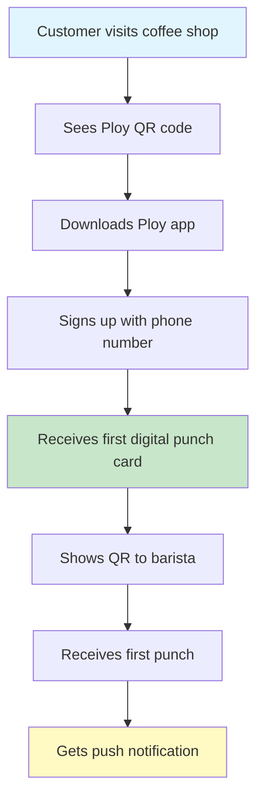
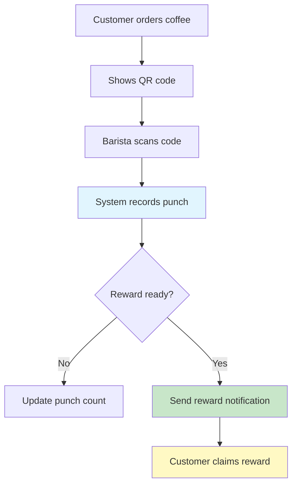
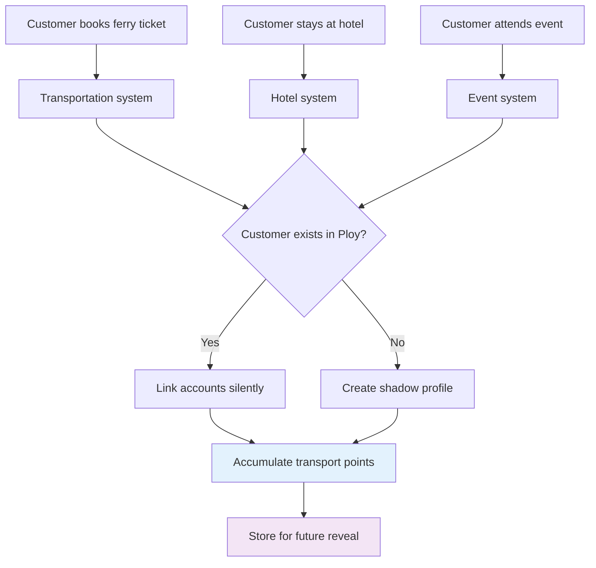
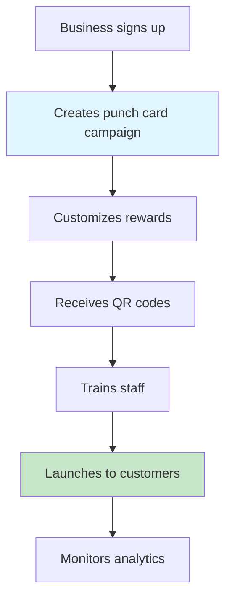
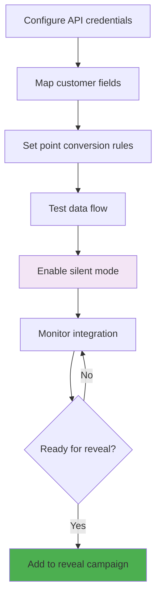
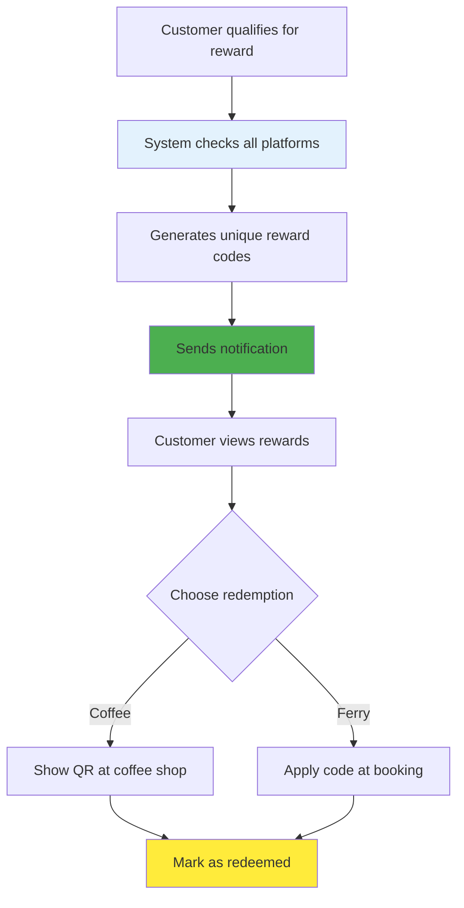
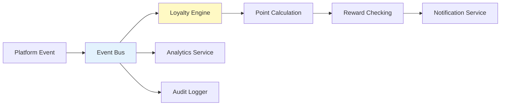
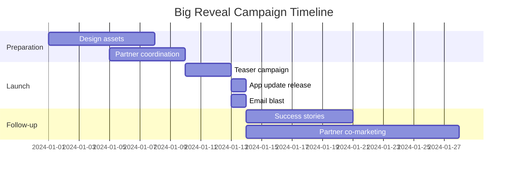
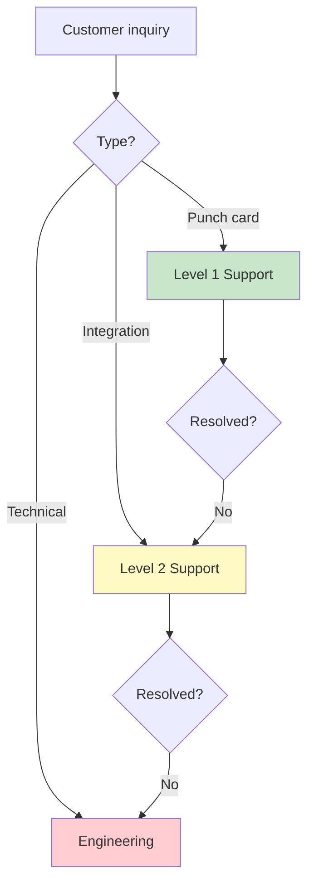

# Punch Card to Platform Integration Workflow

## Overview
This document outlines the customer and business workflows for Ploy's punch card MVP and its hidden integration capabilities with transportation, hotel, and event platforms.

## Customer Journey Workflows

### Phase 1: Punch Card Only Experience

#### New Customer Onboarding


#### Punch Accumulation Flow


### Phase 2: Silent Integration Experience

#### Background Data Collection


### Phase 3: The Big Reveal Experience

#### Surprise Discovery Flow
```mermaid
graph TD
    A[App update notification] --> B[Customer opens app]
    B --> C[Splash screen: "Big News!"]
    C --> D[Show accumulated points]
    D --> E[Display all platforms]
    E --> F[Unlock cross-platform rewards]
    F --> G[Customer explores new features]
    G --> H[Shares with friends]
    
    style C fill:#ffeb3b
    style D fill:#4caf50
    style F fill:#ff5722
```

## Business Workflows

### Coffee Shop Onboarding


### Platform Integration Setup

#### Transportation Platform Connection


## Cross-Platform Reward Workflows

### Reward Configuration
```yaml
coffee_commuter_reward:
  name: "Coffee Commuter Special"
  requirements:
    coffee_shop:
      visits: 10
      period: 30_days
    transportation:
      ferry_rides: 5
      period: 30_days
  reward:
    type: "multi_platform"
    benefits:
      - platform: "transportation"
        value: "Free ferry ticket"
      - platform: "coffee_shop"
        value: "Free large coffee"
  notification:
    title: "You're a Coffee Commuter!"
    body: "Claim your free ferry ticket and coffee"
```

### Reward Redemption Flow


## Technical Integration Workflows

### Customer Matching Algorithm
```typescript
async function matchCustomer(platformData: PlatformCustomer): Promise<UnifiedCustomer> {
  // Try exact matches first
  let customer = await findByPhone(platformData.phone);
  if (customer) return linkPlatform(customer, platformData);
  
  customer = await findByEmail(platformData.email);
  if (customer) return linkPlatform(customer, platformData);
  
  // Try fuzzy matching
  const candidates = await findSimilar({
    name: platformData.name,
    phone: platformData.phone,
    email: platformData.email
  });
  
  if (candidates.length === 1) {
    return linkPlatform(candidates[0], platformData);
  }
  
  // Create shadow profile for later matching
  return createShadowProfile(platformData);
}
```

### Event Processing Pipeline


## Marketing Campaign Workflows

### Phase 1 Launch Campaign
- **Week 1**: Local business recruitment
- **Week 2**: Staff training and setup
- **Week 3**: Soft launch with employees
- **Week 4**: Public launch with PR

### Phase 3 Reveal Campaign


## Support Workflows

### Customer Support Escalation


### Business Support Process
1. **Onboarding**: Dedicated success manager
2. **Training**: Video tutorials and documentation
3. **Ongoing**: Monthly check-ins
4. **Integration**: Technical support for connections
5. **Analytics**: Custom reporting assistance

## Performance Monitoring Workflows

### System Health Checks
```yaml
monitoring:
  punch_cards:
    - response_time: < 200ms
    - success_rate: > 99.9%
    - daily_active_users: track
    
  integrations:
    - data_sync_delay: < 5min
    - match_success_rate: > 80%
    - error_rate: < 0.1%
    
  cross_platform:
    - reward_calculation_time: < 1s
    - notification_delivery: > 95%
    - redemption_success: > 99%
```

### Scaling Triggers
- **1,000 users**: Optimize database queries
- **10,000 users**: Add caching layer
- **50,000 users**: Horizontal scaling
- **100,000 users**: Multi-region deployment

## Future Workflow Expansions

### Delivery Platform Integration
- Order tracking integration
- Loyalty points on delivery
- Cross-promotion with restaurants
- Lifestyle-based meal suggestions

### AI Enhancement Workflows
- Predictive reward recommendations
- Churn prevention automation
- Personalized campaign generation
- Fraud detection pipeline

---

These workflows demonstrate how Ploy seamlessly evolves from simple punch cards to a complete lifestyle loyalty ecosystem, with careful attention to user experience at each phase.